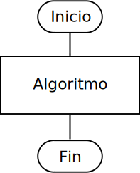
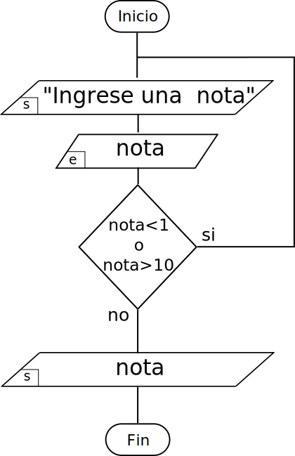

class: center, middle, inverse
<title>Unidad 4</title>

.title[Informática I]

Claudio Paz

<!-- .email[claudiojpaz@gmail.com] -->

Mayo 2023


<div style="position: absolute; left: 5%; top: 85%; height: 50%; width: 50%; padding: 1em; text-align: left;">
<input type="image" src="assets/fullscreen.png" onclick="openFullscreen()" style="height: 15%; width: 15%;">
<input type="image" src="assets/smallscreen.png" onclick="closeFullscreen()" style="height: 15%; width: 15%;">
</div>

---
class: middle, center, intermediate
.title-dark[Unidad 4]
# Introducción a la programación estructurada
---
# Algoritmos
--
count: false

Para resolver un problema (informático) se necesita ejecutar una serie de acciones en un orden específico

--
count: false

El procedimiento para resolver estas acciones en un orden específico se llama **algoritmo**

---
# Algoritmos
--
count: false

Medios de expresión de un algoritmo:

* Lenguaje natural,
* pseudocódigo,
* diagramas de flujo y
* lenguajes de programación.

---
# Algoritmos

## Ejemplo
---
count: false
# Algoritmos
## Ejemplo

.smaller10[
1. Dormir hasta que suene el despertador
]

---
count: false
# Algoritmos
## Ejemplo

.smaller10[
1. Dormir hasta que suene el despertador
2. Bañarse
]
---
count: false
# Algoritmos
## Ejemplo

.smaller10[
1. Dormir hasta que suene el despertador
2. Bañarse
3. Vestirse acorde al trabajo
]
---
count: false
# Algoritmos
## Ejemplo

.smaller10[
1. Dormir hasta que suene el despertador
2. Bañarse
3. Vestirse acorde al trabajo
4. Si hay tiempo desayunar
]
---
count: false
# Algoritmos
## Ejemplo

.smaller10[
1. Dormir hasta que suene el despertador
2. Bañarse
3. Vestirse acorde al trabajo
4. Si hay tiempo desayunar
5. Ir a la parada del bus
]
---
count: false
# Algoritmos
## Ejemplo

.smaller10[
1. Dormir hasta que suene el despertador
2. Bañarse
3. Vestirse acorde al trabajo
4. Si hay tiempo desayunar
5. Ir a la parada del bus
6. Esperar hasta que llegue
]
---
count: false
# Algoritmos
## Ejemplo

.smaller10[
1. Dormir hasta que suene el despertador
2. Bañarse
3. Vestirse acorde al trabajo
4. Si hay tiempo desayunar
5. Ir a la parada del bus
6. Esperar hasta que llegue
7. Subirse al bus hasta la parada más cercana al trabajo
]
---
count: false
# Algoritmos
## Ejemplo

.smaller10[
1. Dormir hasta que suene el despertador
2. Bañarse
3. Vestirse acorde al trabajo
4. Si hay tiempo desayunar
5. Ir a la parada del bus
6. Esperar hasta que llegue
7. Subirse al bus hasta la parada más cercana al trabajo
8. Bajarse y caminar al trabajo
]
---
count: false
# Algoritmos
## Ejemplo

.smaller10[
1. Dormir hasta que suene el despertador
2. Bañarse
3. Vestirse acorde al trabajo
4. Si hay tiempo desayunar
5. Ir a la parada del bus
6. Esperar hasta que llegue
7. Subirse al bus hasta la parada más cercana al trabajo
8. Bajarse y caminar al trabajo
9. Ingresar
]

---
# Algoritmos
--
count: false

.mid[¿Qué pasa si no se respeta el orden de ejecución?]

---

# Algoritmos
## Ejemplo

.smaller10[
1. Dormir hasta que suene el despertador
2. Vestirse acorde al trabajo
3. Bañarse
4. Si hay tiempo desayunar
3. Ir a la parada del bus
6. Esperar hasta que llegue
7. Subirse al bus hasta la parada más cercana al trabajo
8. Bajarse y caminar al trabajo
9. Ingresar
]

---
count: false

# Algoritmos
## Ejemplo

.smaller10[
1. Dormir hasta que suene el despertador<br>
2. .red[Vestirse acorde al trabajo]
3. .red[Bañarse]
4. Si hay tiempo desayunar
3. Ir a la parada del bus
6. Esperar hasta que llegue
7. Subirse al bus hasta la parada más cercana al trabajo
8. Bajarse y caminar al trabajo
9. Ingresar
]

---
# Pseudo-código vs. Diagrama de flujo
--
count: false

# Inicio y Fin

.left-column[
## Pseudo-código
<div style="font-size: 80%;">
<p>
Inicio<br>
&emsp;$Algoritmo$<br>
Fin<br>
</p>
</div>
]
.right-column[
]

---
count: false
# Pseudo-código vs. Diagrama de flujo

# Inicio y Fin

.left-column[
## Pseudo-código
<div style="font-size: 80%;"> 
<p>
Inicio<br>
&emsp;$Algoritmo$<br>
Fin<br>
</p>
</div>
]
.right-column[
## Diagrama de flujo
.center[]
]

---
# Pseudo-código vs. Diagrama de flujo
--
count: false

# Entrada y Salida

.left-column[
## Pseudo-código
<div style="font-size: 80%;">
<p>
 imprimir: "Ingrese su edad"<br>
 leer: edad
</p>
</div>
]
.right-column[
]

---
count: false
# Pseudo-código vs. Diagrama de flujo

# Entrada y Salida

.left-column[
## Pseudo-código
<div style="font-size: 80%;"> 
<p>
 imprimir: "Ingrese su edad"<br>
 leer: edad
</p>
</div>
]
.right-column[
## Diagrama de flujo
.center[]
]

---
# Pseudo-código vs. Diagrama de flujo
--
count: false

# Asignaciones

.left-column[
## Pseudo-código
<div style="font-size: 80%;"> 
<p>
$
  \begin{array}{ll}
    \texttt{a}&\leftarrow \texttt{1} \\
    \texttt{b}& \texttt{= 2} \\
    \texttt{c}& \texttt{= 3 * 5} \\
    \texttt{d}& \texttt{= d + 1} \\
    \texttt{e}& \texttt{= distancia(p,q)}
  \end{array}
$
</p>
</div>
]
.right-column[
]

---
count: false
# Pseudo-código vs. Diagrama de flujo

# Asignaciones

.left-column[
## Pseudo-código
<div style="font-size: 80%;"> 
<p>
$
  \begin{array}{ll}
    \texttt{a}&\leftarrow \texttt{1} \\
    \texttt{b}& \texttt{= 2} \\
    \texttt{c}& \texttt{= 3 * 5} \\
    \texttt{d}& \texttt{= d + 1} \\
    \texttt{e}& \texttt{= distancia(p,q)}
  \end{array}
$
</p>
</div>
]
.right-column[
## Diagrama de flujo
.center[]
]

---
# Pseudo-código vs. Diagrama de flujo
--
count: false
# Estructuras de control
---
# Pseudo-código vs. Diagrama de flujo
# Condicionales. Bloque Si simple
--
count: false

.left-column[
## Pseudo-código
<div style="font-size: 80%;"> 
<p>
si $a > 0$ entonces<br>
&emsp;$b = b / a$<br>
fin si<br>
</p>
</div>
]
.right-column[
]
---
count: false
# Pseudo-código vs. Diagrama de flujo
# Condicionales. Bloque Si simple

.left-column[
## Pseudo-código
<div style="font-size: 80%;"> 
<p>
si $a > 0$ entonces<br>
&emsp;$b = b / a$<br>
fin si<br>
</p>
</div>
]
.right-column[
## Diagrama de flujo
.center[]
]

--
count: false

Cuando se cumple la **expresión** a > 0 el flujo del programa _ingresa_ a la rama de verdad

---
# En lenguaje C
--
count: false
# Sentencias Condicionales. Bloque `if` simple

--
count: false

En el lenguaje C, la palabra clave para comenzar una sentencia condicional es `if`

--
count: false

**No** tiene palabra clave para el _entonces_

--
count: false

Para determinar donde termina la expresión que se evalúa se la encierra entre paréntesis

---
# En lenguaje C
# Sentencias Condicionales. Bloque `if` simple

--
count: false

.left-column[
## Pseudo-código
<div style="font-size: 80%;"> 
<p>
si $a > 0$ entonces<br>
&emsp;$b = b / a$<br>
fin si<br>
</p>
</div>
]
--
count: false

.right-column[
## Lenguaje C
```C
if (a > 0)
    b = b / a;
```
]

--
count: false

.up[
.left-99-column[
Tampoco hay equivalente al _fin si_
]
]
--
count: false

.up[ .up[ .up[
.left-99-column[
En lenguaje C solo se considera que pertenece a la rama _de verdad_ del `if` la primera sentencia luego del paréntesis
]
] ] ]

---
# En lenguaje C
# Sentencias Condicionales. Bloque `if` simple

--
count: false

.left-column[
## Lenguaje C
```C
nota = 4;
if (nota >= 6)
    printf("aprobado\n");
    printf("felicitaciones!\n");
```
]

--
count: false

.right-column[
## Pseudo-código
<div style="font-size: 80%; ">
<p>
si $n >= 6$ entonces<br>
&emsp;imprimir: "aprobado" <br>
fin si<br>
imprimir: "felicitaciones" <br>
</p>
</div>
]

--
count: false

Esto es un **error lógico**

--
count: false

No importa la alineación entre las sentencias. La segunda no pertence al bloque `if`

---
# En lenguaje C
# Sentencias Condicionales. Bloque `if` simple

--
count: false

Para escribir más de una sentencia _dentro_ del `if` hay que usar llaves y formar un bloque

--
count: false

.left-column[
## Lenguaje C
```C
nota = 4;
if (nota >= 6) {
    printf("aprobado\n");
    printf("felicitaciones!\n");
}
```
]

---
# En lenguaje C
# Sentencias Condicionales. Bloque `if` simple

--
count: false

Las llaves pueden ir en la misma línea o abajo, en la misma columna o en cualquiera

--
count: false

.left-column[
## Lenguaje C
```C
nota = 4;
if (nota >= 6) {
    printf("aprobado\n");
    printf("felicitaciones!\n");
}
```
]

---
count: false
# En lenguaje C
# Sentencias Condicionales. Bloque `if` simple


Las llaves pueden ir en la misma línea o abajo, en la misma columna o en cualquiera

.left-column[
## Lenguaje C
```C
nota = 4;
if (nota >= 6)
{
    printf("aprobado\n");
    printf("felicitaciones!\n");
}
```
]

---
count: false
# En lenguaje C
# Sentencias Condicionales. Bloque `if` simple


Las llaves pueden ir en la misma línea o abajo, en la misma columna o en cualquiera

.left-column[
## Lenguaje C
```C
nota = 4;
if (nota >= 6)
    {
    printf("aprobado\n");
    printf("felicitaciones!\n");
    }
```
]

---
# En lenguaje C
# Sentencias Condicionales. Bloque `if` simple
--
count: false

Más allá del _estilo_ elegido, se recomienda ser consistente durante todo el programa

--
count: false

También se recomienda utilizar espacios o tabulaciones para indicar la pertenencia o no a un bloque (además de las llaves cuando sean necesarias)

---
# Pseudo-código vs. Diagrama de flujo
--
count: false
# Bloque Si doble
--
count: false

.left-column[
## Pseudo-código
<div style="font-size: 80%;"> 
<p>
si $a > b$ entonces<br>
&emsp;$max = a$<br>
si no<br>
&emsp;$max = b$<br>
fin si<br>
</p>
</div>
]
.right-column[
]
---
count: false
# Pseudo-código vs. Diagrama de flujo
# Bloque Si doble

.left-column[
## Pseudo-código
<div style="font-size: 80%;"> 
<p>
si $a > b$ entonces<br>
&emsp;$max = a$<br>
si no<br>
&emsp;$max = b$<br>
fin si<br>
</p>
</div>
]
.right-column[
## Diagrama de flujo
.center[]
]

---
# En lenguaje C
# Sentencias Condicionales. Bloque `if` doble

--
count: false

.left-column[
## Pseudo-código
<div style="font-size: 80%;"> 
<p>
si $a > b$ entonces<br>
&emsp;$max = a$<br>
si no<br>
&emsp;$max = b$<br>
fin si<br>
</p>
</div>
]

--
count: false

.right-column[
## Lenguaje C
```C
if (a > b)
    max = a;
else
    max = b;
```
]

--
count: false

.left-99-column[
La palabra clave `else` da comienzo a la rama de _Falso_
]

---
# En lenguaje C
# Sentencias Condicionales. Bloque `if` doble

--
count: false

Para más de una sentencia en cualquier rama hace falta usar llaves para generar un bloque

--
count: false

.left-70-column[
## Lenguaje C
```C
nota = 4;
if (nota >= 6) {
    printf("aprobado\n");
    printf("felicitaciones!\n");
} else {
    printf("desaprobado\n");
    printf("hay que estudiar un poco más\n");
}
```
]


---
# Pseudo-código vs. Diagrama de flujo
--
count: false
# Anidamiento de bloques Si
--
count: false

.left-column[
## Pseudo-código
<div style="font-size: 80%;"> 
<p>
si $n < 6$ entonces<br>
&emsp;imprimir: "Desaprobado"<br>
si no<br>
&emsp;si $n >= 8$ entonces<br>
&emsp;&emsp;imprimir: "Aprobado Dir."<br>
&emsp;si no<br>
&emsp;&emsp;imprimir: "Regular"<br>
&emsp;fin si<br>
fin si<br>
</p>
</div>
]
.right-column[
]
---
count: false
# Pseudo-código vs. Diagrama de flujo
# Anidamiento de bloques Si

.left-column[
## Pseudo-código
<div style="font-size: 80%;">
<p>
si $n < 6$ entonces<br>
&emsp;imprimir: "Desaprobado"<br>
si no<br>
&emsp;si $n >= 8$ entonces<br>
&emsp;&emsp;imprimir: "Aprobado Dir."<br>
&emsp;si no<br>
&emsp;&emsp;imprimir: "Regular"<br>
&emsp;fin si<br>
fin si<br>
</p>
</div>
]
.right-column[
## Diagrama de flujo
.center[]
]

---
# Diseño de algoritmos
--
count: false

El **Diseño Descendente** es una forma de resolver un proyecto de programación.

--
count: false

Consiste en comenzar de lo más general hacia lo más particular.

--
count: false

Se debe dividir el problema en sub problemas más pequeños.

---
# Diseño de algoritmos
--
count: false
## Ejemplo: Cálculo de Índice de Masa Corporal

--
count: false

Diseñe un algoritmo para una calculadora de BMI que lea el peso y la altura del usuario.
Debe calcular y mostrar el índice de masa corporal del usuario.

--
count: false

Además, se debe mostrar el estado del usuario respecto de la tabla.

### Valores BMI

<div style="font-size: 80%;">
<p>
Bajo peso: menos de 18.5<br>
Normal: entre 18.5 y 24.99<br>
Sobrepeso: entre 25 y 29.99<br>
Obeso: 30 o más
</p>
</div>

---
# Diseño de algoritmos
## Ejemplo: Cálculo de Índice de Masa Corporal
--
count: false

<div style="font-size: 90%;">
<p>
Inicio<br>
&emsp;Solicitar peso y altura al usuario<br>
&emsp;Hacer cálculo de BMI<br>
&emsp;Mostrar cálculo de BMI<br>
&emsp;Determinar estado según tabla<br>
Fin<br>
</p>
</div>

---
# Diseño de algoritmos
## Ejemplo: Cálculo de Índice de Masa Corporal
--
count: false

<div style="font-size: 90%;">
<p>
Solicitar peso y altura al usuario<br>
</p>
</div>

<div style="font-size: 90%;">
<p>
imprimir: "Ingrese su peso"<br>
leer: peso<br>
imprimir: "Ingrese su altura"<br>
leer: altura<br>
</p>
</div>

---
# Diseño de algoritmos
## Ejemplo: Cálculo de Índice de Masa Corporal

<div style="font-size: 90%;">
<p>
Solicitar peso y altura al usuario<br>
</p>
</div>

--
count: false
<div style="font-size: 90%;">
<p>
imprimir: "Ingrese su peso y altura"<br>
leer: peso, altura<br>
</p>
</div>

---
# Diseño de algoritmos
## Ejemplo: Cálculo de Índice de Masa Corporal
--
count: false

<div style="font-size: 90%;">
<p>
Hacer cálculo de BMI<br>
</p>
</div>

--
count: false
<div style="font-size: 90%;">
<p>
bmi = peso / (altura * altura)
</p>
</div>

---
# Diseño de algoritmos
## Ejemplo: Cálculo de Índice de Masa Corporal
--
count: false

<div style="font-size: 90%;">
<p>
Mostrar cálculo de BMI<br>
</p>
</div>

--
count: false
<div style="font-size: 90%;">
<p>
imprimir: bmi
</p>
</div>

---
# Diseño de algoritmos
## Ejemplo: Cálculo de Índice de Masa Corporal
--
count: false

<div style="font-size: 90%;">
<p>
Determinar estado según tabla<br>
</p>
</div>

--
count: false
<div style="font-size: 70%;">
<p>
si bmi < 18.5 entonces<br>
&emsp;imprimir: "Bajo peso"<br>
si no<br>
&emsp;si bmi < 25 entonces<br>
&emsp;&emsp;imprimir: "Peso normal"<br>
&emsp;si no<br>
&emsp;&emsp;si bmi < 30 entonces<br>
&emsp;&emsp;&emsp;imprimir: "Sobrepeso"<br>
&emsp;&emsp;si no<br>
&emsp;&emsp;&emsp;imprimir: "Obeso"<br>
&emsp;&emsp;fin si<br>
&emsp;fin si<br>
fin si
</p>
</div>

---
--
count: false
<div style="font-size: 150%; font-family: 'Yanone Kaffeesatz'; font-weight: normal; color: darkcyan; position: relative; top: 0px" >
Ejemplo: Cálculo de Índice de Masa Corporal
</div>
--
count: false
<div style="font-size: 70%;position: relative; top: 0px">
<p>
inicio<br>
&emsp;imprimir: "Ingrese su peso y altura"<br>
&emsp;leer: peso, altura<br>
&emsp;bmi = peso / (altura * altura)<br>
&emsp;imprimir: bmi<br>
&emsp;si bmi < 18.5 entonces<br>
&emsp;&emsp;imprimir: "Bajo peso"<br>
&emsp;si no<br>
&emsp;&emsp;si bmi < 25 entonces<br>
&emsp;&emsp;&emsp;imprimir: "Peso normal"<br>
&emsp;&emsp;si no<br>
&emsp;&emsp;&emsp;si bmi < 30 entonces<br>
&emsp;&emsp;&emsp;&emsp;imprimir: "Sobrepeso"<br>
&emsp;&emsp;&emsp;si no<br>
&emsp;&emsp;&emsp;&emsp;imprimir: "Obeso"<br>
&emsp;&emsp;&emsp;fin si<br>
&emsp;&emsp;fin si<br>
&emsp;fin si<br>
fin<br>
</p>
</div>

---

# Estructuras repetitivas

# Bloque Mientras

--
count: false

.left-column[
## Pseudo-código
<div style="font-size: 80%;">
<p>
a = 10<br>
mientras a > 0 hacer<br>
&emsp;imprimir: a<br>
&emsp;a = a - 1<br>
fin mientras<br>
</p>
</div>
]
.right-column[
]

---
count: false
# Estructuras repetitivas
# Bloque Mientras

.left-column[
## Pseudo-código
<div style="font-size: 80%;">
<p>
a = 10<br>
mientras a > 0 hacer<br>
&emsp;imprimir: a<br>
&emsp;a = a - 1<br>
fin mientras<br>
</p>
</div>
]
.right-column[
## Diagrama de flujo
.center[]
]

---
# Estructuras repetitivas
# Bloque Hacer-Mientras
--
count: false

.left-column[
## Pseudo-código
<div style="font-size: 80%;">
<p>
a = 10<br>
hacer<br>
&emsp;imprimir: a<br>
&emsp;a = a - 1<br>
mientras a > 0<br>
</p>
</div>
]
.right-column[
]

---
count: false
# Estructuras repetitivas
# Bloque Hacer-Mientras

.left-column[
## Pseudo-código
<div style="font-size: 80%;">
<p>
a = 10<br>
hacer<br>
&emsp;imprimir: a<br>
&emsp;a = a - 1<br>
mientras a > 0<br>
</p>
</div>
]
.right-column[
## Diagrama de flujo
.center[]
]
---
# Estructuras repetitivas
# Bloque Para
--
count: false

.left-column[
## Pseudo-código
<div style="font-size: 80%;">
<p>
para i desde 0 hasta 9 hacer<br>
&emsp;imprimir: i<br>
fin para<br>
</p>
</div>
]
.right-column[
]

---
count: false
# Estructuras repetitivas
# Bloque Para

.left-column[
## Pseudo-código
<div style="font-size: 80%;">
<p>
para i desde 0 hasta 9 hacer<br>
&emsp;imprimir: i<br>
fin para<br>
</p>
</div>
]
.right-column[
## Diagrama de flujo
.left[]
]

---
# Estructuras repetitivas
--
count: false
# Ejemplos

--
count: false
 **Problema:** Realizar un algoritmo que solicite una nota al usuario.
El programa solo debe permitir ingresar calificaciones con valores entre 1 y 10.
Luego, debe imprimirse la nota ingresada.

---
# Pseudo-código vs. Diagrama de flujo
--
count: false

.left-column[
## Pseudo-código
```
inicio
  hacer
    imprimir: "Ingrese una nota"
    leer: nota
  mientras nota < 1 o nota > 10
  imprimir: nota
fin
```
]
.right-column[
## Diagrama de flujo
.left[]
]
