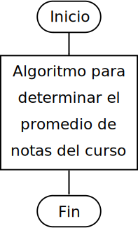
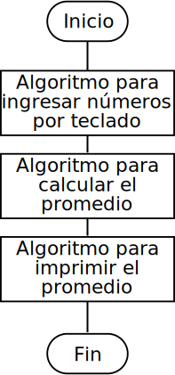

class: center, middle, inverse, no-number
<title>Unidad 6</title>

.title[Informática I]

Claudio Paz

<!-- .email[claudiojpaz@gmail.com] -->

Junio 2023


<div style="position: absolute; left: 5%; top: 85%; height: 50%; width: 50%; padding: 1em; text-align: left;">
<input type="image" src="assets/fullscreen.png" onclick="openFullscreen()" style="height: 15%; width: 15%;">
<input type="image" src="assets/smallscreen.png" onclick="closeFullscreen()" style="height: 15%; width: 15%;">
</div>

---
class: middle, center, intermediate
.title-dark[Unidad 6]
# Funciones en lenguaje C
---
class: middle, center, intermediate
# Primera Parte
---
# Programación modular
--
count: false

La programación modular consiste en resolver problemas dividiéndolos en problemas más pequeños

--
count: false

.left-column[
.center[]
]

--
count: false

.right-column[
.center[]
]

---
# Funciones en el lenguaje C
--
count: false

Funciones de la biblioteca estándar...

--
count: false
(de `stdio.h`: `printf`, `scanf`, etc.)

--
count: false
(de `math.h`: `sqrt`, `pow`, `log`, etc.)

--
count: false

o nuevas funciones _definidas_ por el usuario

---
layout: true
# Definición de una función
---
count: false
---
count: false

.italic[
tipo-valor-retorno nombre-funcion (lista-parametros)
{
  sentencias
}
]
---
count: false

.italic[
tipo-valor-retorno .red[nombre-funcion] (lista-parametros)
{
  sentencias
}
]

--
count: false

Los nombres de función deben respetar las mismas reglas que los otros identificadores (variables)

--
count: false

Se usa ese nombre para invocarla. No pueden tener nombres de otras funciones.

---
count: false

.italic[
tipo-valor-retorno nombre-funcion (lista-parametros)
{
  sentencias
}
]

---
count: false

.italic[
tipo-valor-retorno nombre-funcion (.red[lista-parametros])
{
  sentencias
}
]

--
count: false

La lista de parámetros es la información (variables) que recibe la función desde quien la llama

--
count: false

Son variables separadas por comas (,) que deben incluir el tipo de las mismas

---
count: false

.italic[
tipo-valor-retorno nombre-funcion (lista-parametros)
{
  sentencias
}
]

---
count: false

.italic[
.red[tipo-valor-retorno] nombre-funcion (lista-parametros)
{
  sentencias
}
]

--
count: false

En ocasiones las funciones devuelven un valor

--
count: false

El tipo del valor devuelto, debe estar explicito en la definición de la función

---
count: false

.italic[
tipo-valor-retorno nombre-funcion (lista-parametros)
{
  sentencias
}
]

---
count: false

.italic[
tipo-valor-retorno nombre-funcion (lista-parametros)
{
  .red[sentencias]
}
]

--
count: false

Abajo del encabezado, el _cuerpo_ de la función está formado por el bloque formado por las sentencias y las llaves que las rodean


--
count: false

Las llaves son **obligatorias** aunque la sentencia sea una _sentencia simple_


---
layout: false
# Definición de una función
--
count: false
## Ejemplo

--
count: false

```C
 float media (int n1, int n2)
 {
   int suma;
   float resultado;

   suma = n1 + n2;

   resultado = (float) suma / 2;

   return resultado;
 }
```

---
count: false
# Definición de una función
## Ejemplo

```C
 float media (`int n1, int n2`)
 {
   int suma;
   float resultado;

   suma = n1 + n2;

   resultado = (float) suma / 2;

   return resultado;
 }
```

--
count: false

En este ejemplo las variables `n1` y `n2` no necesitan definirse en el cuerpo de la función

--
count: false

A cada variable de la lista de parámetros debe anteponerse su tipo (aunque sean iguales)

---
# Definición de una función
## Ejemplo

```C
 float media (int n1, int n2)
 {
   int suma;
   float resultado;

   suma = n1 + n2;

   resultado = (float) suma / 2;

   return resultado;
 }
```
---
count: false

# Definición de una función
## Ejemplo

```C
 `float` media (int n1, int n2)
 {
   int suma;
   float resultado;

   suma = n1 + n2;

   resultado = (float) suma / 2;

   return resultado;
 }
```
--
count: false

El tipo de valor de retorno puede ser cualquier tipo (`int`, `char`, `float`, etc.)


---
count: false

# Definición de una función
## Ejemplo

```C
 `float` media (int n1, int n2)
 {
   int suma;
   float resultado;

   suma = n1 + n2;

   resultado = (float) suma / 2;

   `return resultado;`
 }
```
--
count: false

Al final del cuerpo de la función la sentencia `return` indica cual es el valor devuelto

--
count: false

Debe coincidir en tipo con el _tipo de valor de retorno_

---
count: false

# Definición de una función
## Ejemplo

```C
 `float` media (int n1, int n2)
 {
   int suma;
   `float resultado;`

   suma = n1 + n2;

   resultado = (float) suma / 2;

   `return resultado;`
 }
```

Al final del cuerpo de la función la sentencia `return` indica cual es el valor devuelto

Debe coincidir en tipo con el _tipo de valor de retorno_


---
# Lista de Parámetros Vs Lista de Argumentos
--
count: false

Las funciones se llaman invocándolas por su nombre, colocando entre paréntesis los valores que pasan a la lista de parámetros

```C
  m = media(7, 8);
```

se dice que los números (en este caso) entre paréntesis son la _Lista de Argumentos_

--
count: false
También podrían ser variables o cualquier otra expresión

```C
  m = media(a, b);
```

---
# Lista de Parámetros Vs Lista de Argumentos
--
count: false

La _Lista de Argumentos_ debe coincidir con la _Lista de Parámetros_ en tipo y número

--
count: false

Cada elemento de la _Lista de Argumentos_ se copia en los elementos de la _Lista de Parámetros_

--
count: false

Las variables de la _Lista de Argumentos_ puede tener nombres diferentes de la _Lista de Parámetros_

---
# Lista de Parámetros Vs Lista de Argumentos
--
count: false

Por ejemplo, si se tiene la siguiente función:

--
count: false

```C
float potencia (float base, int exponente) {
  float p = 1;

  for (int i = 0; i < exponente; i++)
    p *= base;

  return p;
}
```

el llamado debería ser algo así:

--
count: false

```C
  float resultado;

  resultado = potencia(2, 3);

```
--
count: false

Aquí el 2 se copia en `base`

---
count: false
# Lista de Parámetros Vs Lista de Argumentos

Por ejemplo, si se tiene la siguiente función:

```C
float potencia (`float base`, int exponente) {
  float p = 1;

  for (int i = 0; i < exponente; i++)
    p *= base;

  return p;
}
```

el llamado debería ser algo así:


```C
  float resultado;

  resultado = potencia(`2`, 3);

```
Aquí el 2 se copia en `base`
--
count: false
y el 3 en `exponente`


---
# Lista de Parámetros Vs Lista de Argumentos

Por ejemplo, si se tiene la siguiente función:

```C
float potencia (float base, `int exponente`) {
  float p = 1;

  for (int i = 0; i < exponente; i++)
    p *= base;

  return p;
}
```

el llamado debería ser algo así:


```C
  float resultado;

  resultado = potencia(2, `3`);

```
Aquí el 2 se copia en `base` y el 3 en `exponente`

---
# Lista de Parámetros Vs Lista de Argumentos
--
count: false

Si la función no recibe ningún valor, la _Lista de Argumentos_ debe estar vacía y la _Lista de Parámetros_ debe tener el tipo `void`

--
count: false

```C
int ingreso_nota (void)
{
  int nota;

  do {
    printf("Ingrese una nota: ");
    scanf("%d", &nota);
  } while ( nota < 1 || nota > 10 );

  return nota;
}
```

--
count: false
```C
int n;

n = ingreso_nota();

```

---
# Retorno desde una función
--
count: false

Si la función **no devuelve** valor, en el encabezado el _tipo de valor de retorno_ debe ser `void`

--
count: false

En ese caso, no hace falta la sentencia `return`

--
count: false

## Ejemplo

```C
void imprime_linea (int n)
{
  for (int i = 0; i < n; i++)
    if ( i % 2 == 0 )
      printf("*");
    else
      printf("+");

  printf("\n");

}
```
---
# Uso del valor devuelto por una función
--
count: false

El valor devuelto _desde_ la función con la sentencia `return` se puede almacenar en una variable

```C
  m = media(7, 8);
  printf("La media entre %d y %d es %.1f\n", 7, 8, m);
```
--
count: false

O se puede usar directamente como argumento en otra función

```C
  printf("La media entre %d y %d es %.1f\n", 7, 8, media(7, 8));
```

--
count: false

O se puede usar como operando

```C
  med = 20 / media(7, 8);
```

---
# Uso del valor devuelto por una función
--
count: false

Si valor devuelto por la función no se usa, se pierde

--
count: false

Esto no da errores ni advertencias del compilador

--
count: false

Hay funciones se usan cotidianamente, que devuelven valor que generalmente se descarta

Por ejemplo: `printf`, `scanf`


---
# Prototipo de una función
--
count: false

Para que los programas no den errores o advertencias de _linqueo_, las funciones deben estar definidas antes de su uso en el programa (de arriba hacia abajo).

--
count: false

Se puede definir la función debajo de su llamado si se usa los _prototipos_

--
count: false

El _prototipo_ de una función es una sentencia que indica el valor de retorno, el nombre y los _tipos_ de la lista de parámetros y finaliza con un punto y coma (;)

---
# Prototipo de una función
--
count: false

```C
#include <stdio.h>

int cuadrado (int);

int main (void)
{
  int x=3;
  int x2;

  x2 = cuadrado(x);

  printf("El cuadrado de %d es %d\n", x, x2);

  return 0;
}

int cuadrado (int x)
{
  return x * x;
}

```

---
count: false
# Prototipo de una función

```C
#include <stdio.h>

*int cuadrado (int);

int main (void)
{
  int x=3;
  int x2;

  x2 = cuadrado(x);

  printf("El cuadrado de %d es %d\n", x, x2);

  return 0;
}

*int cuadrado (int x)
{
  return x * x;
}

```

---
# Prototipo de una función
--
count: false

Los prototipos indican al compilador cuantos y de que tipo son los argumentos que hay que pasarle a cada función y el tipo de valor de retorno

--
count: false

La ventaja de usar prototipos es que no hace falta preocuparse cual función es llamada antes que otra, o que función llama a cual y que las definiciones estén en el orden correcto

--
count: false

Los prototipos van antes de las definiciones de las funciones, usualmente los prototipos van antes que `main` y las definiciones después de `main`

---
class: middle, center, intermediate
# Segunda Parte

---
# Clases de Almacenamiento
--
count: false

En la Unidad 3 se dijo que las variables tenían cuatro atributos:

Nombre

Tipo

Dirección

Valor

---
# Clases de Almacenamiento
--
count: false

Nuevo atributo:

**Clase de almacenamiento:**

Determina la duración, alcance y enlace de las variables

---
# Clases de Almacenamiento
--
count: false
### Duración del almacenamiento
--
count: false

Se refiere al tiempo que las variables _existen_ en memoria

--
count: false

Pueden durar solo un momento, ser creadas y destruidas reiteradamente, o existir durante toda la ejecución del programa

--
count: false

Las variables pueden ser:
* de _duración de almacenamiento **automática**_
* de _duración de almacenamiento **estática**_

---
# Clases de Almacenamiento
--
count: false
### Alcance o ámbito (_scope_) de una variable
--
count: false

El alcance de una variable es la porción de programa donde se puede acceder o _referenciar_ a una variable

--
count: false

Las variables que se definen en la lista de parámetros o en el cuerpo de las funciones se dice que son **variables locales**

--
count: false

Solo pueden ser accedidas desde las funciones donde están definidas

---
# Clases de Almacenamiento
### Alcance o ámbito (_scope_) de una variable
--
count: false

Las variables que se definen afuera de cualquier función son conocidas como **variables globales**

--
count: false

Pueden ser accedidas desde cualquier función

--
count: false

Pueden retener su valor durante toda la duración del programa

---
# Variables automáticas Vs estáticas
--
count: false

Cuando una función es llamada, las variables definidas en la lista de parámetros o las definidas en el cuerpo de la función son creadas

--
count: false

Cuando la función llega a una sentencia `return` o a la llave de cierre del cuerpo de la función, las variables son destruidas

--
count: false

Se dice que estas variables son **automáticas** y es el comportamiento por defecto de las _variables locales_

--
count: false

Se puede explicitar este comportamiento con la palabra clave .olive[`auto`] a la izq. en la definición

---
# Variables automáticas Vs estáticas
--
count: false

Si las variables se definen con la palabra clave .olive[`static`], son consideradas **estáticas**

--
count: false

En este caso, las variables no se destruyen al finalizar la función, y mantienen su valor hasta el próximo llamado a la función

--
count: false

Por defecto se inicializan en 0, a menos que se dé otro valor

--
count: false

```C
static int var = 1;
```

---
# Variables automáticas Vs estáticas
--
count: false

Las variables _locales_ son por defecto **automáticas**

--
count: false

Las variables _globales_ son por defecto **estáticas**


---
# Reglas de alcance
--
count: false

Las variables globales, los prototipos y las definiciones de las funciones se dice que tienen _alcance de archivo_

--
count: false

Esto quiere decir que se pueden acceder desde cualquier parte del archivo

--
count: false

Las variables definidas dentro de bloques se dice que tienen _alcance de bloque_

---
# Reglas de alcance
--
count: false

Se pueden anidar bloques, y en cada bloque definir nuevas variables que tendrán alcance de **ese** bloque

--
count: false

Si dentro de un bloque anidado hay un identificador (variable) con el mismo nombre que una variable de un bloque de más afuera, la variable del bloque de afuera es _escondida_ hasta que el bloque anidado termine

--
count: false

Si una variable local tiene el mismo nombre que una variable global, esta última es escondida y no puede ser accedida desde la función

---
## Ejemplo variable estática
--
count: false

```C
#include <stdio.h>

int inc (void)
{
  int c = 0;

  return c++;
}

int main (void)
{
  for (int i = 0; i < 10; i++)
    printf("%d ", inc() );

  printf("\n");

  return 0;
}
```
--
count: false

```sh
0 0 0 0 0 0 0 0 0 0
```

---
## Ejemplo variable estática

```C
#include <stdio.h>

int inc (void)
{
  int c = 0;

  return c++;
}

int main (void)
{
  for (int i = 0; i < 10; i++)
    printf("%d ", inc() );

  printf("\n");

  return 0;
}
```
--
count: false

Cuando se llama a la función `inc` la variable c es creada e inicializada a cero

---
## Ejemplo variable estática

```C
#include <stdio.h>

int inc (void)
{
  int c = 0;

  return c++;
}

int main (void)
{
  for (int i = 0; i < 10; i++)
    printf("%d ", inc() );

  printf("\n");

  return 0;
}
```
--
count: false

Cuando la función termina el valor (incrementado) de la variable `c` se pierde

---
## Ejemplo variable estática

```C
#include <stdio.h>

int inc (void)
{
  int c = 0;

  return c++;
}

int main (void)
{
  for (int i = 0; i < 10; i++)
    printf("%d ", inc() );

  printf("\n");

  return 0;
}
```
---
count: false
## Ejemplo variable estática

```C
#include <stdio.h>

int inc (void)
{
  static int c = 0;

  return c++;
}

int main (void)
{
  for (int i = 0; i < 10; i++)
    printf("%d ", inc() );

  printf("\n");

  return 0;
}
```
---
count: false
## Ejemplo variable estática

```C
#include <stdio.h>

int inc (void)
{
  `static` int c = 0;

  return c++;
}

int main (void)
{
  for (int i = 0; i < 10; i++)
    printf("%d ", inc() );

  printf("\n");

  return 0;
}
```
--
count: false

```sh
0 1 2 3 4 5 6 7 8 9
```

---
## Ejemplo variable estática

```C
#include <stdio.h>

int inc (void)
{
  `static` int c = 0;

  return c++;
}

int main (void)
{
  for (int i = 0; i < 10; i++)
    printf("%d ", inc() );

  printf("\n");

  return 0;
}
```
--
count: false

Cuando se define la variable como estática, es creada e inicializada cuando inicia el programa

---
## Ejemplo variable estática

```C
#include <stdio.h>

int inc (void)
{
  `static` int c = 0;

  return c++;
}

int main (void)
{
  for (int i = 0; i < 10; i++)
    printf("%d ", inc() );

  printf("\n");

  return 0;
}
```
--
count: false

Luego cada vez que es llamada la función no se declara ni inicializa, continúa con el valor que quedó del llamado anterior, o sea que _"se salta esa línea"_

---
## Variables estáticas Vs Globales
--
count: false

.left-column[
```C
#include <stdio.h>

int inc (void)
{
  static int c = 0;

  return c++;
}

int main (void)
{
  for (int i = 0; i < 10; i++)
    printf("%d ", inc() );

  printf("\n");

  return 0;
}
```
]
.right-column[
```C
#include <stdio.h>

int c = 0;

int inc (void)
{
  return c++;
}

int main (void)
{
  for (int i = 0; i < 10; i++)
    printf("%d ", inc() );

  printf("\n");

  return 0;
}
```
]

--
count: false

Ambos casos tienen la misma salida, la diferencia radica en que la variable `c`, en el caso cuando es local solo puede ser accedida desde la función

---
## Variables estáticas Vs Globales

.left-column[
```C
#include <stdio.h>

int inc (void)
{
  static int c = 0;

  return c++;
}

int main (void)
{
  for (int i = 0; i < 10; i++)
    printf("%d ", inc() );

  printf("\n");

  return 0;
}
```
]
.right-column[
```C
#include <stdio.h>

int c = 0;

int inc (void)
{
  return c++;
}

int main (void)
{
  for (int i = 0; i < 10; i++)
    printf("%d ", inc() );

  printf("\n");

  return 0;
}
```
]

--
count: false

En el caso de la variable global, esta podría ser accesible desde cualquier función definida en este archivo

---
## Variables estáticas Vs Globales
--
count: false

Entonces hay que diferenciar entre el alcance (desde donde se puede acceder) y la duración (por cuanto tiempo se mantienen los datos)

--
count: false

Las variables locales (automáticas por defecto) solo pueden ser accedidas desde la función donde _"viven"_ y cuando la función termina, las variables _"mueren"_

.footnote[.smaller50[Las palabras "viven" y "mueren" son metafóricas y no son parte del vocabulario del lenguaje]]

---
class: middle, center, intermediate
# Tercera Parte

---
# Funciones con más de un return
--
count: false

En ocasiones, siempre tratando de escribir código más claro, se puede usar más de una sentencia return en una función

--
count: false

Ejemplo, en caso de haber dos sentencias return, la ejecución de la primera termina inmediatamente la función devolviendo el valor indicada en la sentencia.

--
count: false

Aún estando en una estructura y sin importar el grado de anidamiento

---
# Funciones con más de un return
--
count: false

```C
#include <stdio.h>

int max (int a, int b)
{
  if (a > b)
    return a;
  else
    return b;
}

int main (void)
{

  printf("%d\n", max(3,4));

  return 0;
}
```

---
# Llamada por valor y por "referencia"
--
count: false

En programación, cuando se llama a funciones se pasa información _por valor_ o _por referencia_

--
count: false

El paso _por valor_ significa que la información es copiada en una nueva variable, y modificar esta última no afecta a la original

--
count: false

El paso _por referencia_ significa que algún cambio en la variable en la función afecta la variable original

---
# Llamada por valor y por "referencia"
--
count: false

```C
#include <stdio.h>

void func1 (int x)
{
  x++;
  printf("En la función: %d\n", x);
}

int main (void)
{
  int x = 3;

  func1(x);
  printf("En el main: %d\n", x);

  return 0;
}
```

```sh
En la función: 4
En el main: 3
```

---
# Recursividad
--
count: false

Existen algunos problemas en los que es útil tener funciones **que se llaman a si mismas**

--
count: false

Reciben el nombre de **funciones recursivas**

--
count: false

Cada llamado a la función (incluso desde la misma función) crea un nuevo "contexto" de la función, con nuevas variables

--
count: false

Cuando una función se llama a si misma es equivalente a cuando llama a cualquier otra, esto es, suspende la ejecución hasta que la función llamada termina.

---
# Recursividad
--
count: false

```C
#include <stdio.h>

void imp (int n)
{
  printf("Ingresa a la función donde n vale %d\n", n);

  if (n > 1)
    imp(n-1);

  printf("Sale de la función donde n vale %d\n", n);
}

int main (void)
{
  imp(5);

  return 0;
}
```
---
# Recursividad
--
count: false

```sh
Ingresa a la función donde n vale 5
Ingresa a la función donde n vale 4
Ingresa a la función donde n vale 3
Ingresa a la función donde n vale 2
Ingresa a la función donde n vale 1
Sale de la función donde n vale 1
Sale de la función donde n vale 2
Sale de la función donde n vale 3
Sale de la función donde n vale 4
Sale de la función donde n vale 5
```
---
# Condiciones para implementar funciones recursivas
--
count: false

Las funciones recursivas deben tener dos partes:

--
count: false

el _caso base_ en el cual la función **no** realiza el paso de recursividad (el llamado a si misma)

--
count: false

el llamado a si misma con algún argumento que haga que converja al caso base
---
# Ejemplo: Suma acumulada
--
count: false

La suma acumulada de un número $n$ se puede calcular como  
$\text{cumsum}(n) = \sum\limits_{i=1}^{n} i $

entonces, el algoritmo recursivo se puede escribir

$\text{cumsum}(n) = n + \text{cumsum}(n-1)$

--
count: false

Se puede tomar está expresión como el paso recursivo

--
count: false

y $\text{cumsum}(1) = 1$ como caso base

---
# Ejemplo: Suma acumulada
--
count: false

```C
int suma_acumulada(int n)
{
  int resultado;

  if (n == 1)
    resultado = 1;
  else
    resultado = n + suma_acumulada (n-1);

  return resultado;
}
```


---
# Ejemplo: Serie de Fibonacci
--
count: false
Es una serie de números que comienza con $0$ y $1$, y a partir de ahí, cada elemento de la serie es igual a la suma de los dos números anteriores
--
count: false
$0,1,1,2,3,5,8,13,21,34,$ etc
--
count: false

$\text{fibo}(n) = \text{fibo}(n-1) + \text{fibo}(n-2)$

--
count: false

Como caso base se toma $\text{fibo}(1)=1$ y $\text{fibo}(0)=0$

---
# Ejemplo: Serie de Fibonacci
--
count: false

```C
int fibo (int n)
{
  if (n == 0)
    return 0;
  if (n == 1)
    return 1;

  return fibo(n-1) + fibo(n-2);
}
```
--
count: false

o también

--
count: false

```C
int fibo (int n)
{
  if (n == 0 || n == 1)
    return n;

  return fibo(n-1) + fibo(n-2);
}
```

---
# Recursividad vs. Iteración
--
count: false

Ambos métodos usan sentencias de control: La _iteración_ usa la sentencia repetitiva, la _recursividad_ usa la sentencia selectiva

--
count: false

La _recursión_ realiza numerosos llamados a una función, creando con cada llamado nuevas copias de variables para cada instancia de la función, usando tiempo de computo y **memoria**.

--
count: false

La _iteración_ generalmente está confinada en una función y no hace mayor uso de memoria que 1 ciclo

---
# Recursividad vs. Iteración
--
count: false

La recursividad se usa en los programas en los que este enfoque es más natural de implementar, lo que resulta en un problema más fácil de entender o _mantener_

--
count: false

También se usa en los problemas en que la solución _iterativa_ no es fácil de implementar

---
# Archivos de cabecera
--
count: false

Los archivos de cabecera son aquellos con extensión `.h`

--
count: false

Contienen los prototipos de las funciones necesarias para el programa

--
count: false

Se _incluyen_ en el programa usando la directiva de preprocesador `#include`

--
count: false

Pueden ser los archivos de cabecera correspondientes a la biblioteca estándar o a las funciones realizadas por el usuario

---
# Archivos de cabecera
--
count: false

Se pueden incluir de dos formas  
```C
#include <stdio.h>
```
o  
```C
#include "mifuncion.h"
```
--
count: false

los _ángulos_ (`< >`) indican que debe buscarse en los directorios del sistema (en Linux usualmente `/usr/include/`)

--
count: false

las `" "` indican que debe buscarse en el directorio actual, o en su defecto en el directorio del sistema

---
# Archivos de cabecera
--
count: false

por ejemplo, si se tiene un archivo `fibo.h` con  
```C
int fibo (int);
```

---
# Archivos de cabecera
--
count: false

quedando el archivo `principal.c`

```C
#include <stdio.h>
#include "fibo.h"

int main (void)
{
  for (int i = 0; i < 10; i++)
    printf("%d ", fibo(i));

  return 0;
}

int fibo (int n)
{
  if (n == 0 || n == 1)
    return n;

  return fibo(n-1) + fibo(n-2);
}
```

---
# Archivos de cabecera (extra)
--
count: false

también se puede poner en un archivo llamado `fibo.c` la función

```C
int fibo (int n)
{
  if (n == 0 || n == 1)
    return n;

  return fibo(n-1) + fibo(n-2);
}
```

quitándola del archivo `principal.c`

---
# Archivos de cabecera (extra)
--
count: false

quedando ahora el archivo `principal.c`

```C
#include <stdio.h>
#include "fibo.h"

int main (void)
{
  for (int i = 0; i < 10; i++)
    printf("%d ", fibo(i));

  return 0;
}

```

---
# Archivos de cabecera (extra)
--
count: false

Recordando el proceso de _compilación_, compuesto del preprocesamiento, la compilación propiamente dicha y el linqueo...

--
count: false

La compilación propiamente dicha no da errores (faltando la definición de la función) ya que existe el prototipo que indica nombre, lista de parámetros y valor de retorno.

--
count:false

De manera similar a lo que sucede con `printf`

--
count: false

En el proceso de linqueo, hay que _juntar_ el código del programa principal con el **código objeto** de la función

---
# Archivos de cabecera (extra)
--
count: false

Para compilar (y solo compilar) se usa la opción **`-c`**

--
count: false

```sh
$ gcc -Wall -std=c99 -c fibo.c
```
--
count: false

Esto genera un archivo de extensión `.o`, el cual no es posible ejecutar

--
count: false

Lo mismo se hace con el programa principal

```sh
$ gcc -Wall -std=c99 -c principal.c
```

--
count: false

luego, el proceso de linqueo se puede hacer con el mismo `gcc`, pero con los archivos `.o` generados


---
# Archivos de cabecera (extra)
--
count: false


```sh
$ gcc -Wall -std=c99 fibo.o principal.o -o fibonacci
```
--
count: false

esto genera un archivo **ejecutable** llamado `fibonacci` (si no se usa el `-o` se llamará `a.out`)

--
count: false

y se ejecuta con

```sh
$ ./fibonacci
```

---
count: false
# Archivos de cabecera (extra)

```sh
$ gcc -Wall -std=c99 fibo.o principal.o -o fibonacci
```
esto genera un archivo **ejecutable** llamado `fibonacci` (si no se usa el `-o` se llamará `a.out`)

y se ejecuta con

```sh
$ ./fibonacci
0 1 1 2 3 5 8 13 21 34
$
```

---
# Archivos de cabecera (extra)
--
count: false

Una de las condiciones para usar múltiples archivos es que solo uno de ellos debe tener la función `main`

--
count: false

Recordar también compilar cada archivo con la opción `-c` y luego todos los `.o` juntos sin el `-c`

