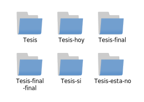
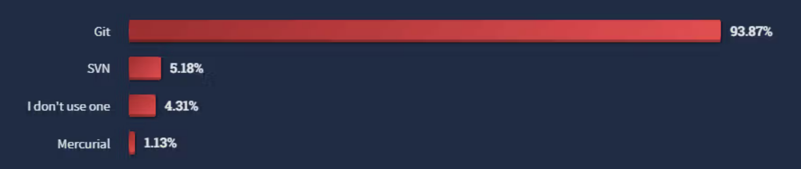
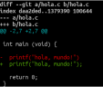
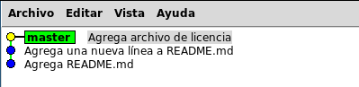
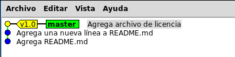

class: middle, inverse, no-number

.center[.title[Control de versiones con]]

.center[]

<div style="position: absolute; right: 20px; bottom: 0px; height: 30px; width: 400px; padding: 1em; text-align: center;">
.right[por Claudio J Paz]
</div>

---
class: center, middle, inverse, no-number

.title[¿Para qué sirve un control de versiones?]

---
# ¿Para qué sirve?
--
count: false

Para llevar registro de los cambios en archivos o proyectos
--
count: false

Para pasar de esto:

--
count: false
.center[]

???
Es fácil equivocarse

dificil saber cual es la verdadera versión final

borrar archivos que no querías

---
count: false
# ¿Para qué sirve?

Para llevar registro de los cambios en archivos o proyectos

a esto:

--
count: false
.center[]

---
# Primer intento

--
count: false
.center[]
.center[.smaller10[Ej.: RCS (Revision Control System)]]

.footnote[.smaller50[cc by-nc-sa 3.0 Scott Chacon, Ben Straub]]

???
Lo primero que surgió fue tener una base de datos con la lista de cambios

ejemplo: RCS (primera generación)

Muchos defectos:

como que no se podía editar un archivo al mismo tiempo por dos usuarios

se podía editar la lista de cambios

---
# Trabajo en equipo, pero centralizado

--
count: false
.center[]
.center[.smaller10[Ej.: CVS, Subversion, etc.]]

.footnote[.smaller50[cc by-nc-sa 3.0 Scott Chacon, Ben Straub]]
???

Con la necesidad de trabajo colaborativo surgen sistemas de control de versiones CENTRALIZADOS

Ejemplo: CVS y Subversion (segunda generación)


---
# Trabajo en equipo distribuido

--
count: false
.center[]
.center[.smaller10[Ej.: git, Bazaar, etc.]]

.footnote[.smaller50[cc by-nc-sa 3.0 Scott Chacon, Ben Straub]]

???

ante los riesgos por pérdidas de datos surgen sistemas distribuidos

Ejemplo: git, bazaar (tercera generación)

---
class: center, middle, inverse, no-number

.title[¿Se usa el control de versiones?]

---
--
count: false

En 2023 el sitio Stackoverflow preguntó a 70mil programadores si usaban o no un control de versiones, y cuál...
--
count: false

<div style="position: absolute; left: 0px;">
.center[]
</div>

.footnote[.smaller50[https://stackoverflow.blog/2023/01/09/beyond-git-the-other-version-control-systems-developers-use/]]

---
class: center, middle,inverse, no-number

--
count: false

.title[La diferencia de .git-orange[git] frente a los otros]

---
# Los otros...

--
count: false

.center[]

.footnote[.smaller50[cc by-nc-sa 3.0 Scott Chacon, Ben Straub]]

---
## Los deltas son algo así

.center[]

---
# git

--
count: false

.center[]

.footnote[.smaller50[cc by-nc-sa 3.0 Scott Chacon, Ben Straub]]

---
# Los tres estados

--
count: false

Git tiene tres estados principales en los que se pueden encontrar los archivos:

**confirmado (committed)**: significa que los datos están almacenados de manera segura en la base de datos local

---
count: false
# Los tres estados

Git tiene tres estados principales en los que se pueden encontrar los archivos:

**preparado (staged)**: significa que se ha marcado un archivo modificado en su versión actual para que vaya en la próxima confirmación.

---
count: false
# Los tres estados

Git tiene tres estados principales en los que se pueden encontrar los archivos:

**modificado (modified)**: significa que el archivo fue modificado pero todavía no se ha confirmado a la base de datos

---
# Las tres secciones

--
count: false

.center[]

.footnote[.smaller50[cc by-nc-sa 3.0 Scott Chacon, Ben Straub]]


---
class: center, middle,inverse, no-number

--
count: false

.title[Instalando, configurando e iniciando un control de versiones]

---
# Para Instalar
--
count: false

en Debian y Ubuntu:

.bigger50[
```sh
$ sudo apt install git
```
]

Para otras distribuciones:

https://git-scm.com/downloads/


---
# Para Configurar
--
count: false

Porque siempre es bueno tener alguien a quien echarle la culpa...

--
count: false

.bigger25[
```sh
$ git config --global user.name "Claudio Paz"
$ git config --global user.email claudiojpaz@gmail.com
```
]

--
count: false

Para editar los `commits`

.bigger25[
```sh
$ git config --global core.editor /usr/bin/vim
```
]


---
# Para Configurar

--
count: false

La configuración _global_ del usuario se puede encontrar en `~/.gitconfig`

--
count: false

La configuración _local_ de cada proyecto en `.git/config`

--
count: false

La configuración _global_ de todos los usuarios en `/etc/gitconfig`


--
count: false

Se puede chequear la lista de configuraciones con

--
count: false

.bigger25[
```sh
$ git config --list
```
]

---
# Iniciando

--
count: false

Hay tres opciones con las que se suele trabajar

--
count: false

* Creando un repositorio propio local

--
count: false

* Creando un repositorio propio local pero sincronizandolo con uno remoto

--
count: false

* Haciendo una copia de un repositorio remoto (propio o de otra persona)

---

# Iniciando

--
count: false

## Repositorio propio local
--
count: false

.bigger25[
```shell
$ git init mi_proyecto
```
]

--
count: false

Esto crea una carpeta `mi_proyecto` y comienza el repo ahí (archivos de configuración, etc.)

--
count: false

...o lo mismo un poco más largo

.bigger25[
```shell
$ mkdir otro_proyecto
$ cd otro_proyecto
$ git init
```
]

---

# Iniciando
## Repositorio propio local

--
count: false

En general esta opción no se usa tanto porque pierde la seguridad de tener todo en la nube

---
# Iniciando

--
count: false

## Repositorio propio local pero sincronizado en la nube
--
count: false

Creamos de la misma manera el repositorio local

.bigger25[
```shell
$ git init mi_proyecto_remoto
Inicializado repositorio Git vacío en mi_proyecto_remoto
$
```
]
--
count: false

y luego sincronizamos (el repositorio debe existir en la url)

.bigger25[
```shell
$ git init mi_proyecto_remoto
$ git remote add origin <url>
```
]

---
# Iniciando

--
count: false

## Copia (clone) de repositorio (propio o no)

--
count: false

Un repositorio de un tercero

.bigger25[
```sh
$ git clone https://github.com/git/git
```
]

--
count: false

O propio

--
count: false

armemos uno en gitlab

---
class: center, middle,inverse, no-number
--
count: false

.title[Ahora si... usando .git-orange[git]]

---
# El ciclo de vida de los archivos de git

--
count: false

.center[]

.footnote[.smaller50[cc by-nc-sa 3.0 Scott Chacon, Ben Straub]]

---
# Revisar el estado de los archivos

--
count: false

```sh
$ cd propio
$
```

---
count: false
# Revisar el estado de los archivos

```sh
$ cd propio
$ git status
```

---
count: false
# Revisar el estado de los archivos

```sh
$ cd propio
$ git status
En la rama master

No hay commits todavía

no hay nada para confirmar (crea/copia archivos y usa
                  "git add" para hacerles seguimiento)
$
```

---
count: false
# Revisar el estado de los archivos

```sh
$ cd propio
$ git status
En la rama master

No hay commits todavía

no hay nada para confirmar (crea/copia archivos y usa
                  "git add" para hacerles seguimiento)
$ touch README.md
$
```

---
count: false
# Revisar el estado de los archivos

```sh
$ cd propio
$ git status
En la rama master

No hay commits todavía

no hay nada para confirmar (crea/copia archivos y usa
                  "git add" para hacerles seguimiento)
$ touch README.md
$ git status
```

---
count: false
# Revisar el estado de los archivos

```sh
$ cd propio
$ git status
En la rama master

No hay commits todavía

no hay nada para confirmar (crea/copia archivos y usa
                  "git add" para hacerles seguimiento)
$ touch README.md
$ git status
En la rama master

No hay commits todavía

Archivos sin seguimiento:
  (usa "git add <archivo>..." para incluirlo a lo que se
                                         será confirmado)

  README.md

no hay nada agregado al commit pero hay archivos sin seguimiento
              presentes (usa "git add" para hacerles seguimiento)

```
---
# Rastrear archivos nuevos

--
count: false

```sh
$
```
---
count: false
# Rastrear archivos nuevos

```sh
$ git add README.md
$
```
---
count: false
# Rastrear archivos nuevos

```sh
$ git add README.md
$ git status
```

---
count: false
# Rastrear archivos nuevos

```sh
$ git add README.md
$ git status
En la rama master

No hay commits todavía

Cambios a ser confirmados:
  (usa "git rm --cached <archivo>..." para sacar del área de stage)

  nuevo archivo:  README.md

```

---

# Preparar archivos modificados

```sh
$
```
---
count: false
# Preparar archivos modificados

```sh
$ echo "Modificando README.md" > README.md
$
```
---
count: false
# Preparar archivos modificados

```sh
$ echo "Modificando README.md" > README.md
$ git status
```
---
count: false
# Preparar archivos modificados

```sh
$ echo "Modificando README.md" > README.md
$ git status
En la rama master

No hay commits todavía

Cambios a ser confirmados:
  (usa "git rm --cached <archivo>..." para sacar del área de stage)

  nuevo archivo:  README.md

Cambios no rastreados para el commit:
  (usa "git add <archivo>..." para actualizar lo que será confirmado)
  (usa "git checkout -- <archivo>..." para descartar los cambios en
                                            el directorio de trabajo)

  modificado:     README.md

```

---
# Método abreviado (de status)

--
count: false

```sh
$ git status -s
 M README
MM Rakefile
A  lib/git.rb
M  lib/simplegit.rb
?? LICENSE.txt
```
--
count: false

`??` es un archivo que no está bajo seguimiento (untracked)

`A` es un archivo que está agregado y preparado para confirmación (staged)

`M` es un archivo que fue preparado alguna vez, pero fue modificado

---
count: false
# Método abreviado (de status)

```sh
$ git status -s
 M README
MM Rakefile
A  lib/git.rb
M  lib/simplegit.rb
?? LICENSE.txt
```
--
count: false

Se pueden ver dos columnas, a la izquiera está el estado preparado para confirmar y a la derecha el estado si preparar

---
# Ver los cambios preparados y no preparados
--
count: false

```sh
$ cat README.md
Modificando README.md
$
```
---
count: false
# Ver los cambios preparados y no preparados

```sh
$ cat README.md
Modificando README.md
$ git status -s
AM README.md
$
```
---
count: false
# Ver los cambios preparados y no preparados

```sh
$ cat README.md
Modificando README.md
$ git status -s
AM README.md
$ git diff
diff --git a/README.md b/README.md
index e69de29..a71e443 100644
--- a/README.md
+++ b/README.md
@@ -0,0 +1 @@
+Modificando README.md
$
```
---
count: false
# Ver los cambios preparados y no preparados

```sh
$ cat README.md
Modificando README.md
$ git status -s
AM README.md
$ git diff
diff --git a/README.md b/README.md
index e69de29..a71e443 100644
--- a/README.md
+++ b/README.md
@@ -0,0 +1 @@
+Modificando README.md
$ git add README.md
$
```
---
count: false
# Ver los cambios preparados y no preparados

```sh
$ cat README.md
Modificando README.md
$ git status -s
AM README.md
$ git diff
diff --git a/README.md b/README.md
index e69de29..a71e443 100644
--- a/README.md
+++ b/README.md
@@ -0,0 +1 @@
+Modificando README.md
$ git add README.md
$ git status -s
A  README.md
$
```
---
count: false
# Ver los cambios preparados y no preparados

```sh
$ cat README.md
Modificando README.md
$ git status -s
AM README.md
$ git diff
diff --git a/README.md b/README.md
index e69de29..a71e443 100644
--- a/README.md
+++ b/README.md
@@ -0,0 +1 @@
+Modificando README.md
$ git add README.md
$ git status -s
A  README.md
$ git diff
$
```
---
# Ver los cambios preparados y no preparados
--
count: false

`git diff` compara el directorio de trabajo con lo que esta preparado para confirmar (working directory vs staging area)

--
count: false

Para comparar lo preparado con lo último confirmado (o lo que está listo para confirmar) se usa
.bigger25[
```sh
$ git diff --staged
```
]
.bigger25[
ó
```sh
$ git diff --cached
```
]

---
# Confirmar los cambios
--
count: false

```sh
$ git status
En la rama master

No hay commits todavía

Cambios a ser confirmados:
  (usa "git rm --cached <archivo>..." para sacar del área de stage)

  nuevo archivo:  README.md
$
```

---
count: false
# Confirmar los cambios

```sh
$ git status
En la rama master

No hay commits todavía

Cambios a ser confirmados:
  (usa "git rm --cached <archivo>..." para sacar del área de stage)

  nuevo archivo:  README.md
$ git commit
```
--
count: false

En este momento se abre el editor que se haya configurado con `git config --global core.editor` o en su defecto con lo que tenga la variable de entorno `$EDITOR`

---

# Confirmar los cambios (editor)
--
count:false

.smaller10[
.smaller10[
```csp

# Por favor ingrese el mensaje del commit para sus cambios. Las líneas que comiencen
# con '#' serán ignoradas, y un mensaje vacío aborta el commit.
#
# En la rama master
#
# Confirmación inicial
#
# Cambios a ser confirmados:
#      nuevo archivo:  README.md
#
~
~
~
~
~
~
~
~
~
~
~
~
~
~
```
]
]

---
# Confirmar los cambios (línea de comandos)
--
count: false

.bigger25[
```sh
$ git commit -m "Agrega README.md"
```
]
---
count: false
# Confirmar los cambios

.bigger25[
```sh
$ git commit -m "Agrega README.md"
[master (commit-raíz) da11ada] Agrega README.md
 1 file changed, 0 insertions(+), 0 deletions(-)
 create mode 100644 README.md
$
```
]

---
count: false
# Confirmar los cambios

.bigger25[
```sh
$ git commit -m "Agrega README.md"
[master (commit-raíz) da11ada] Agrega README.md
 1 file changed, 0 insertions(+), 0 deletions(-)
 create mode 100644 README.md
$ echo "Otra línea" >> README.md
$
```
]

---
count: false
# Confirmar los cambios

.bigger25[
```sh
$ git commit -m "Agrega README.md"
[master (commit-raíz) da11ada] Agrega README.md
 1 file changed, 0 insertions(+), 0 deletions(-)
 create mode 100644 README.md
$ echo "Otra línea" >> README.md
$ git status -s
 M README.md
$
```
]
---
count: false
# Confirmar los cambios

.bigger25[
```sh
$ git commit -m "Agrega README.md"
[master (commit-raíz) da11ada] Agrega README.md
 1 file changed, 0 insertions(+), 0 deletions(-)
 create mode 100644 README.md
$ echo "Otra línea" >> README.md
$ git status -s
 M README.md
$ git add README.md
$
```
]
---
count: false
# Confirmar los cambios

.bigger25[
```sh
$ git commit -m "Agrega README.md"
[master (commit-raíz) da11ada] Agrega README.md
 1 file changed, 0 insertions(+), 0 deletions(-)
 create mode 100644 README.md
$ echo "Otra línea" >> README.md
$ git status -s
 M README.md
$ git add README.md
$ git commit -m "Agrega una nueva línea a README.md"
```
]

---
count: false
# Confirmar los cambios

.bigger25[
```sh
$ git commit -m "Agrega README.md"
[master (commit-raíz) da11ada] Agrega README.md
 1 file changed, 0 insertions(+), 0 deletions(-)
 create mode 100644 README.md
$ echo "Otra línea" >> README.md
$ git status -s
 M README.md
$
```
]

---
count: false
# Confirmar los cambios

.bigger25[
```sh
$ git commit -m "Agrega README.md"
[master (commit-raíz) da11ada] Agrega README.md
 1 file changed, 0 insertions(+), 0 deletions(-)
 create mode 100644 README.md
$ echo "Otra línea" >> README.md
$ git status -s
 M README.md
$ git commit -a -m "Agrega una nueva línea a README.md"
```
]
---
count: false
# Confirmar los cambios

.bigger25[
```sh
$ git commit -m "Agrega README.md"
[master (commit-raíz) da11ada] Agrega README.md
 1 file changed, 0 insertions(+), 0 deletions(-)
 create mode 100644 README.md
$ echo "Otra línea" >> README.md
$ git status -s
 M README.md
$ git commit -a -m "Agrega una nueva línea a README.md"
[master 1090bdb] Agrega una nueva línea a README.md
 1 file changed, 1 insertion(+)
$
```
]

---
count: false
# Confirmar los cambios

.bigger25[
```sh
$ git commit -m "Agrega README.md"
[master (commit-raíz) da11ada] Agrega README.md
 1 file changed, 0 insertions(+), 0 deletions(-)
 create mode 100644 README.md
$ echo "Otra línea" >> README.md
$ git status -s
 M README.md
$ git commit -a -m "Agrega una nueva línea a README.md"
[master 1090bdb] Agrega una nueva línea a README.md
 1 file changed, 1 insertion(+)
$ git status
```
]
---
count: false
# Confirmar los cambios

.bigger25[
```sh
$ git commit -m "Agrega README.md"
[master (commit-raíz) da11ada] Agrega README.md
 1 file changed, 0 insertions(+), 0 deletions(-)
 create mode 100644 README.md
$ echo "Otra línea" >> README.md
$ git status -s
 M README.md
$ git commit -a -m "Agrega una nueva línea a README.md"
[master 1090bdb] Agrega una nueva línea a README.md
 1 file changed, 1 insertion(+)
$ git status
En la rama master
nada para hacer commit, el árbol de trabajo está limpio
$
```
]
---
# Eliminar archivos
---
count: false
# Eliminar archivos (sin querer)

--
count: false

.bigger25[
```sh
$ rm README.md
```
]

???
Supongamos que borramos sin querer un archivo

La solución dependerá de cuando nos demos cuenta que la cagamos

---
count: false
# Eliminar archivos (sin querer)

.bigger25[
```sh
$ rm README.md
$ git status -s
```
]
---
count: false
# Eliminar archivos (sin querer)

.bigger25[
```sh
$ rm README.md
$ git status -s
 D README.md
$
```
]
---
count: false
# Eliminar archivos (sin querer)

.bigger25[
```sh
$ rm README.md
$ git status -s
 D README.md
$ git add .
$
```
]

???
Supongamos que abusamos del git add .

con lo que logramos (sin querer) preparar el archivo

---
count: false
# Eliminar archivos (sin querer)

.bigger25[
```sh
$ rm README.md
$ git status -s
 D README.md
$ git add .
$ git status -s
D  README.md
$
```
]

???
Si nos damos cuenta en este momento (ya está en stage) hay que sacar el archivo de ahí

---
count: false
# Eliminar archivos (sin querer)

.bigger25[
```sh
$ rm README.md
$ git status -s
 D README.md
$ git add .
$ git status -s
D  README.md
$ git reset HEAD README.md
$
```
]

---
count: false
# Eliminar archivos (sin querer)

.bigger25[
```sh
$ rm README.md
$ git status -s
 D README.md
$ git add .
$ git status -s
D  README.md
$ git reset HEAD README.md
$ ls
$
```
]

---
count: false
# Eliminar archivos (sin querer)

.bigger25[
```sh
$ rm README.md
$ git status -s
 D README.md
$ git add .
$ git status -s
D  README.md
$ git reset HEAD README.md
$ ls
$ git status -s
 D README.md
$
```
]
---
count: false
# Eliminar archivos (sin querer)

.bigger25[
```sh
$ rm README.md
$ git status -s
 D README.md
$ git add .
$ git status -s
D  README.md
$ git reset HEAD README.md
$ ls
$ git status -s
 D README.md
$ git checkout -- README.md
$
```
]
---
count: false
# Eliminar archivos (sin querer)

.bigger25[
```sh
$ rm README.md
$ git status -s
 D README.md
$ git add .
$ git status -s
D  README.md
$ git reset HEAD README.md
$ ls
$ git status -s
 D README.md
$ git checkout -- README.md
$ ls
README.md
$
```
]

---
# Eliminar archivos (queriendo)
--
count: false

.bigger25[
```sh
$ git rm README.md
$
```
]
---
count: false
# Eliminar archivos (queriendo)

.bigger25[
```sh
$ git rm README.md
$ git status -s
D  README.md
$
```
]

---
# Corregir un commit
--
count: false

Si queremos corregir el mensaje de un `commit`
--
count: false

o lo más común, se olvidó preparar un archivo...

--
count: false

.bigger25[
```sh
$ git status -s
 M README.md
?? LICENSE
$
```
]

---
count: false
# Corregir un commit

Si queremos corregir el mensaje de un `commit`

o lo más común, se olvidó preparar un archivo...

.bigger25[
```sh
$ git status -s
 M README.md
?? LICENSE
$ git commit -a -m "Agrega archivo de licencia"
[master a8cae20] Agrega archivo de licencia
 1 file changed, 1 insertion(+), 1 deletion(-)
$
```
]

---
count: false
# Corregir un commit

Si queremos corregir el mensaje de un `commit`

o lo más común, se olvidó preparar un archivo...

.bigger25[
```sh
$ git status -s
 M README.md
?? LICENSE
$ git commit -a -m "Agrega archivo de licencia"
[master a8cae20] Agrega archivo de licencia
 1 file changed, 1 insertion(+), 1 deletion(-)
$ git status -s
?? LICENSE
$
```
]

---
count: false
# Corregir un commit

Si queremos corregir el mensaje de un `commit`

o lo más común, se olvidó preparar un archivo...

.bigger25[
```sh
$ git status -s
 M README.md
?? LICENSE
$ git commit -a -m "Agrega archivo de licencia"
[master a8cae20] Agrega archivo de licencia
 1 file changed, 1 insertion(+), 1 deletion(-)
$ git status -s
?? LICENSE
$ git add LICENSE
$
```
]

---
count: false
# Corregir un commit

Si queremos corregir el mensaje de un `commit`

o lo más común, se olvidó preparar un archivo...

.bigger25[
```sh
$ git status -s
 M README.md
?? LICENSE
$ git commit -a -m "Agrega archivo de licencia"
[master a8cae20] Agrega archivo de licencia
 1 file changed, 1 insertion(+), 1 deletion(-)
$ git status -s
?? LICENSE
$ git add LICENSE
$ git commit --amend
```
]

---
# Corregir un commit
--
count:false

.smaller10[
.smaller10[
```csp
Agrega archivo de licencia

# Por favor ingrese el mensaje del commit para sus cambios. Las líneas que comiencen
# con '#' serán ignoradas, y un mensaje vacío aborta el commit.
#
# Fecha:     Wed Jul 3 18:24:24 2019 -0300
#
# En la rama master
# Cambios a ser confirmados:
#       nuevo archivo:  LICENSE
#       modificado:     README.md
#
~
~
~
~
~
~
~
~
~
~
~
~
~
~
```
]
]

---
# Etiquetado
--
count: false

Las **etiquetas ligeras** son simplemente un puntero a un `commit` específico.

--
count: false

Las **etiquetas anotadas** además contienen el nombre del etiquetador, correo electrónico y fecha; tienen un mensaje asociado; y pueden ser firmadas y verificadas con GNU Privacy Guard (GPG).

???
Puntos específicos del historial.

Esta funcionalidad se usa típicamente para marcar versiones de lanzamiento

---
# Etiquetado (ligero)
--
count: false

.bigger25[
```sh
$ gitk
```
]

--
count: false

.left[]

---
count: false
# Etiquetado (ligero)

.bigger25[
```sh
$ gitk
$
```
]

---
count: false
# Etiquetado (ligero)

.bigger25[
```sh
$ gitk
$ git tag v1.0
$
```
]

---
count: false
# Etiquetado (ligero)

.bigger25[
```sh
$ gitk
$ git tag v1.0
$ gitk
```
]

--
count: false

.left[]

---
count: false
# Etiquetado (ligero)

.bigger25[
```sh
$ gitk
$ git tag v1.0
$ gitk
$
```
]

---
count: false
# Etiquetado (ligero)

.bigger25[
```sh
$ gitk
$ git tag v1.0
$ gitk
$ git show
```
]

---
count: false
# Etiquetado (ligero)

.bigger25[
```sh
$ gitk
$ git tag v1.0
$ gitk
$ git show
commit d1c1e65eb7de59cf654a...(HEAD -> master, tag: v1.0)
Author: claudiojpaz <claudiojpaz@gmail.com>
Date:   Wed Jul 3 23:37:31 2019 -0300

    Agrega archivo de licencia

diff --git a/LICENSE b/LICENSE
new file mode 100644
index 0000000..e69de29

```
]

---
# Etiquetado (anotado)
--
count: false

.bigger25[
```sh
$ git tag --list
v1.0
$
```
]
---
count: false
# Etiquetado (anotado)

.bigger25[
```sh
$ git tag --list
v1.0
$ git tag -d v1.0
Etiqueta 'v1.0' eliminada
$
```
]
---
count: false
# Etiquetado (anotado)

.bigger25[
```sh
$ git tag --list
v1.0
$ git tag -d v1.0
Etiqueta 'v1.0' eliminada
$ git tag -a v1.0 -m "Primera etiqueta"
$
```
]

---
count: false
# Etiquetado (anotado)

.bigger25[
```sh
$ git tag --list
v1.0
$ git tag -d v1.0
Etiqueta 'v1.0' eliminada
$ git tag -a v1.0 -m "Primera etiqueta"
$ git show v1.0
tag v1.0
Tagger: claudiojpaz <claudiojpaz@gmail.com>
Date:   Thu Jul 4 00:27:21 2019 -0300

Primera etiqueta

commit d1c1e65eb7de59cf654a...(HEAD -> master, tag: v1.0)

...
```
]
---
class: center, middle,inverse, no-number
--
count: false

.title[¿Y las ramas?]

---
# Hasta ahora solo master

--
count: false

```sh
$ git log --oneline
```
---
count: false
# Hasta ahora solo master

```sh
$ git log --oneline
f30ab (HEAD -> master, tag: v1.0) Agrega archivo de licencia
34ac2 Agrega una nueva línea a README.md
98ca9 Agrega README.md
```

--
count: false

.center[]
.footnote[.smaller50[cc by-nc-sa 3.0 Scott Chacon, Ben Straub]]

---
# Creando una nueva rama

--
count: false

```sh
$ git branch testing
$
```

--
count: false

.center[]
.footnote[.smaller50[cc by-nc-sa 3.0 Scott Chacon, Ben Straub]]

---
# Cambiando de rama

--
count: false

```sh
$ git checkout testing
Cambiado a rama 'testing'
$
```

--
count: false

.center[]
.footnote[.smaller50[cc by-nc-sa 3.0 Scott Chacon, Ben Straub]]

---
# Cambiando de rama
--
count: false

```sh
$ echo "Algo de GPL" >> LICENSE
$
```
---
count: false
# Cambiando de rama

```sh
$ echo "Algo de GPL" >> LICENSE
$ git commit -a -m "Agrega texto de licencia"
[testing 87ab2] Agrega texto de licencia
 1 file changed, 1 insertion(+)
$
```

--
count: false

.center[]
.footnote[.smaller50[cc by-nc-sa 3.0 Scott Chacon, Ben Straub]]

---
# Cambiando de rama

--
count: false

```sh
$ git checkout master
Cambiado a rama 'master'
$
```

--
count: false

.center[]
.footnote[.smaller50[cc by-nc-sa 3.0 Scott Chacon, Ben Straub]]

---
# Cambiando de rama

--
count: false

```sh
$ echo "Algo más de GPL" >> LICENSE
$
```

---
# Cambiando de rama
--
count: false

```sh
$ git commit -a -m "Agrega más texto a licencia"
[master c2b9e] Agrega más texto a licencia
 1 file changed, 1 insertion(+)
$
```
--
count: false

.center[]
.footnote[.smaller50[cc by-nc-sa 3.0 Scott Chacon, Ben Straub]]

---
# Cambiando de rama
--
count: false

```sh
$ git log --oneline --graph --all
 * c2b9e (HEAD -> master) Agrega más texto a licencia
 | * 87ab2 (testing) Agrega texto de licencia
 |/
 * f30ab (tag: v1.0) Agrega archivo de licencia
 * 34ac2 Agrega una nueva línea a README.md
 * 98ca9 Agrega README.md
```

---
# Bibliografia hasta acá

https://git-scm.com/book/es/v2

---
class: center, middle,inverse, no-number

--
count: false

.title[.bigger50[Gitflow]]


## diseñado por Vincent Driessen (2010)

???

---
class: center, middle
Flujo de trabajo basado en git que brinda un mayor control y organización en el proceso de integración continua.


Ideal para trabajar con desarrolladores junior.

---
# Ramas eternas
--
count: false

.right[]
.footnote[.smaller50[cc by-sa 3.0 Vincent Driessen]]
---
count: false
# Ramas eternas

.left-column[
**master** solo contiene código listo para producción (uso en aplicación)
]
.right[]

.footnote[.smaller50[cc by-sa 3.0 Vincent Driessen]]
---
count: false
# Ramas eternas

.left-column[
]
.right[]

.footnote[.smaller50[cc by-sa 3.0 Vincent Driessen]]

---
count: false
# Ramas eternas

.left-column[
**develop** tiene código con los nuevos desarrollos y características que se incorporarán en el próximo release
]
.right[]

.footnote[.smaller50[cc by-sa 3.0 Vincent Driessen]]

---
count: false
# Ramas eternas

.left-column[
]
.right[]

.footnote[.smaller50[cc by-sa 3.0 Vincent Driessen]]

---
count: false
# Ramas eternas

.left-column[
Solo cuando **develop** fue _testeada_ lo suficiente es fusionado con **master**
]
.right[]

.footnote[.smaller50[cc by-sa 3.0 Vincent Driessen]]
---
# Ramas de apoyo
--
count: false

Las ramas **feature** se usan para desarrollar nuevas caracteristicas del programa

--
count: false

La rama **release** es un paso intermedio entre **develop** y **master**.
Generalmente aquí aparecen los números/nombres de versiones.

--
count: false

Las ramas **hotfix** resuelven bugs generalmente aparecidos en **master**.

---
# Ramas de apoyo

.left-column[
]
.right[]

.footnote[.smaller50[cc by-sa 3.0 Vincent Driessen]]
---
count: false
# Ramas de apoyo

.left-column[
Las ramas **feature** siempre se desprenden y se fusionan en **develop**.
]
.right[]

.footnote[.smaller50[cc by-sa 3.0 Vincent Driessen]]
---
count: false
# Ramas de apoyo

.left-column[
]
.right[]

.footnote[.smaller50[cc by-sa 3.0 Vincent Driessen]]
---
count: false
# Ramas de apoyo

.left-column[
Para iniciar la rama...
]
.right[]

.footnote[.smaller50[cc by-sa 3.0 Vincent Driessen]]
---
count: false
# Ramas de apoyo

.left-60-column[
Para iniciar la rama...
```sh
$ git checkout -b myfeature develop
Cambiado a nueva rama 'myfeature'
$
```
]
.right[]

.footnote[.smaller50[cc by-sa 3.0 Vincent Driessen]]
---
count: false
# Ramas de apoyo

.left-column[
]
.right[]

.footnote[.smaller50[cc by-sa 3.0 Vincent Driessen]]
---
count: false
# Ramas de apoyo

.left-60-column[
Para cerrarla...
```sh
$ git checkout develop
Cambiado a rama 'develop'
$ git merge --no-ff myfeature
Updating ea1b82a..05e9557
...
$ git branch -d myfeature
Eliminada la rama myfeature (era 05e9557).
...
```
]
.right[]

.footnote[.smaller50[cc by-sa 3.0 Vincent Driessen]]

---
count: false
# Ramas de apoyo

.left-60-column[
Para cerrarla...
```sh
$ git checkout -b release-1.0 develop
Cambiado a nueva rama 'release-1.0'
$
```
]
.right-40-column[

]

.right-60-column[

]
.right-60-column[

]
--
count: false

Después de revisar todo se cierra

--
count: false

```sh
$ git commit -a -m "Actualizada la versión a 1.0"
[release-1.0 74d9424] Actualizada la versión a 1.0
1 files changed, 1 insertions(+), 1 deletions(-)
```
---
# Ramas de apoyo
--
count: false

```sh
$ git checkout master
Cambiado a rama 'master'
$ git merge --no-ff release-1.0
Merge made by the 'recursive' strategy.
...
$ git tag -a 1.0
$
```

---
count: false
# Ramas de apoyo

```sh
$ git checkout master
Cambiado a rama 'master'
$ git merge --no-ff release-1.0
Merge made by the 'recursive' strategy.
...
$ git tag -a 1.0
$ git checkout develop
Cambiado a rama 'develop'
$ git merge --no-ff release-1.0
Merge made by the 'recursive' strategy.
...
$
```
---
count: false
# Ramas de apoyo

```sh
$ git checkout master
Cambiado a rama 'master'
$ git merge --no-ff release-1.0
Merge made by the 'recursive' strategy.
...
$ git tag -a 1.0
$ git checkout develop
Cambiado a rama 'develop'
$ git merge --no-ff release-1.0
Merge made by the 'recursive' strategy.
...
$ git branch -d release-1.0
Eliminada la rama release-1.0
$
```
---
# Ramas de apoyo
--
count: false

.left-60-column[
]
.right[]

.footnote[.smaller50[cc by-sa 3.0 Vincent Driessen]]

---
count: false
# Ramas de apoyo

.left-60-column[
Las ramas **hotfix** se desprenden de **master** y se deben fusionar con **develop** y **master**
]
.right[]

.footnote[.smaller50[cc by-sa 3.0 Vincent Driessen]]
---
count: false
# Ramas de apoyo

.left-60-column[
]
.right[]

.footnote[.smaller50[cc by-sa 3.0 Vincent Driessen]]
---
count: false
# Ramas de apoyo

.left-60-column[
Para iniciar la rama...
]
.right[]

.footnote[.smaller50[cc by-sa 3.0 Vincent Driessen]]

---
count: false
# Ramas de apoyo

.left-60-column[
Para iniciar la rama...
```sh
$ git checkout -b hotfix-1.2.1 master
Cambiado a rama 'hotfix-1.2.1'
...
```
]
.right[]

.footnote[.smaller50[cc by-sa 3.0 Vincent Driessen]]
---
count: false
# Ramas de apoyo

.left-60-column[
Para iniciar la rama...
```sh
$ git checkout -b hotfix-1.2.1 master
Cambiado a rama 'hotfix-1.2.1'
...
$ git commit -a -m "Act. versión a 1.2.1"
...
```
]
.right[]

.footnote[.smaller50[cc by-sa 3.0 Vincent Driessen]]

---
count: false
# Ramas de apoyo

.left-60-column[
Para iniciar la rama...
```sh
$ git checkout -b hotfix-1.2.1 master
Cambiado a rama 'hotfix-1.2.1'
...
$ git commit -a -m "Act. versión a 1.2.1"
...
```
Luego de la corrección...
]
.right[]

.footnote[.smaller50[cc by-sa 3.0 Vincent Driessen]]

---
count: false
# Ramas de apoyo

.left-60-column[
]
.right[]

.footnote[.smaller50[cc by-sa 3.0 Vincent Driessen]]

---
count: false
# Ramas de apoyo

.left-60-column[
```sh
$ git commit -m "Soluciona el bug"
[hotfix-1.2.1 abbe5d6] Soluciona el bug
5 files changed, 32 insertions(+)
$
```
]
.right[]

.footnote[.smaller50[cc by-sa 3.0 Vincent Driessen]]

---
count: false
# Ramas de apoyo

.left-60-column[
```sh
$ git commit -m "Soluciona el bug"
[hotfix-1.2.1 abbe5d6] Soluciona el bug
5 files changed, 32 insertions(+)
$ git checkout master
Cambiado a rama 'master'
$ git merge --no-ff hotfix-1.2.1
Merge made by recursive.
(Summary of changes)
$ git tag -a 1.2.1
$
```
]
.right[]

.footnote[.smaller50[cc by-sa 3.0 Vincent Driessen]]

---
count: false
# Ramas de apoyo

.left-60-column[
```sh
$ git commit -m "Soluciona el bug"
[hotfix-1.2.1 abbe5d6] Soluciona el bug
5 files changed, 32 insertions(+)
$ git checkout master
Cambiado a rama 'master'
$ git merge --no-ff hotfix-1.2.1
Merge made by recursive.
(Summary of changes)
$ git tag -a 1.2.1
$ git checkout develop
Cambiado a rama 'develop'
$ git merge --no-ff hotfix-1.2.1
Merge made by recursive.
(Summary of changes)
$ git branch -d hotfix-1.2.1
Eliminada la rama hotfix-1.2.1
```
]
.right[]
.footnote[.smaller50[cc by-sa 3.0 Vincent Driessen]]

---
# Importante

--
count: false

Solo un encargado de hacer los `merge` hacia **master**.

--
count: false

Trabajar con _pull-request_ o _merge-request_.

--
count: false

Es preferible que las ramas **features** también los usen.

--
count: false

Pueden haber más autorizados a aceptarlos.

---
# Lo que quedó en el tintero

--
count: false

Más comandos de git (grep, stash, bisect)

--
count: false

Jugar con las versiones remotas

--
count: false

Ver las extensiones `git-flow`


---
class: center, middle, no-number

# ¡Gracias!
---
class: center, middle, no-number

# ¿Preguntas?

.footnote[``claudiojpaz@gmail.com``]
