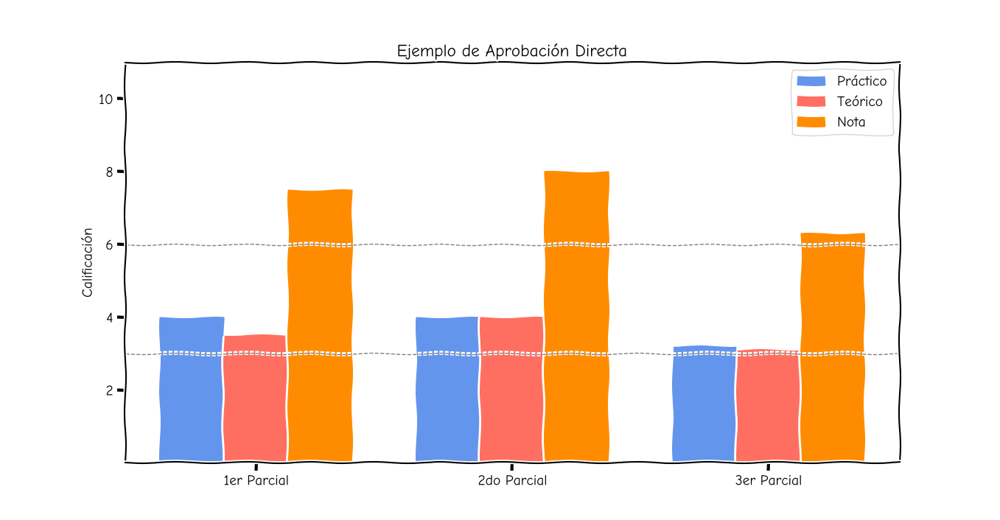
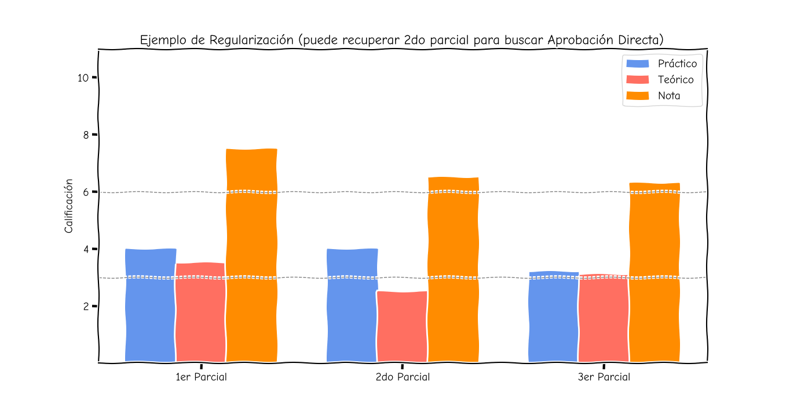
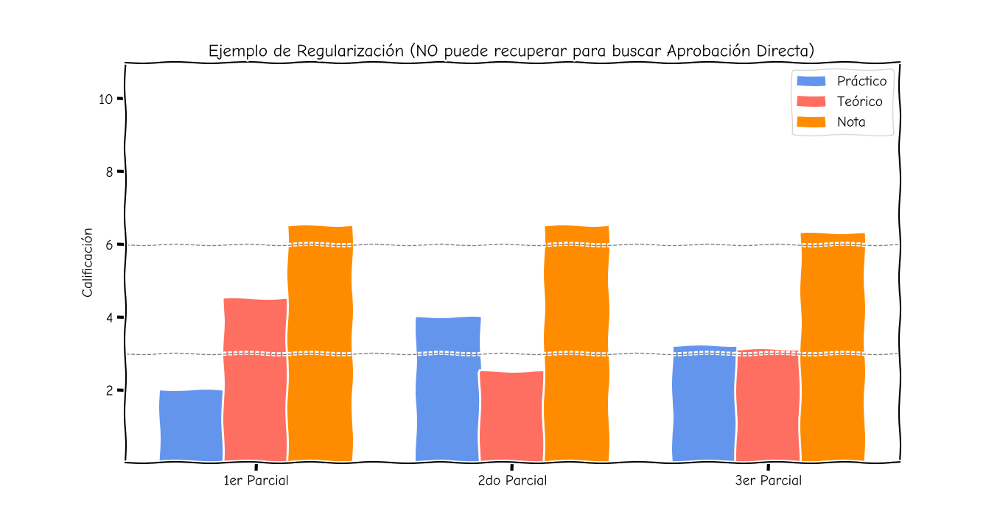
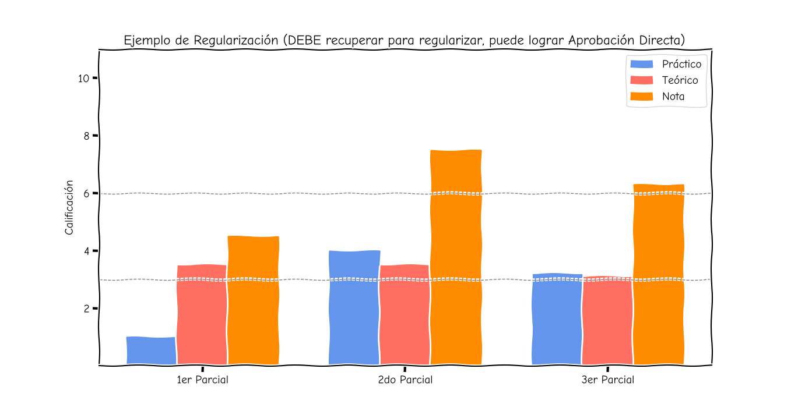
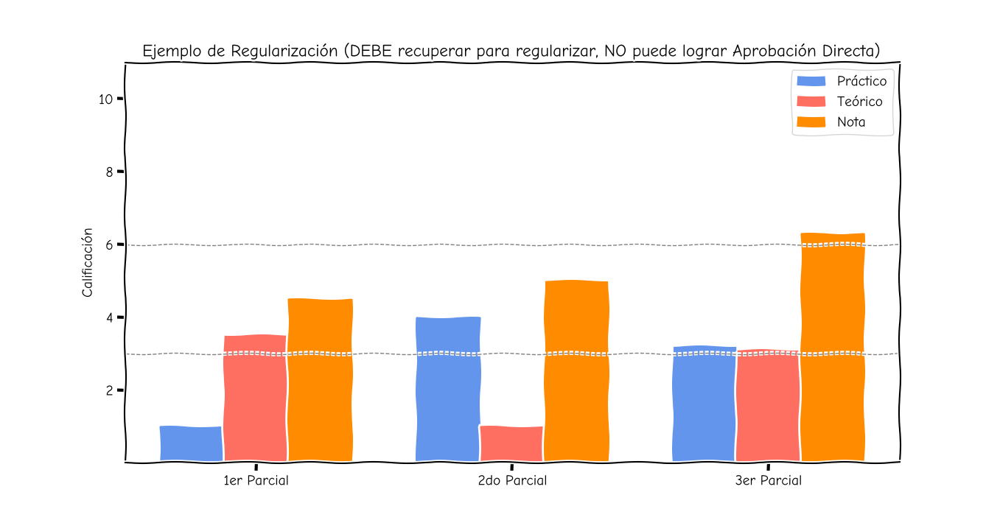

class: center, middle, inverse
<title>Presentación</title>

.title[Informática I]

.center[2025]

<input type="image" src="assets/fullscreen.png" onclick="openFullscreen()" style="height: 15%; width: 15%;">
<input type="image" src="assets/smallscreen.png" onclick="closeFullscreen()" style="height: 15%; width: 15%;">

---
class: middle, center, inverse
.title[Quiénes]
---
class: inverse
# Integrantes de la Cátedra
 
--
count: false
## Prof. Titular: Luis E. Toledo

## Prof. Asoc.: Claudio J. Paz

## JTP: Martín Nievas
---
class: middle, center, inverse
.title[Cuándo]
---
class: inverse
--
count: false
# Horarios 1R5

 Teórico: Lunes 11:20hs. a 12:50hs. (Paz)  
 Práctico: Jueves 8:00hs. a 10:25hs. (Nievas)

# Horarios 1R7

 Teórico: Miércoles 21:35hs. a 23:05hs. (Paz)  
 Práctico: Miércoles 19:00hs. a 21:25hs. (Nievas)

---
class: inverse
# Condiciones para Regularizar
--
count: false

 
## Asistir a clases (al menos 75%)

--
count: false
## Presentar los Trabajos Prácticos en UV (al menos 80%)

--
count: false
## Aprobar los parciales Teórico-Prácticos

---
name: parciales
class: inverse
---
template: parciales
count: false
# Parciales
---
template: parciales
count: false
# Parciales. Regularización
--
count: false

Tres parciales

--
count: false
Cada uno tiene dos partes, una práctica y otra teórica (Pero es el mismo parcial)

--
count: false
Para **Regularizar** la materia se necesita que en cada parcial, la suma de las partes (la teórica y la práctica) sea mayor o igual a 6.

--
count: false
El 6 corresponde a un 60%

---
template: parciales
count: false
# Parciales. Regularización. Recuperatorios

--
count: false
Si no se alcanza el 6 en alguno de los parciales se puede recuperar a fin de año en un examen de similares características del parcial desaprobado.

--
count: false

El parcial se recupera completo **siempre** (parte teórica y práctica)

--
count: false

Se puede recuperar incluso no alcanzando el 60% en los tres parciales

---
template: parciales
# Parciales
---
template: parciales
count: false
# Parciales. Aprobación Directa

--
count: false
Si se cumplen con los requisitos de regularización...

--
count: false
Y además se entregaron el 100% de los Trabajos Prácticos

--
count: false
Para **Aprobar Directamente** la materia se necesita que las partes (teórica y práctica) de cada parcial (1er, 2do y 3ro) sea mayor o igual a 3.

--
count: false

También hay que realizar un trabajo práctico extra (TP10)

---
template: parciales
count: false
# Parciales. Aprobación Directa. Recuperatorios.
--
count: false
Si no se alcanza esa condición en algún parcial se puede recuperar a fin de año en un examen de similares características del parcial que no haya cumplido con estas calificaciones.

--
count: false
Si no se alcanza esa condición en más de uno los parciales no se puede Aprobar Directamente, solo se podrá regularizar.

---
class: inverse
# Parciales. Ejemplos
--
count: false

---
class: inverse
# Parciales. Ejemplos
--
count: false

---
class: inverse
# Parciales. Ejemplos
--
count: false

---
class: inverse
# Parciales. Ejemplos
--
count: false

---
class: inverse
# Parciales. Ejemplos
--
count: false

---
class: inverse
# Parciales
---
class: inverse
count: false
# Parciales. Fechas
--
count: false
 
## 1er Parcial: Miércoles 21/5/2025 20h
--
count: false
## 2do parcial: Miércoles 27/8/2025 20h
--
count: false
## 3er parcial: Miércoles 5/11/2025 20h
--
count: false
## Recuperatorios: Miércoles 19/11/2025 20h

 
 
--
count: false
## Aulas a definir
---
class: inverse
# Trabajos Prácticos
--
count: false
 
## 10 Trabajos Prácticos (80% para regularizar y 100% para Ap. Directamente)
--
count: false
## 2 Obligatorios

--
count: false
## Para Aprobación Directa TP Integrador
--
count: false
## Todos se suben a la UV (Ojo! Tienen fecha límite)

---
class: center, middle, inverse
# .bigger50[Consultas]

---
class: inverse
**Jueves de 12 a 14h - Ed.Salcedo - Of.5**

.smaller75[Centro de Investigación en Informática para la Ingeniería (CIII)]

<iframe width="100%" height="100%" id="gmap_canvas" src="https://maps.google.com/maps?q=ciii utn&t=&z=17&ie=UTF8&iwloc=&output=embed" frameborder="0" scrolling="no" marginheight="0" marginwidth="0"></iframe><a href="https://2yu.co">2yu</a> <a href="https://embedgooglemap.2yu.co/">html embed google map</a>

---
class: inverse

**Por mail**

---
class: inverse

**Grupo de Telegram**

