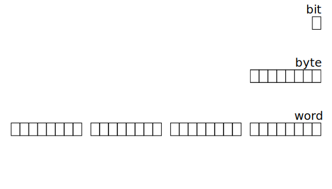
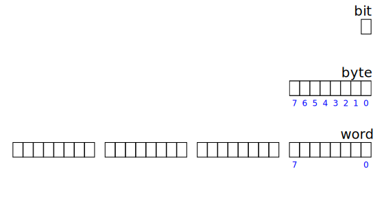
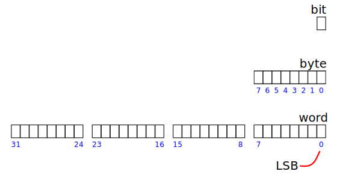
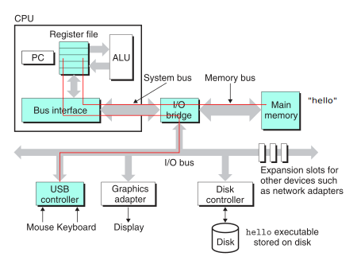
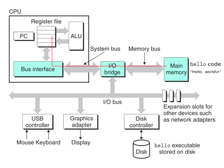

class: center, middle, inverse
<title>Unidad 1</title>

.title[Informática I]

Claudio Paz

<!-- .email[claudiojpaz@gmail.com] -->

Marzo 2024


<div style="position: absolute; left: 5%; top: 85%; height: 50%; width: 50%; padding: 1em; text-align: left;">
<input type="image" src="assets/fullscreen.png" onclick="openFullscreen()" style="height: 15%; width: 15%;">
<input type="image" src="assets/smallscreen.png" onclick="closeFullscreen()" style="height: 15%; width: 15%;">
</div>


---
class: middle, center, intermediate
.title-dark[Unidad 1]
# Estructura de una computadora
---
name: historia
# Antecedentes históricos

---
template: historia
count: false
.header[.title-color[En la antigüedad]]
<div style="position: absolute; left: 60px; top: 150px; height: 200px; width: 100px; padding: 1em; text-align: center;">

<figcaption>Ábaco romano</figcaption>
</div>

--
count: false
<div style="position: absolute; left: 250px; top: 200px; height: 200px; width: 100px; padding: 1em;">

<figcaption>Pascalina</figcaption>
</div>

--
count: false
<div style="position: absolute; left: 500px; top: 250px; height: 200px; width: 100px; padding: 1em;">

<figcaption>Ábaco Neperiano</figcaption>
</div>

---
template: historia
.header[.title-color[Primer dispositivo de cómputo de propósitos generales (Teórico)]]
<div style="position: absolute; top: 100px; height: 400px; width: 750px; padding: 1em; text-align: center;">
<figure>

<figcaption>Difference Engine, <i>Charles Babbage</i>. 1822.</figcaption>
</figure>
</div>
---
template: historia
count: false
.header[.title-color[Primer dispositivo de cómputo de propósitos generales (teórico)]]
<div style="position: absolute; top: 100px; height: 400px; width: 750px; padding: 1em; text-align: center;">
<figure>

<figcaption>Difference Engine, <i>Charles Babbage</i>. 1822.</figcaption>
</figure>
</div>
---
template: historia
.header[.title-color[Computadoras electromecánicas]]
<div style="position: absolute; top: 100px; height: 400px; width: 750px; padding: 1em; text-align: center;">
<figure>

<figcaption> Z3, <i>Konrad Zuse</i>. 1941.</figcaption>
</figure>
</div>
---
template: historia
count: false
.header[.title-color[Computadoras electromecánicas]]
<div style="position: absolute; top: 100px; height: 400px; width: 750px; padding: 1em; text-align: center;">
<figure>

<figcaption> Z3, <i>Konrad Zuse</i>. 1941.</figcaption>
</figure>
</div>
---
template: historia
.header[.title-color[Computadoras electromecánicas]]
<div style="position: absolute; top: 100px; height: 400px; width: 750px; padding: 1em; text-align: center;">
<figure>

<figcaption> Bombe, <i>Marian Rejewski y Alan Turing</i>. 1941.</figcaption>
</figure>
</div>
---
template: historia
count: false
.header[.title-color[Computadoras electromecánicas]]
<div style="position: absolute; top: 100px; height: 400px; width: 750px; padding: 1em; text-align: center;">
<figure>

<figcaption> Bombe, <i>Marian Rejewski y Alan Turing</i>. 1941.</figcaption>
</figure>
</div>
---
template: historia
.header[.title-color[Computadoras electrónicas]]
<div style="position: absolute; top: 100px; height: 400px; width: 750px; padding: 1em; text-align: center;">
<figure>

<figcaption> ABC, <i>John Vincent Atanasoff y Clifford Berry</i>. 1942.</figcaption>
</figure>
</div>
---
template: historia
.header[.title-color[Computadoras electrónicas]]
<div style="position: absolute; top: 100px; height: 400px; width: 750px; padding: 1em; text-align: center;">
<figure>

<figcaption> Colossus, <i>Thomas Harold Flowers</i>. 1944.</figcaption>
</figure>
</div>
---
template: historia
.header[.title-color[Computadoras electrónicas]]
<div style="position: absolute; top: 100px; height: 400px; width: 750px; padding: 1em; text-align: center;">
<figure>

<figcaption> ENIAC, <i>Universidad de Pennsylvania y US Army</i>. 1944.</figcaption>
</figure>
</div>
---
template: historia
.header[.title-color[Computadoras electrónicas (Primer programa almacenado en memoria)]]
<div style="position: absolute; top: 100px; height: 400px; width: 750px; padding: 1em; text-align: center;">
<figure>

<figcaption> Manchester Baby, <i>Universidad de Manchester</i>. 1948.</figcaption>
</figure>
</div>
---
template: historia
.header[.title-color[Computadoras electrónicas (Primera computadora con transistores)]]
<div style="position: absolute; top: 100px; height: 400px; width: 750px; padding: 1em; text-align: center;">
<figure>

<figcaption> Transistor Computer (prototype), <i>Universidad de Manchester</i>. 1953.</figcaption>
</figure>
</div>
---
template: historia
.header[.title-color[Computadoras electrónicas (Primera computadora con transistores en América)]]
<div style="position: absolute; top: 100px; height: 400px; width: 750px; padding: 1em; text-align: center;">
<figure>

<figcaption> TRADIC, <i>Bell Labs</i>. 1954.</figcaption>
</figure>
</div>
---
template: historia
.header[.title-color[Computadoras electrónicas (Primera computadora totalmente transistorizada)]]
<div style="position: absolute; top: 100px; height: 400px; width: 750px; padding: 1em; text-align: center;">
<figure>

<figcaption> Harwell CADET, <i>Harwell Laboratory</i>. 1955.</figcaption>
</figure>
</div>
---
template: historia
--
Hasta aquí los desarrollos eran principalmente llevados a cabo por universidades, laboratorios y entes gubernamentales de distintos países.

--
count:false

A partir de aquí comenzaron los desarrollos comerciales, que rápidamente llegaron a tener una arquitectura similar a las computadoras modernas.

---
name: computer-system
# Computadora moderna
---
template: computer-system
count: false

.center[]
.smaller50[.footnote[Ilustración tomada de _Computer Systems_, Bryant-O’Hallaron, Ed. 2015, Cap.1, pág.44 ]]

---
template: computer-system
count: false

.header[.title-color[Memoria Principal]]

.center[]
.smaller50[.footnote[Ilustración tomada de _Computer Systems_, Bryant-O’Hallaron, Ed. 2015, Cap.1, pág.44 ]]

---
template: computer-system
count: false

.header[.title-color[Memoria Principal]]

.center[]
.smaller50[.footnote[Ilustración tomada de _Computer Systems_, Bryant-O’Hallaron, Ed. 2015, Cap.1, pág.44 ]]

---
template: computer-system

.center[]
.smaller50[.footnote[Ilustración tomada de _Computer Systems_, Bryant-O’Hallaron, Ed. 2015, Cap.1, pág.44 ]]

---
template: computer-system
count: false

.header[.title-color[Dispositivos de Entrada/Salida]]

.center[]
.smaller50[.footnote[Ilustración tomada de _Computer Systems_, Bryant-O’Hallaron, Ed. 2015, Cap.1, pág.44 ]]

---
template: computer-system
count: false

.header[.title-color[Dispositivos de Entrada/Salida]]

.center[]
.smaller50[.footnote[Ilustración tomada de _Computer Systems_, Bryant-O’Hallaron, Ed. 2015, Cap.1, pág.44 ]]

---
template: computer-system

.center[]
.smaller50[.footnote[Ilustración tomada de _Computer Systems_, Bryant-O’Hallaron, Ed. 2015, Cap.1, pág.44 ]]

---
template: computer-system

.header[.title-color[Unidad Central de Procesamiento]]

.center[]
.smaller50[.footnote[Ilustración tomada de _Computer Systems_, Bryant-O’Hallaron, Ed. 2015, Cap.1, pág.44 ]]

---
template: computer-system
count: false

.header[.title-color[Unidad Central de Procesamiento]]

.center[]

.smaller50[.footnote[Ilustración tomada de _Computer Systems_, Bryant-O’Hallaron, Ed. 2015, Cap.1, pág.44 ]]

---
template: computer-system

.center[]
.smaller50[.footnote[Ilustración tomada de _Computer Systems_, Bryant-O’Hallaron, Ed. 2015, Cap.1, pág.44 ]]

---
template: computer-system
count: false

.header[.title-color[Buses]]

.center[]
.smaller50[.footnote[Ilustración tomada de _Computer Systems_, Bryant-O’Hallaron, Ed. 2015, Cap.1, pág.44 ]]

---
template: computer-system
count: false

.header[.title-color[Buses]]

.center[]
.smaller50[.footnote[Ilustración tomada de _Computer Systems_, Bryant-O’Hallaron, Ed. 2015, Cap.1, pág.44 ]]

???
Que son los buses? Cables, un pedazo de cobre

Como se puede mandar señales? Niveles de tensión

Altos o bajos, 0 o 1

---
# Unidades fundamentales
--
count: false
> El _bit_ es el elemento más pequeño que reconoce la computadora. Tiene solo dos valores posibles, 0 y 1.

--
count: false
> El _byte_ está formado por 8 bits. Todas las combinaciones posibles de 8 bits prendidos y apagados son 256.

--
count: false
> Una _palabra_ (o _word_ en inglés) está formada por 2 o 4 bytes (esto depende del sistema).

---
name: bit-byte-word
# Unidades fundamentales
---
template: bit-byte-word
count: false
.center[]
---
template: bit-byte-word
count: false
.center[]
---
template: bit-byte-word
count: false
.center[]
---
template: bit-byte-word
count: false
.center[]
---
template: bit-byte-word
count: false
.center[]
---
template: bit-byte-word
count: false
.center[]
---
template: bit-byte-word
count: false
.center[]
---
template: bit-byte-word
count: false
.center[]
---
template: bit-byte-word
count: false
.center[]
---
template: bit-byte-word
count: false
.center[]

---
# Múltiplos
--
count: false

<div style="font-size: 70%; position: relative; left: -50px">
<p>
    \begin{array}{lll}
    \textsf{Unidad} &  \textsf{bytes}  & \textsf{Aproximadamente} \\ \hline
    \textsf{1 kilobyte (kB)} & \textsf{1024 bytes} & \textsf{1000 bytes} \\
    \textsf{1 megabyte (MB)} & \textsf{1024 kilobytes} & 10^6 = \textsf{1000000 bytes} \\
    \textsf{1 gigabyte (GB)} & \textsf{1024 megabytes} & 10^9 = \textsf{1000000000 bytes} \\
    \textsf{1 terabyte (TB)} & \textsf{1024 gigabytes} & 10^{12} = \textsf{1000000000000 bytes} \\
    \textsf{1 petabyte (PB)} & \textsf{1024 terabytes} & 10^{15} = \textsf{1000000000000000 bytes} \\
    \textsf{1 exabyte (EB)} & \textsf{1024 petabytes} & 10^{18} = \textsf{1000000000000000000 bytes} \\
    \textsf{1 zetabyte (ZB)} & \textsf{1024 exabytes} & 10^{21} = \textsf{1000000000000000000000 bytes} \\
    \end{array}
</p>
</div>

---
# Memoria Principal
--
count: false

.center[]
.smaller50[.footnote[Ilustración tomada de _Computer Systems_, Bryant-O’Hallaron, Ed. 2015, Cap.1, pág.44 ]]

---
# Memoria Principal
--
count: false

Dispositivo que retiene o almacena datos informáticos durante algún periodo de tiempo.

--
count: false

Retiene datos provenientes de los dispositivos de entrada que serán utilizados por programas.

--
count: false

Retiene datos procesados hasta que puedan ser puestos en los dispositivos de salida.

--
count: false

Incluso almacena los programas que están en ejecución.

---
# Registros
--
count: false

.center[]
.smaller50[.footnote[Ilustración tomada de _Computer Systems_, Bryant-O’Hallaron, Ed. 2015, Cap.1, pág.44 ]]

---
# Registros
--
count: false

Son pequeños espacios de almacenamiento del tamaño de una _palabra_

--
count: false

Cada registro tiene su propio nombre.

--
count: false

La colección de todos los registros se conoce como _Archivo de registros_

--
count: false

Dependiendo de la arquitectura, cuantos registros tendrá el CPU.

---
# Registros Vs. Memoria
--
count: false

Los registros están dentro del _chip_ del procesador.

--
count: false

La memoria principal está en peines conectada al procesador mediante _buses_.

--
count: false

El acceso a memoria principal es aproximadamente 100 veces más lenta.

--
count: false

El tamaño del archivo de registros es muy pequeño, típicamente del orden del kB.


---
# Memoria caché (en inglés se dice _cash_)
--
count: false

.center[]
.smaller50[.footnote[Ilustración tomada de _Computer Systems_, Bryant-O’Hallaron, Ed. 2015, Cap.1, pág.49 ]]

---
# Memoria caché
--
count: false

Es un espacio de almacenamiento dentro del _chip_ donde está el procesador central.

--
count: false

Es más lento de accesar que los registros, pero mucho más rápido que la memoria RAM.

--
count: false

La idea es que en la memoria _caché_ se almacenen datos que el procesador _podría_ necesitar.

---
# Memoria caché
--
count: false

Las computadoras modernas tienen 3 niveles de caché: L1, L2 y L3

--
count: false

La L1 tiene una capacidad del orden de los cientos de kB. (Ej. en mi laptop L1i 128kB, L1d 128kB)

--
count: false

La L2 tiene una capacidad que puede ir del orden de los 100kB hasta los MB. (Ej. en mi laptop L2 1MB)

--
count: false

La caché L3 tiene una capacidad del orden de los MB. (Ej. en mi laptop L3 6MB)

---
# Memoria caché
--
count: false

.center[]
.smaller50[.footnote[Ilustración tomada de _Computer Systems_, Bryant-O’Hallaron, Ed. 2015, Cap.1, pág.61 ]]

---
# Jerarquía de memoria.
--
count: false

.center[]
.smaller50[.footnote[Ilustración tomada de _Computer Systems_, Bryant-O’Hallaron, Ed. 2015, Cap.1, pág.50 ]]

---
# Unidad Central de Procesamiento o CPU
--
count: false

.center[]
.smaller50[.footnote[Ilustración tomada de _Computer Systems_, Bryant-O’Hallaron, Ed. 2015, Cap.1, pág.49 ]]

---
# Unidad Central de Procesamiento o CPU
--
count: false

Ejecuta las instrucciones almacenadas en la memoria.

--
count: false

Un registro llamado PC (Program Counter) apunta a la dirección donde está almacenada la instrucción que debe ejecutarse a continuación.

--
count: false

El procesador lee la instrucción de la dirección de memoria _apuntada_ por el PC...

--
count: false

...interpreta la instrucción, realiza alguna operación sencilla indicada por la instrucción...

--
count: false

... y actualiza el PC

---
# Unidad Central de Procesamiento o CPU
--
count: false

Las operaciones que se pueden realizar son reducidas en número y simples en complejidad.

--
count: false

Todas a cargo de la _Unidad Aritmética/Lógica_ o por sus siglas en inglés (ALU).

--
count: false

Alguna de las operaciones son: carga (_load_), almacenamiento (_store_), operación (_operate_), salto (_jump_)

--
count: false

Todas las operaciones van de la memoria a los registros, la ALU y de vuelta, todo el tiempo.


---
# Sistemas Operativos
--
count: false

.center[]
.smaller50[.footnote[Ilustración tomada de _Computer Systems_, Bryant-O’Hallaron, Ed. 2015, Cap.1, pág.51 ]]

--
count: false

Los programas no reciben directamente la información ingresada desde el teclado ni de la memoria, ni escriben la memoria o imprimen en pantalla...

---
# Sistemas Operativos

.center[]
.smaller50[.footnote[Ilustración tomada de _Computer Systems_, Bryant-O’Hallaron, Ed. 2015, Cap.1, pág.51 ]]

--
count: false

...por el contrario, utilizan _servicios_ provistos por el _Sistema Operativo_

---
# Sistemas Operativos
--
count: false

El SO tiene dos objetivos principales:
--
count: false

* Proteger el _hardware_ de uso indebido por parte de las aplicaciones
--
count: false
* Proveer un mecanismo unificado para manipular diferentes tipos de _hardware_

---
# Sistemas Operativos
--
count: false

Para lograr estos objetivos el SO utiliza tres abstracciones: _procesos_, _memoria virtual_ y _archivos_

--
count: false

.center[]
.smaller50[.footnote[Ilustración tomada de _Computer Systems_, Bryant-O’Hallaron, Ed. 2015, Cap.1, pág.51 ]]

---
# Sistemas Operativos
--
count: false

Un **proceso** es la abstracción que hace el sistema operativo de un programa corriendo proveyendo la ilusión de que es el único

--
count: false

Muchos procesos pueden correr _concurrentemente_ en el mismo sistema...

--
count: false

...entendiéndose como concurrentes a los procesos que pueden ser interrumpidos momentáneamente por otros.

--
count: false

Normalmente, hay más procesos que CPUs.

---
# Sistemas Operativos
--
count: false

La **memoria virtual** es una abstracción que provee a cada proceso la ilusión que tiene uso exclusivo de la memoria principal, conocida como _espacio virtual de memoria_

--
count: false

El espacio de memoria virtual tiene áreas bien definidas cada una con su propósito específico


---
# Sistemas Operativos
--
count: false

Todos los dispositivos de entrada/salida son modelados como **archivos**.

--
count: false

Un archivo es simplemente una secuencia de bits.

--
count: false

Desde el teclado, disco, pantalla, cámaras hasta las redes son modeladas como archivos.

--
count: false

Para realizar accesos a los distintos dispositivos se utilizan herramientas de acceso a archivos (apertura, lectura, escritura).

---
# Sistemas Operativos
--
count: false

* Windows
--
count: false
* macOS (y derivados)
--
count: false
* GNU/Linux (y derivados)
--
count: false
* Android (pero es derivado de GNU/Linux)
--
count: false
* otros

???
pág de uso de SOs
---
# Sistemas Operativos

.header[.title-color[GNU/Linux]]
<div style="position: absolute; left: 600px; top: 200px; height: 200px; width: 200px; padding: 1em;">

<figcaption>.center[GNU's Not Unix]</figcaption>
</div>
--
count: false
* No solo un sistema operativo, es también una colección de programas
--
count: false
* gcc (GNU Compiler Collection)
--
count: false
* glibc
--
count: false
* bash
--
count: false
* GNU Core Utilities (cat, ls, rm, etc.)
--
count: false
* GNOME desktop environment
--
count: false
* etc.

---
---
# Sistemas Operativos

.header[.title-color[GNU/Linux]]
<div style="position: absolute; left: 650px; top: 380px; height: 200px; width: 200px; padding: 1em;">

<figcaption>.center[Linux]</figcaption>
</div>
--
count: false
* Iniciado en 1991 por Linus Torvalds (~ 10000 lineas de código)
--
count: false
* Escrito completamente en C (y algo de ASM)
--
count: false
* Hoy tiene 25 millones de líneas de código
--
count: false
* y más de 19000 desarrolladores
--
count: false
* es el proyecto de sofware más grande de la historia

---
template: computer-system
.header[.title-color[Corriendo un programa]]

.center[]
.smaller50[.footnote[Ilustración tomada de _Computer Systems_, Bryant-O’Hallaron, Ed. 2011, Cap.1, pág.8 ]]

---
template: computer-system
count: false
.header[.title-color[Corriendo un programa]]

.center[]
.smaller50[.footnote[Ilustración tomada de _Computer Systems_, Bryant-O’Hallaron, Ed. 2011, Cap.1, pág.8 ]]

---
template: computer-system
count: false
.header[.title-color[Corriendo un programa. Ingreso del programa solicitado]]

.center[]
.smaller50[.footnote[Ilustración tomada de _Computer Systems_, Bryant-O’Hallaron, Ed. 2011, Cap.1, pág.8 ]]

---
template: computer-system
count: false
.header[.title-color[Corriendo un programa. Ingreso del programa solicitado]]

.center[]
.smaller50[.footnote[Ilustración tomada de _Computer Systems_, Bryant-O’Hallaron, Ed. 2011, Cap.1, pág.8 ]]

---
template: computer-system
count: false
.header[.title-color[Corriendo un programa. Ingreso del programa solicitado]]

.center[]
.smaller50[.footnote[Ilustración tomada de _Computer Systems_, Bryant-O’Hallaron, Ed. 2011, Cap.1, pág.8 ]]

---
template: computer-system
count: false
.header[.title-color[Corriendo un programa. Ingreso del programa solicitado]]

.center[]
.smaller50[.footnote[Ilustración tomada de _Computer Systems_, Bryant-O’Hallaron, Ed. 2011, Cap.1, pág.8 ]]

---
template: computer-system
count: false
.header[.title-color[Corriendo un programa. Ingreso del programa solicitado]]

.center[]
.smaller50[.footnote[Ilustración tomada de _Computer Systems_, Bryant-O’Hallaron, Ed. 2011, Cap.1, pág.8 ]]

---
template: computer-system
count: false
.header[.title-color[Corriendo un programa. Ingreso del programa solicitado]]

.center[]
.smaller50[.footnote[Ilustración tomada de _Computer Systems_, Bryant-O’Hallaron, Ed. 2011, Cap.1, pág.8 ]]

---
template: computer-system
count: false
.header[.title-color[Corriendo un programa. Ingreso del programa solicitado]]

.center[]
.smaller50[.footnote[Ilustración tomada de _Computer Systems_, Bryant-O’Hallaron, Ed. 2011, Cap.1, pág.8 ]]

---
template: computer-system
count: false
.header[.title-color[Corriendo un programa. Ingreso del programa solicitado]]

.center[]
.smaller50[.footnote[Ilustración tomada de _Computer Systems_, Bryant-O’Hallaron, Ed. 2011, Cap.1, pág.8 ]]

---
template: computer-system
count: false
.header[.title-color[Corriendo un programa. Ingreso del programa solicitado]]

.center[]
.smaller50[.footnote[Ilustración tomada de _Computer Systems_, Bryant-O’Hallaron, Ed. 2011, Cap.1, pág.8 ]]

---
template: computer-system
count: false
.header[.title-color[Corriendo un programa. Ingreso del programa solicitado]]

.center[]
.smaller50[.footnote[Ilustración tomada de _Computer Systems_, Bryant-O’Hallaron, Ed. 2011, Cap.1, pág.8 ]]

---
template: computer-system
count: false
.header[.title-color[Corriendo un programa. Ingreso del programa solicitado]]

.center[]
.smaller50[.footnote[Ilustración tomada de _Computer Systems_, Bryant-O’Hallaron, Ed. 2011, Cap.1, pág.8 ]]

---
template: computer-system
count: false
.header[.title-color[Corriendo un programa. Ingreso del programa solicitado]]

.center[]
.smaller50[.footnote[Ilustración tomada de _Computer Systems_, Bryant-O’Hallaron, Ed. 2011, Cap.1, pág.8 ]]

---
template: computer-system
count: false
.header[.title-color[Corriendo un programa.]]

.center[]
.smaller50[.footnote[Ilustración tomada de _Computer Systems_, Bryant-O’Hallaron, Ed. 2011, Cap.1, pág.8 ]]

---
template: computer-system
count: false
.header[.title-color[Corriendo un programa. Carga a memoria del programa]]

.center[]
.smaller50[.footnote[Ilustración tomada de _Computer Systems_, Bryant-O’Hallaron, Ed. 2011, Cap.1, pág.8 ]]

---
template: computer-system
count: false
.header[.title-color[Corriendo un programa. Carga a memoria del programa]]

.center[]
.smaller50[.footnote[Ilustración tomada de _Computer Systems_, Bryant-O’Hallaron, Ed. 2011, Cap.1, pág.8 ]]

---
template: computer-system
count: false
.header[.title-color[Corriendo un programa. Carga a memoria del programa]]

.center[]
.smaller50[.footnote[Ilustración tomada de _Computer Systems_, Bryant-O’Hallaron, Ed. 2011, Cap.1, pág.8 ]]

---
template: computer-system
count: false
.header[.title-color[Corriendo un programa. Carga a memoria del programa]]

.center[]
.smaller50[.footnote[Ilustración tomada de _Computer Systems_, Bryant-O’Hallaron, Ed. 2011, Cap.1, pág.8 ]]

---
template: computer-system
count: false
.header[.title-color[Corriendo un programa. Carga a memoria del programa]]

.center[]
.smaller50[.footnote[Ilustración tomada de _Computer Systems_, Bryant-O’Hallaron, Ed. 2011, Cap.1, pág.8 ]]

---
template: computer-system
count: false
.header[.title-color[Corriendo un programa.]]

.center[]
.smaller50[.footnote[Ilustración tomada de _Computer Systems_, Bryant-O’Hallaron, Ed. 2011, Cap.1, pág.8 ]]

---
template: computer-system
count: false
.header[.title-color[Corriendo un programa. Ejecución: Muestra en pantalla]]

.center[]
.smaller50[.footnote[Ilustración tomada de _Computer Systems_, Bryant-O’Hallaron, Ed. 2011, Cap.1, pág.8 ]]

---
template: computer-system
count: false
.header[.title-color[Corriendo un programa. Ejecución: Muestra en pantalla]]

.center[]
.smaller50[.footnote[Ilustración tomada de _Computer Systems_, Bryant-O’Hallaron, Ed. 2011, Cap.1, pág.8 ]]

---
template: computer-system
count: false
.header[.title-color[Corriendo un programa. Ejecución: Muestra en pantalla]]

.center[]
.smaller50[.footnote[Ilustración tomada de _Computer Systems_, Bryant-O’Hallaron, Ed. 2011, Cap.1, pág.8 ]]

---
template: computer-system
count: false
.header[.title-color[Corriendo un programa. Ejecución: Muestra en pantalla]]

.center[]
.smaller50[.footnote[Ilustración tomada de _Computer Systems_, Bryant-O’Hallaron, Ed. 2011, Cap.1, pág.8 ]]

---
template: computer-system
count: false
.header[.title-color[Corriendo un programa. Ejecución: Muestra en pantalla]]

.center[]
.smaller50[.footnote[Ilustración tomada de _Computer Systems_, Bryant-O’Hallaron, Ed. 2011, Cap.1, pág.8 ]]

---
template: computer-system
count: false
.header[.title-color[Corriendo un programa. Ejecución: Muestra en pantalla]]

.center[]
.smaller50[.footnote[Ilustración tomada de _Computer Systems_, Bryant-O’Hallaron, Ed. 2011, Cap.1, pág.8 ]]

---
template: computer-system
count: false
.header[.title-color[Corriendo un programa. Ejecución: Muestra en pantalla]]

.center[]
.smaller50[.footnote[Ilustración tomada de _Computer Systems_, Bryant-O’Hallaron, Ed. 2011, Cap.1, pág.8 ]]

---
template: computer-system
count: false
.header[.title-color[Corriendo un programa. Ejecución: Muestra en pantalla]]

.center[]
.smaller50[.footnote[Ilustración tomada de _Computer Systems_, Bryant-O’Hallaron, Ed. 2011, Cap.1, pág.8 ]]

---
template: computer-system
count: false
.header[.title-color[Corriendo un programa. Ejecución: Muestra en pantalla]]

.center[]
.smaller50[.footnote[Ilustración tomada de _Computer Systems_, Bryant-O’Hallaron, Ed. 2011, Cap.1, pág.8 ]]

---
template: computer-system
count: false
.header[.title-color[Corriendo un programa. Ejecución: Muestra en pantalla]]

.center[]
.smaller50[.footnote[Ilustración tomada de _Computer Systems_, Bryant-O’Hallaron, Ed. 2011, Cap.1, pág.8 ]]

---
template: computer-system
count: false
.header[.title-color[Corriendo un programa. Ejecución: Muestra en pantalla]]

.center[]
.smaller50[.footnote[Ilustración tomada de _Computer Systems_, Bryant-O’Hallaron, Ed. 2011, Cap.1, pág.8 ]]

---
template: computer-system
count: false
.header[.title-color[Corriendo un programa. Ejecución: Muestra en pantalla]]

.center[]
.smaller50[.footnote[Ilustración tomada de _Computer Systems_, Bryant-O’Hallaron, Ed. 2011, Cap.1, pág.8 ]]

---
# Fases de compilación
--
count: false

Suponga un programa que deje un saludo escrito en lenguaje C, llamado `hello.c`

--
count: false

```C
#include <stdio.h>

int main (void)
{
  printf("Hola, mundo!\n");

  return 0;
}

```
--
count: false

el cual se verá en detalle en la Unidad 3

---
# Fases de compilación
--
count: false

.center[]
.smaller50[.footnote[Ilustración tomada de _Computer Systems_, Bryant-O’Hallaron, Ed. 2015, Cap.1, pág.41 ]]

--
count: false

El **preprocesador** modifica el programa original agregando y quitando texto para dejar preparado el archivo `.i` para el compilador.

---
# Fases de compilación

.center[]
.smaller50[.footnote[Ilustración tomada de _Computer Systems_, Bryant-O’Hallaron, Ed. 2015, Cap.1, pág.41 ]]

--
count: false

El **compilador** traduce el programa del archivo `.i` a lenguaje _assembly_, dejando el archivo `.s`

---
# Fases de compilación

.center[]
.smaller50[.footnote[Ilustración tomada de _Computer Systems_, Bryant-O’Hallaron, Ed. 2015, Cap.1, pág.41 ]]

--
count: false

El **ensamblador** traduce el programa escrito en _assembly_ a código objeto, comprensible por la computadora.
Queda un archivo `.o`

---
# Fases de compilación

.center[]
.smaller50[.footnote[Ilustración tomada de _Computer Systems_, Bryant-O’Hallaron, Ed. 2015, Cap.1, pág.41 ]]

--
count: false

Finalmente, el **linqueador** transforma compone un único archivo ejecutable con el `.o` que se creo a partir del código del usuario, junto con los `.o` de las funciones de las bibliotecas elegidas

---
# Compilación y Ejecución
--
count: false

En la terminal de linux...

```shell
$

```

---
count: false
# Compilación y Ejecución

En la terminal de linux...

```shell
$ gcc hello.c -o hello

```
---
count: false
# Compilación y Ejecución

En la terminal de linux...

```shell
$ gcc hello.c -o hello
$

```

---
count: false
# Compilación y Ejecución

En la terminal de linux...

```shell
$ gcc hello.c -o hello
$ ./hello

```
---
count: false
# Compilación y Ejecución

En la terminal de linux...

```shell
$ gcc hello.c -o hello
$ ./hello
Hola, mundo!
$

```

--
count: false

Por suerte, todo el preprocesamiento, compilación, ensamblaje y linqueo se hace con el mismo comando, al mismo tiempo...
con `gcc`

--
count: false

...aunque se puede hacer paso por paso si se quiere

---
# Bibliografía

**Computer Systems** A Programmer’s Perspective

Randal E. Bryant and David R. O’Hallaron

_2015_ Third edition.

Cap. 1
