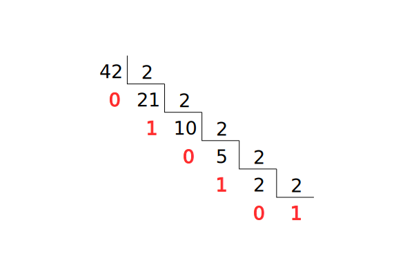
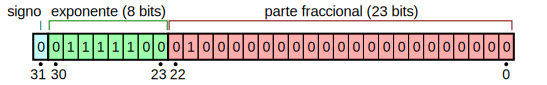

class: center, middle, inverse
<title>Unidad 2</title>

.title[Informática I]

Claudio Paz

<!-- .email[claudiojpaz@gmail.com] -->

Abril 2025

<input type="image" src="assets/fullscreen.png" onclick="openFullscreen()" style="height: 15%; width: 15%;">
<input type="image" src="assets/smallscreen.png" onclick="closeFullscreen()" style="height: 15%; width: 15%;">

---
class: middle, center
.title[Unidad 2]
# Sistemas de numeración

---
name: screen

<input type="image" src="assets/fullscreengrey.png" onclick="openFullscreen()" style="height: 15%; width: 15%;">
<input type="image" src="assets/smallscreengrey.png" onclick="closeFullscreen()" style="height: 15%; width: 15%;">

---
template: screen
# Sistemas de numeración

--
count: false

Preguntas para hacernos...

--
count: false

¿Por qué (los humanos) usamos el sistema decimal?

--
count: false

¿Usamos otros sistemas?

--
count: false

¿Por qué las computadoras usan el sistema binario?

---
template: screen
# Sistemas de numeración
--
count: false
En la primaria vimos como descomponer un número en unidad, decena, centena, etc.

--
count: false

$1324$

---
template: screen
count: false
# Sistemas de numeración
En la primaria vimos como descomponer un número en unidad, decena, centena, etc.

$1324 = 1000 + 300 + 20 + 4 %$

--
count: false
Se podría escribir también como

--
count: false

$1324 = 1 \times 1000 + 3 \times 100 + 2 \times 10 + 4 \times 1 %$

--
count: false

o más formalmente (para el nivel universitario)

--
count: false

$1324 = 1 \times 10^3 + 3 \times 10^2 + 2 \times 10^1 + 4 \times 10^0 %$

---
template: screen
# Sistemas de numeración
--
count: false

$1324 = 1 \times 10^3 + 3 \times 10^2 + 2 \times 10^1 + 4 \times 10^0 %$

--
count: false

Se puede ver que el 1 ocupa una posición de mayor valor que el 4.

--
count: false

Aunque el 4 es nominalmente mayor al 1

--
count: false

Por eso se dice que el sistema decimal, es posicional

--
count: false

Existen los sistemas posicionales, como el decimal, y no posicionales como el sistema romano

---
template: screen
# Teorema Fundamental de la Numeración
--
count: false

Considérese un sistema de numeración posicional de base $b$, siendo $b$ números naturales que cumplan con $b>1$, entonces cualquier número natural $N$ puede expresarse de manera única en esa base decimal como
\begin{equation*}
  N = a_n b^n + a_{n-1} b^{n-1} + \dots + a_2 b^2 + a_1 b^1 + a_0 b^0
\end{equation*}

    siendo $a_n,\, a_{n-1},\, \dots ,\,  a_2,\, a_1 ,\, a_0$ alguno de los símbolos que forman la base del sistema y $n+1$ la cantidad de cifras del número $N$.

---
template: screen
# Teorema Fundamental de la Numeración
--
count: false

    También se puede escribir de forma compacta como
\begin{align}
  N = \sum^n_{i=0} a_i b^i
\end{align}

---
template: screen
# Sistema de numeración decimal
--
count: false

\begin{align}
  base &= \{0,\,1,\,2,\,3,\,4,\,5,\,6,\,7,\,8,\,9\} \\
  b &= 10
\end{align}

--
count: false

\begin{align}
  N = \sum^n_{i=0} a_i 10^i
\end{align}

--
count: false

\begin{align}
  512 &= 5 \times 10^2 + 1 \times 10^1 + 2 \times 10^0
\end{align}

---
template: screen
# Sistema de numeración binario
--
count: false

\begin{align}
  base &= \{0,\,1\}\\
  b &= 2
\end{align}

--
count: false

\begin{align}
  N = \sum^n_{i=0} a_i 2^i
\end{align}

--
count: false

\begin{align}
  101_{(2)}  &\rightarrow 1 \times 2^2 + 0 \times 2^1 + 1 \times 2^0 = 5_{(10)} \\
  1010_{(2)} &\rightarrow 1 \times 2^3 + 0 \times 2^2 + 1 \times 2^1 + 0 \times 2^0 = 10_{(10)}\\
  1101_{(2)} &\rightarrow 1 \times 2^3 + 1 \times 2^2 + 0 \times 2^1 + 1 \times 2^0 = 13_{(10)}
\end{align}

---
template: screen
# Sistema de numeración hexadecimal
--
count: false

\begin{align}
  base &= \{0,\,1,\,2,\,3,\,4,\,5,\,6,\,7,\,8,\,9,\,A,\,B,\,C,\,D,\,E,\,F\}\\
  b &= 16
\end{align}

--
count: false

\begin{align}
  N = \sum^n_{i=0} a_i 16^i
\end{align}

--
count: false

\begin{align}
  10_{(16)}   &\rightarrow  1  \times 16^1 + 0 \times 16^0  = 16_{(10)}
\end{align}

---
template: screen
# Sistema de numeración octal
--
count: false

\begin{align}
  base &= \{0,\,1,\,2,\,3,\,4,\,5,\,6,\,7 \}\\
  b &= 8
\end{align}

--
count: false

\begin{align}
  N = \sum^n_{i=0} a_i 8^i
\end{align}

--
count: false

\begin{align}
  10_{(8)}   &\rightarrow  1  \times 8^1 + 0 \times 8^0  = 8_{(10)} \\
  130_{(8)}   &\rightarrow  1  \times 8^2 + 3 \times 8^1 + 0 \times 8^0  = 88_{(10)}
\end{align}

---
template: screen
class: middle

$1000_{(10)} = $

$1000_{(2)} = $

$1000_{(8)} = $

$1000_{(16)} = $
---
template: screen
class: middle
count: false

$1000_{(10)} = 1000$

$1000_{(2)} = 8$

$1000_{(8)} = 512$

$1000_{(16)} = 4096$
---
## Números enteros y positivos con binarios de 4 bits
--
count: false

Sistema binario | Sistema decimal | Sistema hexadecimal | Sistema octal
----------------|-----------------|---------------------|--------------
0 0 0 0         |       0         |         0           |         0
0 0 0 1         |       1         |         1           |         1
0 0 1 0         |       2         |         2           |         2
0 0 1 1         |       3         |         3           |         3
0 1 0 0         |       4         |         4           |         4
0 1 0 1         |       5         |         5           |         5
0 1 1 0         |       6         |         6           |         6
0 1 1 1         |       7         |         7           |         7
1 0 0 0         |       8         |         8           |        10
1 0 0 1         |       9         |         9           |        11
1 0 1 0         |      10         |         A           |        12
1 0 1 1         |      11         |         B           |        13
1 1 0 0         |      12         |         C           |        14
1 1 0 1         |      13         |         D           |        15
1 1 1 0         |      14         |         E           |        16
1 1 1 1         |      15         |         F           |        17

---
template: screen
# Conversión de decimal a binario
## Ejemplo 345
--
count: false

.center[]

---
template: screen
count: false
# Conversión de decimal a binario
## Ejemplo 345

.center[]

---
template: screen
count: false
# Conversión de decimal a binario
## Ejemplo 345

.center[]

---
template: screen
count: false
# Conversión de decimal a binario
## Ejemplo 345

.center[]

---
template: screen
count: false
# Conversión de decimal a binario
## Ejemplo 345

.center[]

---
template: screen
count: false
# Conversión de decimal a binario
## Ejemplo 345

.center[]

---
template: screen
count: false
# Conversión de decimal a binario
## Ejemplo 345

.center[]

---
template: screen
count: false
# Conversión de decimal a binario
## Ejemplo 345

.center[]

---
template: screen
count: false
# Conversión de decimal a binario
## Ejemplo 345

.center[]

---
count: false
# Conversión de decimal a binario
## Ejemplo 345

.center[]

--
count: false

$345_{(10)} = 101011001_{(2)}$

---
template: screen
# Distintos sistemas: números enteros y positivos
## Pasaje directo

--
count: false

Debido a que las bases del sistema binario, octal y hexadecimal son potencias de 2, el pasaje entre números de estos sistemas se puede hacer directamente cifra por cifra

--
count: false

Cada cifra del sistema hexadecimal se puede representar con 4 del sistema binario.

--
count: false

Cada cifra del sistema octal se puede representar con 3 del sistema binario.

---
template: screen
count: false
# Distintos sistemas: números enteros y positivos
## Pasaje directo

--
count: false

## Ejemplo con 32bits

$\small{53048=1100111100111000_{(2)}}$

 
--
count: false

## Pasando a hexadecimal

--
count: false

    \begin{array}{cccc}
     1100 & 1111 & 0011 & 1000\\
       C  &  F   &  3   &   8
    \end{array}

---
template: screen
count: false
# Distintos sistemas: números enteros y positivos
## Pasaje directo

## Ejemplo con 32bits

$\small{53048=1100111100111000_{(2)}}$

 

## Pasando a octal

--
count: false

    \begin{array}{cccccc}
     1&100 & 111 & 100 & 111 & 000\\
     1&4  &  7  &   4 &  7  &  0
    \end{array}

---
template: screen
count: false
# Distintos sistemas: números enteros y positivos
## Pasaje directo

## Ejemplo con 32bits

$\small{53048=1100111100111000_{(2)}}$

---
template: screen
count: false
# Distintos sistemas: números enteros y positivos
## Pasaje directo

## Ejemplo con 32bits

$\small{53048=1100111100111000_{(2)} = CF38_{(16)} = 147470_{(8)}}$

---
template: screen
# Operaciones aritméticas con números binarios
--
count:false
## Suma
--
count:false

$0 + 0 = 0$

--
count:false

$1 + 0 = 1$

$0 + 1 = 1$

--
count:false

$1 + 1 = 0$ (pero hay acarreo), o sea .italic[me llevo uno]

---
template: screen
# Operaciones aritméticas con números binarios

## Suma
--
count: false

.left-column[

    \begin{array}{rr}
      &9\\
     +&4\\
\hline
     &13 \\
    \end{array}

]
--
count: false

.right-column[

    \begin{array}{ccccc}
     & 1 & 0 & 0 & 1 \\
    +& 0 & 1 & 0 & 0 \\
\hline
     & 1 & 1 & 0 & 1 \\
    \end{array}

]

---
template: screen
# Operaciones aritméticas con números binarios
--
count:false
## Producto
--
count:false

$0 \times 0 = 0$

--
count:false

$1 \times 0 = 0$

$0 \times 1 = 0$

--
count:false

$1 \times 1 = 1$

---
template: screen
# Operaciones aritméticas con números binarios

## Producto
--
count: false

.left-column[

    \begin{array}{rr}
      &3\\
     \times&5\\
\hline
     &15 \\
    \end{array}

]
--
count: false

.right-column[

    \begin{array}{cccccc}
          &  &  & 0 & 1 & 1 \\
    & \times &  & 1 & 0 & 1 \\
    \hline
    &       &   & 0 & 1 & 1 \\
    &       & 0 & 0 & 0 &  \\
    &     0 & 1 & 1 &   & \\
    \hline
        &   & 1 & 1 & 1 & 1
    \end{array}

]
---
template: screen
# Operaciones aritméticas con números binarios

## Producto
--
count: false

.left-column[

    \begin{array}{rr}
      &7\\
     \times&5\\
\hline
     &35 \\
    \end{array}

]
--
count: false

.right-column[

    \begin{array}{cccccc}
          &  &  & 1 & 1 & 1 \\
    & \times &  & 1 & 0 & 1 \\
    \hline
    &       &   & 1 & 1 & 1 \\
    &       & 0 & 0 & 0 &  \\
    &     1 & 1 & 1 &   & \\
    \hline
     1  & 0 & 0 & 0 & 1 & 1
    \end{array}

]

--
count: false

 
 
 
 

Ojo con el acarreo!!

--
count: false

La representación binaria será posible dependiendo de la cantidad de bits usados

---
template: screen
# Operaciones aritméticas con números binarios
--
count:false
## Resta
--
count:false

$0 - 0 = 0$

--
count:false

$1 - 0 = 1$

--
count:false

$1 - 1 = 0$

---
template: screen
# Operaciones aritméticas con números binarios

## Resta
--
count: false

.left-column[

    \begin{array}{rr}
     &13\\
     -&4\\
\hline
      &9 \\
    \end{array}

]
--
count: false

.right-column[

    \begin{array}{ccccc}
     & 1 & 1 & 0 & 1 \\
    -& 0 & 1 & 0 & 0 \\
\hline
     & 1 & 0 & 0 & 1 \\
    \end{array}

]

---
template: screen
# Operaciones aritméticas con números binarios

## Resta
--
count:false

$0 - 1 = ?$

---
template: screen
# Representación de Números signados
--
count: false

 Problema: necesidad de representar números negativos
--
count: false

 Soluciones: ?

---
template: screen
# Convenio de signo y magnitud
--
count: false

## Ejemplo con 8 bits

Usando el bit más significativo como bit de signo
--
count: false

+13 en binario

0|0|0|0|1|1|0|1
-|-|-|-|-|-|-|-

--
count: false

-13 en binario

1|0|0|0|1|1|0|1
-|-|-|-|-|-|-|-

---
# Convenio de signo y magnitud

## Ejemplo con 8 bits

--
count: false

El problema
--
count: false

+0 en binario

0|0|0|0|0|0|0|0
-|-|-|-|-|-|-|-

--
count: false

-0 en binario

1|0|0|0|0|0|0|0
-|-|-|-|-|-|-|-

--
count: false
A diferencia del análisis matemático, en informática es el mismo número (+0 es igual a -0)
---
template: screen
# Convenio de complemento a uno

--
count: false
## Ejemplo con 8 bits
--
count: false

Para números negativos se complementa todo

--
count: false

+13 en binario

0|0|0|0|1|1|0|1
-|-|-|-|-|-|-|-

--
count: false

-13 en binario

1|1|1|1|0|0|1|0
-|-|-|-|-|-|-|-

---
template: screen
# Convenio de complemento a uno

## Ejemplo con 8 bits
--
count: false

El problema
--
count: false

+0 en binario

0|0|0|0|0|0|0|0
-|-|-|-|-|-|-|-

--
count: false

-0 en binario

1|1|1|1|1|1|1|1
-|-|-|-|-|-|-|-

--
count: false
Nuevamente, doble representación del 0

---
# Convenio de complemento a dos

--
count: false
## Ejemplo con 8 bits
--
count: false

Para números negativos se complementa todo, pero además, se incrementa en 1

--
count: false

+13 en binario

0|0|0|0|1|1|0|1
-|-|-|-|-|-|-|-

--
count: false

-13 en binario

1|1|1|1|0|0|1|0
-|-|-|-|-|-|-|-
|||||||1

1|1|1|1|0|0|1|1
-|-|-|-|-|-|-|-

---
template: screen
# Convenio de complemento a dos

## Ejemplo con 8 bits
--
count: false

El problema, ahora resuelto
--
count: false

+0 en binario

0|0|0|0|0|0|0|0
-|-|-|-|-|-|-|-

--
count: false

-0 en binario

1|1|1|1|1|1|1|1
-|-|-|-|-|-|-|-
|||||||1

0|0|0|0|0|0|0|0
-|-|-|-|-|-|-|-

---
template: screen
# Operaciones de adición y de sustracción utilizando el convenio de complemento a dos

--
count: false

    \begin{array}{rr}
      &4\\
     -&13\\
\hline
      &-9 \\
    \end{array}

---
template: screen
count: false
# Operaciones de adición y de sustracción utilizando el convenio de complemento a dos

    \begin{array}{ccccccccc}
     & 0 & 0 & 0 & 0 & 0 & 1 & 0 & 0 \\
    +& 1 & 1 & 1 & 1 & 0 & 0 & 1 & 1 \\
\hline
     & 1 & 1 & 1 & 1 & 0 & 1 & 1 & 1 \\
    \end{array}

--
count: false

Qué número es?
--
count: false

Si el bit más significativo es 1, sabemos que es un número negativo
--
count: false

Hay que _deshacer_ el complemento a 2 y se obtiene el valor absoluto del número negativo

---
template: screen
count: false
# Operaciones de adición y de sustracción utilizando el convenio de complemento a dos

    \begin{array}{ccccccccc}
     & 0 & 0 & 0 & 0 & 0 & 1 & 0 & 0 \\
    +& 1 & 1 & 1 & 1 & 0 & 0 & 1 & 1 \\
\hline
     & 1 & 1 & 1 & 1 & 0 & 1 & 1 & 1 \\
    -&   &   &   &   &   &   &   & 1 \\
\hline
     & 1 & 1 & 1 & 1 & 0 & 1 & 1 & 0 \\
  \text{C1} & 0 & 0 & 0 & 0 & 1 & 0 & 0 & 1
    \end{array}

---
template: screen
# Operaciones de adición y de sustracción utilizando el convenio de complemento a dos

--
count: false

    \begin{array}{rr}
      &100\\
      -&36\\
\hline
      &64 \\
    \end{array}

--
count: false

 Primero: $-36$ a binario usando <i>complemento a 2</i>

--
count: false

    \begin{array}{ccccccccc}
              & 0 & 0 & 1 & 0 & 0 & 1 & 0 & 0 \\
    \text{C1} & 1 & 1 & 0 & 1 & 1 & 0 & 1 & 1 \\
            + &   &   &   &   &   &   &   & 1 \\
\hline
              & 1 & 1 & 0 & 1 & 1 & 1 & 0 & 0
    \end{array}

---
template: screen
# Operaciones de adición y de sustracción utilizando el convenio de complemento a dos

    \begin{array}{ccccccccc}
     & 0 & 1 & 1 & 0 & 0 & 1 & 0 & 0 \\
    +& 1 & 1 & 0 & 1 & 1 & 1 & 0 & 0 \\
\hline
   \mathbf{1} & 0 & 1 & 0 & 0 & 0 & 0 & 0 & 0 \\
    \end{array}

--
count: false

El acarreo se ignora

---
template: screen
# Representación de números fraccionales
--
count: false

Para pasar un número fraccionario a binario, se van tomando las partes a la izquierda de la coma decimal como cifras binarias y se multiplica por 2 la parte a la derecha de la coma decimal.

--
count: false
Se repite el proceso continuamente hasta obtener cero en la parte decimal o llenar los bits requeridos

---
template: screen
# Representación de números fraccionales
## Ejemplo 0.6875

--
count: false

$0.6875 \times 2 = \color{red}{1}.375$

--
count: false

$0.375 \times 2 = \color{red}{0}.75$

--
count: false
$0.75 \times 2 = \color{red}{1}.5$

--
count: false
$0.5 \times 2 = \color{red}{1}.0$

--
count: false

$$
\begin{array}{|c|c|c|c|c|c|c|c|}
\hline
  0 & 0 & 0 & 0 & \color{red}{1} & \color{red}{0} & \color{red}{1} & \color{red}{1} \\
\hline
\end{array}
$$

---
template: screen
# Representación de números fraccionales
--
count: false

Supongamos que es un $7.6875$

--
count: false

La parte entera $(7)$ se pasa a binario como $\color{blue}{111}$

--
count: false

Entonces el número completo usando 4 bits para la parte entera y 4 bits para la parte fraccionaria queda

--
count: false

$$
\begin{array}{|c|c|c|c|c|c|c|c|}
\hline
  \color{blue}{0} & \color{blue}{1} & \color{blue}{1} & \color{blue}{1} & \color{red}{1} & \color{red}{0} & \color{red}{1} & \color{red}{1} \\
\hline
\end{array}
$$

---
template: screen
# Representación de números fraccionales
--
count: false

Para volver al número en base decimal...

--
count: false

\begin{equation*}
  .M = b_{-1} 2^{-1} + b_{-2} 2^{-2} + b_{-3} 2^{-3} + \dots + b_{-m} 2^{-m}
\end{equation*}

--
count: false

donde $m$ es la cantidad de bits que tenemos para representar la parte fraccional.

---
template: screen
# Representación de números fraccionales
--
count: false

 Ejemplo: volviendo el $.1011$ a base decimal

--
count: false

\begin{align*}
  1 \times 2^{-1} + 0 \times 2^{-2} + 1 \times 2^{-3} + 1 \times 2^{-4} &= \\
  1 \times \frac{1}{2} + 0 \times \frac{1}{4} + 1 \times \frac{1}{8} + 1 \times \frac{1}{16} &= \\
  \frac{1}{2} + \frac{1}{8} + \frac{1}{16} &= \frac{11}{16} = 0.6875
\end{align*}

---
template: screen
# Representación de números fraccionales

???
Filípides
--
count: false

$$
42.195
$$

--
count: false
.left-column[
Tomando la parte entera
]

--
count: false

--
count: false

 
 
 
 
 
 
 

.left-column[

$$
101010
$$

]

---
template: screen
count: false
# Representación de números fraccionales

$$
42.195
$$

.left-column[
Tomando la parte entera
]

.right-column[
y la parte fraccionaria
]

 
 
 
 
 
 
 

.left-column[

$$
101010
$$

]

--
count: false

$0.195 \times 2 = \color{red}{0}.39$

$0.39 \times 2 = \color{red}{0}.78$

$0.78 \times 2 = \color{red}{1}.56$

$0.56 \times 2 = \color{red}{1}.12$

---
template: screen
count: false
# Representación de números fraccionales

$$
42.195
$$

.left-column[
Tomando la parte entera
]

.right-column[
y la parte fraccionaria
]

 
 
 
 
 
 
 

.left-column[

$$
101010
$$

]

.right-column[

$$
.0011
$$

]

$0.195 \times 2 = \color{red}{0}.39$

$0.39 \times 2 = \color{red}{0}.78$

$0.78 \times 2 = \color{red}{1}.56$

$0.56 \times 2 = \color{red}{1}.12$

---
template: screen
# Representación de números fraccionales

$$
101010.0011
$$

--
count: false

La parte entera:

$\small{1 \times 2^5 + 0 \times 2^4 + 1 \times 2^3 + 0 \times 2^2 +  1 \times 2^1 + 0 \times 2^0 = 42}$

--
count: false

La parte fraccionaria:

$\small{0 \times 2^{-1} + 0 \times 2^{-2} + 1 \times 2^{-3} + 1 \times 2^{-4}} = $

--
count: false

$\small{0 \times 1/2 + 0 \times 1/4 + 1 \times 1/8 + 1 \times 1/16 = }$

--
count: false

$\small{0 \times 0.5 + 0 \times 0.25 + 1 \times 0.125 + 1 \times 0.0625 = 0.1875}$

---
template: screen
# Representación de números fraccionales

$$
  \begin{align}
    42.195 &\xrightarrow[]{\text{a binario}} 101010.0011 \\[25pt]
    101010.0011 &\xrightarrow[]{\text{a decimal}} 42.1875
  \end{align}
$$

--
count: false

Que pasó?

--
count: false

Respuesta corta:

$0.195$ tiene una expansión binaria infinita
---
template: screen
# Representación de números fraccionales
--
count: false

En binario solo se pueden representar números fraccionarios de manera exacta si el denominador es potencia de 2

--
count: false

Por ejemplo: $0.625$ ($10/16$)

.left-column[

$$
  \begin{align}
0.625 \times 2 &= \color{red}{1}.25 \\
0.25 \times 2 &= \color{red}{0}.50 \\
0.50 \times 2 &= \color{red}{1}.00
  \end{align}
$$

]
.right-column[

]

--
count: false

.right-column[

$0.625 \xrightarrow[]{\text{a binario}} 0.101$

]

---
template: screen
# Representación de números fraccionales
--
count: false

 Ejemplo: $0.1$ ($1/10$)

.left-column[

$$
  \begin{align}
0.1 \times 2 &= \color{red}{0}.2 \\
0.2 \times 2 &= \color{red}{0}.4 \\
0.4 \times 2 &= \color{red}{0}.8 \\
0.8 \times 2 &= \color{red}{1}.6 \\
0.6 \times 2 &= \color{red}{1}.2 \\
0.2 \times 2 &= \color{red}{0}.4
  \end{align}
$$

]
.right-column[

]

--
count: false

.right-column[

$0.1 \xrightarrow[]{\text{a binario}} 0.0\overline{0011}$

]

---
template: screen
# Errores en la representación
--
count: false
La representación binaria de un número fraccionario siempre estará limitada por el número de bits disponibles...

--
count: false

...lo que limita también la precisión

--
count: false

 Ejemplo: si tenemos 4 bits para para representar un número fraccionario, el último bit puede estar _prendido_ o _apagado_, y eso significa agregar o no un 1/16 al número en base decimal

---
template: screen
# Errores en la representación
--
count: false

con 4 bits

\begin{array}{lllllllll}
.1111_{(2)} = & \cfrac{1}{2} &+ & \cfrac{1}{4} &+ & \cfrac{1}{8} &+ &\cfrac{1}{16} &= 0.9375_{(10)} \\
.1110_{(2)} = & \cfrac{1}{2} &+ & \cfrac{1}{4} &+ & \cfrac{1}{8} & & &= 0.875_{(10)}
\end{array}

--
count: false

Entonces, todos los números entre $0.875$ y $0.9375$ tienen la misma representación para 4 bits

---
template: screen
# Errores en la representación
--
count: false

El error absoluto $e_A$ será constante, igual a la mitad de la mínima representación hacia cada lado

--
count: false

$e_A = \pm \frac{1}{2} LSB = \pm \frac{1}{2} 2^{-4} = \pm 2^{-5}$

---
template: screen
# Errores en la representación
--
count: false

El error relativo $e_r$ será el porcentaje del error absoluto respecto del valor representado.

--
count: false

$e_r \; [\%] = \cfrac{e_A}{N} \times 100$

---
template: screen
# Notación punto fijo y punto flotante
## Punto fijo

--
count: false

Las computadoras, y en particular los espacios en ellas destinados a almacenar números, tienen una capacidad finita.

--
count: false

Para almacenar un número real una opción es destinar una cantidad **fija** de bits para la parte fraccionaria y otra parte fija para la parte entera.

--
count: false

---
template: screen
# Notación punto fijo y punto flotante
## Punto flotante

--
count: false

En este caso se descompone en dos partes, _mantisa_ y _exponente_.

Cualquier valor real se puede expresar en notación científica como

$$
r = m \times b^e
$$

Ejemplo:

$ 2.1 = 21 \times 10^{-1}$

---
template: screen
count: false
# Notación punto fijo y punto flotante
## Punto flotante

En este caso se descompone en dos partes, _mantisa_ y _exponente_.

Cualquier valor real se puede expresar en notación científica como

$$
r = m \times b^e
$$

Ejemplo:

$ 2.1 = 0.21 \times 10^{1}$

---
template: screen
count: false
# Notación punto fijo y punto flotante
## Punto flotante

En este caso se descompone en dos partes, _mantisa_ y _exponente_.

Cualquier valor real se puede expresar en notación científica como

$$
r = m \times b^e
$$

Ejemplo:

$ 2.1 = 2100 \times 10^{-3}$

---
template: screen
# Notación punto fijo y punto flotante
## Punto flotante

--
count: false

Se puede guardar por un lado la mantisa con su signo y por otro lado el exponente también con su signo.

--
count: false

El signo de la mantisa determina el signo del número, y el signo del exponente determina si es mayor o menor que 1.

--
count: false

En computación se utiliza el estándar IEEE 754.

---
template: screen
# Representación según formato IEEE 754
--
count: false

El estándar determina que se utilizan 32 bits para los números de punto flotante de simple precisión y 64 bits para los de doble precisión.

 

--
count: false

## Para 32 bits

Bits de signo (S): 1 bit.

Exponente desplazado (E): 8 bits.

Significando o Mantisa (T): 23 bits.

---
template: screen
# Representación según formato IEEE 754

El estándar determina que se utilizan 32 bits para los números de punto flotante de simple precisión y 64 bits para los de doble precisión.

 

## Para 64 bits

Bits de signo (S): 1 bit.

Exponente desplazado (E): 11 bits.

Significando o Mantisa (T): 52 bits.

---
# Representación según formato IEEE 754

.footnote[

Fresheneesz [<a href="https://creativecommons.org/licenses/by-sa/3.0">CC BY-SA 3.0</a>], <a href="https://commons.wikimedia.org/wiki/File:Float_example.svg">via Wikimedia Commons</a>

]

--
count: false

 
 
 

$$\scriptsize{r = (-1)^{b_{31}} \times \left(1+\sum^{23}_{i=1} b_{23-i} \times 2^{-i} \right) \times 2^{\left(e-127\right)} }$$

--
count: false

$$\scriptsize{r = (-1)^{0} \times \left( 1 +  2^{-2} \right) \times 2^{\left(124-127\right)} }$$

--
count: false

$$\scriptsize{r = \left( 1 +  \frac{1}{4} \right) \times \frac{1}{8} = \frac{10}{8} \times \frac{1}{8} = \frac{10}{64} }$$

--
count: false

$$\scriptsize{r = 0.15625}$$

---
name: ieee
# Representación según formato IEEE 754

Para convertir un número real decimal en uno de formato
IEEE 754 precisión simple se debe seguir el siguiente procedimiento:

---
template: ieee

1 Si el número a analizar ($N$) es positivo, asignar a $S=0$ y, en caso contrario, $S=1$.

## Ejemplo

$N = 0.15625$

--
count: false

$S = 0$

---
template: ieee

2 Igualar $N$ a $2^x$.

## Ejemplo

$N = 0.15625$

--
count: false

$0.15625 = 2^x$

---
template: ieee

3 Despejar la variable $x$, aplicando logaritmos decimales o naturales a ambos lados de la ecuación.

## Ejemplo

$N = 0.15625$

--
count: false

$\dfrac{\ln 0.15625}{\ln 2} = x \implies x = -2.678 $

---
template: ieee

4 Tomar como valor aproximado al entero inmediatamente inferior y llamarlo $e$.

## Ejemplo

$N = 0.15625$

--
count: false

$ x = -2.678 \approx -3 \implies e = -3 $

---
template: ieee

5 Sumar a $e$ el valor de $127$ y convertir el resultado a binario llamándolo $E$

## Ejemplo

$N = 0.15625$

--
count: false

$E = e + 127 \implies E = 124$  

$E = 01111100$

---
template: ieee

6 Tomar nuevamente el número decimal $N$ e igualarlo a $m \times 2^e$.

## Ejemplo

$N = 0.15625$

--
count: false

$ 0.15625 = m \times 2^{-3}$

---
template: ieee

7 Despejar $m$ y quitarle la parte entera que siempre es $1$. Éste es el bit a la izquierda de la coma binaria que nunca se incluye en el número en coma flotante.

## Ejemplo

$N = 0.15625$

--
count: false

$\require{cancel} \dfrac{0.15625}{0.125} = m \implies m = 1.25 \implies m = \cancel{1}.25$

---
template: ieee

8 Tomar la fracción del resultado y convertirla en binario.

## Ejemplo

$N = 0.15625$

--
count: false

$0.25 \xrightarrow[]{\text{a binario}} .01 \text{(recordar que son 23 bits de mantisa)}$

$M = .01000000000000000000000$

---
template: ieee

9 Juntar los resultados de $S$, $E$ y $M$ que forman parte del número en formato IEEE 754 de 32bits.

$N = 0.15625$

--
count: false

$S = 0$ 
$E = 01111100$ 
$M = .01000000000000000000000$  

$0.15625\xrightarrow[]{\text{a IEEE 754}} 0\;01111100\;01000000000000000000000 $

---
template: screen
# Errores en notación de punto flotante
--
count: false

No todos los números fraccionarios pueden ser expresados exactamente en binario.

--
count: false

Por ejemplo vimos el $0.1$

En punto flotante IEEE 754 de simple precisión sería:

.center[]

--
count: false

Que pasado a decimal nuevamente es:

--
count: false

$0.100000001490116119384765625$

---
template: screen
# Errores en notación de punto flotante
--
count: false

entonces, es usual que $0.1 + 0.9 \neq 1.0$

--
count: false

Por este motivo, **nunca** deben compararse por igual dos números de punto flotante

---
template: screen
# Representación de caracteres: Decimal Codificado en Binario (BCD).

Representación de números decimales donde cada dígito del número en base 10 se representa en base 2

--
count: false

|0|1|2|3|4|5|6|7|8|9|
|-|-|-|-|-|-|-|-|-|-|
|0000|0001|0010|0011|0100|0101|0110|0111|1000|1001|

---
template: screen
# Representación de caracteres: Decimal Codificado en Binario (BCD).

--
count: false

## Ejemplo para 16 bits:

en base 2:

$2019 = 0000011111100011$

--
count: false

en BCD:

$2019 = 0010000000011001$

---
template: screen
# Representación de caracteres: ASCII.

---
template: screen
## Caracteres de Control

    \begin{array}{ccccl}
\text{Binario}&\text{Decimal}&\text{Hex}&\text{Abreviatura}&\text{Nombre/Significado/Representación}\\
\hline
00000000 & 0  & 00 & \text{NUL} &  \text{Carácter Nulo}\\
00000001 & 1  & 01 & \text{SOH} &  \text{Inicio de Encabezado}\\
00000010 & 2  & 02 & \text{STX} &  \text{Inicio de Texto}\\
00000011 & 3  & 03 & \text{ETX} &  \text{Fin de Texto}\\
00000100 & 4  & 04 & \text{EOT} &  \text{Fin de Transmisión}\\
00000101 & 5  & 05 & \text{ENQ} &  \text{Consulta}\\
00000110 & 6  & 06 & \text{ACK} &  \text{Acuse de recibo}\\
00000111 & 7  & 07 & \text{BEL} &  \text{Timbre}\\
00001000 & 8  & 08 & \text{BS}  &  \text{Retroceso}\\
00001001 & 9  & 09 & \text{HT}  &  \text{Tabulación horizontal}\\
00001010 & 10 & 0A & \text{LF}  &  \text{Salto de línea}\\
00001011 & 11 & 0B & \text{VT}  &  \text{Tabulación Vertical}\\
00001100 & 12 & 0C & \text{FF}  &  \text{Avance de página}\\
00001101 & 13 & 0D & \text{CR}  &  \text{Retorno de carro}\\
00001110 & 14 & 0E & \text{SO}  &  \text{Desactivar mayúsculas}\\
00001111 & 15 & 0F & \text{SI}  &  \text{Activar mayúsculas}\\
    \end{array}

---
template: screen
## Caracteres de Control (cont.)

    \begin{array}{ccccl}
      \text{Binario}&\text{Decimal}&\text{Hex}&\text{Abreviatura}&\text{Nombre/Significado/Representación}\\
      \hline
      00010000 & 16 & 10 & \text{DLE} & \text{Escape vínculo de datos}\\
      00010001 & 17 & 11 & \text{DC1} & \text{Control de dispositivo 1 (XON)}\\
      00010010 & 18 & 12 & \text{DC2} & \text{Control de dispositivo 2}\\
      00010011 & 19 & 13 & \text{DC3} & \text{Control de dispositivo 3 (XOFF)}\\
      00010100 & 20 & 14 & \text{DC4} & \text{Control de dispositivo 4}\\
      00010101 & 21 & 15 & \text{NAK} & \text{Acuse de recibo negativo}\\
      00010110 & 22 & 16 & \text{SYN} & \text{Síncronía en espera}\\
      00010111 & 23 & 17 & \text{ETB} & \text{Fin del bloque de transmisión}\\
      00011000 & 24 & 18 & \text{CAN} & \text{Cancelar}\\
      00011001 & 25 & 19 & \text{EM } & \text{Fin del medio}\\
      00011010 & 26 & 1A & \text{SUB} & \text{Substitución}\\
      00011011 & 27 & 1B & \text{ESC} & \text{ESC o Escape}\\
      00011100 & 28 & 1C & \text{FS } & \text{Separador de archivo}\\
      00011101 & 29 & 1D & \text{GS } & \text{Separador de grupo}\\
      00011110 & 30 & 1E & \text{RS } & \text{Separador de registro}\\
      00011111 & 31 & 1F & \text{US } & \text{Separador de unidad}\\
      01111111 & 127& 7F & \text{DEL} & \text{DEL o Suprimir}\\
    \end{array}

---
template: screen
## Caracteres Imprimibles

.left-column[

    \begin{array}{cccl}
      \text{Binario}&\text{Decimal}&\text{Hex}&\text{Representación}\\
      \hline
      00100000 & 32 & 20 & \text{espacio ( )} \\
      00100001 & 33 & 21 & \text{!} \\
      00100010 & 34 & 22 & \text{"} \\
      00100011 & 35 & 23 & \# \\
      00100100 & 36 & 24 & \text{\$} \\
      00100101 & 37 & 25 & \% \\
      00100110 & 38 & 26 & \& \\
      00100111 & 39 & 27 & \text{'} \\
      00101000 & 40 & 28 & \text{(} \\
      00101001 & 41 & 29 & \text{)} \\
      00101010 & 42 & 2A & \text{*} \\
      00101011 & 43 & 2B & \text{+} \\
      00101100 & 44 & 2C & \text{,} \\
      00101101 & 45 & 2D & \text{-} \\
      00101110 & 46 & 2E & \text{.} \\
      00101111 & 47 & 2F & \text{/} \\
    \end{array}

]
.right-column[

    \begin{array}{cccl}
      \text{Binario}&\text{Decimal}&\text{Hex}&\text{Representación}\\
      \hline
      00110000 & 48 & 30 & \text{0} \\
      00110001 & 49 & 31 & \text{1} \\
      00110010 & 50 & 32 & \text{2} \\
      00110011 & 51 & 33 & \text{3} \\
      00110100 & 52 & 34 & \text{4} \\
      00110101 & 53 & 35 & \text{5} \\
      00110110 & 54 & 36 & \text{6} \\
      00110111 & 55 & 37 & \text{7} \\
      00111000 & 56 & 38 & \text{8} \\
      00111001 & 57 & 39 & \text{9} \\
      00111010 & 58 & 3A & \text{:} \\
      00111011 & 59 & 3B & \text{;} \\
      00111100 & 60 & 3C & < \\
      00111101 & 61 & 3D & \text{=} \\
      00111110 & 62 & 3E & > \\
      00111111 & 63 & 3F & \text{?} \\
    \end{array}

]

---
template: screen

## Caracteres Imprimibles

.left-column[

    \begin{array}{cccl}
      \text{Binario}&\text{Decimal}&\text{Hex}&\text{Representación}\\
      \hline
      01000000 & 64 & 40 & @ \\
      01000001 & 65 & 41 & \text{A} \\
      01000010 & 66 & 42 & \text{B} \\
      01000011 & 67 & 43 & \text{C} \\
      01000100 & 68 & 44 & \text{D} \\
      01000101 & 69 & 45 & \text{E} \\
      01000110 & 70 & 46 & \text{F} \\
      01000111 & 71 & 47 & \text{G} \\
      01001000 & 72 & 48 & \text{H} \\
      01001001 & 73 & 49 & \text{I} \\
      01001010 & 74 & 4A & \text{J} \\
      01001011 & 75 & 4B & \text{K} \\
      01001100 & 76 & 4C & \text{L} \\
      01001101 & 77 & 4D & \text{M} \\
      01001110 & 78 & 4E & \text{N} \\
      01001111 & 79 & 4F & \text{O} \\
    \end{array}

]

.right-column[

    \begin{array}{cccl}
      \text{Binario}&\text{Decimal}&\text{Hex}&\text{Representación}\\
      \hline
      01010000 & 80 & 50 & \text{P} \\
      01010001 & 81 & 51 & \text{Q} \\
      01010010 & 82 & 52 & \text{R} \\
      01010011 & 83 & 53 & \text{S} \\
      01010100 & 84 & 54 & \text{T} \\
      01010101 & 85 & 55 & \text{U} \\
      01010110 & 86 & 56 & \text{V} \\
      01010111 & 87 & 57 & \text{W} \\
      01011000 & 88 & 58 & \text{X} \\
      01011001 & 89 & 59 & \text{Y} \\
      01011010 & 90 & 5A & \text{Z} \\
      01011011 & 91 & 5B & [ \\
      01011100 & 92 & 5C & \backslash \\
      01011101 & 93 & 5D & ] \\
      01011110 & 94 & 5E & \wedge \\
      01011111 & 95 & 5F & \_ \\
    \end{array}

]

---
template: screen

## Caracteres Imprimibles

.left-column[

    \begin{array}{cccl}
      \text{Binario}&\text{Decimal}&\text{Hex}&\text{Representación}\\
      \hline
      01100000 & 96  & 60 & \text{`} \\
      01100001 & 97  & 61 & \text{a} \\
      01100010 & 98  & 62 & \text{b} \\
      01100011 & 99  & 63 & \text{c} \\
      01100100 & 100 & 64 & \text{d} \\
      01100101 & 101 & 65 & \text{e} \\
      01100110 & 102 & 66 & \text{f} \\
      01100111 & 103 & 67 & \text{g} \\
      01101000 & 104 & 68 & \text{h} \\
      01101001 & 105 & 69 & \text{i} \\
      01101010 & 106 & 6A & \text{j} \\
      01101011 & 107 & 6B & \text{k} \\
      01101100 & 108 & 6C & \text{l} \\
      01101101 & 109 & 6D & \text{m} \\
      01101110 & 110 & 6E & \text{n} \\
      01101111 & 111 & 6F & \text{o} \\
    \end{array}

]

.right-column[

    \begin{array}{cccl}
      \text{Binario}&\text{Decimal}&\text{Hex}&\text{Representación}\\
      \hline
      01110000 & 112 & 70 & \text{p} \\
      01110001 & 113 & 71 & \text{q} \\
      01110010 & 114 & 72 & \text{r} \\
      01110011 & 115 & 73 & \text{s} \\
      01110100 & 116 & 74 & \text{t} \\
      01110101 & 117 & 75 & \text{u} \\
      01110110 & 118 & 76 & \text{v} \\
      01110111 & 119 & 77 & \text{w} \\
      01111000 & 120 & 78 & \text{x} \\
      01111001 & 121 & 79 & \text{y} \\
      01111010 & 122 & 7A & \text{z} \\
      01111011 & 123 & 7B & \{ \\
      01111100 & 124 & 7C & | \\
      01111101 & 125 & 7D & \} \\
      01111110 & 126 & 7E & \sim \\
    \end{array}

]

---
template: screen
