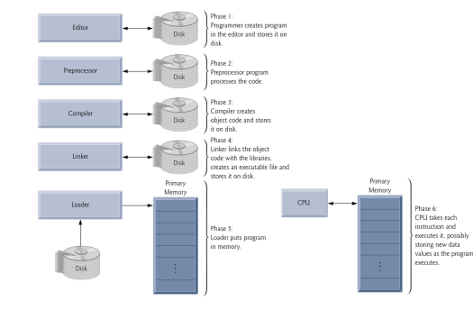

class: center, middle, inverse
<title>Unidad 3</title>

.title[Informática I]

Claudio Paz

<!-- .email[claudiojpaz@gmail.com] -->

Abril 2024


<div style="position: absolute; left: 5%; top: 85%; height: 50%; width: 50%; padding: 1em; text-align: left;">
<input type="image" src="assets/fullscreen.png" onclick="openFullscreen()" style="height: 15%; width: 15%;">
<input type="image" src="assets/smallscreen.png" onclick="closeFullscreen()" style="height: 15%; width: 15%;">
</div>

---
class: middle, center, intermediate
.title-dark[Unidad 3]
# Introducción al lenguaje C
---
# Reseña histórica

<div style="position: absolute; top: 100px; height: 400px; width: 750px; padding: 1em; text-align: center;">
<figure>

<figcaption>DEC PDP-7. Oslo, Noruega</figcaption>
</figure>
</div>

.footnote[
<font size="3">
Toresbe [<a href="http://creativecommons.org/licenses/sa/1.0/">CC SA 1.0</a>], <a href="https://commons.wikimedia.org/wiki/File:Pdp7-oslo-2005.jpeg">via Wikimedia Commons</a>
</font>
]

---
count: false
# Reseña histórica
## Fines de los 60's y principios de los 70's

* 1966 - BCPL - Martin Richards.
* 1969 - B -  Ken Thompson con Dennis Ritchie.
* 1969-1973 - C -  Dennis Ritchie.

---
count: false
# Reseña histórica

## Fines de los 70's hasta fines de los 90's.. y más
*  1978 - Libro: Lenguaje de Programación C <br>Kernighan & Ritchie
*  1989 - American National Standards Institute - ANSI C - C89
*  1990 - International Organization for Standardization - ISO C - C90
*  1999 - ANSI adopta el estándar ISO para C - C99
*  2011 - ISO C - C11
*  2018 - ISO C - C18

---
# Elementos del lenguaje C

--
count: false

> **Token:** conjunto de símbolos que tiene un significado coherente en un lenguaje de programación

--
count: false
Existen seis clases de tokens en el vocabulario del lenguaje C

--
count: false
<div style="font-size: 90%;"> 
<p>
    \begin{array}{llll}
    \textsf{Palabras clave} &  &  & \textsf{Identificadores} \\
    \textsf{Constantes}     &  &  & \textsf{Comentarios} \\
    \textsf{Operadores}     &  &  & \textsf{Separadores} \\
    \end{array}
</p>
</div>
---
# Elementos del lenguaje C
--
count: false

## Palabras clave

--
count: false

32 palabras reservadas para el lenguaje

---
count:false
# Elementos del lenguaje C

## Palabras clave

--
count: false

<div style="font-size: 80%;">
<p>
    \begin{array}{llllllllll}
      \mathtt{auto}     & & &  \mathtt{break}    & & &   \mathtt{case}      & & &  \mathtt{char} \\
      \mathtt{const}    & & &  \mathtt{continue} & & &   \mathtt{default}   & & &  \mathtt{do} \\
      \mathtt{enum}     & & &  \mathtt{extern}   & & &   \mathtt{float}     & & &  \mathtt{for} \\
      \mathtt{goto}     & & &  \mathtt{if}       & & &   \mathtt{int}       & & &  \mathtt{long} \\
      \mathtt{else}     & & &  \mathtt{return}   & & &   \mathtt{short}     & & &  \mathtt{signed} \\
      \mathtt{sizeof}   & & &  \mathtt{static}   & & &   \mathtt{struct}    & & &  \mathtt{double} \\
      \mathtt{register} & & &  \mathtt{switch}   & & &   \mathtt{typedef}   & & &  \mathtt{union} \\
      \mathtt{unsigned} & & &  \mathtt{void}     & & &   \mathtt{volatile}  & & &  \mathtt{while}
    \end{array}
</p>
</div>

---
# Elementos del lenguaje C
--
count: false

## Identificadores

--
count: false

Conjunto de caracteres alfanuméricos que asocian a entidades del programa (variables, funciones, etc.).

--
count: false

No pueden ser iguales a ninguna palabra reservada.

--
count: false

Pueden estar formados por letras del alfabeto inglés, números o guiones bajos (\_).

--
count: false

No pueden comenzar con números.

--
count: false

No pueden tener espacios ni operadores aritméticos.

---
# Elementos del lenguaje C

## Identificadores

--
count: false
.left-column[
## Correcto

<div style="font-size: 80%;">
<p>
$\mathtt{var}$<br>
$\mathtt{n1}$<br>
$\mathtt{\_node05}$<br>
$\mathtt{contador}$<br>
$\mathtt{max\_temp}$<br>
$\mathtt{i}$<br>
</p>
</div>

]

.right-column[

]

---
count: false
# Elementos del lenguaje C

## Identificadores

.left-column[
## Correcto

<div style="font-size: 80%;">
<p>
$\mathtt{var}$<br>
$\mathtt{n1}$<br>
$\mathtt{\_node05}$<br>
$\mathtt{contador}$<br>
$\mathtt{max\_temp}$<br>
$\mathtt{i}$<br>
</p>
</div>

]

.right-column[
## Incorrecto

<div style="font-size: 80%;">
<p>
$\mathtt{3var}$<br>
$\mathtt{if}$<br>
$\mathtt{5}$<br>
$\mathtt{node\text{-}05}$<br>
$\mathtt{max\;temp}$<br>
</p>
</div>
]

---
# Elementos del lenguaje C

--
count: false

## Constantes

--
count: false

Son valores que no pueden cambiar una vez que el programa fue compilado.

--
count: false

También se llaman literales.

--
count: false

Pueden ser números, caracteres individuales o cadenas de texto.

---
# Elementos del lenguaje C
## Constantes

--
count: false
## Números

||
---|---
.inline-code[3] | .inline-code[3.1416] | .inline-code[31.416e-1] | .inline-code[0.31416e1] | .inline-code[.31416e1] | .inline-code[.31416e+1]

--
count: false

||
---|---
.inline-code[3.1416f] | .inline-code[3.1416F] | .inline-code[31.416E-1] | .inline-code[0xfe01] | .inline-code[0xFE01] | .inline-code[0XFE01]

--
count: false

## Caracteres
--
count: false

||
---|---
.inline-code['c'] | .inline-code['F'] | .inline-code['.red[\n]'] | .inline-code['7']

--
count: false

## Cadenas de caracteres

--
count: false
||
---|---
.inline-code["Hola, mundo!"]|

---
# Elementos del lenguaje C

--
count: false

## Operadores

--
count: false

Los operadores en C son conjuntos de caracteres (uno o dos) que indican al programa que debe hacer.

--
count: false

<div style="font-size: 80%;"> 
<p>

Aritméticos: +, -, *, / y % <br><br>

Asignación: =, +=, -=, *= y /= <br><br>

Incrementales: ++ y -- <br><br>

Relacionales: <, >, >=, <=, == y != <br><br>

Lógicos: && y ||

</p>
</div>


---
# Elementos del lenguaje C

--
count: false

## Separadores o delimitadores

--
count: false

Se utilizan en distintas construcciones del lenguaje

--
count: false

<div style="font-size: 90%;"> 
<p>
    \begin{array}{llllllllllllllllll}
    \mathbf{[\;]} & (\;) & \{\} & , & ; & : & ... & * & = & \#
    \end{array}
</p>
</div>

---
# Elementos del lenguaje C

--
count: false

## Comentarios

--
count: false

Cadenas de texto que no se compilan.

--
count: false

Sirven para que el programador deje aclaraciones.

--
count: false

O para anular partes del código.
--
count: false

La doble barra (//) anula todo hasta el final de la línea.
--
count: false

/\* comenta todo hasta encontrar un \*/ aunque sea muchas líneas más abajo

---
# Primer ejemplo: Hola, Mundo!

.left-70-column[
```C
#include <stdio.h>

// programa de prueba

int main (void)
{

  printf("Hola, Mundo!\n");

  return 0;
}
```
]
.right-30-column[


]
---
count: false
# Primer ejemplo: Hola, Mundo!

.left-70-column[
```C
#include <stdio.h>

// programa de prueba

*int main (void)
{

  printf("Hola, Mundo!\n");

  return 0;
}
```
]

--
count: false

.right-30-column[

Todos los programas deben tener una función ``main``


]

---
# Primer ejemplo: Hola, Mundo!

.left-70-column[
```C
#include <stdio.h>

// programa de prueba

int main (void)
{

  printf("Hola, Mundo!\n");

  return 0;
}
```
]

.right-30-column[

]

---
count: false
# Primer ejemplo: Hola, Mundo!

.left-70-column[
```C
#include <stdio.h>

// programa de prueba

int main (void)
*{
*
* printf("Hola, Mundo!\n");
*
* return 0;
*}
```
]

--
count: false

.right-30-column[
Las llaves definen _bloques_.

En este caso el bloque es el _cuerpo_ de la función ``main``

]
---
# Primer ejemplo: Hola, Mundo!

.left-70-column[
```C
#include <stdio.h>

// programa de prueba

int main (void)
{

  printf("Hola, Mundo!\n");

  return 0;
}
```
]

.right-30-column[

]

---
count: false
# Primer ejemplo: Hola, Mundo!

.left-70-column[
```C
#include <stdio.h>

// programa de prueba

int main (void)
{

  printf("Hola, Mundo!\n");

* return 0;
}
```
]

--
count: false

.right-30-column[

A partir del estándar C90 en adelante, la función ``main`` debe terminar con un ``return``.

]

---
count: false
# Primer ejemplo: Hola, Mundo!

.left-70-column[
```C
#include <stdio.h>

// programa de prueba

int main (void)
{

  printf("Hola, Mundo!\n");

* return 0;
}
```
]

--
count: false

.right-30-column[

Indica al _proceso_ que _lanzó_ el programa, que el mismo ya terminó.

]

---
# Primer ejemplo: Hola, Mundo!

.left-70-column[
```C
#include <stdio.h>

// programa de prueba

int main (void)
{

  printf("Hola, Mundo!\n");

  return 0;
}
```
]

.right-30-column[

]

---
count: false
# Primer ejemplo: Hola, Mundo!

.left-70-column[
```C
*#include <stdio.h>

// programa de prueba

int main (void)
{

  printf("Hola, Mundo!\n");

  return 0;
}
```
]

--
count: false

.right-30-column[

Las líneas que comienzan con # se llaman _directivas de preprocesador_.

]
---
count: false
# Primer ejemplo: Hola, Mundo!

.left-70-column[
```C
*#include <stdio.h>

// programa de prueba

int main (void)
{

  printf("Hola, Mundo!\n");

  return 0;
}
```
]

--
count: false

.right-30-column[

Son necesarias para que el compilador trabaje de forma correcta.

]
---
count: false
# Primer ejemplo: Hola, Mundo!

.left-70-column[
```C
*#include <stdio.h>

// programa de prueba

int main (void)
{

  printf("Hola, Mundo!\n");

  return 0;
}
```
]

--
count: false

.right-30-column[

Otras son:

``#define``
``#ifdef``
``#pragma``

etc.

]

---
# Primer ejemplo: Hola, Mundo!

.left-70-column[
```C
#include <stdio.h>

// programa de prueba

int main (void)
{

  printf("Hola, Mundo!\n");

  return 0;
}
```
]

.right-30-column[

]

---
count: false
# Primer ejemplo: Hola, Mundo!

.left-70-column[
```C
#include <stdio.h>

// programa de prueba

int main (void)
{

* printf("Hola, Mundo!\n");

* return 0;
}
```
]

--
count: false

.right-30-column[

En este caso ``printf`` y ``return 0`` son sentencias simples...

]
---
# Primer ejemplo: Hola, Mundo!

.left-70-column[
```C
#include <stdio.h>

// programa de prueba

int main (void)
{

* printf("Hola, Mundo!\n");

* return 0;
}
```
]

--
count: false
.right-30-column[

Sentencias simples deben terminar con punto y coma (;)

]

---
count: false
# Primer ejemplo: Hola, Mundo!

.left-70-column[
```C
#include <stdio.h>

// programa de prueba

int main (void)
{

* printf("Hola, Mundo!\n");

  return 0;
}
```
]

--
count: false

.right-30-column[

``printf`` es una función definida en ``stdio.h``...

]

---
count: false
# Primer ejemplo: Hola, Mundo!

.left-70-column[
```C
#include <stdio.h>

// programa de prueba

int main (void)
{

* printf("Hola, Mundo!\n");

  return 0;
}
```
]

--
count: false

.right-30-column[
...utilizada para imprimir mensajes en pantalla.
]

---
# Ambiente de desarrollo
--
count: false

.center[]
.smaller50[.footnote[Ilustración adaptada de _C: How to Program_, Deitel & Deitel, Ed. 2016, Cap.1, pág.47 ]]

---
# Ambiente de desarrollo
--
count: false

> **Editor:** Programa con el que se pueden modificar los archivos donde se escriben los programas.
> Luego de modificarlos se guardan en el disco.

--
count: false

En linux se suele usar el gedit, nano, vim o emacs pero hay muchos más.

--
count: false

No confundir con los IDE de programación (geany, zinja, eclipse, codeblock, etc.)

---
# Ambiente de desarrollo
--
count: false

> **Preprocesador:** Programa que se ejecuta automáticamente antes del compilador.
> Modifica el archivo original agregando y quitando texto.
> Luego guarda el resultado nuevamente en el disco.

--
count: false

El preprocesador _pega_ el contenido de los archivos solicitados con la directiva .inline-code[\#include], remueve las líneas comentadas, y cambia las constantes definidas con la directiva .inline-code[\#define]

---
# Ambiente de desarrollo
--
count: false

> **Compilador:** Programa que traduce el código escrito en C y lo pasa a un código entendible por la máquina.
> Luego guarda el resultado nuevamente en el disco como código objeto.

--
count: false

En esta fase podemos considerar que el compilador está formado por el compilador propiamente dicho y el ensamblador, según lo visto en la Unidad 1 (ver gráfico de Unidad 1).

---
# Ambiente de desarrollo
--
count: false

> **Linqueador:** Programa que compagina el código objeto realizado por el compilador con el código objeto de las funciones de bibliotecas usadas por el programa.
> Luego guarda el resultado nuevamente en el disco como un archivo ejecutable.

---
# Ambiente de desarrollo
--
count: false

> **Cargador:** Programa que toma el programa del disco y lo coloca en memoria, quedando listo para ejecutarse.

--
count: false

> **Ejecución:** Finalmente el CPU ejecuta una a una las instrucciones de la memoria.


---
# Uso del compilador.

--
count: false

En adelante, en los _slides_ emularemos la terminal con cuadros de texto como el siguiente

```shell
$
```

--
count: false

El signo $ se llama _prompt_ y es el inicio de la línea de comandos en SO GNU/Linux.

--
count: false

El signo $ NO debe escribirse.

---
# Uso del compilador.
--
count: false

Si contamos con un archivo llamado .inline-code[hello.c] con el siguiente contenido:

--
count: false

```C
#include <stdio.h>

int main (void)
{
  printf("Hola, Mundo!\n");

  return 0;
}
```

---
# Uso del compilador
--
count: false

...podemos compilarlo usando el .inline-code[gcc]:

```shell
$ gcc hello.c
$
```

--
count: false

Si no cometimos errores en el programa, el .inline-code[gcc] no da ningún mensaje y crea un archivo llamado .inline-code[a.out] el cual podemos ejecutar.

---
# Uso del compilador
--
count: false

Para ejecutar cualquier archivo en linux, debemos anteponer un punto y una barra, sin espacios

```bash
$ ./a.out
Hola, Mundo!
$
```

---
# Uso del compilador
--
count: false

Se puede utilizar el .inline-code[gcc] con _parámetros_ más apropiados a nuestras necesidades

--
count: false

Por ejemplo, para cambiar el nombre del archivo ejecutable se agrega .inline-code[-o] seguido del nuevo nombre

```shell
$ gcc hello.c -o saludo
$
```
---
# Uso del compilador
--
count: false

...luego, se ejecuta como antes, agregando el punto y la barra, ahora invocando el programa con su nuevo nombre

```shell
$ ./saludo
Hola, Mundo!
$
```

---
# Uso del compilador
--
count: false

Otros parámetros útiles son:

```bash
$ gcc -Wall -std=c99 --pedantic-errors hello.c -o saludo
```
--
count: false

.red[``-Wall``] **W**arning **all**

--
count: false
.red[``-std=c99``] para el estándar C99

--
count: false
.red[``--pedantic-errors``] si algo no cumple el estándar da error

---
# Funciones de entrada/salida
--
count: false

## Funciones

Las funciones son fragmentos de código que se _ejecutan_ cada vez que son _llamadas_.

--
count: false

Generalmente las funciones reciben información por parte de _quien_ las llame.
Esta información se pasa a la función por medio de los paréntesis.

--
count: false

Por ejemplo:

--
count: false
```C
  printf("Hola, Mundo!\n");
```

---
# Funciones de entrada/salida
--
count: false

.inline-code[stdio.h] es el archivo de cabecera que contiene las declaraciones de las funciones de la **biblioteca estándar**

--
count: false

Algunas funciones son:<br>
.inline-code[printf], .inline-code[scanf], .inline-code[getchar], .inline-code[putchar]

---
# Funciones de entrada/salida
--
count: false

Para usar estas funciones debe incluirse este archivo con la directiva de preprocesador .inline-code[\#include]

--
count: false

```C
*#include <stdio.h>

int main (void)
{
  printf("Hola, Mundo!\n");

  return 0;
}
```

---
# Función printf
--
count: false

Como se vió, .inline-code[printf] es una función para imprimir en pantalla.

--
count: false

Esta función debe recibir la cadena de caracteres para imprimir.
Por ejemplo, en los ejemplos se usó la cadena .inline-code["Hola, Mundo!\n"]

--
count: false

Como se puede ver en los ejemplos, el .inline-code[\n] no se imprime.

--
count: false

La barra invertida (.inline-code[\]) se llama **caracter de escape**, y cambia el _significado_ del caracter que sigue.

---
# Función printf
--
count: false

## Secuencias de escape de la función .inline-code[printf]

<div style="font-size: 80%;">
<p>
    \begin{array}{ll}
    \text{Escape} & \text{Descripción} \\
    \hline
    {\sf \backslash  n} & \text{Nueva línea} \\
    {\sf \backslash  t} & \text{Tabulador horizontal} \\
    {\sf \backslash  v} & \text{Tabulador vertical} \\
    {\sf \backslash  b} & \text{Retroceso} \\
    {\sf \backslash  r} & \text{Retorno de carro} \\
    {\sf \backslash \backslash} & \text{Diagonal invertida} \\
    {\sf \backslash "} & \text{Comillas}
    \end{array}
</p>
</div>

---
# Función printf
---
count: false
layout: true
# Función printf
## Ejemplos

```C
#include <stdio.h>
// u3-tres.c

int main (void)
{
  printf("Uno\nDos\nTres\n");

  return 0;
}
```
---
count: false
---
count: false

```bash
$ gcc -Wall -std=c99 --pedantic-errors u3-tres.c
$
```
---
count: false

```bash
$ gcc -Wall -std=c99 --pedantic-errors u3-tres.c
$ ./a.out
```
---
count: false

```bash
$ gcc -Wall -std=c99 --pedantic-errors u3-tres.c
$ ./a.out
Uno
Dos
Tres
$
```

---
layout: false
# Función printf
---
count: false
layout: true
# Función printf
## Ejemplos

```C
#include <stdio.h>
// u3-tabs.c

int main (void)
{
  printf("Uno\tDos\tTres\n");

  return 0;
}
```
---
count: false
---
count: false
```bash
$ gcc -Wall -std=c99 --pedantic-errors u3-tabs.c
$
```

---
count: false

```bash
$ gcc -Wall -std=c99 --pedantic-errors u3-tabs.c
$ ./a.out
```
---
count: false

```bash
$ gcc -Wall -std=c99 --pedantic-errors u3-tabs.c
$ ./a.out
Uno    Dos    Tres
$
```

---
layout: false
# Función printf
---
layout: true
# Función printf
## Ejemplos

```C
#include <stdio.h>
// u3-retroceso.c

int main (void)
{
  printf("Uno\tDos\rTres\n");

  return 0;
}
```
---
count: false
---
count: false
```bash
$ gcc -Wall -std=c99 --pedantic-errors u3-retroceso.c
$
```

---
count: false

```bash
$ gcc -Wall -std=c99 --pedantic-errors u3-retroceso.c
$ ./a.out
```
---
count: false

```bash
$ gcc -Wall -std=c99 --pedantic-errors u3-retroceso.c
$ ./a.out
Tres   Dos
$
```

---
layout: false
# Función printf
--
count: false

## Especificadores de conversión o de formato

<div style="font-size: 80%;">
<p>
    \begin{array}{ll}
        \text{Especificadores} & \text{Descripción} \\
        \hline
        \%\text{c}       & \text{Caracter}\\
        \%\text{d} \text{ o } \%\text{i} & \text{Entero decimal con signo}\\
        \%\text{u}       & \text{Entero decimal sin signo}\\
        \%\text{f}       & \text{Decimal de punto flotante}\\
    \end{array}
</p>

---
# Función printf

## Especificadores de conversión o de formato
--
count: false

```C
#include <stdio.h>
// u3-conversion.c

int main (void)
{
  printf("%f\n", 3.14);
  printf("%d %d %d\n", 1, 2, 4);

  return 0;
}
```
--
count: false
Por cada especificador que tenga la cadena de texto se espera un valor que tomará su lugar, todos separados por comas (llamados **argumentos**)

---
layout: false
# Función printf
--
count: false
La cadena puede tener cualquier caracter válido junto con los especificadores de formato
---
count: false
layout: true

# Función printf
La cadena puede tener cualquier caracter válido junto con los especificadores de formato

```C
#include <stdio.h>
// u3-conversion-suma.c

int main (void)
{
  printf("%d+%d=%d\n", 1, 2, 3);

  return 0;
}
```
---
count: false
---
count: false
```bash
$ gcc -Wall -std=c99 --pedantic-errors u3-conversion-suma.c
$
```
---
count: false
```bash
$ gcc -Wall -std=c99 --pedantic-errors u3-conversion-suma.c
$ ./a.out
```
---
count: false
```bash
$ gcc -Wall -std=c99 --pedantic-errors u3-conversion-suma.c
$ ./a.out
1+2=3
$
```

---
layout: false
# Función printf
--
count: false
Los valores que usan los especificadores pueden ser el resultado de operaciones
---
layout: true
count: false
# Función printf

Los valores que usan los especificadores pueden ser el resultado de operaciones

```C
#include <stdio.h>
// u3-conversion-op-suma.c

int main (void)
{
  printf("%d+%d=%d\n", 1, 2, 1+2);

  return 0;
}
```
---
count: false
---
count: false
```bash
$ gcc -Wall -std=c99 --pedantic-errors u3-conversion-op-suma.c
$
```
---
count: false
```bash
$ gcc -Wall -std=c99 --pedantic-errors u3-conversion-op-suma.c
$ ./a.out
```
---
count: false
```bash
$ gcc -Wall -std=c99 --pedantic-errors u3-conversion-op-suma.c
$ ./a.out
1+2=3
$
```

---
layout: false
# Función printf
---
layout: true
count: false
# Función printf

```C
#include <stdio.h>
// u3-conversion-div-mod.c

int main (void)
{
  printf("%d\n", 5%2);
  printf("%d\n", 5/2);

  return 0;
}
```
---
count: false
---
count: false
```bash
$ gcc -Wall -std=c99 --pedantic-errors u3-conversion-div-mod.c
$
```
---
count: false
```bash
$ gcc -Wall -std=c99 --pedantic-errors u3-conversion-div-mod.c
$ ./a.out
```
---
count: false
```bash
$ gcc -Wall -std=c99 --pedantic-errors u3-conversion-div-mod.c
$ ./a.out
1
2
$
```
---
layout: false
# Variables
--
count: false

.left-column[
]
.right-column[

]
---
count: false
# Variables
.left-column[

Todas las variables tienen:
- Nombre o identificador
- Valor almacenado
- Dirección de memoria
- Tipo
]

.right-column[

]

---
# Tipos de datos, ej. de tamaño
--
count: false

<div style="font-size: 65%;"> 
<p>
    \begin{array}{lrrr}
      \textsf{Tipo}          & \textsf{Menor}        & \textsf{Mayor}       & \textsf{Bytes} \\
      \hline
      \textsf{char}          & -128        & 127           & 1 \\
      \textsf{unsigned char} & 0           & 255           & 1 \\
      \textsf{short}         & -32768      & 32767         & 2 \\
      \textsf{unsigned short}& 0           & 65535         & 2 \\
      \textsf{int}           & -2147483648 & 2147483647    & 4 \\
      \textsf{unsigned int}  & 0           & 4294967295    & 4 \\
      \textsf{long}          & -9223372036854775808 & 9223372036854775807 & 8 \\
      \textsf{unsigned long} & 0           & 18446744073709551615  & 8 \\
      \color{red}{\textsf{float}}         & \text{1.18e-38}     & \text{3.4e+38}       & 4 \\
      \color{red}{\textsf{double}}        & \text{2.23e-308}    & \text{1.8e+308}      & 8 \\
      \color{red}{\textsf{long double}}   & \text{3.36e-4932}   & \text{1.19e+4932}     & 10
    \end{array}
</p>
</div>

---
# Definición de variables
--
count: false

Cuando se **define** una variable se reserva una posición de memoria para poder almacenar su contenido.

--
count: false
En la definición se debe explicitar el **tipo** que corresponderá a esa variable.

--
count: false
De esta manera el compilador sabe que tan grande es el espacio de memoria que debe reservar.

--
count: false
También hay que asignar un **nombre**, con el cual se puede acceder al contenido de la memoria.

---
# Definición de variables

--
count: false

## Cómo?
--
count: false

.inline-code[.green[tipo] .grey[identificador];]

--
count: false

Donde .inline-code[.green[tipo]] puede ser .inline-code[.green[int]], .inline-code[.green[char]], .inline-code[.green[float]], etc.

--
count: false

...y donde .inline-code[.grey[identificador]] puede ser cualquier identificador válido.

--
count: false
```C
int entero;
char caracter;
int n1, n2;
float max_temp;
```
---
# Definición de variables

--
count: false

## Donde?
--
count: false
```C
#include <stdio.h>
// u3-definicion-tipos.c

int main (void)
{
  int la_respuesta;

  la_respuesta = 42;
  printf("%d\n", la_respuesta);

  return 0;
}
```
---
count: false
# Definición de variables

## Donde?

```C
#include <stdio.h>
// u3-definicion-tipos.c

int main (void)
{
* int la_respuesta;

  la_respuesta = 42;
  printf("%d\n", la_respuesta);

  return 0;
}
```
--
count: false
Por ahora entre las llaves del cuerpo de .inline-code[.teal[main]]
---
count: false
# Definición de variables

## Donde?

```C
#include <stdio.h>
// u3-definicion-tipos.c

int main (void)
{
* int la_respuesta;

  la_respuesta = 42;
  printf("%d\n", la_respuesta);

  return 0;
}
```
---
# Definición de variables


## Donde?

```C
#include <stdio.h>
// u3-definicion-tipos.c

int main (void)
{
  int la_respuesta;

* la_respuesta = 42;
  printf("%d\n", la_respuesta);

  return 0;
}
```
--
count: false
Cuando se **asigna** un valor a una variable se dice que se **inicializa**

---
# Definición de variables

--
count: false
Se puede **inicializar** una variable en el mismo momento que se **define**

--
count: false

```C
#include <stdio.h>
// u3-definicion-tipos-ini.c

int main (void)
{
  int la_respuesta = 42;

  printf("%d\n", la_respuesta);

  return 0;
}
```
---
count: false
# Definición de variables

Se puede **inicializar** una variable en el mismo momento que se **define**

```C
#include <stdio.h>
// u3-definicion-tipos-ini.c

int main (void)
{
* int la_respuesta = 42;

  printf("%d\n", la_respuesta);

  return 0;
}
```

---
# Definición de variables
--
count: false

Se pueden definir varias variables del mismo tipo en la misma sentencia.

--
count: false

```C
  char var1, var2, var3;
```
--
count: false

Se pueden inicializar varias variables en la misma sentencia.

--
count: false

```C
  int a=3, b, c=0;
```
--
count: false

Las variables no inicializadas pueden tener cualquier valor.

---
# Definición de variables
--
layout: true
count: false
```C
#include <stdio.h>
// u3-def-sin-ini.c

int main (void)
{
  int a=3, b, c=0;

  printf("%d %d %d\n", a, b, c);

  return 0;
}
```
---
count: false
---
count: false

```bash
$ gcc -Wall -std=c99 --pedantic-errors u3-def-sin-ini.c
```
---
count: false

```bash
$ gcc -Wall -std=c99 --pedantic-errors u3-def-sin-ini.c
u3-def-sin-ini.c: In function ‘main’:
u3-def-sin-ini.c:8:3: warning: ‘b’ is used uninitialized
                               in this function [-Wuninitialized]
   printf("%d %d %d\n", a, b, c);
   ^~~~~~~~~~~~~~~~~~~~~~~~~~~~~
$
```
---
count: false

```bash
$ gcc -Wall -std=c99 --pedantic-errors u3-def-sin-ini.c
u3-def-sin-ini.c: In function ‘main’:
u3-def-sin-ini.c:8:3: warning: ‘b’ is used uninitialized
                               in this function [-Wuninitialized]
   printf("%d %d %d\n", a, b, c);
   ^~~~~~~~~~~~~~~~~~~~~~~~~~~~~
$./a.out
```
---
count: false

```bash
$ gcc -Wall -std=c99 --pedantic-errors u3-def-sin-ini.c
u3-def-sin-ini.c: In function ‘main’:
u3-def-sin-ini.c:8:3: warning: ‘b’ is used uninitialized
                               in this function [-Wuninitialized]
   printf("%d %d %d\n", a, b, c);
   ^~~~~~~~~~~~~~~~~~~~~~~~~~~~~
$./a.out
3 32767 0
$
```
---
layout: false
# Definición de variables
--
count: false
Si se ejecuta nuevamente .inline-code[a.out] la variable .inline-code[b] puede tener cualquier valor.

--
count: false
Posiblemente diferente cada vez que se ejecute.

--
count: false
Dependerá de donde sea alojado .inline-code[a.out] y la _basura_ que haya quedado en esa posición.

--
count: false
Para evitar errores inesperados **debe** inicializarse cada variable.

--
count: false
Y prestar atención a los mensajes del compilador.

---
layout: false
# Operadores
--
count: false

En general, los **operadores** son símbolos que indican que debe realizarse una operación sobre algún conjunto de objetos.

--
count: false

Los objetos sobre los que opera un operador se llaman **operandos**.

--
count: false

Según a cuantos operandos afecten, los operadores pueden ser **unarios**, **binarios** o **ternarios**.

--
count: false

Los operadores siempre **devuelven** el resultado de la operación.

---
# Operadores aritméticos
--
count:false
## Unarios

||
---|:---
\+| Signo positivo
\-| Signo negativo
|

--
count: false

## Binarios

||
---|:---
\+ |Suma
\- |Resta
\* |Producto
/  |División
%  |Módulo
=  |Asignación
|

---
layout: false
# Operadores aritméticos
---
layout: true
# Operadores aritméticos
El resultado de la operación se puede imprimir

```C
#include <stdio.h>
// u3-intro-operadores-1.c

int main (void)
{
  printf("%d\n", 2 + 1);

  return 0;
}
```
---
count: false
---
count: false
```bash
$ gcc -Wall -std=c99 --pedantic-errors u3-intro-operadores-1.c
$
```
---
count: false
```bash
$ gcc -Wall -std=c99 --pedantic-errors u3-intro-operadores-1.c
$ ./a.out
```
---
count: false
```bash
$ gcc -Wall -std=c99 --pedantic-errors u3-intro-operadores-1.c
$ ./a.out
3
$
```

---
layout: false
# Operadores aritméticos
---
layout: true
# Operadores aritméticos
El resultado de la operación se puede **asignar**

```C
#include <stdio.h>
// u3-intro-operadores-2.c

int main (void)
{
  int resultado;

  resultado = 2 + 1;

  printf("%d\n", resultado);

  return 0;
}
```
---
count: false
---
count: false
```bash
$ gcc -Wall -std=c99 --pedantic-errors u3-intro-operadores-2.c
$
```
---
count: false
```bash
$ gcc -Wall -std=c99 --pedantic-errors u3-intro-operadores-2.c
$ ./a.out
```
---
count: false
```bash
$ gcc -Wall -std=c99 --pedantic-errors u3-intro-operadores-2.c
$ ./a.out
3
$
```
---
layout: false
# Operadores aritméticos
---
layout: true
# Operadores aritméticos

```C
#include <stdio.h>
// u3-intro-operadores-3.c

int main (void)
{
  int resultado;

  resultado = 3 * 2 + 1;

  printf("%d\n", resultado);

  return 0;
}
```
---
count: false
---
count: false
```bash
$ gcc -Wall -std=c99 --pedantic-errors u3-intro-operadores-3.c
$
```
---
count: false
```bash
$ gcc -Wall -std=c99 --pedantic-errors u3-intro-operadores-3.c
$ ./a.out
```
---
count: false
```bash
$ gcc -Wall -std=c99 --pedantic-errors u3-intro-operadores-3.c
$ ./a.out
7
$
```
--
count: false
<div style="font-size: 80%;">
<p>
El orden en el que se resuelven las operaciones depende de las reglas de precedencia
</p>
</div>
---
layout: false
# Precedencia
--
count: false

Se llama precedencia al orden en el que se evalúan las operaciones en una expresión

--
count: false
Mientras más arriba en la tabla, se dice que tiene más (o mayor) precedencia, y se evalúa primero

---
layout: false
# Precedencia
--
count: false

Hasta ahora...

<div style="font-size: 90%;">
<p>
    \begin{array}{llll}
    \textsf{Operador} &    &  & \textsf{Asociatividad} \\\hline
    \textsf{()}       &    &  & \textsf{Izq. a Der.} \\
    \textsf{+ - (los de signo)}      &    &  & \textsf{Der. a Izq.} \\
    \textsf{* / }\%   &    &  & \textsf{Izq. a Der.} \\
    \textsf{+ -}      &    &  & \textsf{Izq. a Der.} \\
    \textsf{=}        &    &  & \textsf{Der. a Izq.} \\
    \end{array}
</p>
</div>

---
# Precedencia
---
count: false
# Precedencia

<div style="position: absolute; top: 100px;">

</div>
---
count: false
# Precedencia

<div style="position: absolute; top: 100px;">

</div>
---
count: false
# Precedencia

<div style="position: absolute; top: 100px;">

</div>
---
count: false
# Precedencia

<div style="position: absolute; top: 100px;">

</div>
---
count: false
# Precedencia

<div style="position: absolute; top: 100px;">

</div>
---
count: false
# Precedencia

<div style="position: absolute; top: 100px;">

</div>
---
count: false
# Precedencia

<div style="position: absolute; top: 100px;">

</div>
---
count: false
# Precedencia

<div style="position: absolute; top: 100px;">

</div>
---
count: false
# Precedencia

<div style="position: absolute; top: 100px;">

</div>
---
count: false
# Precedencia

<div style="position: absolute; top: 100px;">

</div>

---
layout: false
# Operadores relacionales
--
count: false
<div style="font-size: 90%; "> 
<p>
Los operadores relacionales sirven para comparar constantes o variables.
</div>
</p>

--
count: false

<div style="font-size: 80%; "> 
<p>
$
    \begin{array}{ccl}
     \textsf{En Mat.} & \textsf{En C} & \textsf{Descripción} \\ \hline
     >   & >  & \textsf{Mayor} \\
     <   & <  & \textsf{Menor} \\
     \geq& >= & \textsf{Mayor o igual} \\
     \leq& <= & \textsf{Menor o igual} \\
     =   & == & \textsf{Igual}\\
     \neq& != & \textsf{Distinto}
    \end{array}
$
</p>
</div>

--
count: false

<div style="font-size: 90%; "> 
<p>
Como todos los operadores, devuelve el resultado de la operación
</div>
</p>

---
# Operadores relacionales
--
count: false
Si la relación se cumple, devuelve un .inline-code[1]
--
layout: true
count: false
```C
#include <stdio.h>
// u3-relacion-1.c

int main (void)
{
  printf("%d\n", 3>2);

  return 0;
}
```
---
count: false
---
count: false
```bash
$ gcc -Wall -std=c99 --pedantic-errors u3-relacion-1.c
$
```
---
count: false
```bash
$ gcc -Wall -std=c99 --pedantic-errors u3-relacion-1.c
$ ./a.out
```
---
count: false
```bash
$ gcc -Wall -std=c99 --pedantic-errors u3-relacion-1.c
$ ./a.out
1
$
```

---
layout: false
# Operadores relacionales
--
count: false
Si la relación **no** se cumple, devuelve un .inline-code[0]
--
layout: true
count: false
```C
#include <stdio.h>
// u3-relacion-2.c

int main (void)
{
  printf("%d\n", 2>3);

  return 0;
}
```
---
count: false
---
count: false
```bash
$ gcc -Wall -std=c99 --pedantic-errors u3-relacion-2.c
$
```
---
count: false
```bash
$ gcc -Wall -std=c99 --pedantic-errors u3-relacion-2.c
$ ./a.out
```
---
count: false
```bash
$ gcc -Wall -std=c99 --pedantic-errors u3-relacion-2.c
$ ./a.out
0
$
```
--
count: false
Estos operadores son utilizados en los condicionales.

---
layout: false
# Funciones de entrada/salida (continúa)

--
count: false
Cuando se necesita que el usuario ingrese algún valor se puede usar la función .inline-code[scanf]

--
count: false

.inline-code[scanf] es otra de las funciones de la **biblioteca estándar**

---
# Función scanf
--
count: false

.inline-code[scanf] espera _al menos_ dos argumentos.

--
count: false
```C
  scanf("%d", &variable);
```
--
count: false

El primero es una cadena de texto con especificadores de formato semejantes a .inline-code[printf].

--
count: false

Luego espera tantos argumentos como especificadores de formato tenga la cadena.

--
count: false

Por ahora, estos argumentos son las variables (con un & delante) donde se guardarán los valores ingresados por el usuario.

---
# Función scanf
--
count: false

```C
#include <stdio.h>
// u3-entrada-1.c

int main (void)
{
  int sum1, sum2;
  int res;

  printf("Ingrese un número: ");
  scanf("%d", &sum1);
  printf("Ingrese otro número: ");
  scanf("%d", &sum2);

  res = sum1 + sum2;

  printf("%d+%d=%d\n", sum1, sum2, res);

  return 0;
}
```

---
# Función scanf
--
count: false

```bash
$ gcc -Wall -std=c99 --pedantic-errors u3-relacion-2.c
$ ./a.out
Ingrese un número: 12
Ingrese otro número: 13
12+13=25
$
```
--
count: false

Si una variable va a ser utilizada por primera vez en un .inline-code[scanf] no hace falta inicializarla

---
# Función scanf
--
count: false

Al igual que .inline-code[printf] tiene distintos especificadores de formato

--
count: false

<div style="font-size: 80%;">
<p>
    \begin{array}{ll}
        \text{Especificadores} & \text{Descripción} \\
        \hline
        \%\text{c}       & \text{Caracter}\\
        \%\text{d} \text{ o } \%\text{i} & \text{Entero decimal con signo}\\
        \%\text{u}       & \text{Entero decimal sin signo}\\
        \%\text{f}       & \text{Decimal de punto flotante}\\
    \end{array}
</p>

---
# Función scanf
--
count: false

También se pueden ingresar más valores por sentencia

--
count: false

```C
  scanf("%d %d", &var1, &var2);
```
--
count: false

donde para diferenciar los valores desde el teclado se ingresan con un espacio, un tab o un enter entre ellos.

---
layout: false
# Función putchar
--
layout: true
count: false

```C
#include <stdio.h>
// u3-putchar.c

int main (void)
{
  int numero;

  printf("Ingrese un número (1-127): ");
  scanf("%d", &numero);

  printf("En la tabla ASCII: ");
  putchar(numero);

  return 0;
}
```
---
count: false

---
count: false

```bash
$ gcc -Wall -std=c99 --pedantic-errors u3-putchar.c
$
```
---
count: false

```bash
$ gcc -Wall -std=c99 --pedantic-errors u3-putchar.c
$ ./a.out
```
---
count: false

```bash
$ gcc -Wall -std=c99 --pedantic-errors u3-putchar.c
$ ./a.out
Ingrese un número (1-127):
```
---
count: false

```bash
$ gcc -Wall -std=c99 --pedantic-errors u3-putchar.c
$ ./a.out
Ingrese un número (1-127): 65
```
---
count: false

```bash
$ gcc -Wall -std=c99 --pedantic-errors u3-putchar.c
$ ./a.out
Ingrese un número (1-127): 65
En la tabla ASCII: A
$
```
---
layout: false
# Función putchar
--
count: false

La función .inline-code[.red[putchar]] tiene el mismo efecto que .inline-code[.red[printf]] si solo se imprime un caracter con .inline-code["%c"]

--
count: false
La sentencia

--
count: false
```C
  putchar(65);
```
--
count: false
Tiene el mismo efecto que la sentencia

--
count: false
```C
  printf("%c", 65);
```

---
layout: false
# Función putchar
--
count: false

Además de la diferente complejidad de las sentencias, la diferencia fundamental reside en el valor devuelto.

--
count: false

La función .inline-code[.red[putchar]] devuelve el valor entero del carater impreso.

--
count: false

La función .inline-code[.red[printf]] devuelve la cantidad de caracteres impresos.

---
# Función getchar
--
count: false

Se puede ingresar cualquier caracter desde el teclado utilizando la función .inline-code[.red[getchar]]

--
count: false

.inline-code[.red[getchar]] devuelve un entero correspondiente al caracter ingresado

---
# Función getchar
--
layout: true
count: false

```C
#include <stdio.h>
// u3-getchar.c

int main (void)
{
  int numero;

  printf("Ingrese un caracter de la tabla ASCII: ");
  numero = getchar();

  printf("En la tabla ASCII es el %d\n", numero);

  return 0;
}
```
---
count: false
---
count: false

```bash
$ gcc -Wall -std=c99 --pedantic-errors u3-getchar.c
$
```
---
count: false

```bash
$ gcc -Wall -std=c99 --pedantic-errors u3-getchar.c
$ ./a.out
```
---
count: false

```bash
$ gcc -Wall -std=c99 --pedantic-errors u3-getchar.c
$ ./a.out
Ingrese un caracter de la tabla ASCII:
```
---
count: false

```bash
$ gcc -Wall -std=c99 --pedantic-errors u3-getchar.c
$ ./a.out
Ingrese un caracter de la tabla ASCII: A
```
---
count: false

```bash
$ gcc -Wall -std=c99 --pedantic-errors u3-getchar.c
$ ./a.out
Ingrese un caracter de la tabla ASCII: A
En la tabla ASCII es el 65
$
```
---
layout: false
# Operador de Conversión de tipo (cast)
--
count: false

En ocaciones se necesita obtener resultados de un tipo de datos a partir de variables de tipos diferentes.

--
count: false
Por ejemplo un promedio (punto flotante) a partir calificaciones (enteras)

--
count: false

```C
  promedio = suma_notas / cuantas_notas;
```
---
layout: true
# Operador de Conversión de tipo (cast)
---
---
count: false

```C
#include <stdio.h>
// u3-sin-cast.c

int main (void)
{
  int suma_notas, cuantas_notas;
  float promedio;

  printf("Ingrese la suma de todas las notas: ");
  scanf("%d", &suma_notas);
  printf("Ingrese cuantas notas son: ");
  scanf("%d", &cuantas_notas);

  promedio = suma_notas / cuantas_notas;

  printf("Promedio: %.2f\n", promedio);

  return 0;
}
```
---
---
count: false
```bash
$ gcc -Wall -std=c99 --pedantic-errors u3-sin-cast.c
$
```
---
count: false
```bash
$ gcc -Wall -std=c99 --pedantic-errors u3-sin-cast.c
$ ./a.out
```
---
count: false
```bash
$ gcc -Wall -std=c99 --pedantic-errors u3-sin-cast.c
$ ./a.out
Ingrese la suma de todas las notas:
```
---
count: false
```bash
$ gcc -Wall -std=c99 --pedantic-errors u3-sin-cast.c
$ ./a.out
Ingrese la suma de todas las notas: 13
```
---
count: false
```bash
$ gcc -Wall -std=c99 --pedantic-errors u3-sin-cast.c
$ ./a.out
Ingrese la suma de todas las notas: 13
Ingrese cuantas notas son:
```
---
count: false
```bash
$ gcc -Wall -std=c99 --pedantic-errors u3-sin-cast.c
$ ./a.out
Ingrese la suma de todas las notas: 13
Ingrese cuantas notas son: 2
```
---
count: false
```bash
$ gcc -Wall -std=c99 --pedantic-errors u3-sin-cast.c
$ ./a.out
Ingrese la suma de todas las notas: 13
Ingrese cuantas notas son: 2
Promedio: 6.00
$
```
--
count: false

El problema es que cuando la división es entre dos enteros, se realiza de la manera básica, devolviendo un entero y dejando resto...

--
count: false

...asignando un valor entero a la variable .inline-code[promedio] (aunque quede almacenado como de punto flotante)

--
count: false

Para esto se usa el operador de conversión de tipo

---
layout: false
# Operador de Conversión de tipo (cast)

--
count: false

El operador de conversión de tipo o simplemente _cast_ es un operador **unario** que cambia temporalmente el tipo de datos de su operando.

--
count: false

Consiste en colocar entre parentesis el tipo de datos al que se quiere _convertir_ el operando, delante del mismo.

---
layout: true
# Operador de Conversión de tipo (cast)
---
---
count: false

```C
#include <stdio.h>
// u3-con-cast.c

int main (void)
{
  int suma_notas, cuantas_notas;
  float promedio;

  printf("Ingrese la suma de todas las notas: ");
  scanf("%d", &suma_notas);
  printf("Ingrese cuantas notas son: ");
  scanf("%d", &cuantas_notas);

* promedio = (float) suma_notas / cuantas_notas;

  printf("Promedio: %.2f\n", promedio);

  return 0;
}
```
---
---
count: false
```bash
$ gcc -Wall -std=c99 --pedantic-errors u3-con-cast.c
$
```
---
count: false
```bash
$ gcc -Wall -std=c99 --pedantic-errors u3-con-cast.c
$ ./a.out
```
---
count: false
```bash
$ gcc -Wall -std=c99 --pedantic-errors u3-con-cast.c
$ ./a.out
Ingrese la suma de todas las notas:
```
---
count: false
```bash
$ gcc -Wall -std=c99 --pedantic-errors u3-con-cast.c
$ ./a.out
Ingrese la suma de todas las notas: 13
```
---
count: false
```bash
$ gcc -Wall -std=c99 --pedantic-errors u3-con-cast.c
$ ./a.out
Ingrese la suma de todas las notas: 13
Ingrese cuantas notas son:
```
---
count: false
```bash
$ gcc -Wall -std=c99 --pedantic-errors u3-con-cast.c
$ ./a.out
Ingrese la suma de todas las notas: 13
Ingrese cuantas notas son: 2
```
---
count: false
```bash
$ gcc -Wall -std=c99 --pedantic-errors u3-con-cast.c
$ ./a.out
Ingrese la suma de todas las notas: 13
Ingrese cuantas notas son: 2
Promedio: 6.50
$
```
---
layout: false
# Precedencia (actualizada)

--
count: false

<div style="font-size: 80%;">
<p>
    \begin{array}{llll}
    \textsf{Operador}                        &   &  & \textsf{Asociatividad} \\\hline
    ()                                       &   &  & \textsf{Izq. a Der.} \\
    + \quad - \quad (\text{tipo})            &   &  & \textsf{Der. a Izq.} \\
    * \quad / \quad \%                       &   &  & \textsf{Izq. a Der.} \\
    + \quad -                                &   &  & \textsf{Izq. a Der.} \\
    < \quad <= \quad > \quad >=              &   &  & \textsf{Izq. a Der.} \\
    == \quad !=                              &   &  & \textsf{Izq. a Der.} \\
    =                                        &   &  & \textsf{Der. a Izq.} \\
    \end{array}
</p>
</div>

---
# Operadores
--
count: false

Otros operadores son el .inline-code[++] (llamado incremento) y  
el .inline-code[--] (llamado decremento)

--
count: false

Son operadores **unarios** porque solo funcionan con un operando.

--
count: false

Solo pueden usarse con variables.

--
count: false

El .inline-code[++] incrementa en 1 el operando al que opera

--
count: false

El .inline-code[--] decrementa en 1 el operando al que opera

---
# Operadores
--
count: false

 Ejemplo con .inline-code[++]

```C
#include <stdio.h>
// u3-op-inc.c

int main (void)
{
  int var = 3;

  var++;

  printf("%d\n", var);

  return 0;
}
```
--
count: false

la variable .inline-code[var] se inicializa con un 3, pero luego en la siguiente línea aparece el .inline-code[var++;]


---
# Operadores

 Ejemplo con .inline-code[++]

```C
#include <stdio.h>
// u3-op-inc.c

int main (void)
{
  int var = 3;

  var++;

  printf("%d\n", var);

  return 0;
}
```

--
count: false

```bash
$
```
---
count: false
# Operadores

 Ejemplo con .inline-code[++]

```C
#include <stdio.h>
// u3-op-inc.c

int main (void)
{
  int var = 3;

  var++;

  printf("%d\n", var);

  return 0;
}
```


```bash
$ gcc -Wall -std=c99 --pedantic-errors u3-op-inc.c
$
```
---
count: false
# Operadores

 Ejemplo con .inline-code[++]

```C
#include <stdio.h>
// u3-op-inc.c

int main (void)
{
  int var = 3;

  var++;

  printf("%d\n", var);

  return 0;
}
```


```bash
$ gcc -Wall -std=c99 --pedantic-errors u3-op-inc.c
$ ./a.out
```

---
count: false
# Operadores

 Ejemplo con .inline-code[++]

```C
#include <stdio.h>
// u3-op-inc.c

int main (void)
{
  int var = 3;

  var++;

  printf("%d\n", var);

  return 0;
}
```


```bash
$ gcc -Wall -std=c99 --pedantic-errors u3-op-inc.c
$ ./a.out
4
$
```

---
# Operadores

 Ejemplo con .inline-code[++]

```C
#include <stdio.h>
// u3-op-inc.c

int main (void)
{
  int var = 3;

  var++;

  printf("%d\n", var);

  return 0;
}
```

---
count: false
# Operadores

 Ejemplo con .inline-code[++]

```C
#include <stdio.h>
// u3-op-inc.c

int main (void)
{
  int var = 3;

* var++;

  printf("%d\n", var);

  return 0;
}
```

--
count: false

el operador .inline-code[++] aquí funciona igual que
```C
var = var + 1;
```

---
# Operadores

 Ejemplo con .inline-code[++]

```C
#include <stdio.h>
// u3-op-inc.c

int main (void)
{
  int var = 3;

* var++;

  printf("%d\n", var);

  return 0;
}
```

--
count: false

O sea, tomar el valor que tiene la variable, incrementarla en una unidad, y volver a guardar el resultado en la misma variable.

---
# Operadores

--
count: false

El operador .inline-code[++] también se puede usar antes de la variable

```C
++var;
```

--
count: false

En este caso tiene el mismo efecto que en el caso anterior

---
# Operadores

--
count: false

Los operadores .inline-code[++] y .inline-code[--] también se pueden usar dentro de otra expresión...

--
count: false

```C
int var = 3

printf("%d\n", ++var);
```
--
count: false

```bash
4
```
--
count: false

pero con un detalle...

---
# Operadores
--
count: false

Suponga 2 fragmentos de código (se omite todo el resto y se pone la salida sin compilar para simplificar)

--
count: false


.left-column[
**pre** incremento
```C
int var = 3

printf("%d\n", ++var);
```
]

.right-column[
**post** incremento
```C
int var = 3

printf("%d\n", var++);
```
]

---
count: false
# Operadores

Suponga 2 fragmentos de código (se omite todo el resto y se pone la salida sin compilar para simplificar)


.left-column[
**pre** incremento
```C
int var = 3

printf("%d\n", ++var);
```
]

.right-column[
**post** incremento
```C
int var = 3

printf("%d\n", var++);
```
]


.left-column[
```bash
4
```
]

.right-column[
```bash
3
```
]

--
count: false

¿Qué pasó?


---
# Operadores
--
count: false

La función .inline-code[.red[printf]] en este caso reemplaza el .inline-code[%d] con lo que hay luego de la coma

--
count: false

```C
printf("`%d`\n", `++var`);
```

--
count: false

como es una operación, debe resolverse primero (como en el caso de 1+2 hace unos slides atrás)

--
count: false

El .inline-code[++] delante de la variable se llama **pre** incremento, porque se incrementa **previamente** a su _uso_ (el uso de la variable).

--
count: false

El _uso_ es ser reemplazada por el .inline-code[%d]

---
# Operadores
--
count: false

En cambio, cuando el .inline-code[++] se coloca después de la variable se llama **post** incremento, porque incrementa a la variable **después** de su _uso_.

--
count: false

Entonces, primero se usa el valor actual de .inline-code[var] en el .inline-code[.red[printf]] y **luego** se incrementa

```C
printf("%d\n", var++);
```

--
count: false

Lo mismo sucede con el .inline-code[--], se puede hacer pre o post decremento

---
# Operadores
--
count: false

Otro operador útil es el .inline-code[+=] y sus variantes

--
count: false

```C
var += 3;
```

es equivalente a

```C
var = var + 3;
```

--
count: false

en lugar de 3 se podría poner cualquier valor numérico


---
# Operadores
--
count: false

Las variantes son:

--
count: false

||
---|:---
.inline-code[\+=] |Suma y asignación
.inline-code[\-=] |Resta y asignación
.inline-code[\*=] |Producto y asignación
.inline-code[/=] |División y asignación
.inline-code[%=] |Módulo y asignación


---
# Precedencia de operadores (actualizada)
--
count: false

<div style="font-size: 80%;">
<p>
    \begin{array}{llll}
    \textsf{Operador}                                           &   &  & \textsf{Asociatividad} \\\hline
    ()                                                          &   &  & \textsf{Izq. a Der.} \\
    + \quad - \quad (\text{tipo}) \quad ++ \quad --      &   &  & \textsf{Der. a Izq.} \\
    * \quad / \quad \%                                          &   &  & \textsf{Izq. a Der.} \\
    + \quad -                                                   &   &  & \textsf{Izq. a Der.} \\
    < \quad <= \quad > \quad >=                                 &   &  & \textsf{Izq. a Der.} \\
    == \quad !=                                                 &   &  & \textsf{Izq. a Der.} \\
    = \quad += \quad -=  \quad /= \quad *= \quad \%=            &   &  & \textsf{Der. a Izq.} \\
    \end{array}
</p>
</div>

---
# Material
--
count: false

Todos los códigos de esta unidad (y las próximas) se pueden ver/bajar de:

https://github.com/claudiojpaz/code


