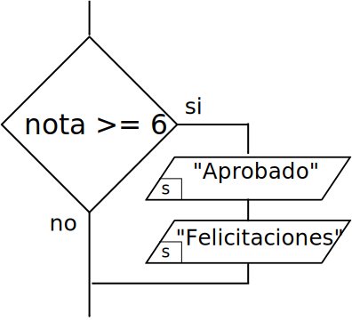
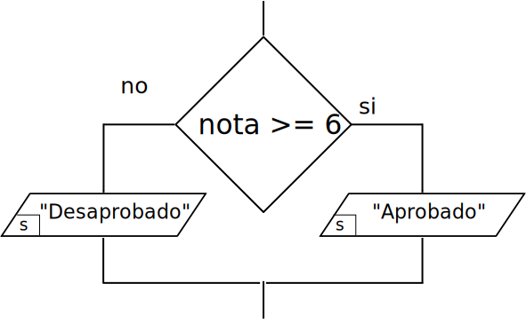
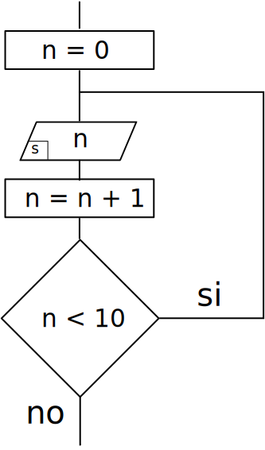
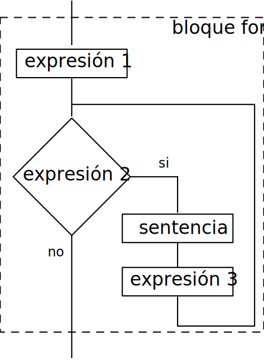

class: center, middle, inverse
<title>Unidad 5</title>

.title[Informática I]

Claudio Paz

<!-- .email[claudiojpaz@gmail.com] -->

Mayo 2025


<div style="position: absolute; left: 5%; top: 85%; height: 50%; width: 50%; padding: 1em; text-align: left;">
<input type="image" src="assets/fullscreen.png" onclick="openFullscreen()" style="height: 15%; width: 15%;">
<input type="image" src="assets/smallscreen.png" onclick="closeFullscreen()" style="height: 15%; width: 15%;">
</div>


---
class: middle, center, intermediate
.title-dark[Unidad 5]
# Control de flujo en lenguaje C

---
class: middle, center
.title-dark[Primero, algunas definiciones]
---
# Sentencias
--
count: false

Unidades _sintácticas_ de programación que expresan una acción que debe ser llevada a cabo, de las que se espera un resultado

--
count: false
 Pueden ser:
--
count: false
- Simples (las terminadas en .inline-code[;])
--
count: false
- Compuestas (simples encerradas entre .inline-code[{}])
--
count: false
- de Selección (.inline-code[if], .inline-code[if-else] y .inline-code[switch])
--
count: false
- de Repetición (.inline-code[while], .inline-code[do-while] y .inline-code[for])
--
count: false
- de Salto (.inline-code[break], .inline-code[continue], .inline-code[return] y .inline-code[~~goto~~])

---
# Expresiones
--
count: false

Es una combinación de una o más constantes, variables o funciones que se interpretan siguiendo las reglas de precedencia y devuelven un resultado

--
count: false
Pueden ser:
--
count: false
- operaciones (aritméticas, lógicas, de relación, etc.)
--
count: false
- llamados a función
--
count: false
- variables o constantes

---
# Sentencias de Selección
--
count: false
## Selección simple (`if`)
--
count: false
En lenguaje C, el condicional simple se codifica con la palabra clave `if`

--
count: false
La condición que se evalúa se coloca entre paréntesis. Puede ser cualquier expresión

--
count: false
Si la condición se evalúa verdadera se _ejecuta_ la sentencia que siguen a la condición.

--
count: false

.center[
.bigger50[
```
if ( expresión )
  sentencia
```
]
]
---
# Sentencias de Selección
## Selección simple (`if`)
--
count: false
### Ejemplo

.left-40-column[
.center[]
]
.right-column[
]
---
count: false
# Sentencias de Selección
## Selección simple (`if`)
### Ejemplo

.left-40-column[
.center[]
]
.right-column[
```C
if ( nota >= 6 ) {
  printf("Aprobado\n");
  printf("Felicitaciones\n");
}
```
]
---
# Sentencias de Selección
## Selección simple (`if`)
--
count: false
### Ejemplo

.left-40-column[
.center[]
]
.right-column[
]
---
count: false
# Sentencias de Selección
## Selección simple (`if`)
### Ejemplo

.left-40-column[
.center[]


]
.right-column[
```C
if ( nota >= 6 ) {
  printf("Aprobado\n");
}
```
]

--
count: false
.right-column[
.smaller10[
Si la sentencia compuesta tiene una sola sentencia simple podrían omitirse las llaves
]
]

--
count: false

.right-column[
```C
if ( nota >= 6 )
  printf("Aprobado\n");
  
```
]

---
# Sentencias de Selección
## Selección simple (`if`)
--
count: false
### Errores lógicos
--
count: false

En ocasiones se hacen agregados de código olvidando usar las llaves

--
count: false

```C
if ( nota >= 6 )
  printf("Aprobado\n");
```

---
# Sentencias de Selección
## Selección simple (`if`)
### Errores lógicos

En ocasiones se hacen agregados de código olvidando usar las llaves

```C
if ( nota >= 6 )
  printf("Aprobado\n");
  printf("Felicitaciones\n");
```
--
count: false

lo que causa errores lógicos

--
count: false

En el ejemplo, el programa felicita siempre, sin importar el valor de nota

---
# Sentencias de Selección
--
count: false
## Selección doble (`if-else`)

--
count: false

La sintaxis es la siguiente:

.bigger50[
        ```
        if ( expresión )
          sentencia 1
        else
          sentencia 2
        ```
]

--
count: false

Si la `expresión` devuelve algo distinto de cero, se ejecuta la `sentencia 1`.

--
count: false

Si devuelve cero, se ejecuta la  `sentencia 2`.

---
# Sentencias de Selección
--
count: false
## Selección doble (`if-else`)
--
count: false
### Ejemplo

.left-40-column[
.center[]
]
.right-60-column[
]
---
count: false
# Sentencias de Selección
## Selección doble (`if-else`)
### Ejemplo

.left-40-column[
.center[]
]
.right-60-column[
```C
if ( nota >= 6 ) {
  printf("Aprobado\n");
} else {
  printf("Desaprobado\n");
}
```
]
---
# Sentencias de Selección
--
count: false

Las sentencias _dentro_ de cada rama del `if` puede ser de cualquier tipo.

--
count: false

Si se necesita más de una sentencia por rama, deben formar una sentencia compuesta con las `{}`.

--
count: false
Se recomienda siempre usar llaves.

--
count: false

```C
if ( nota >= 6 ) {
  printf("Aprobado\n");
  if ( nota >= 9 ) {
    printf("Excelente!\n");
  }
} else {
  printf("Desaprobado\n");
}
```
---
# Volviendo a los operadores
--
count: false

## Operadores de Asignación
--
count: false

.left-column[
.bigger50[
```
a = 0;

i = i + 1;

d = d / 2;

m = m * 3;

r = r % 10;
```
]
]
--
count: false

.right-column[
.bigger50[
```
a = 0;

i += 1;

d /= 2;

m *= 3;

r %= 10;
```
]
]

---
# Operadores de incremento
--
count: false

## Pre incremento

.bigger50[
```
++i; // equivalente a i = i + 1;

--i; // equivalente a i = i - 1;
```
]
--
count: false

## Post incremento

.bigger50[
```
i++; // equivalente a i = i + 1;

i--; // equivalente a i = i - 1;
```
]

---
# Operadores de incremento
--
count: false

La diferencia entre el pre y el post incremento (o decremento) se puede ver cuando están dentro de una expresión
--
count: false

.left-column[
### Pre incremento
```C
i = 0;
printf("%d", ++i);
```
```shell
1
```
]

--
count: false

.right-column[
### Pos incremento
```C
i = 0;
printf("%d", i++);
```
```shell
0
```
]

--
count: false

En el caso del pos-incremento, se _usa_ el valor que tenía `i` para el especificador de formato del `printf` y luego se incrementa.

---
# Operadores lógicos
--
count: false

En C hay tres operadores lógicos a nivel de variables:

--
count: false
- AND ( $\&\&$ )
--
count: false
- OR ( $||$ )
--
count: false
- NOT ( $!$ )

--
count: false
Se pueden usar en cualquier expresión, aunque generalmente se usan en condicionales y sentencias repetitivas

---
# Operadores lógicos
--
count: false
### Ejemplo

.bigger50[
```
  if ( expresión 1 && expresión 2 )
    sentencia
```
]

--
count: false
La sentencia se ejecutará dependiendo del valor de las expresiones evaluadas por el operador $\&\&$

--
count: false

<div style="font-size: 80%;">
<p>
    \begin{array}{cc|c}
    \texttt{expresión 1} & \texttt{expresión 2}  &  \&\& \\\hline
    0                    & 0                     &  0 \\
    0                    & \text{distinto de }0  &  0 \\
    \text{distinto de }0 & 0                     &  0 \\
    \text{distinto de }0 & \text{distinto de }0  &  1
    \end{array}
</p>
</div>


---
# Operadores lógicos
--
count: false
### Ejemplo

.bigger50[
```
  if ( expresión 1 || expresión 2 )
    sentencia
```
]

--
count: false
En el caso de $||$ la tabla de verdad es la siguiente

--
count: false

<div style="font-size: 80%;">
<p>
    \begin{array}{cc|c}
    \texttt{expresión 1} & \texttt{expresión 2}  &  || \\\hline
    0                    & 0                     &  0 \\
    0                    & \text{distinto de }0  &  1 \\
    \text{distinto de }0 & 0                     &  1 \\
    \text{distinto de }0 & \text{distinto de }0  &  1
    \end{array}
</p>
</div>

---
# Operadores lógicos
--
count: false

El tercer operador lógico es la negación NOT ( $!$ )

--
count: false

<div style="font-size: 80%;">
<p>
    \begin{array}{c|c}
    \texttt{expresión 1} &  ! \\\hline
    0                    &  1 \\
    \text{distinto de }0 &  0
    \end{array}
</p>
</div>

---
# Precedencia de operadores (actualizada)
--
count: false

<div style="font-size: 80%;">
<p>
    \begin{array}{llll}
    \textsf{Operador}                                           &   &  & \textsf{Asociatividad} \\\hline
    ()                                                          &   &  & \textsf{Izq. a Der.} \\
    + \quad - \quad (\text{tipo}) \quad ++ \quad -- \quad !     &   &  & \textsf{Der. a Izq.} \\
    * \quad / \quad \%                                          &   &  & \textsf{Izq. a Der.} \\
    + \quad -                                                   &   &  & \textsf{Izq. a Der.} \\
    < \quad <= \quad > \quad >=                                 &   &  & \textsf{Izq. a Der.} \\
    == \quad !=                                                 &   &  & \textsf{Izq. a Der.} \\
    || \quad \&\&                                               &   &  & \textsf{Izq. a Der.} \\
    = \quad += \quad -=  \quad /= \quad *= \quad \%=            &   &  & \textsf{Der. a Izq.} \\
    \end{array}
</p>
</div>

---
# Sentencias de repetición (o iterativas)

--
count: false
## Sentencia repetitiva `while`
--
count: false

Permite repetir sentencias **mientras** se cumpla una condición


--
count: false

La sintaxis es

.bigger50[
        ```
        while (expresión)
          sentencia
        ```
]

---
# Sentencias de repetición (o iterativas)
## Sentencia repetitiva `while`
--
count: false
## Ejemplo

.left-40-column[
.center[]
]
.right-column[
]

---
count: false
# Sentencias de repetición (o iterativas)
## Sentencia repetitiva `while`
## Ejemplo

.left-40-column[
.center[]
]
.right-column[
```C
n = 0;
while ( n < 10 ) {
  printf("%d", n);
  n = n + 1;
}
```
]

---
# Sentencias de repetición (o iterativas)

--
count: false
## Sentencia repetitiva `do-while`
--
count: false

Igual que antes, permite repetir sentencias **mientras** se cumpla una condición


--
count: false

La sintaxis es

.bigger50[
        ```
        do
          sentencia
        while (expresión);
        ```
]

--
count: false
con la diferencia que las sentencias se realizan al menos una vez.

---
# Sentencias de repetición (o iterativas)
## Sentencia repetitiva `do-while`
--
count: false
## Ejemplo

.left-40-column[
.center[]
]
.right-column[
]

---
count: false
# Sentencias de repetición (o iterativas)
## Sentencia repetitiva `do-while`
## Ejemplo

.left-40-column[
.center[]
]
.right-column[
```C
n = 0;
do {
  printf("%d", n);
  n = n + 1;
} while ( n < 10 );
```
]

---
# Sentencias de repetición (o iterativas)
--
count: false
## Sentencia repetitiva `do-while`

Se usa generalmente para validar datos ingresados por el usuario

--
count: false

Las sentencias que se ejecutan al menos una vez son el `printf` que solicita el dato y el `scanf` que toma el valor ingresado

--
count: false

Si los datos ingresados están en el rango no permitido la condición debe evaluarse por verdadero

---
# Sentencias de repetición (o iterativas)
## Sentencia repetitiva `do-while`
--
count: false
## Ejemplo

El usuario debe ingresar una calificación

--
count: false
Entonces el rango permitido es desde 1 hasta 10, incluyendo a ambos

--
count: false
Entonces si se ingresa un número menor que 1 se debe solicitar un nuevo ingreso

--
count: false
Si el número es mayor a 10 también se debe solicitar un nuevo ingreso

---
# Sentencias de repetición (o iterativas)
## Sentencia repetitiva `do-while`
## Ejemplo

--
count: false

```C
do {
  printf("Ingrese la calificación (1-10): ");
  scanf("%d", &nota);
} while ( nota < 1 || nota > 10 );
```

---
# Sentencias de repetición (o iterativas)
--
count: false

# Ejemplo

--
count: false
Realizar un programa que calcule el promedio entre `n` notas ingresadas.

--
count: false

Las notas deben ser validadas, de forma que solo se acepten aquellas entre 1 y 10.

---

```C
#include <stdio.h>
// u5-notas.c

int main (void) {
  int i, n;
  int nota, notas;
  float promedio;

  printf("Cuantos registros cargará: ");
  scanf("%d", &n);

  notas = 0;
  i = 0;
  while (i < n) {
    do {
      printf("Ingrese nota %d: ", i+1);
      scanf("%d", &nota);
    } while ( nota < 1 || nota > 10 );
    notas += nota;
    i++;
  }
  promedio = (float) notas / n;

  printf("El promedio de notas es %.2f", promedio);

  return 0;
}
```


---
# Sentencias de Selección
--
count: false
## Selección múltiple (`switch`)

--
count: false

Se usa en casos donde hay muchos posibles valores para una variable con distintas acciones para cada valor.

--
count: false

Se usa en lugar de anidar múltiples `if-else`

--
count: false

Solo se pueden comparar enteros (pueden ser caracteres pero no flotantes) y solo por igualdad (no relación)

---
# Sentencias de Selección
--
count: false
## Sintaxis

.bigger25[
```
    switch (expresión) {
        case valor1:
          sentencia 1; // pueden ser muchas, no hace falta {}
          break; // opcional
        case valor2:
          sentencia 2;
          break; // opcional
        // tantos case como se quiera, mientras sean diferentes
        default:
          sentencia n;
          break; // opcional
    }
```
]

---
# Sentencias de Selección
--
count: false

Se compara la expresión (puede ser una variable, operación, etc.) con las _etiquetas_ en los **case**

--
count: false

Las etiquetas deben ser diferentes. Cuando haya una coincidencia, el flujo del programa salta hasta esa ubicación


---
# Sentencias de Selección

--
count: false

```C
i = 3;
switch (i) {
  case 1:
    printf("Primera opción\n");
    break;
  case 2:
    printf("Segunda opción\n");
    break;
  case 3:
    printf("Tercera opción\n");
    break;
  default:
    printf("Ninguna opción\n");
}
```

---
count: false
# Sentencias de Selección

```C
*i = 3;
switch (i) {
  case 1:
    printf("Primera opción\n");
    break;
  case 2:
    printf("Segunda opción\n");
    break;
  case 3:
    printf("Tercera opción\n");
    break;
  default:
    printf("Ninguna opción\n");
}
```

---
count: false
# Sentencias de Selección

```C
i = 3;
*switch (i) {
  case 1:
    printf("Primera opción\n");
    break;
  case 2:
    printf("Segunda opción\n");
    break;
  case 3:
    printf("Tercera opción\n");
    break;
  default:
    printf("Ninguna opción\n");
}
```
---
count: false
# Sentencias de Selección

```C
i = 3;
switch (i) {
* case 1:
    printf("Primera opción\n");
    break;
  case 2:
    printf("Segunda opción\n");
    break;
  case 3:
    printf("Tercera opción\n");
    break;
  default:
    printf("Ninguna opción\n");
}
```
---
count: false
# Sentencias de Selección

```C
i = 3;
switch (i) {
  case 1:
    printf("Primera opción\n");
    break;
* case 2:
    printf("Segunda opción\n");
    break;
  case 3:
    printf("Tercera opción\n");
    break;
  default:
    printf("Ninguna opción\n");
}
```
---
count: false
# Sentencias de Selección

```C
i = 3;
switch (i) {
  case 1:
    printf("Primera opción\n");
    break;
  case 2:
    printf("Segunda opción\n");
    break;
* case 3:
    printf("Tercera opción\n");
    break;
  default:
    printf("Ninguna opción\n");
}
```

---
count: false
# Sentencias de Selección

```C
i = 3;
switch (i) {
  case 1:
    printf("Primera opción\n");
    break;
  case 2:
    printf("Segunda opción\n");
    break;
  case 3:
*   printf("Tercera opción\n");
    break;
  default:
    printf("Ninguna opción\n");
}
```

---
count: false
# Sentencias de Selección

```C
i = 3;
switch (i) {
  case 1:
    printf("Primera opción\n");
    break;
  case 2:
    printf("Segunda opción\n");
    break;
  case 3:
    printf("Tercera opción\n");
*   break;
  default:
    printf("Ninguna opción\n");
}
```

---
count: false
# Sentencias de Selección

```C
i = 3;
switch (i) {
  case 1:
    printf("Primera opción\n");
    break;
  case 2:
    printf("Segunda opción\n");
    break;
  case 3:
    printf("Tercera opción\n");
    break;
  default:
    printf("Ninguna opción\n");
*}
```

---
# Sentencias de Selección
## Selección múltiple (`switch`)
--
count: false
.left-column[
### Ejemplo con `if-else`

```C
if (nota == 10) {
  printf("A\n");
} else {
  if (nota == 9) {
    printf("B\n");
  } else {
    if (nota == 8) {
      printf("C\n");
    } else {
      if (nota == 7) {
        printf("D\n");
      } else {
        printf("F\n");
      }
    }
  }
}
```
]
.right-column[
]

---
count: false
# Sentencias de Selección
## Selección múltiple (`switch`)

.left-column[
### Ejemplo con `if-else`

```C
if (nota == 10) {
  printf("A\n");
} else {
  if (nota == 9) {
    printf("B\n");
  } else {
    if (nota == 8) {
      printf("C\n");
    } else {
      if (nota == 7) {
        printf("D\n");
      } else {
        printf("F\n");
      }
    }
  }
}
```
]
.right-column[
### Ejemplo con `switch`
```C
switch (nota) {
  case 10:
    printf("A\n");
    break;
  case 9:
    printf("B\n");
    break;
  case 8:
    printf("C\n");
    break;
  case 7:
    printf("D\n");
    break;
  default:
    printf("F\n");
    break;
}
```
]

---
# Sentencias de repetición (o iterativas)
--
count: false
## Sentencia repetitiva `for`
--
count: false

.left-60-column[
Tiene un funcionamiento semejante al `while` controlado por contador
]

--
count: false

.right-40-column[
.left[]
]

--
count: false
.left-60-column[
La `expresión 1` se ejecuta una vez, al principio
]

---
count: false
# Sentencias de repetición (o iterativas)
## Sentencia repetitiva `for`

.left-60-column[
Tiene un funcionamiento semejante al `while` controlado por contador
]

.right-40-column[
.left[]
]

--
count: false
.left-60-column[
La `expresión 2` sirve de condición para repetir el ciclo
]
--
count: false
.left-60-column[
Se evalúa todos los ciclos
]

---
count: false
# Sentencias de repetición (o iterativas)
## Sentencia repetitiva `for`

.left-60-column[
Tiene un funcionamiento semejante al `while` controlado por contador
]

.right-40-column[
.left[]
]

--
count: false
.left-60-column[
La `sentencia` puede ser simple, compuesta, condicional o iterativa.
]
--
count: false
.left-60-column[
Se ejecuta todos los ciclos
]

---
count: false
# Sentencias de repetición (o iterativas)
## Sentencia repetitiva `for`

.left-60-column[
Tiene un funcionamiento semejante al `while` controlado por contador
]

.right-40-column[
.left[]
]

--
count: false
.left-60-column[
La `expresión 3` se ejecuta todos los ciclos al finalizar la `sentencia`
]

---
# Sentencias de repetición (o iterativas)
## Sentencia repetitiva `for`
--
count: false

.bigger50[
```
for ( expresión 1; expresión 2; expresión 3 )
  sentencia
```
]

--
count: false

Las expresiones son opcionales

--
count: false

Si falta la `expresión 2` se considera que la condición es verdad y el bucle continúa indefinidamente

---
# Sentencias de repetición (o iterativas)
## Sentencia repetitiva `for`
--
count: false

```C
for ( i = 0; i < 5; i++ )
  printf("vuelta %d\n", i);
```
--
count: false
```shell
vuelta 0
vuelta 1
vuelta 2
vuelta 3
vuelta 4
```

---
# Sentencias de repetición (o iterativas)
## Sentencia repetitiva `for`
--
count: false

A partir del estándar C99 se puede declarar la variable de control en la `expresión 1`

--
count: false

```C
#include <stdio.h>
// u5-for-init-1.c

int main (void) {

  for ( int i = 0; i < 10 ; i++ ) {
    printf("%d\n", i);
  }

  return 0;
}
```
---
# Sentencias de repetición (o iterativas)
## Sentencia repetitiva `for`
--
count: false

Pero la variable solo existe en el bloque del `for`

--
count: false

.smaller10[
```C
#include <stdio.h>
// u5-for-init-2.c

int main (void) {

  for ( int i = 0; i < 10 ; i++ ) {
    printf("%d\n", i);
  }
  printf("%d\n", i);

  return 0;
}
```
]

--
count: false
.smaller10[
```shell
$ gcc -Wall -std=c99 -pedantic-errors u5-for-init-2.c
u5-for-init-2.c: In function ‘main’:
u5-for-init-2.c:9:18: error: ‘i’ undeclared (first use in this function)
   printf("%d\n", i);
                  ^
```
]


---
# Sentencias break y continue
--
count: false

`break` y `continue` son sentencias de salto, que se pueden usar dentro de estructuras repetitivas (`while`, `do-while` y `for`) o dentro de la sentencia `switch`

--
count: false

`break` interrumpe la ejecución de la estructura en la que se encuentra

--
count: false

En el caso de estructuras repetitivas se usa con condicionales

---
# Sentencias break y continue
--
count: false

```C
#include <stdio.h>
// u5-for-break.c

int main (void) {
  int nota, suma = 0;
  int i;

  printf("Ingrese 10 calificaciones, o 0 para terminar\n");
  for (i = 0; i < 10; i++) {
    do {
      printf("Ingrese la calificación %d: ", i+1);
      scanf("%d", &nota);
    } while (nota < 0 || nota > 10);

    if (nota == 0) {
      break;
    }

    suma += nota;
  }

  printf("El promedio es %.2f\n", (float) suma / i);

  return 0;
}
```
---
count: false
# Sentencias break y continue

```C
#include <stdio.h>
// u5-for-break.c

int main (void) {
  int nota, suma = 0;
  int i;

  printf("Ingrese 10 calificaciones, o 0 para terminar\n");
  for (i = 0; i < 10; i++) {
    do {
      printf("Ingrese la calificación %d: ", i+1);
      scanf("%d", &nota);
    } while (nota < 0 || nota > 10);

*   if (nota == 0) {
*     break;
*   }

    suma += nota;
  }

  printf("El promedio es %.2f\n", (float) suma / i);

  return 0;
}
```

---
count: false
# Sentencias break y continue

```C
#include <stdio.h>
// u5-for-break.c

int main (void) {
  int nota, suma = 0;
  int i;

  printf("Ingrese 10 calificaciones, o 0 para terminar\n");
  for (i = 0; i < 10; i++) {
    do {
      printf("Ingrese la calificación %d: ", i+1);
      scanf("%d", &nota);
    } while (nota < 0 || nota > 10);

*   if (nota == 0)
*     break;
*

    suma += nota;
  }

  printf("El promedio es %.2f\n", (float) suma / i);

  return 0;
}
```

---
# Sentencias break y continue
--
count: false

La sentencia `continue` interrumpe la ejecución del ciclo **actual** pero continúa con el siguiente

--
count: false

```C
#include <stdio.h>
// u5-for-continue.c

int main (void) {
  for (int i = 0; i < 10; i++) {
    if (i == 3) {
      continue;
    }
    printf("%d  ", i);
  }

  return 0;
}
```
--
count: false

```sh
0  1  2  4  5  6  7  8  9
```

---
count: false
# Sentencias break y continue

La sentencia `continue` interrumpe la ejecución del ciclo **actual** pero continúa con el siguiente

```C
#include <stdio.h>
// u5-for-continue.c

int main (void) {
  for (int i = 0; i < 10; i++) {
*   if (i == 3) {
*     continue;
*   }
    printf("%d  ", i);
  }

  return 0;
}
```

```sh
0  1  2  4  5  6  7  8  9
```

---
count: false
# Sentencias break y continue

La sentencia `continue` interrumpe la ejecución del ciclo **actual** pero continúa con el siguiente

```C
#include <stdio.h>
// u5-for-continue.c

int main (void) {
  for (int i = 0; i < 10; i++) {
*   if (i == 3)
*     continue;
*
    printf("%d  ", i);
  }

  return 0;
}
```

```sh
0  1  2  4  5  6  7  8  9
```
---
# Directivas de preprocesador
--
count: false

Antes de la compilación propiamente dicha. Se comienza la línea con `#`

* `include`
* `define`
* `ifdef`
* `ifndef`
* `else`
* `elif`
* `endif`
* `defined` (ojo que no se comienza con esta palabra)
* etc.

---
# `define`
--
count: false

Sirve para crear _constantes simbólicas_

--
count: false

.bigger50[
```
#define  identificador  reemplazo
```
]

--
count: false

Antes de la compilación, el preprocesador reemplaza todas las coincidencias con el identificador por el texto de reemplazo

--
count: false

**NO** se usa punto y coma (;), no es una sentencia

--
count: false

**NO** se usa el igual (=), no es asignación

---
# `define`
--
count: false

.bigger50[
```C
#include <stdio.h>

#define PI 3.141592

int main (void) {

  printf("%.4f\n", PI);

  return 0;
}
```
]

--
count: false

.bigger50[
```sh
3.1416
```
]

---
# `define`
--
count: false

No confundir las constantes simbólicas con variables.

--
count: false

Es texto que se reemplaza. Cuando el compilador lo compila no diferencia si fue agredado en la edición o en el preprocesamiento

--
count: false

No se pueden hacer asignaciones y cambiar su valor

---
# `define`
--
count: false
## Ejemplo

.bigger50[
```C
#include <stdio.h>

#define MSG "Hola, mundo!\n"

int main (void) {

  printf(MSG);

  return 0;
}
```
]

--
count: false

.bigger50[
```sh
Hola, mundo!
```
]

---
# Compilación condicional

--
count: false


