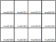
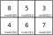
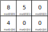
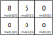
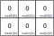
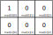

class: center, middle, inverse
<title>Unidad 7</title>

.title[Informática I]

Claudio Paz

<!-- .email[claudiojpaz@gmail.com] -->

Agosto 2023


<div style="position: absolute; left: 5%; top: 85%; height: 50%; width: 50%; padding: 1em; text-align: left;">
<input type="image" src="assets/fullscreen.png" onclick="openFullscreen()" style="height: 15%; width: 15%;">
<input type="image" src="assets/smallscreen.png" onclick="closeFullscreen()" style="height: 15%; width: 15%;">
</div>

---
class: middle, center, intermediate
.title-dark[Unidad 7]
# Arreglos en lenguaje C

---
# Arreglos

--
count: false

.left-column[
]
.right-column[
.center[]
]
---
count: false

# Arreglos

.left-column[
Los arreglos son un conjunto de posiciones de memoria contiguos, en donde se pueden almacenar valores del mismo tipo.
]
.right-column[
.center[]
]

---
count: false

# Arreglos

.left-column[
]
.right-column[
.center[]
]

---
count: false

# Arreglos

.left-column[
Tienen un nombre que debe respetar las características de los identificadores.
]
.right-column[
.center[]
]

---
count: false

# Arreglos

.left-column[
]
.right-column[
.center[]
]

---
count: false

# Arreglos

.left-column[
Se puede acceder a cada valor mediante el nombre y el índice entre corchetes.
]
.right-column[
.center[]
]
--
count: false

.left-column[
Ej.
.bigger25[
```C
vec[3] = 15;
```
]
]

---
count: false

# Arreglos

.left-column[
]
.right-column[
.center[]
]

---
count: false

# Arreglos

.left-column[
El índice puede ser una variable o cualquier expresión
]
.right-column[
.center[]
]
--
count: false

.left-column[
Ej.
.bigger25[
```C
for (int i = 0; i < 7; i++)
  printf("%d\n", vec[i]);
```
]
]

--
count: false

El primer elemento **siempre** es el de índice 0 (cero)

---
# Arreglos
--
count: false
## Definición
--
count: false
.bigger50[
```
tipo identificador[tamaño];
```
]

--
count: false
`tipo` se refiere a cualquier tipo de dato (.inline-code[.green[int]], .inline-code[.green[char]], .inline-code[.green[float]], etc.).

--
count: false
`identificador` es el nombre que se usará para acceder a los elementos del arreglo. Debe cumplir los requisitos de cualquier identificador.

--
count: false
`tamaño` es una **constante** que indica cuantos elementos tendrá el arreglo.

---
# Arreglos
## Definición

--
count: false

Ejemplo:

.bigger50[
```C
int vec[100];
```
]

--
count: false
Esto define un arreglo llamado `vec` de 100 enteros.

--
count: false

El estándar c99 determina que el tamaño máximo debe ser al menos 65536 elementos...

--
count: false
...pero el verdadero tamaño máximo depende de diversos factores relacionados a la memoria del programa (se verán más adelante en la carrera)

---
# Arreglos

--
count: false

```C
#include <stdio.h>

int main (void) {
  int i;
  int vec[5];

  for ( i = 0; i < 5; i++ )
    vec[i] = 0;

  for ( i = 0; i < 5; i++ )
    printf("%d\n", vec[i]);

  return 0;
}
```
--
count: false

Si eventualmente se necesita un arreglo más grande, hay que cambiar el tamaño del arreglo...

---
count: false
# Arreglos

```C
#include <stdio.h>

int main (void) {
  int i;
* int vec[5];

  for ( i = 0; i < 5; i++ )
    vec[i] = 0;

  for ( i = 0; i < 5; i++ )
    printf("%d\n", vec[i]);

  return 0;
}
```

Si eventualmente se necesita un arreglo más grande, hay que cambiar el tamaño del arreglo...

---
count: false
# Arreglos

```C
#include <stdio.h>

int main (void) {
  int i;
* int vec[10];

  for ( i = 0; i < 5; i++ )
    vec[i] = 0;

  for ( i = 0; i < 5; i++ )
    printf("%d\n", vec[i]);

  return 0;
}
```

Si eventualmente se necesita un arreglo más grande, hay que cambiar el tamaño del arreglo...
--
count: false

...y el control de las sentencias repetitivas

---
count: false
# Arreglos

```C
#include <stdio.h>

int main (void) {
  int i;
* int vec[10];

* for ( i = 0; i < 5; i++ )
    vec[i] = 0;

* for ( i = 0; i < 5; i++ )
    printf("%d\n", vec[i]);

  return 0;
}
```

Si eventualmente se necesita un arreglo más grande, hay que cambiar el tamaño del arreglo...

...y el control de las sentencias repetitivas

---
count: false
# Arreglos

```C
#include <stdio.h>

int main (void) {
  int i;
* int vec[10];

* for ( i = 0; i < 10; i++ )
    vec[i] = 0;

* for ( i = 0; i < 10; i++ )
    printf("%d\n", vec[i]);

  return 0;
}
```

Si eventualmente se necesita un arreglo más grande, hay que cambiar el tamaño del arreglo...

...y el control de las sentencias repetitivas


---
# Arreglos

--
count: false

Si el programa tiene gran extensión, hacer estos cambios puede llevar a cometer errores...

--
count: false

Para evitarlos se puede utilizar la directiva de preprocesador `#define`

---
# Preprocesador

--
count: false

## Directiva `#define`
--
count: false

Se utiliza para **definir** _constantes simbólicas_

--
count: false

```C
#include <stdio.h>
#define N 5

int main (void) {
  int i;
  int vec[N];

  for ( i = 0; i < N; i++ )
    vec[i] = 0;

  for ( i = 0; i < N; i++ )
    printf("%d\n", vec[i]);

  return 0;
}
```

---

# Preprocesador
## Directiva `#define`
--
count: false

**Antes** de la compilación, el preprocesador _reemplaza_ todas las constantes simbólicas por el valor que corresponde.

--
count: false

Los nombres de las constantes deben respetar las características de los identificadores, y se recomienda el uso de mayúsculas.

--
count: false

No deben usarse los punto y coma (`;`) en las directivas `#define` ya que luego, cuando se hagan los reemplazos podría haber errores de sintaxis.

---
# Arreglos
--
count: false
## Inicialización
--
count: false

Así como las variables comunes se podían inicializar en la definición

--
count: false

.bigger50[
```C
int var = 3;
```
]

--
count: false

Los arreglos se pueden inicializar en la definición elemento por elemento usando llaves

--
count: false

.bigger50[
```C
int vec[5] = {3, 5, 2, 10, 4};
```
]
---
# Arreglos
## Inicialización
--
count: false

Los elementos entre llaves se asignarán en orden desde el índice cero.

--
count: false

.left-60-column[
.bigger25[
```C
int vec[5] = {3, 5, 2, 10, 4};
```
]
]

--
count: false

.right-40-column[
.center[]
]

---
count: false
# Arreglos
## Inicialización

Los elementos entre llaves se asignarán en orden desde el índice cero.

.left-60-column[
.bigger25[
```c
int vec[5] = {3, 5, 2, 10, 4};
```
]
]

.right-40-column[
.center[]
]

---
# Arreglos
## Inicialización
--
count: false

Si los valores para inicializar son **menos** que el tamaño del arreglo, el resto de los elementos son inicializados en cero

--
count: false

.left-60-column[
.bigger25[
```c
int vec[5] = {3, 5, 2};
```
]
]
--
count: false

.right-40-column[
.center[]
]

---
count: false
# Arreglos
## Inicialización

Si los valores para inicializar son **menos** que el tamaño del arreglo, el resto de los elementos son inicializados en cero

.left-60-column[
.bigger25[
```c
int vec[5] = {3, 5, 2};
```
]
]

.right-40-column[
.center[]
]
---
# Arreglos
## Inicialización
--
count: false

Si los valores para inicializar son **más** que el tamaño del arreglo, el compilador da un `error` o `warning` dependiendo de si está la opción `--pedantic-errors`

--
count: false

.left-60-column[
.bigger25[
```c
int vec[5] = {3, 5, 2, 10, 4, 6};
```
]
]

--
count: false
.right-40-column[
.center[]
]


---
# Arreglos
## Inicialización
--
count: false

Se puede inicializar **todo** el arreglo poniendo entre llaves un número cero

--
count: false

.bigger50[
```c
int vec[5] = {0};
```
]
--
count: false

Estrictamente hablando de esta forma se inicializa el primer elemento en cero, y el resto de los elementos en cero.

---
# Arreglos
## Inicialización
--
count: false

Se puede omitir el tamaño entre los corchetes, siempre y cuando se usen las llaves para inicializar.

--
count: false

.bigger50[
```c
int vec[] = {3, 5, 2, 10, 4};
```
]

--
count: false

...pero el tamaño del arreglo siempre corresponderá a la cantidad de elementos inicializados entre llaves

---
# Arreglos
## Inicialización
--
count: false

Si se omiten tanto el tamaño entre corchetes como los inicializadores el compilador da error

--
count: false

.bigger50[
```c
int vec[];
```
]
--
count: false

.bigger50[
```shell
error: array size missing in ‘vec’
   int vec[];
       ^~~
```
]

---
# Arreglos
## Arreglos de 2 Dimensiones

--
count: false

En C se pueden definir arreglos multidimensionales

--
count: false

.bigger50[
```C
int mat[3][4];
```
]

--
count: false

El número entre corchetes a la izquierda determina la cantidad de filas.

--
count: false

El número entre corchetes a la derecha determina la cantidad de columnas.

---
# Arreglos
## Arreglos de 2 Dimensiones
--
count: false

.center[]

--
count: false

Para acceder a cualquier elemento hay que utilizar los índices de filas y columnas.

---
# Arreglos
## Arreglos de 2 Dimensiones - Inicialización

--
count: false

Como los arreglos de 1 dimensión, se utilizan llaves por cada fila y todas las filas también entre llaves.

--
count: false

.bigger25[
```C
int mat[2][3] = {{8,5,3},{4,6,7}};
```
]

--
count: false

.center[]

---
# Arreglos
## Arreglos de 2 Dimensiones - Inicialización

--
count: false

Se pueden inicializar de forma incompleta, donde los elementos faltantes se ponen en cero.

--
count: false

.bigger50[
```C
int mat[2][3] = {{8,5},{4}};
```
]

--
count: false

.center[]

---
# Arreglos
## Arreglos de 2 Dimensiones - Inicialización

--
count: false

...incluso pueden faltar filas.

--
count: false

.bigger50[
```C
int mat[2][3] = {{8,5}};
```
]

--
count: false

.center[]

---
# Arreglos
## Arreglos de 2 Dimensiones - Inicialización

--
count: false

O todos los elementos, salvo el primero. Sirve para inicializar en cero todo el arreglo.

--
count: false

.bigger50[
```C
int mat[2][3] = {{0}};
```
]

--
count: false

.center[]

---
# Arreglos
## Arreglos de 2 Dimensiones - Inicialización

--
count: false

Se pueden omitir un par de llaves en el caso de ser cero...

--
count: false

.bigger50[
```C
int mat[2][3] = {0};
```
]

--
count: false

.center[]

---
# Arreglos
## Arreglos de 2 Dimensiones - Inicialización

--
count: false

...pero da un .orange[`warning`] si se usa otro número

--
count: false

.bigger50[
```C
int mat[2][3] = {1};
```
]
.bigger50[
```shell
warning: missing braces around initializer
    int mat[2][3] = {1};
                    ^
```
]

---
# Arreglos
## Arreglos de 2 Dimensiones - Inicialización

--
count: false

...de todas formas la inicialización es la esperada (pero no hay que dejar pasar los `warnings`)

--
count: false

.bigger50[
```C
int mat[2][3] = {1};
```
]

--
count: false

.center[]


---
# Arreglos
## Arreglos de 2 Dimensiones - Acceso

--
count: false

.bigger25[
```C
int mat[3][3] = {0};

mat[1][1] = 1;

for (int i = 0; i < 3; i++ ) {
  for (int j = 0; j < 3; j++ )
    printf("%d ", mat[i][j]);
  printf("\n");
}
```
]

.bigger25[
```bash
0 0 0
0 1 0
0 0 0
```
]

---
--
count: false

.bigger25[
```C
#include <stdio.h>

#define N 3

int main (void) {
  int i,j;
  int mat[3][3] = {0};

  for (int i = 0; i < N; i++ )
    for (int j = 0; j < N; j++ ) {
      printf("Ingrese el elemento (%d,%d): ", i, j);
      scanf("%d", &mat[i][j]);
    }

  for ( i = 0; i < N; i++ ) {
    for ( j = 0; j < N; j++ )
      printf("%d ", mat[i][j]);
    printf("\n");
  }
  return 0;
}

```
]

---
--
count: false

.bigger25[
```C
#include <stdio.h>

#define N 3

int main (void) {
  int i,j;
  int mat[3][3] = {0};

  for (int i = 0; i < N; i++ )
    for (int j = 0; j < N; j++ )
      if (i == j)
        mat[i][j] = 1;

  for ( i = 0; i < N; i++ ) {
    for ( j = 0; j < N; j++ )
      printf("%d ", mat[i][j]);
    printf("\n");
  }
  return 0;
}
```
]


---
--
count: false

.bigger25[
```C
#include <stdio.h>

#define N 3

int main (void) {
  int i,j;
  int mat[3][3] = {0};

  for (int i = 0; i < N; i++ )
    mat[i][i] = 1;

  for ( i = 0; i < N; i++ ) {
    for ( j = 0; j < N; j++ )
      printf("%d ", mat[i][j]);
    printf("\n");
  }
  return 0;
}
```
]

---

class: middle, center, intermediate
.title-dark[Algoritmos]


---
# Intercambio

--
count: false

Para intercambiar dos elementos cualesquiera de un arreglo, hay que usar una variable temporal para no perder uno de los valores

--
count: false
.left-column[
```C
#include <stdio.h>
// u6-swap-1.c

int main (void) {
  int arreglo[5] = {90,10,20,30,0};
  int tmp;

  tmp = arreglo[0];
  arreglo[0] = arreglo[4];
  arreglo[4] = tmp;

  for (int i = 0; i < 5; i++)
    printf("%d\n", arreglo[i]);

  return 0;
}
```
]

---
count: false
# Intercambio


Para intercambiar dos elementos cualesquiera de un arreglo, hay que usar una variable temporal para no perder uno de los valores

.left-column[
```C
#include <stdio.h>
// u6-swap-1.c

int main (void) {
  int arreglo[5] = {90,10,20,30,0};
  int tmp;

  tmp = arreglo[0];
  arreglo[0] = arreglo[4];
  arreglo[4] = tmp;

  for (int i = 0; i < 5; i++)
    printf("%d\n", arreglo[i]);

  return 0;
}
```
]

.right-column[
primero hay que salvar uno de los valores
]

---
count: false
# Intercambio


Para intercambiar dos elementos cualesquiera de un arreglo, hay que usar una variable temporal para no perder uno de los valores

.left-column[
```C
#include <stdio.h>
// u6-swap-1.c

int main (void) {
  int arreglo[5] = {90,10,20,30,0};
  int tmp;

* tmp = arreglo[0];
  arreglo[0] = arreglo[4];
  arreglo[4] = tmp;

  for (int i = 0; i < 5; i++)
    printf("%d\n", arreglo[i]);

  return 0;
}
```
]

.right-column[
primero hay que salvar uno de los valores
]

---
count: false
# Intercambio


Para intercambiar dos elementos cualesquiera de un arreglo, hay que usar una variable temporal para no perder uno de los valores

.left-column[
```C
#include <stdio.h>
// u6-swap-1.c

int main (void) {
  int arreglo[5] = {90,10,20,30,0};
  int tmp;

  tmp = arreglo[0];
  arreglo[0] = arreglo[4];
  arreglo[4] = tmp;

  for (int i = 0; i < 5; i++)
    printf("%d\n", arreglo[i]);

  return 0;
}
```
]

.right-column[
luego se puede **pisar** el elemento que contenía el valor salvado usando el nuevo elemento
]

---
count: false
# Intercambio


Para intercambiar dos elementos cualesquiera de un arreglo, hay que usar una variable temporal para no perder uno de los valores

.left-column[
```C
#include <stdio.h>
// u6-swap-1.c

int main (void) {
  int arreglo[5] = {90,10,20,30,0};
  int tmp;

  tmp = arreglo[0];
* arreglo[0] = arreglo[4];
  arreglo[4] = tmp;

  for (int i = 0; i < 5; i++)
    printf("%d\n", arreglo[i]);

  return 0;
}
```
]

.right-column[
luego se puede **pisar** el elemento que contenía el valor salvado usando el nuevo elemento
]

---
count: false
# Intercambio


Para intercambiar dos elementos cualesquiera de un arreglo, hay que usar una variable temporal para no perder uno de los valores

.left-column[
```C
#include <stdio.h>
// u6-swap-1.c

int main (void) {
  int arreglo[5] = {90,10,20,30,0};
  int tmp;

  tmp = arreglo[0];
  arreglo[0] = arreglo[4];
  arreglo[4] = tmp;

  for (int i = 0; i < 5; i++)
    printf("%d\n", arreglo[i]);

  return 0;
}
```
]

.right-column[
Finalmente, se recupera el valor salvado en la variable temporal colocandolo en la otra variable
]


---
count: false
# Intercambio


Para intercambiar dos elementos cualesquiera de un arreglo, hay que usar una variable temporal para no perder uno de los valores

.left-column[
```C
#include <stdio.h>
// u6-swap-1.c

int main (void) {
  int arreglo[5] = {90,10,20,30,0};
  int tmp;

  tmp = arreglo[0];
  arreglo[0] = arreglo[4];
* arreglo[4] = tmp;

  for (int i = 0; i < 5; i++)
    printf("%d\n", arreglo[i]);

  return 0;
}
```
]

.right-column[
Finalmente, se recupera el valor salvado en la variable temporal colocandolo en la otra variable
]

---
# Búsqueda lineal o secuencial
--
count: false

Es un método para encontrar un valor en un arreglo

--
count: false

Por ejemplo, encontrar un máximo o un mínimo

--
count: false

.left-column[
```C
#include <stdio.h>
// u6-max-1.c

int main (void) {
  int arreglo[5] = {4,1,6,5,3};
  int max;

  max = arreglo[0];
  for (int i = 1; i < 5; i++)
    if (arreglo[i] > max)
      max = arreglo[i];

  printf("máximo = %d\n", max);

  return 0;
}
```
]

---
count: false
# Búsqueda lineal o secuencial

Es un método para encontrar un valor en un arreglo

Por ejemplo, encontrar un máximo o un mínimo

.left-column[
```C
#include <stdio.h>
// u6-max-1.c

int main (void) {
  int arreglo[5] = {4,1,6,5,3};
  int max;

  max = arreglo[0];
  for (int i = 1; i < 5; i++)
    if (arreglo[i] > max)
      max = arreglo[i];

  printf("máximo = %d\n", max);

  return 0;
}
```
]

.right-column[
Primero, se inicializa la variable `max` con el primer elemento del arreglo
]

---
count: false
# Búsqueda lineal o secuencial

Es un método para encontrar un valor en un arreglo

Por ejemplo, encontrar un máximo o un mínimo

.left-column[
```C
#include <stdio.h>
// u6-max-1.c

int main (void) {
  int arreglo[5] = {4,1,6,5,3};
  int max;

* max = arreglo[0];
  for (int i = 1; i < 5; i++)
    if (arreglo[i] > max)
      max = arreglo[i];

  printf("máximo = %d\n", max);

  return 0;
}
```
]

.right-column[
Primero, se inicializa la variable `max` con el primer elemento del arreglo
]

---
count: false
# Búsqueda lineal o secuencial

Es un método para encontrar un valor en un arreglo

Por ejemplo, encontrar un máximo o un mínimo

.left-column[
```C
#include <stdio.h>
// u6-max-1.c

int main (void) {
  int arreglo[5] = {4,1,6,5,3};
  int max;

  max = arreglo[0];
  for (int i = 1; i < 5; i++)
    if (arreglo[i] > max)
      max = arreglo[i];

  printf("máximo = %d\n", max);

  return 0;
}
```
]

.right-column[
Luego se recorre el arreglo buscando algún valor que supere a `max`
]

---
count: false
# Búsqueda lineal o secuencial

Es un método para encontrar un valor en un arreglo

Por ejemplo, encontrar un máximo o un mínimo

.left-column[
```C
#include <stdio.h>
// u6-max-1.c

int main (void) {
  int arreglo[5] = {4,1,6,5,3};
  int max;

  max = arreglo[0];
* for (int i = 1; i < 5; i++)
*   if (arreglo[i] > max)
      max = arreglo[i];

  printf("máximo = %d\n", max);

  return 0;
}
```
]

.right-column[
Luego se recorre el arreglo buscando algún valor que supere a `max`
]

---
count: false
# Búsqueda lineal o secuencial

Es un método para encontrar un valor en un arreglo

Por ejemplo, encontrar un máximo o un mínimo

.left-column[
```C
#include <stdio.h>
// u6-max-1.c

int main (void) {
  int arreglo[5] = {4,1,6,5,3};
  int max;

  max = arreglo[0];
  for (int i = 1; i < 5; i++)
    if (arreglo[i] > max)
      max = arreglo[i];

  printf("máximo = %d\n", max);

  return 0;
}
```
]

.right-column[
Cuando se lo encuentra se actualiza `max`
]

---
count: false
# Búsqueda lineal o secuencial

Es un método para encontrar un valor en un arreglo

Por ejemplo, encontrar un máximo o un mínimo

.left-column[
```C
#include <stdio.h>
// u6-max-1.c

int main (void) {
  int arreglo[5] = {4,1,6,5,3};
  int max;

  max = arreglo[0];
  for (int i = 1; i < 5; i++)
    if (arreglo[i] > max)
*     max = arreglo[i];

  printf("máximo = %d\n", max);

  return 0;
}
```
]

.right-column[
Cuando se lo encuentra se actualiza `max`
]


---
count: false
# Búsqueda lineal o secuencial

Es un método para encontrar un valor en un arreglo

Por ejemplo, encontrar un máximo o un mínimo

.left-column[
```C
#include <stdio.h>
// u6-max-1.c

int main (void) {
  int arreglo[5] = {4,1,6,5,3};
  int max;

  max = arreglo[0];
  for (int i = 1; i < 5; i++)
    if (arreglo[i] > max)
      max = arreglo[i];

  printf("máximo = %d\n", max);

  return 0;
}
```
]

.right-column[
En este caso, al final del bucle, la variable `max` almacena el máximo **valor** (y puede se mostrar)
]

---
count: false
# Búsqueda lineal o secuencial

Es un método para encontrar un valor en un arreglo

Por ejemplo, encontrar un máximo o un mínimo

.left-column[
```C
#include <stdio.h>
// u6-max-1.c

int main (void) {
  int arreglo[5] = {4,1,6,5,3};
  int max;

  max = arreglo[0];
  for (int i = 1; i < 5; i++)
    if (arreglo[i] > max)
      max = arreglo[i];

* printf("máximo = %d\n", max);

  return 0;
}
```
]

.right-column[
En este caso, al final del bucle, la variable `max` almacena el máximo **valor** (y puede se mostrar)
]


---
# Ordenamiento. Método de la burbuja
--
count: false

Consiste en comparar cada elemento con el siguiente e intercambiarlos si corresponde según el criterio de ordenamiento

--
count: false

Por ejemplo, si se propone ordenar de menor a mayor el siguiente arreglo
```C
  int arreglo[5] = {4,1,6,5,3};
```


