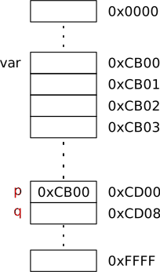
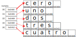
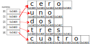

class: center, middle, inverse, no-number
<title>Unidad 8</title>

.title[Informática I]

Claudio Paz

<!-- .email[claudiojpaz@gmail.com] -->

Agosto 2025


<div style="position: absolute; left: 5%; top: 85%; height: 50%; width: 50%; padding: 1em; text-align: left;">
<input type="image" src="assets/fullscreen.png" onclick="openFullscreen()" style="height: 15%; width: 15%;">
<input type="image" src="assets/smallscreen.png" onclick="closeFullscreen()" style="height: 15%; width: 15%;">
</div>

---
class: middle, center, intermediate, no-number
.title-dark[Unidad 8]
# Punteros en lenguaje C
---
# Concepto de puntero
--
count: false

Los punteros son variables, y como tales tienen nombre, tipo, valor y una dirección donde almacena ese valor

--
count: false

Lo particular que tienen los punteros es que el valor, es una dirección de memoria correspondiente a otra variable

--
count: false

Como todas las variables, antes de usarse deben definirse

--
count: false

Solo puede tener tres tipos de valores: 0, NULL o una _dirección de memoria_

---
# Concepto de dirección
--
count: false

.right-column[

]

---
count: false
# Concepto de dirección

.left-column[
Se dice que los punteros **"apuntan"** a una variable cuando su valor es la posición de memoria de esa variable
]
.right-column[

]

---
count: false
# Concepto de dirección

.left-column[
Se dice que los punteros **"apuntan"** a una variable cuando su valor es la posición de memoria de esa variable
]
.right-column[

]

---
count: false
# Concepto de dirección

.left-column[
Se dice que los punteros **"apuntan"** a una variable cuando su valor es la posición de memoria de esa variable

En el ejemplo se dice que .red[`p`] apunta a `var`
]
.right-column[

]

---
count: false
# Concepto de dirección

.footnote[.left[.smaller50[en los _gráficos de memoria_ usaremos letras .red[rojas] para diferenciar punteros de variables comunes]]]

.left-column[
Se dice que los punteros **"apuntan"** a una variable cuando su valor es la posición de memoria de esa variable

En el ejemplo se dice que .red[`p`] apunta a `var`
]
.right-column[

]


---
# Declaración de punteros
--
count: false

.right-column[

]

---
count: false
# Declaración de punteros

.left-column[
```C
int var;
```
]
.right-column[

]

---
count: false
# Declaración de punteros

.left-column[
```C
int var;
```
]
.right-column[

]

---
count: false
# Declaración de punteros

.left-column[
```C
int var;
int *p;
```
]
.right-column[

]

---
count: false
# Declaración de punteros

.left-column[
```C
int var;
int *p;
```
]
.right-column[

]

--
count: false

Para declarar un puntero se usa un asterisco (\*) delante del nombre de la variable (o sea el puntero)

--
count: false

El tipo (en este caso `int`) significa que apunta a una variable que es de tipo `int`

---
# Declaración de punteros

.left-column[
```C
int var;
int *p;
```
]
.right-column[

]

--
count: false

Los punteros pueden ser de cualquier tipo

--
count: false

Siempre deben apuntar a variables del mismo tipo al que fueron declarados

---
# Declaración de punteros
--
count: false

.left-column[
]
.right-column[

]

---
count: false
# Declaración de punteros

.left-column[
```C
char var;
```
]
.right-column[

]


---
count: false
# Declaración de punteros

.left-column[
```C
char var;
char *p, *q;
```
]
.right-column[

]
--
count: false

Cuando se declaran dos o más punteros en una misma sentencia, cada nombre debe llevar su asterisco

---
# Declaración de punteros

.left-column[
```C
char var;
char *p, *q;
```
]
.right-column[

]
---
count: false
# Declaración de punteros

.left-column[
```C
char var;
char *p, q;
```
]
.right-column[

]
--
count: false

En este caso, `p` es un puntero a `char`, pero `q` es simplemente un `char`

---
# Operador de dirección (`&`)
--
count: false

.left-column[
```C
char var;
char *p;
```
]
.right-column[

]

---
count: false
# Operador de dirección (`&`)

.left-column[
```C
char var;
char *p;

p = &var;
```
]
.right-column[

]

---
count: false
# Operador de dirección (`&`)

.left-column[
```C
char var;
char *p;

p = &var;
```
]
.right-column[

]
--
count: false

El _operador de dirección_ también llamado _operador de referencia_ es un operador unario  
 (`&` ampersan), que se coloca delante de una variable y devuelve la dirección de la misma

---
count: false
# Operador de dirección (`&`)

.left-column[
```C
char var;
char *p;

p = &var;
```
]
.right-column[

]

El _operador de dirección_ también llamado _operador de referencia_ es un operador unario  
 (`&` ampersan), que se coloca delante de una variable y devuelve la dirección de la misma

---
# Operador de dirección (`&`)

.left-column[
```C
char var;
char *p;

p = &var;
```
]
.right-column[

]

--
count: false

Independientemente de que `var` tenga asignado o no un valor, el puntero _apunta_ a esa posición de memoria, y se puede acceder a la misma para leer o cargar valores

---
# Operador de desreferencia (`*`)
--
count: false

.left-column[
```C
 char var;
 char *p;

 p = &var;

 *p = 21;
```
]
.right-column[

]

--
count: false

El _operador de desreferencia_ también llamado _operador de indirección_ es un operador unario  
 (`*` asterisco), que se coloca delante de un **puntero**

---
# Operador de desreferencia (`*`)

.left-column[
```C
 char var;
 char *p;

 p = &var;

 *p = 21;
```
]
.right-column[

]

--
count: false

permite acceder indirectamente al contenido de la dirección de memoria apuntada

---
count: false
# Operador de desreferencia (`*`)

.left-column[
```C
 char var;
 char *p;

 p = &var;

 *p = 21;
```
]
.right-column[

]

permite acceder indirectamente al contenido de la dirección de memoria apuntada

---
count: false
# Operador de desreferencia (`*`)

.left-column[
```C
 char var;
 char *p;

 p = &var;

 *p = 21;
```
]
.right-column[

]

permite acceder indirectamente al contenido de la dirección de memoria apuntada

--
count: false

Se dice _desreferenciar el puntero_


---
# Operador de desreferencia (`*`)

.left-column[
```C
 char var;
 char *p;

 p = &var;

 *p = 21;
```
]
.right-column[

]
---
count: false

# Operador de desreferencia (`*`)

.left-column[
```C
 char var;
 char *p;

 p = &var;

 *p = 21;

 printf("%d\n", *p);
```
]
.right-column[

]

--
count: false

Puede ser tanto para cargar valor o usarlo en alguna expresión

---

```C
#include <stdio.h>

int main (void)
{
  char var;
  char *p;

  p = &var;
  *p = 21;

  printf("Desde la variable: %d\n", var);
  printf("Desreferenciando el puntero: %d\n\n", *p);

  printf("La dirección de la variable: %p\n", &var);
  printf("El valor del puntero: %p\n", p);

  return 0;
}
```
--
count: false

```
Desde la variable: 21
Desreferenciando el puntero: 21

La dirección de la variable: 0x7ffc468430af
El valor del puntero: 0x7ffc468430af
```

---
# Asignaciones válidas
--
count: false

Como se dijo, los punteros solo pueden tener **tres** tipos de valores: `0`, `NULL` o una dirección de memoria

--
count: false

`NULL` es una constante definida en `stdio.h` (en realidad en `stddef.h` pero se incluye en la primera)

--
count: false

El `0` (cero) es el único entero que puede ser asignado a un puntero

--
count: false

Las direcciones, solo pueden ser asignadas mediante el operador de dirección (`&`) u otros punteros


---
# Asignaciones válidas
--
count: false

**NO** se pueden hacer asignaciones de punteros de tipos incompatibles

--
count: false

```C
#include <stdio.h>

int main (void)
{
  char var = 4;
  int *p = &var;

  printf("%d\n", *p);

  return 0;
}
```
--
count: false
```sh
$ gcc -Wall -std=c99 -pedantic-errors punteros.c
```

---
count: false
# Asignaciones válidas

**NO** se pueden hacer asignaciones de punteros de tipos incompatibles

```C
#include <stdio.h>

int main (void)
{
  char var = 4;
  int *p = &var;

  printf("%d\n", *p);

  return 0;
}
```
```shell
$ gcc -Wall -std=c99 -pedantic-errors punteros.c
In function ‘main’:
error: initialization of ‘int *’ from incompatible pointer type ‘char *’
    6 |   int *p = &var;
      |            ^


```
---
# Asignaciones válidas
--
count: false

Solo se puede asignar un puntero a otro si ambos son del mismo tipo...

--
count: false

...con la excepción de los punteros de tipo `void`

--
count: false

El tipo `void` se puede usar en punteros, y significa que no es ningún tipo en particular

--
count: false

Se puede asignar cualquier puntero a un puntero `void`

--
count: false

Se puede asignar un puntero `void` a cualquier tipo de puntero

---
# Puntero `void`
--
count: false
```C
#include <stdio.h>

int main (void)
{
  int var = 4;
  char *p;
  void *q;

  q = &var;
  p = q;

  printf("%d\n", *p);

  return 0;
}

```
---
count: false
# Puntero `void`
```C
#include <stdio.h>

int main (void)
{
  int var = 4;
  char *p;
  void *q;

* q = &var;
  p = q;

  printf("%d\n", *p);

  return 0;
}

```
--
count: false

la dirección de un entero a un tipo `void`

---
count: false
# Puntero `void`
```C
#include <stdio.h>

int main (void)
{
  int var = 4;
  char *p;
  void *q;

  q = &var;
* p = q;

  printf("%d\n", *p);

  return 0;
}

```
la dirección de un entero a un tipo `void`

--
count: false

un puntero `void` a un puntero `char`

---
# Puntero `void`

--
count: false

**NO** se puede desreferenciar un puntero `void`

--
count: false

```C
#include <stdio.h>

int main (void)
{
  int var = 4;
  void *q;

  q = &var;

  printf("%d\n", *q);

  return 0;
}

```
--
count: false

```sh
$ gcc -Wall -std=c99 -pedantic-errors puntero-void.c

```
---
count: false
# Puntero `void`

**NO** se puede desreferenciar un puntero `void`

```C
#include <stdio.h>

int main (void)
{
  int var = 4;
  void *q;

  q = &var;

  printf("%d\n", *q);

  return 0;
}

```

```shell
$ gcc -Wall -std=c99 -pedantic-errors puntero-void.c
In function ‘main’:
warning: dereferencing ‘void *’ pointer
   10 |   printf("%d\n", *q);
      |                  ^~
error: invalid use of void expression
```
---
## Precedencia de Operadores (Actualizada)
--
count: false

<div style="font-size: 80%;">
<p>
    \begin{array}{llll}
    \textsf{Operador}                                           &   &  & \textsf{Asociatividad} \\\hline
    () \quad []                                                 &   &  & \textsf{Izq. a Der.} \\
    + \quad - \quad (\text{tipo}) \quad ++ \quad -- \quad ! \quad \& \quad *    &   &  & \textsf{Der. a Izq.} \\
    * \quad / \quad \%                                          &   &  & \textsf{Izq. a Der.} \\
    + \quad -                                                   &   &  & \textsf{Izq. a Der.} \\
    < \quad <= \quad > \quad >=                                 &   &  & \textsf{Izq. a Der.} \\
    == \quad !=                                                 &   &  & \textsf{Izq. a Der.} \\
    \&\&                                                        &   &  & \textsf{Izq. a Der.} \\
    ||                                                          &   &  & \textsf{Izq. a Der.} \\
    ?:                                                          &   &  & \textsf{Der. a Izq.} \\
    = \quad += \quad -=  \quad /= \quad *= \quad \%=                    &   &  & \textsf{Der. a Izq.} \\
    ,                  &   &  & \textsf{Izq. a Der.} \\
    \end{array}
</p>
</div>
---
# Aritmética de punteros
--
count: false

Los punteros pueden ser operandos para operaciones de asignación, sumas y restas

--
count: false

Incluyendo operadores de pre y post incremento y decremento (++, --) y de incremento y decremento y asignación (+=, -=)

--
count: false

No se pueden usar los operadores de división o multiplicación

---
# Aritmética de punteros
--
count: false

.right-column[

]

---
count: false
# Aritmética de punteros

.left-column[
```C
char vec[5];
```
]
.right-column[

]

---
count: false
# Aritmética de punteros

.left-column[
```C
char vec[5];
```
]
.right-column[

]

---
count: false
# Aritmética de punteros

.left-column[
```C
char vec[5];
char *p;
```
]
.right-column[

]

---
count: false
# Aritmética de punteros

.left-column[
```C
char vec[5];
char *p;
```
]
.right-column[

]

---
count: false
# Aritmética de punteros

.left-column[
```C
char vec[5];
char *p;

p = &vec[0];
```
]
.right-column[

]

---
count: false
# Aritmética de punteros

.left-column[
```C
char vec[5];
char *p;

p = &vec[0];
```
]
.right-column[

]

---
count: false
# Aritmética de punteros

.left-column[
```C
char vec[5];
char *p;

p = &vec[0];
```
]
.right-column[

]

---
count: false
# Aritmética de punteros

.left-column[
```C
char vec[5];
char *p;

p = &vec[0];

p += 1;
```
]
.right-column[

]

---
count: false
# Aritmética de punteros

.left-column[
```C
char vec[5];
char *p;

p = &vec[0];

p += 1;
```
]
.right-column[

]

--
count: false

Los incrementos en el puntero pueden aprovecharse para recorrer el arreglo

---
# Aritmética de punteros

.left-column[
]
.right-column[

]
---
count: false
# Aritmética de punteros

.left-column[
]
.right-column[

]
---
count: false
# Aritmética de punteros

.left-column[
]
.right-column[

]
---
count: false
# Aritmética de punteros

.left-column[
]
.right-column[

]

---
# Aritmética de punteros
--
count: false

La línea
.bigger25[
```C
p += 1;
```
]

incrementa en 1 del puntero a `char` pasando por ejemplo de `0xAB00` a `0xAB01`

--
count: false

Sin embargo, si el puntero (y el arreglo) es de tipo `int` la misma línea provocaría que el puntero pase de  `0xAB00` a `0xAB04`

---
--
count: false

```C
#include <stdio.h>

int main (void)
{
  char cadena[16];
  char *p = &cadena[0];
  int vec[16];
  int *q = &vec[0];

  printf("puntero char original: %p\n", p);
  p += 1;
  printf("      puntero char +1: %p\n\n", p);

  printf("puntero int original: %p\n", q);
  q += 1;
  printf("      puntero int +1: %p\n", q);

  return 0;
}
```
--
count: false
```sh
puntero char original: 0x7ffd9bb33cb0
      puntero char +1: 0x7ffd9bb33cb1

puntero int original: 0x7ffd9bb33c70
      puntero int +1: 0x7ffd9bb33c74
```

---
# Relación entre punteros y arreglos
--
count: false

Los punteros y los arreglos están íntimamente relacionados, y en ocasiones pueden ser intercambiados

--
count: false

Esto es debido a que el nombre del arreglo (solo el nombre sin los corchetes) es igual a la dirección de memoria del primer elemento

---
# Relación entre punteros y arreglos
--
count: false

```C
#include <stdio.h>

int main (void)
{
  int vec[16];
  int *p = &vec[0];

  p = &vec[0];
  printf("%p\n", p);
  p = vec;
  printf("%p\n", p);

  return 0;
}
```
--
count: false

```sh
0x7ffd598a5110
0x7ffd598a5110
```

---
# Relación entre punteros y arreglos
--
count: false

Después de la línea `p = &vec[0];` se pueden acceder a los elementos desreferenciando el puntero y un desplazamiento, por ejemplo

--
count: false

.bigger25[
```C
 *(p + 3) = 7;

```
]
--
count: false

asigna un 7 al elemento `vec[3]`

--
count: false

Esto se conoce como _notación puntero/desplazamiento_, también se puede hacer

--
count: false

.bigger25[
```C
 *(vec + 3) = 7;
```
]

---
# Relación entre punteros y arreglos
--
count: false

También es posible usar el puntero con _notación puntero/índice_

--
count: false

.bigger25[
```C
 int vec[5];
 int *p;
 p = vec;
 p[3] = 7;
```
]
--
count: false

Esto será útil en las funciones

---
class: middle, center, intermediate, no-number
count: false

# Punteros en lenguaje C
## (Segunda Parte)

---
# Implementación de llamadas a función por referencia
--
count: false

Como se dijo, en los lenguajes en general, los llamados a funciones se pueden hacer pasando variables _por valor_ o _por referencia_

--
count: false

Sin embargo, en C los llamados son siempre por valor.

--
count: false

Pero se pueden implementar llamadas _por referencia_ usando punteros, pasando la dirección de la variable a modificar en la función.

---
# Pasaje de punteros a funciones
--
count: false

```C
#include <stdio.h>

void addone (int *p)
{
  *p += 1;
}

int main (void)
{
  int n = 3;

  addone(&n);


  printf("%d\n", n);

  return 0;
}
```
--
count: false
```sh
4
```

---
# Pasaje de punteros a funciones

```C
#include <stdio.h>

void addone (int *p)
{
  *p += 1;
}

int main (void)
{
  int n = 3;

  addone(&n);


  printf("%d\n", n);

  return 0;
}
```

---
count: false
# Pasaje de punteros a funciones

```C
#include <stdio.h>

void addone (int *p)
{
  *p += 1;
}

int main (void)
{
  int n = 3;

  addone(&n);
  addone(&n);

  printf("%d\n", n);

  return 0;
}
```
--
count: false
```sh
5
```

---
# Pasaje de punteros a funciones
--
count: false

```C
#include <stdio.h>

void cuadrado (int *p)
{
  *p *= *p;
}

int main (void)
{
  int n = 4;

  cuadrado(&n);

  printf("%d\n", n);

  return 0;
}
```
--
count: false
```sh
16
```

---
# Pasaje de punteros a funciones
--
count: false

Entonces desde un función se puede modificar una variable declarada en el main u otra función (siempre que esta no haya finalizado) usando direcciones como argumentos y punteros como parámetros en las funciones llamadas.

---
# Calificador .red[const]
--
count: false

Como se vio, usar el calificador `const` evita que se modifique una variable, intentar hacerlo es un error de compilación

--
count: false

```C
  int var;
  const int *p = &var;

  *p = 42;
  printf("%d\n", *p);
```
--
count: false
```powershell
error: assignment of read-only location ‘*p’
   *p = 42;
      ^
```
---
# Calificador .red[const]
--
count: false

Sin embargo, la variable podría modificarse accediendola directamente por su nombre, ya que la variable no fue definida con `const`

--
count: false

```C
#include <stdio.h>

int main (void)
{
  int var;
  const int *p = &var;

  var = 42;
  printf("%d\n", *p);

  return 0;
}
```
--
count: false
```sh
42
```

---
# Calificador .red[const]
--
count: false

Esta característica se usa generalmente en funciones para asegurarse que los datos pasados no sean modificados

--
count: false
```C
void copiar (const char *p, char *q)
{
  for (int i = 0; *(p+i) != 0; i++)
    *(q+i) = *(p+i);
}
```
--
count: false

En esa función, la expresión `const char *p` asegura que la cadena apuntada por p no sea modificada en la función

---
# Calificador .red[const]
--
count: false

Hay cuatro formas de usar el calificador .red[const] en la lista de parámetros asociados a punteros

--
count: false

* puntero no constante a dato no constante
--
count: false
* puntero no constante a dato constante
--
count: false
* puntero constante a dato no constante
--
count: false
* puntero constante a dato constante

---
## Puntero no constante a dato no constante
--
count: false

Se puede modificar el valor del puntero y el valor de la variable a la que apunta

```C
void carga_nota (int *pnotas, int n)
{
  int nota;
  for (int i=0; i < n; i++) {
    do {
      printf("Ingrese una calificación: ");
      scanf("%d", &nota);
    } while (nota<1||nota>10);
    *pnotas++ = nota;
  }
}
```
---
count: false
## Puntero no constante a dato no constante

Se puede modificar el valor del puntero y el valor de la variable a la que apunta

```C
void carga_nota (int *pnotas, int n)
{
  int nota;
  for (int i=0; i < n; i++) {
    do {
      printf("Ingrese una calificación: ");
      scanf("%d", &nota);
    } while (nota<1||nota>10);
*   *pnotas++ = nota;
  }
}
```

---
## Puntero no constante a dato constante
--
count: false

Se puede modificar el valor del puntero y pero **no** el valor de la variable a la que apunta

```C
void imprimir (const int *pnotas, int n)
{
  for (int i=0; i < N; i++)
    printf("%d\n", *pnotas++);
}
```

---
count: false
## Puntero no constante a dato constante

Se puede modificar el valor del puntero y pero **no** el valor de la variable a la que apunta

```C
void imprimir (`const int` *pnotas, int n)
{
  for (int i=0; i < N; i++)
    printf("%d\n", *pnotas++);
}
```
--
count: false

El puntero _apunta_ a un tipo _const int_

--
count: false

El valor del puntero se puede modificar

---
## Puntero constante a dato no constante
--
count: false

**No** se puede modificar el valor del puntero y pero si el valor de la variable a la que apunta

--
count: false

```C
void carga_nota (int * const pnotas, int n)
{
  int nota;
  for (int i=0; i < n; i++) {
    do {
      printf("Ingrese una calificación: ");
      scanf("%d", &nota);
    } while (nota<1||nota>10);
    *(pnotas+i) = nota; // *pnotas++ no está permitido
  }
}
```

---
## Puntero constante a dato constante
--
count: false

**No** se puede modificar el valor del puntero y **no** se puede modificar el valor de la variable a la que apunta

```C
void imprimir (const int * const pnotas, int n)
{
  for (int i=0; i < N; i++)
    printf("%d\n", *(pnotas+i));
}
```

---
count: false
## Puntero constante a dato constante

**No** se puede modificar el valor del puntero y **no** se puede modificar el valor de la variable a la que apunta

```C
void imprimir (`const int * const` pnotas, int n)
{
  for (int i=0; i < N; i++)
    printf("%d\n", *(pnotas+i));
}
```

---
# Punteros a puntero
--
count: false

.left-column[
]
.right-column[

]

---
count: false
# Punteros a puntero

.left-column[
```C
 char var;
```
]
.right-column[

]

---
count: false
# Punteros a puntero

.left-column[
```C
 char var;
```
]
.right-column[

]

---
count: false
# Punteros a puntero

.left-column[
```C
 char var;
 char *p;
```
]
.right-column[

]

---
count: false
# Punteros a puntero

.left-column[
```C
 char var;
 char *p;
```
]
.right-column[

]

---
count: false
# Punteros a puntero

.left-column[
```C
 char var;
 char *p;
 char **q;
```
]
.right-column[

]

---
count: false
# Punteros a puntero

.left-column[
```C
 char var;
 char *p;
 char **q;
```
]
.right-column[

]

--
count: false

Si `p` apunta a un tipo `char`,
el puntero `q` así definido podrá apuntar a un tipo `char *`

--
count: false

Se dice que `q` es un _puntero a puntero_

---
# Punteros a puntero

.left-column[
```C
 char var;
 char *p;
 char **q;
```
]
.right-column[

]

---
count: false
# Punteros a puntero

.left-column[
```C
 char var;
 char *p;
 char **q;

 p = &var;
```
]
.right-column[

]

---
count: false
# Punteros a puntero

.left-column[
```C
 char var;
 char *p;
 char **q;

 p = &var;
```
]
.right-column[

]

---
count: false
# Punteros a puntero

.left-column[
```C
 char var;
 char *p;
 char **q;

 p = &var;
 q = &p;
```
]
.right-column[

]

---
count: false
# Punteros a puntero

.left-column[
```C
 char var;
 char *p;
 char **q;

 p = &var;
 q = &p;
```
]
.right-column[

]

---
count: false
# Punteros a puntero

.left-column[
```C
 char var;
 char *p;
 char **q;

 p = &var;
 q = &p;

 printf("%p", *q);
```
]
.right-column[

]

---
count: false
# Punteros a puntero

.left-column[
```C
 char var;
 char *p;
 char **q;

 p = &var;
 q = &p;

 printf("%p", *q);
```
]
.right-column[

]

---
count: false
# Punteros a puntero

.left-column[
```C
 char var;
 char *p;
 char **q;

 p = &var;
 q = &p;

 printf("%p", *q);
 **q = 14;
```
]
.right-column[

]

---
count: false
# Punteros a puntero

.left-column[
```C
 char var;
 char *p;
 char **q;

 p = &var;
 q = &p;

 printf("%p", *q);
 **q = 14;
```
]
.right-column[

]

---
count: false
# Punteros a puntero

.left-column[
```C
 char var;
 char *p;
 char **q;

 p = &var;
 q = &p;

 printf("%p", *q);
 **q = 14;
```
]
.right-column[

]

---
count: false
# Punteros a puntero

.left-column[
```C
 char var;
 char *p;
 char **q;

 p = &var;
 q = &p;

 printf("%p", *q);
 `**q = 14;`
```
]
.right-column[

]

--
count: false

En esta línea, el operador de desreferencia que tiene mayor precedencia es el de la derecha, que opera sobre el puntero `q`

---
# Punteros a puntero

.left-column[
```C
 char var;
 char *p;
 char **q;

 p = &var;
 q = &p;

 printf("%p", *q);
 `**q = 14;`
```
]
.right-column[

]
---
count: false
# Punteros a puntero

.left-column[
```C
 char var;
 char *p;
 char **q;

 p = &var;
 q = &p;

 printf("%p", *q);
 `*(*q) = 14;`
```
]
.right-column[

]
--
count: false

Equivale a encerrarlos entre paréntesis

--
count: false

desreferenciar `q`, o sea (`*q`), trae el contenido del puntero `p` (que es la dirección de `var`)

---
# Punteros a puntero

.left-column[
```C
 char var;
 char *p;
 char **q;

 p = &var;
 q = &p;

 printf("%p", *q);
 `*(*q) = 14;`
```
]
.right-column[

]
--
count: false

Entonces al hacer la doble desreferencia de `q` se accede a la variable `var`

---
# Punteros a puntero

.left-column[
```C
 char var;
 char *p;
 char **q;

 p = &var;
 q = &p;

 printf("%p", *q);
 `**q = 14;`
```
]
.right-column[

]

---
class: middle, center, intermediate, no-number
count: false
# Punteros en lenguaje C
## (Tercera Parte)

---
# Arreglos de caracteres (ya visto)
--
count: false

Para almacenar cadenas se vieron los arreglos de caracteres, su inicialización y su uso

--
count: false

```C
  char saludo[] = "hola, mundo!";

  saludo[6] = 'M';
  printf("%s\n", saludo);
```
--
count: false

La cadena `saludo` así definida tiene el tamaño justo para la frase _hola, mundo!_ + un caracter para el cero de final de línea

--
count: false

La cadena se puede modificar siempre y cuando no se supere el tamaño original

---
# Punteros a cadenas constantes
--
count: false

Otra manera de almacenar cadenas es con los punteros a cadenas de caracteres

--
count: false
```C
  char *saludo = "hola, mundo!";

  printf("%s\n", saludo);
```
--
count: false

La diferencia fundamental es que **no** se pueden modificar. Se pueden considerar cadenas constantes

---
# Arreglos de cadenas
--
count: false

Para almacenar varias cadenas se puede tener un arreglo bidimensional de caracteres

--
count: false

```C
  char numeros[5][10] = {"cero", "uno", "dos", "tres", "cuatro"};

  for(int i = 0; i < 5; i++)
    printf("%s\n", numeros[i]);
```
--
count: false

```sh
cero
uno
dos
tres
cuatro
```
---
# Arreglos de cadenas

Para almacenar varias cadenas se puede tener un arreglo bidimensional de caracteres

```C
  char numeros[5][10] = {"cero", "uno", "dos", "tres", "cuatro"};

  for(int i = 0; i < 5; i++)
    printf("%s\n", numeros[i]);
```
--
count: false

Esto define un arreglo de 5 filas, donde el tamaño máximo de cada fila es 10 caracteres

--
count: false

La expresión `numeros[i]` devuelve la dirección de memoria del primer elemento de la fila `i`

---
# Arreglos de cadenas
--
count: false

.center[]

--
count: false

Las _casillas_ vacías en realidad contienen el número cero (no el caracter '0') pero se omiten para hacer más claro el gráfico

---
# Arreglo de punteros

--
count: false

Para almacenar varias cadenas también se podría usar un arreglo de punteros a caracteres

--
count: false

```C
  char *numeros[5] = {"cero", "uno", "dos", "tres", "cuatro"};

  for(int i = 0; i < 5; i++)
    printf("%s\n", *(numero+i));
```
--
count: false

```sh
cero
uno
dos
tres
cuatro
```
---
# Arreglo de punteros

Para almacenar varias cadenas también se podría usar un arreglo de punteros a caracteres

```C
  char *numeros[5] = {"cero", "uno", "dos", "tres", "cuatro"};

  for(int i = 0; i < 5; i++)
    printf("%s\n", *(numero+i));
```

--
count: false

Esto es arreglo de 5 elementos de tipo _puntero a char_

--
count: false

Cada puntero apunta a una cadena de texto, que no puede ser modificada

---
# Organización de los datos con arreglos de punteros
--
count: false

La organización de los datos cuando se utiliza un arreglo de punteros es diferente

--
count: false

.center[]

---
count: false
# Organización de los datos con arreglos de punteros

La organización de los datos cuando se utiliza un arreglo de punteros es diferente

.center[]

---
count: false
# Organización de los datos con arreglos de punteros

La organización de los datos cuando se utiliza un arreglo de punteros es diferente

.center[]

---
count: false
# Organización de los datos con arreglos de punteros

La organización de los datos cuando se utiliza un arreglo de punteros es diferente

.center[]

---
count: false
# Organización de los datos con arreglos de punteros

La organización de los datos cuando se utiliza un arreglo de punteros es diferente

.center[]

---
count: false
# Organización de los datos con arreglos de punteros

La organización de los datos cuando se utiliza un arreglo de punteros es diferente

.center[]

---
count: false
# Organización de los datos con arreglos de punteros

La organización de los datos cuando se utiliza un arreglo de punteros es diferente

.center[]

---
count: false
# Organización de los datos con arreglos de punteros

La organización de los datos cuando se utiliza un arreglo de punteros es diferente

.center[]

---
count: false
# Organización de los datos con arreglos de punteros

La organización de los datos cuando se utiliza un arreglo de punteros es diferente

.center[]

---
count: false
# Organización de los datos con arreglos de punteros

La organización de los datos cuando se utiliza un arreglo de punteros es diferente

.center[]

---
# Punteros vs. Arreglos multidimensionales
--
count: false

La principal diferencia entre los arreglos de punteros y los arreglos multidimensionales es que, volviendo al ejemplo de los números, es que en el caso de los arreglos multidimensionales las expresiones:
```
numeros
numeros[0]
&numeros[0]
&numeros[0][0]
```
hacen referencia todas a la **misma dirección**

--
count: false

Sin embargo, en el caso de los arreglos de punteros esto no es así

---
# Punteros vs. Arreglos multidimensionales
--
count: false

En el caso de
```C
  char *numeros[5] = {"cero", "uno", "dos", "tres", "cuatro"};
```
el arreglo consta de 5 punteros, es decir, cada elemento tiene un tamaño de 8 bytes
--
count: false
```C
  for (int i=0; i<5; i++)
    printf("%p\n", &numeros[i]);
```
--
count: false

```sh
0x7ffcf1587840
0x7ffcf1587848
0x7ffcf1587850
0x7ffcf1587858
0x7ffcf1587860
```
---
# Punteros vs. Arreglos multidimensionales
--
count: false

Además, como en todos los arreglos, la dirección del primer elemento es igual a la dirección devuelta por la expresión que corresponde solo al nombre del arreglo, entonces se puede decir que en cualquier caso `numeros` es igual a `&numeros[0]`

--
count: false

Si bien `numeros[0]` corresponde al primer elemento del arreglo, el valor contenido es la dirección de memoria donde se encuentra la cadena. Entonces la expresión `numeros[0]` es igual a `&numeros[0][0]`

--
count: false

Sin embargo los primeros dos son diferentes de los segundos

---
# Ordenamiento de estructuras utilizando arreglo de punteros
--
count: false

Se puede aprovechar el hecho de que los punteros se pueden intercambiar para intercambiar _filas_ de un arreglo en lugar del intercambio elemento por elemento de un arreglo bidimensional

--
count: false

```C
  char *numeros[5] = {"cero", "uno", "dos", "tres", "cuatro"};

  char *p = numeros[0];
  numeros[0] = numeros[1];
  numeros[1] = p;
```

---
# Ordenamiento de estructuras utilizando arreglo de punteros
--
count: false

.center[]

--
count: false

Las cadenas no cambian su valor ni posición, cambia el orden de sus apuntadores

---
# Inicialización de punteros y reserva de espacio en memoria: malloc, calloc, realloc y free
---
count: false
# malloc, calloc, realloc y free
--
count: false

Así como la sentencia
```C
int var;
```
hace una reserva de un espacio de memoria de 4 bytes (en mi máquina los enteros tienen 4 bytes), y la sentencia
```C
int *q = &var;
```
define e inicializa un puntero _apuntando_ a esa posición de memoria...

---
# malloc, calloc, realloc y free
--
count: false

...es posible hacer la reserva de memoria sin hacer la declaración de una variable usando la función `malloc` declarada en `stdlib.h`.

--
count: false

```C
  int *p;
  p = malloc(4);
```
--
count: false

Se llama con la cantidad de memoria que se necesita reservar como argumento, expresada en bytes

--
count: false

La función devuelve un puntero a la primera posición de la memoria reservada o un `NULL` si no se pudo hacer la reserva

---
# malloc, calloc, realloc y free
--
count: false

Para no cometer errores en el tamaño _pedido_ o poder usar el programa en distintas arquitecturas, en lugar de pasar un valor _literal_ de memoria solicitada se pasa la expresión `sizeof (int)` o del tipo necesario

--
count: false

```C
  int *p;
  p = malloc(sizeof (int));
```
--
count: false

o también usando el puntero desreferenciado

```C
  int *p;
  p = malloc(sizeof *p);
```

---
# malloc, calloc, realloc y free
--
count: false

Cada vez que se asigne memoria mediante la función `malloc` debe tenerse en cuenta que una vez finalizado el uso de la memoria, debe liberarse la misma con la función `free`

--
count: false

Debe ser llamada pasando como argumento el puntero devuelto en su momento por `malloc`

--
count: false

```C
  int *p;
  p = malloc(sizeof (int));

  // aquí uso de la memoria
  // desreferenciando p

  free(p);
```

---
# malloc, calloc, realloc y free
--
count: false

También puede reservarse memoria para un arreglo de tamaño `n`

--
count: false

```C
  int n;
  int *p;

  printf("Ingrese cuantos elementos necesita: ");
  scanf("%d", &n);

  p = malloc(n * sizeof (int));

  for (int i = 0; i < n; i++)
    *(p+i) = i*i;

  for (int i = 0; i < n; i++)
    printf("%d ", *(p+i));

  free(p);
```

---
# malloc, calloc, realloc y free
--
count: false

Esto es más eficiente que declarar un arreglo de tamaño sobredimensionado para el problema en cuestión y después solo atender a las necesidades del usuario

--
count: false

Esto también es preferible entes que usar los _arreglos de dimensión variable_ los cuales **no** están admitidos en esta materia

---
# malloc, calloc, realloc y free
--
count: false

La asignación de memoria realizada por `malloc` **no** modifica el contenido de esa memoria y hay que tenerlo en cuenta para usar estas direcciones sin inicializar.

--
count: false

En cambio, la función `calloc` también asigna memoria, pero inicializando en cero a los espacios de memoria reservados

--
count: false

La función `calloc` también devuelve el puntero a la primera posición de memoria reservada, pero necesita dos argumentos: la cantidad de elementos y, el tamaño de cada elemento

---
# malloc, calloc, realloc y free
--
count: false

```C
  int n;
  int *p;

  printf("Ingrese cuantos elementos necesita: ");
  scanf("%d", &n);

  p = calloc(n, sizeof (int));

  for (int i = 0; i < n; i++)
    *(p+i) = i*i;

  for (int i = 0; i < n; i++)
    printf("%d ", *(p+i));

  free(p);
```

---
count: false
# malloc, calloc, realloc y free

```C
  int n;
  int *p;

  printf("Ingrese cuantos elementos necesita: ");
  scanf("%d", &n);

* p = calloc(n, sizeof (int));

  for (int i = 0; i < n; i++)
    *(p+i) = i*i;

  for (int i = 0; i < n; i++)
    printf("%d ", *(p+i));

  free(p);
```

---
# malloc, calloc, realloc y free
--
count: false

En ocasiones es necesario cambiar el tamaño del arreglo

--
count: false
La biblioteca estándar también cuenta con la función `realloc` la cual puede _redimensionar_ el arreglo

--
count: false

Como las otras funciones de asignación, `realloc` devuelve el puntero a la posición de memoria (re)asignada

--
count: false

Debe ser llamada con el puntero de la memoria que se quiere modificar como primer argumento, y el nuevo tamaño como segundo argumento

---
# malloc, calloc, realloc y free
--
count: false

Siempre es conveniente chequear que el valor del puntero devuelto por `malloc`, `calloc` o `realloc` no sea `NULL` lo que indicaría que no fue posible la asignación, de lo contrario podría ser un error en tiempo de ejecución

--
count: false

Liberar por segunda vez un puntero da un error en tiempo de ejecución

--
count: false

Desreferenciar un puntero que apunta a memoria ya liberada también es un error en tiempo de ejecución

---
# Punteros a función
--
count: false

Los punteros también pueden apuntar a direcciones de memoria donde están implementadas las funciones

--
count: false

Los punteros a funciones pueden ser pasados a otras funciones o ser devueltos por funciones

--
count: false

Los punteros a funciones también pueden almacenarse en arreglos y asignarse a otros punteros a funciones

---
# Punteros a función
--
count: false

Al igual que con los punteros a variables, los punteros a funciones deben ser definidos antes de su uso

--
count: false

En las declaraciones de los punteros a funciones, debe aclararse que tipos de valores recibirá la función apuntada y que tipo de valor devolverá

--
count: false

Por ejemplo:

```C
int (*p)(int, int);
```

es la definición un puntero a una función que espera dos enteros y devuelve un entero

---
# Punteros a función
--
count: false

Es importante diferenciar el prototipo de una función común y corriente que devuelve un puntero a un entero

```C
  int *funcion(int, int);
```

---
count: false
# Punteros a función

Es importante diferenciar el prototipo de una función común y corriente que devuelve un puntero a un entero

```C
  `int *`funcion(int, int);
```

---
count: false
# Punteros a función

Es importante diferenciar el prototipo de una función común y corriente que devuelve un puntero a un entero

```C
  `int *`funcion(int, int);
```

de un puntero a una función que devuelve un entero

```C
  int (*pfuncion)(int, int);
```

---
count: false
# Punteros a función

Es importante diferenciar el prototipo de una función común y corriente que devuelve un puntero a un entero

```C
  `int *`funcion(int, int);
```

de un puntero a una función que devuelve un entero

```C
  int `(*pfuncion)`(int, int);
```

--
count: false

El uso de los paréntesis es la única forma de diferenciar entre los dos casos

---
# Punteros a función
--
count: false

Al igual que los arreglos, **el nombre de la función indica la posición de memoria donde comienza su implementación**

--
count: false
Entonces si se tiene una definición de función como
```C
int add (int a, int b) {
  return a+b;
}
```
--
count: false
Se puede hacer una asignación como

```C
  int (*p)(int, int);
  p = add;
```

---
# Punteros a función
--
count: false

El llamado a las funciones apuntadas por medio de la desreferencia se puede hacer con

--
count: false

```C
  int (*p)(int, int);
  p = add;

  printf("%d\n", (*p)(5,3));
```

--
count: false

En lugar de usar el nombre de la función se usa el puntero desreferenciado

---
count: false
# Punteros a función

El llamado a las funciones apuntadas por medio de la desreferencia se puede hacer con

```C
  int (*p)(int, int);
  p = add;

  printf("%d\n", `(*p)`(5,3));
```

En lugar de usar el nombre de la función se usa el puntero desreferenciado

---
count: false
# Punteros a función

El llamado a las funciones apuntadas por medio de la desreferencia se puede hacer con

```C
  int (*p)(int, int);
  p = add;

  printf("%d\n", (*p)(5,3));
```

En lugar de usar el nombre de la función se usa el puntero desreferenciado

---
count: false
# Punteros a función

El llamado a las funciones apuntadas por medio de la desreferencia se puede hacer con

```C
  int (*p)(int, int);
  p = add;

  printf("%d\n", (*p)(5,3));
```

En lugar de usar el nombre de la función se usa el puntero desreferenciado

El paso de argumentos se hace encerrando la lista entre paréntesis como en una función común

---
count: false
# Punteros a función

El llamado a las funciones apuntadas por medio de la desreferencia se puede hacer con

```C
  int (*p)(int, int);
  p = add;

  printf("%d\n", (*p)`(5,3)`);
```

En lugar de usar el nombre de la función se usa el puntero desreferenciado

El paso de argumentos se hace encerrando la lista entre paréntesis como en una función común

---
# Punteros a función
--
count: false

```C
#include <stdio.h>

int suma (int a, int b) {
  return a+b;
}
int resta (int a, int b) {
  return a-b;
}

int main (void) {
  int (*p)(int,int);
  int r;

  p = suma;
  r = (*p)(5,4);
  printf("%d\n",  r);

  p = resta;
  r = (*p)(5,4);
  printf("%d\n",  r);

  return 0;
}

```
---
# Punteros a función
--
count: false

La expresión `r = (*p)(5,4);` podría escribirse
```C
  r = p(5,4);
```
sin usar el operador de desreferencia

--
count: false

Sin embargo esto no es aconsejable porque se _pierde_ la información a cerca de `p`...
Alguien podría pensar que es una función que no está definida

--
count: false

Se aconseja usar la versión con el operador de desreferencia

---
# Punteros a función
--
count: false

Un ejemplo un poco más complejo es el siguiente. Supongamos las dos funciones ya vistas que resuelven una operación, ambas reciben dos enteros y devuelven un entero

```C
int suma (int a, int b) {
  return a+b;
}

int resta (int a, int b) {
  return a-b;
}
```
---
# Punteros a función
--
count: false

En lugar de definir el puntero en la función `main`, se lo pone en la lista de parámetros de una función, que recibe además los operandos que se le pasan al puntero a función

```C
void pregunta (int (*p)(int,int), int a, int b, char signo){
  int r;
  printf("¿Cuánto es %d%c%d? ", a, signo, b);
  scanf("%d", &r);

  if (r == (*p)(a,b))
    printf("Correcto\n");
  else
    printf("Incorrecto\n");
}
```

---
count: false
# Punteros a función

En lugar de definir el puntero en la función `main`, se lo pone en la lista de parámetros de una función, que recibe además los operandos que se le pasan al puntero a función

```C
void pregunta (`int (*p)` `(int,int)`, int a, int b, char signo){
  int r;
  printf("¿Cuánto es %d%c%d? ", a, signo, b);
  scanf("%d", &r);

  if (r == (*p)(a,b))
    printf("Correcto\n");
  else
    printf("Incorrecto\n");
}
```

---
# Punteros a función
--
count: false

El llamado a la función, se hace simplemente pasando el nombre de la función

```C
int main (void) {

  pregunta(suma, 5, 4, '+');

  return 0;
}
```

---
count: false
# Punteros a función

El llamado a la función, se hace simplemente pasando el nombre de la función

```C
int main (void) {

  pregunta(`suma`, 5, 4, '+');

  return 0;
}
```
---
count: false
# Punteros a función

El llamado a la función, se hace simplemente pasando el nombre de la función

```C
int main (void) {

  pregunta(suma, 5, 4, '+');

  return 0;
}
```
--
count: false

También se puede enviar otra función

---
count: false
# Punteros a función

El llamado a la función, se hace simplemente pasando el nombre de la función

```C
int main (void) {

  pregunta(suma, 5, 4, '+');

  return 0;
}
```
---
count: false
# Punteros a función

El llamado a la función, se hace simplemente pasando el nombre de la función

```C
int main (void) {

  pregunta(suma, 5, 4, '+');
  pregunta(resta, 5, 4, '-');

  return 0;
}
```

---
# Arreglo de punteros a función
--
count: false

Entonces
```C
int main (void) {
  int (*p[4])(int,int);
  int r;

  p[0] = suma;
  p[1] = resta;
  p[2] = mult;
  p[3] = divi;

  for (int i = 0; i < 4; i++) {
    r = (*p[i])(6,2);
    printf("%d\n",  r);
  }

  return 0;
}
```

---
# Arreglo de punteros a función
--
count: false

O _simplemente_ inicializando en la definición del arreglo

```C
int main (void) {
  int (*p[])(int,int) = {suma, resta, mult, divi};
  int r;

  for (int i = 0; i < 4; i++) {
    r = (*p[i])(6,2);
    printf("%d\n",  r);
  }

  return 0;
}

```
---
# Arreglo de punteros a función
--
count: false
## Ejemplo de menú con arreglo de punteros a función

--
count: false

Se trata de reemplazar la estructura se selección múltiple `switch` por una estructura repetitiva con punteros a funciones

--
count: false

Para simplificar, en el ejemplo las opciones solo imprimen como se llama la función que la ejecuta

---
# Arreglo de punteros a función
## Ejemplo de menú con arreglo de punteros a función

--
count: false

Las funciones son
```C
void alta (void) {
  printf("alta\n");
}
void baja (void) {
  printf("baja\n");
}
void modificacion (void) {
  printf("modificación\n");
}
void impresion (void) {
  printf("impresión\n");
}
```

---
# Arreglo de punteros a función
## Ejemplo de menú con arreglo de punteros a función

--
count: false

```C
int main (void) {
  void (*p[4])(void) = {alta, baja, modificacion, impresion};
  int op;

  do {
    printf("0-Alta\n1-Baja\n2-Modificación\n");
    printf("3-Impresión\nCualquier otra-Salir\n");
    printf("Ingrese que opción desea: ");
    scanf("%d", &op);
    if (op >= 0 && op < 4)
      (*p[op])();
  } while (op >= 0 && op < 4);

  return 0;
}
```
--
count: false

Dependiendo de la variable `op` se ejecutará la función que corresponda del arreglo

---
count: false
# Arreglo de punteros a función
## Ejemplo de menú con arreglo de punteros a función

```C
int main (void) {
  void (*p[4])(void) = {alta, baja, modificacion, impresion};
  int op;

  do {
    printf("0-Alta\n1-Baja\n2-Modificación\n");
    printf("3-Impresión\nCualquier otra-Salir\n");
    printf("Ingrese que opción desea: ");
    scanf("%d", &op);
    if (op >= 0 && op < 4)
*     (*p[op])();
  } while (op >= 0 && op < 4);

  return 0;
}
```
Dependiendo de la variable `op` se ejecutará la función que corresponda del arreglo

---
# Argumentos por línea de comandos
--
count: false

El estándar de C permite que los parámetros de `main` sean: `void` o como en el siguiente ejemplo

--
count: false

```C
#include <stdio.h>

int main (int argc, char *argv[]) {

  return 0;
}
```

---
count: false
# Argumentos por línea de comandos

El estándar de C permite que los parámetros de `main` sean: `void` o como en el siguiente ejemplo

```C
#include <stdio.h>

int main (`int argc, char *argv[]`) {

  return 0;
}
```
--
count: false

El primer parámetro, `argc`, es igual a la cantidad de argumentos usados en la llamada al programa

---
# Argumentos por línea de comandos
--
count: false
Si se tiene el archivo `argumentos-main-01.c` con
```C
#include <stdio.h>

int main (int argc, char *argv[]) {

  printf("%d argumentos en la llamada al programa\n", argc);

  return 0;
}
```
--
count: false
Se lo compila con
```cmd
$ gcc -Wall -std=c99 -pedantic-errors argumentos-main-01.c -o test
```
---
count: false
# Argumentos por línea de comandos

Si se tiene el archivo `argumentos-main-01.c` con
```C
#include <stdio.h>

int main (int argc, char *argv[]) {

  printf("%d argumentos en la llamada al programa\n", argc);

  return 0;
}
```
Se lo compila con
```cmd
$ gcc -Wall -std=c99 -pedantic-errors argumentos-main-01.c -o `test`
```
--
count: false
El ejecutable ahora se llama `test`

---
# Argumentos por línea de comandos
--
count: false

Si se lanza el programa con palabras extras como _argumentos_ su salida será

--
count: false

```cmd
$ ./test uno dos tres
4 argumentos en la llamada al programa
$
```
--
count: false

Se puede ver que `test` se ejecutó de manera correcta, y en `argc` se cargó un 4 correspondiente a los 3 argumentos pasados en el llamado al programa y el programa mismo

---
# Argumentos por línea de comandos
--
count: false

El parámetro `char *argv[]` es un arreglo de punteros a cadenas y cada una es uno de los argumentos pasados a la llamada del programa

--
count: false

Si tenemos el archivo `argumentos-main-02.c` con
--
count: false

```C
#include <stdio.h>

int main (int argc, char *argv[]) {

  for (int i = 0; i < argc; i++)
    printf("%s\n", argv[i]);

  return 0;
}
```
--
count: false

Se puede imprimir cada uno de los parámetros

---
# Argumentos por línea de comandos
--
count: false
Compilando con
```cmd
$ gcc -Wall -std=c99 -pedantic-errors argumentos-main-02.c -o test
```
--
count: false
si se lanza este programa de la misma manera que la vez anterior...
```cmd
$ ./test uno dos tres
./test
uno
dos
tres
$
```
---
# Argumentos por línea de comandos
--
count: false
## Ejemplo para abrir un archivo (solo la primera parte)
--
count: false

```C
#include <stdio.h>
#include <string.h>

int main (int argc, char *argv[]) {
  char archivo[80];

  if (argc == 3) {
    if (strcmp(argv[1], "-file") == 0) {
      strcpy(archivo, argv[2]);
      printf("Se intentará abrir el archivo %s \n", archivo);
    } else {
      printf("Error. Debe indicar el nombre del archivo con");
      printf(" -file <archivo>\n");
    }
  } else {
    printf("Error en la cantidad de argumentos\n");
  }

  return 0;
}
```
---
# Argumentos por línea de comandos
## Ejemplo para abrir un archivo (solo la primera parte)
--
count: false
```cmd
$ gcc -Wall -std=c99 -pedantic-errors argumentos-main-03.c -o test
$
```
---
count: false
# Argumentos por línea de comandos
## Ejemplo para abrir un archivo (solo la primera parte)
```cmd
$ gcc -Wall -std=c99 -pedantic-errors argumentos-main-03.c -o test
$ ./test
```
---
count: false
# Argumentos por línea de comandos
## Ejemplo para abrir un archivo (solo la primera parte)
```cmd
$ gcc -Wall -std=c99 -pedantic-errors argumentos-main-03.c -o test
$ ./test
Error en la cantidad de argumentos
$
```
---
count: false
# Argumentos por línea de comandos
## Ejemplo para abrir un archivo (solo la primera parte)
```cmd
$ gcc -Wall -std=c99 -pedantic-errors argumentos-main-03.c -o test
$ ./test
Error en la cantidad de argumentos
$ ./test abrir archivo.c
```
---
count: false
# Argumentos por línea de comandos
## Ejemplo para abrir un archivo (solo la primera parte)
```cmd
$ gcc -Wall -std=c99 -pedantic-errors argumentos-main-03.c -o test
$ ./test
Error en la cantidad de argumentos
$ ./test abrir archivo.c
Error. Debe indicar nombre de archivo usando -file <archivo>
$
```
---
count: false
# Argumentos por línea de comandos
## Ejemplo para abrir un archivo (solo la primera parte)
```cmd
$ gcc -Wall -std=c99 -pedantic-errors argumentos-main-03.c -o test
$ ./test
Error en la cantidad de argumentos
$ ./test abrir archivo.c
Error. Debe indicar nombre de archivo usando -file <archivo>
$ ./test -file archivo.c
```
---
count: false
# Argumentos por línea de comandos
## Ejemplo para abrir un archivo (solo la primera parte)
```cmd
$ gcc -Wall -std=c99 -pedantic-errors argumentos-main-03.c -o test
$ ./test
Error en la cantidad de argumentos
$ ./test abrir archivo.c
Error. Debe indicar nombre de archivo usando -file <archivo>
$ ./test -file archivo.c
Se intentará abrir el archivo archivo.c
$
```

