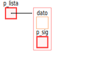
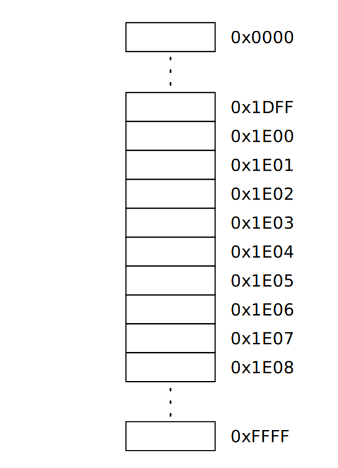
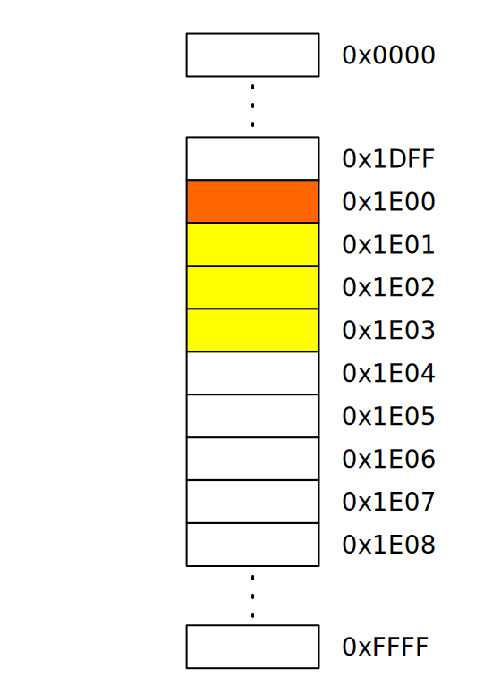

class: center, middle, inverse
<title>Unidad 9</title>

.title[Informática I]

Claudio Paz

<!-- .email[claudiojpaz@gmail.com] -->

Octubre 2023


<div style="position: absolute; left: 5%; top: 85%; height: 50%; width: 50%; padding: 1em; text-align: left;">
<input type="image" src="assets/fullscreen.png" onclick="openFullscreen()" style="height: 15%; width: 15%;">
<input type="image" src="assets/smallscreen.png" onclick="closeFullscreen()" style="height: 15%; width: 15%;">
</div>

---
class: middle, center, intermediate
.title-dark[Unidad 9]
# Estructuras y uniones en C
# y Campos de bit.
---
# Repaso
--
count: false

Los int, char, float con todos sus calificadores, junto con el tipo void y los punteros son conocidos como _tipos escalares_

--
count: false

Los arreglos, vistos en la Unidad 6, forman parte de los _tipos agregados_

--
count: false

Los arreglos sirven para almacenar datos relacionados del mismo tipo bajo un mismo nombre

--
count: false

Existe otra forma de datos de _tipo agregado_...

---
# Estructuras
--
count: false

Las estructuras son tipos de datos _derivados_ que agrupan datos relacionados que pueden ser de **distinto tipo**

--
count: false

Ej. una estructura que tenga un entero y un char

---
# Estructuras. Definición
--
count: false

.left-column[
```C
struct dato {
  int a;
  char b;
};
```
]
--
count: false

.right-column[
* .inline-code[.green[struct]] es la palabra reservada para indicar que se define una estructura
]

---
count: false
# Estructuras. Definición

.left-column[
```C
struct dato {
  int a;
  char b;
};
```
]
--
count: false

.right-column[
* .olive[dato] es la _etiqueta_ de la estructura
]

---
count: false
# Estructuras. Definición

.left-column[
```C
struct dato {
  int a;
  char b;
};
```
]
--
count: false

.right-column[
* entre llaves se definen los _miembros_ de la estructura (la cantidad que se quiera)
]

---
count: false
# Estructuras. Definición

.left-column[
```C
struct dato {
  int a;
  char b;
};
```
]
--
count: false

.right-column[
* los _miembros_ son variables de cualquier tipo, se definen con tipo y nombre, terminan en punto y coma (;)
]

---
count: false
# Estructuras. Definición

.left-column[
```C
struct dato {
  int a;
  char b;
};
```
]
--
count: false

.right-column[
* los _miembros_ pueden ser de cualquier tipo, incluso arreglos, punteros u otras estructuras.
]

---
count: false
# Estructuras. Definición

.left-column[
```C
struct dato {
  int a;
  char b;
};
```
]
--
count: false

.right-column[
* la _definición de la estructura_ termina con punto y coma (;)
]

---
# Estructuras. Definición
--
count: false

La definición de una estructura no asigna memoria, solo _crea_ un nuevo tipo de datos que puede ser usado para definir variables

--
count: false

Para definir una variable con el nuevo tipo, se antepone al nombre de la variable la palabra `struct` y el nombre de la etiqueta de la estructura

```C
  struct dato d;
```
--
count: false

en este ejemplo se define una variable `d` de tipo `struct dato` definido anteriormente

---
# Estructuras. Definición
--
count: false

```C
#include <stdio.h>

struct dato {
  int a;
  char b;
};

int main (void)
{
  struct dato d;

  return 0;
}
```
--
count: false

La definición de las variables de tipo `struct dato` deberán hacerse, luego de la definición de la estructura

---
count: false
# Estructuras. Definición

```C
#include <stdio.h>

struct dato {
  int a;
  char b;
};

int main (void)
{
* struct dato d;

  return 0;
}
```

La definición de las variables de tipo `struct dato` deberán hacerse, luego de la definición de la estructura

---
count: false
# Estructuras. Definición

```C
#include <stdio.h>

*struct dato {
* int a;
* char b;
*};

int main (void)
{
* struct dato d;

  return 0;
}
```

La definición de las variables de tipo `struct dato` deberán hacerse, luego de la definición de la estructura

---
# Estructuras. Definición
--
count: false

Se pueden definir variables en la misma definición de la estructura
--
count: false

```C
#include <stdio.h>

struct dato {
 int a;
 char b;
} d;

int main (void)
{
  d.a = 1;
  d.b = 'a';

  printf("%d\n", d.a);

  return 0;
}
```

---
count: false
# Estructuras. Definición

Se pueden definir variables en la misma definición de la estructura

```C
#include <stdio.h>

struct dato {
 int a;
 char b;
} `d`;

int main (void)
{
  d.a = 1;
  d.b = 'a';

  printf("%d\n", d.a);

  return 0;
}
```
--
count: false

En este caso, `d` es una variable global

---
# Inicialización
--
count: false

.left-column[
```C
#include <stdio.h>

struct dato {
  int a;
  char b;
};

int main (void)
{
  struct dato d = {1, 'a'};

  return 0;
}
```
]

--
count: false
.right-column[
* Al igual que en los arreglos se inicializan entre llaves, donde los elementos se asignan en el orden que están definidos dentro de la estructura
]

---
# Inicialización

.left-column[
```C
#include <stdio.h>

struct dato {
  int a;
  char b;
};

int main (void)
{
  struct dato d = {0};

  return 0;
}
```
]

--
count: false
.right-column[
* Si se desea hacer todos los elementos iguales a cero, se coloca entre las llaves un cero
]

---
# Inicialización

.left-column[
```C
#include <stdio.h>

struct dato {
  int a;
  char b;
};

int main (void)
{
  struct dato d = {1};

  return 0;
}
```
]

--
count: false
.right-column[
* Si hay menos inicializadores que miembros, los que faltan son puestos en cero
]

---
# Inicialización

.left-column[
```C
#include <stdio.h>

struct dato {
  int a;
  char b;
};

int main (void)
{
  struct dato d = {1, 'a', 3.14};

  return 0;
}
```
]

--
count: false
.right-column[
* Si hay más inicializadores que miembros, se genera una advertencia  
(o error con  
`-pedantic-errors`)
]

---
# Operador punto
--
count: false

En el caso de los arreglos se usaban los `[]` (corchetes) para identificar cada elemento que componía el arreglo

--
count: false

En el caso de las estructuras, se utiliza el operador punto y el nombre del miembro al que se quiere acceder

---
# Operador punto
--
count: false
```C
#include <stdio.h>

struct dato {
  int a;
  char b;
};

int main (void)
{
  struct dato d = {1, 'a'};

  printf("miembro a: %d\n", d.a);
  printf("miembro b: %c\n", d.b);

  return 0;
}
```
--
count: false

La variable `d`, al ser de tipo `struct dato` tiene miembros llamados `a` y `b` a los que se accede mediante el operador punto

---
count: false
# Operador punto
```C
#include <stdio.h>

struct dato {
  int a;
  char b;
};

int main (void)
{
  struct dato d = {1, 'a'};

  printf("miembro a: %d\n", `d.a`);
  printf("miembro b: %c\n", d.b);

  return 0;
}
```

La variable `d`, al ser de tipo `struct dato` tiene miembros llamados `a` y `b` a los que se accede mediante el operador punto

---
count: false
# Operador punto
```C
#include <stdio.h>

struct dato {
  int a;
  char b;
};

int main (void)
{
  struct dato d = {1, 'a'};

  printf("miembro a: %d\n", `d.a`);
  printf("miembro b: %c\n", `d.b`);

  return 0;
}
```

La variable `d`, al ser de tipo `struct dato` tiene miembros llamados `a` y `b` a los que se accede mediante el operador punto

---
# Operador punto

```C
#include <stdio.h>

struct dato {
  int a;
  char b;
};

int main (void)
{
  struct dato d = {1, 'a'};

  printf("miembro a: %d\n", `d.a`);
  printf("miembro b: %c\n", `d.b`);

  return 0;
}
```
--
count: false

`d.a` es un entero y se la puede usar usar como a cualquier entero, al igual que `d.b` es usado como cualquier caracter

---
# Operador punto
--
count: false

```C
#include <stdio.h>

struct dato {
  int a;
  char b;
};

int main (void)
{
  struct dato d = {0};

  printf("Ingrese el miembro a: ");
  scanf(" %c", &d.b);

  printf("miembro a: %d\n", d.a);
  printf("miembro b: %c\n", d.b);

  return 0;
}
```

---
count: false
# Operador punto

```C
#include <stdio.h>

struct dato {
  int a;
  char b;
};

int main (void)
{
  struct dato d = {0};

  printf("Ingrese el miembro a: ");
  scanf(" %c", `&d.b`);

  printf("miembro a: %d\n", d.a);
  printf("miembro b: %c\n", d.b);

  return 0;
}
```
--
count: false

Es importante actualizar la tabla de precedencia de operadores

---
## Precedencia de Operadores (Actualizada)
--
count: false

<div style="font-size: 70%;position:relative;top:-10px">
<p>
    \begin{array}{llll}
    \textsf{Operador}                                           &   &  & \textsf{Asociatividad} \\\hline
    () \quad [] \quad \dot \quad\quad                     &   &  & \textsf{Izq. a Der.} \\
    + \quad - \quad (\text{tipo}) \quad ++ \quad -- \quad ! \quad \& \quad *    &   &  & \textsf{Der. a Izq.} \\
    * \quad / \quad \%                                          &   &  & \textsf{Izq. a Der.} \\
    + \quad -                                                   &   &  & \textsf{Izq. a Der.} \\
    < \quad <= \quad > \quad >=                                 &   &  & \textsf{Izq. a Der.} \\
    == \quad !=                                                 &   &  & \textsf{Izq. a Der.} \\
    \&\&                                                        &   &  & \textsf{Izq. a Der.} \\
    ||                                                          &   &  & \textsf{Izq. a Der.} \\
    ?:                                                          &   &  & \textsf{Der. a Izq.} \\
    = \quad += \quad -=  \quad /= \quad *= \quad \%=            &   &  & \textsf{Der. a Izq.} \\
    ,                                                           &   &  & \textsf{Izq. a Der.} \\
    \end{array}
</p>
</div>
---
# Acceso a los miembros de una estructura
--
count: false

```C
#include <stdio.h>

struct punto_2d {
  float x;
  float y;
};

int main (void) {
  struct punto_2d p1 = {3, 2};

  printf("(%.2f, %.2f)\n", p1.x, p1.y);

  return 0;
}

```
---
# Acceso a los miembros de una estructura
--
count: false

```C
#include <stdio.h>

struct punto_2d {
  float x;
  float y;
};

int main (void) {
  struct punto_2d p1;

  p1.x = 3;
  p1.y = 2;

  printf("(%.2f, %.2f)\n", p1.x, p1.y);

  return 0;
}

```
---
# Acceso a los miembros de una estructura
--
count: false

```C
#include <stdio.h>

struct persona {
  int dni;
  char nombre[80];
  float altura;
  float peso;
};

int main (void) {
  struct persona emp = {12345678, "nombre Cualquiera"};

  emp.nombre[0] = 'N';
  printf("Nombre: %s", emp.nombre);

  return 0;
}

```
---
count: false
# Acceso a los miembros de una estructura

```C
#include <stdio.h>

struct persona {
  int dni;
  char nombre[80];
  float altura;
  float peso;
};

int main (void) {
  struct persona emp = {12345678, "nombre Cualquiera"};

* emp.nombre[0] = 'N';
  printf("Nombre: %s", emp.nombre);

  return 0;
}
```
--
count: false

A igual precedencia, con asociatividad desde la izq. primero opera el punto

---
# Inicialización (extra)
--
count: false

.left-column[
```C
#include <stdio.h>

struct dato {
  int a;
  char b;
};

int main (void)
{
  struct dato d = {.b='a'};

  return 0;
}
```
]

--
count: false
.right-column[
* también se puede inicializar un elemento usando el operador punto y el miembro que corresponde.
Se conocen como _inicializadores designados_.
]


---
# Operaciones permitidas
--
count: false

Asignación

--
count: false

Tomar dirección de memoria con .inline-code[&]

--
count: false

Desreferenciar con *

--
count: false

Acceder a miembros con  .inline-code[.] o  .inline-code[->]

--
count: false

Operador .inline-code[sizeof]

---
# Operaciones permitidas: Asignación
--
count: false

```C
#include <stdio.h>

struct punto_2d {
  float x;
  float y;
};

int main (void) {
  struct punto_2d p1, p2 = {3,2};

  p1 = p2;

  printf("(%.2f, %.2f)\n", p1.x, p1.y);

  return 0;
}

```
--
count: false

```sh
(3.00, 2.00)
```

---
count: false
# Operaciones permitidas: Asignación

```C
#include <stdio.h>

struct punto_2d {
  float x;
  float y;
};

int main (void) {
  struct punto_2d p1, p2 = {3,2};

* p1 = p2;

  printf("(%.2f, %.2f)\n", p1.x, p1.y);

  return 0;
}

```

```sh
(3.00, 2.00)
```

---
# Operaciones permitidas: Asignación
--
count: false

Se puede hacer asignación si y solo si se trata del mismo tipo de estructuras...

--
count: false

...de lo contrario hay error de compilación

--
count: false

```C
  struct punto_2d p1, p2 = {3,2};
  struct punto_3d p3;

  p3 = p2;
```
--
count: false

```cmd
$ gcc -Wall -std=c99 -pedantic-errors punto-3.c && ./a.out
punto-3.c:18:8: error: incompatible types when assigning to type
                ‘struct punto_3d’ from type ‘struct punto_2d’
   18 |   p3 = p2;
      |        ^~
$
```
---
# Operaciones no permitidas
--
count: false

No se permite el uso de los operadores de relación (.inline-code[==], .inline-code[!=], .inline-code[>], .inline-code[<], etc)

--
count: false

```C
  struct punto_2d p1, p2 = {3,2};

  p1 = p2;

  if (p1 == p2)
    printf("Ok!\n");

```
--
count: false
```shell
$ gcc -Wall -std=c99 -pedantic-errors punto-4.c && ./a.out
punto-4.c:14:9: error: invalid operands to binary ==
                (have ‘struct punto_2d’ and ‘struct punto_2d’)
   14 |   if (p1==p2)
      |         ^~
$
```

---
# Punteros a estructuras
--
count: false

De la misma manera que en variables de tipo escalar se usa el asterisco entre el nombre y el tipo...

--
count: false

...en estructuras se usa el asterisco, pero recordando que el tipo incluye la palabra reservada .inline-code[struct]

---
# Punteros a estructuras
--
count: false

```C
#include <stdio.h>

struct punto_2d {
  float x;
  float y;
};

int main (void) {
  struct punto_2d p1 = {3,2};

  struct punto_2d *pp;

  pp = &p1;

  printf("%.2f\n", (*pp).x);

  return 0;
}
```
---
count: false
# Punteros a estructuras

```C
#include <stdio.h>

struct punto_2d {
  float x;
  float y;
};

int main (void) {
  struct punto_2d p1 = {3,2};

* struct punto_2d *pp;

  pp = &p1;

  printf("%.2f\n", (*pp).x);

  return 0;
}
```
---
count: false
# Punteros a estructuras

```C
#include <stdio.h>

struct punto_2d {
  float x;
  float y;
};

int main (void) {
  struct punto_2d p1 = {3,2};

  struct punto_2d *pp;

  pp = &p1;

  printf("%.2f\n", (*pp).x);

  return 0;
}
```
---
count: false
# Punteros a estructuras

```C
#include <stdio.h>

struct punto_2d {
  float x;
  float y;
};

int main (void) {
  struct punto_2d p1 = {3,2};

  struct punto_2d *pp;

* pp = &p1;

  printf("%.2f\n", (*pp).x);

  return 0;
}
```
---
count: false
# Punteros a estructuras

```C
#include <stdio.h>

struct punto_2d {
  float x;
  float y;
};

int main (void) {
  struct punto_2d p1 = {3,2};

  struct punto_2d *pp;

  pp = &p1;

  printf("%.2f\n", (*pp).x);

  return 0;
}
```
---
count: false
# Punteros a estructuras

```C
#include <stdio.h>

struct punto_2d {
  float x;
  float y;
};

int main (void) {
  struct punto_2d p1 = {3,2};

  struct punto_2d *pp;

  pp = &p1;

* printf("%.2f\n", (*pp).x);

  return 0;
}
```
---
# Punteros a estructuras
--
count: false

En la expresión `(*pp).x` deben usarse los paréntesis para que la desreferencia sea correcta

--
count: false

Debido al orden de precedencia del operador punto deben usarse paréntesis para que la desreferencia del puntero se realice primero.

--
count: false

De lo contrario el compilador da un error, ya que el operador punto espera una estructura y un miembro al que acceder, no un puntero.

---
# Punteros a estructuras
--
count: false

Para simplificar la notación y disminuir la posibilidad de errores se usa el operador _flecha_ (.inline-code[->])

--
count: false

En lugar de

```C
  printf("%.2f\n", (*pp).x);
```

--
count: false

se puede usar

```C
  printf("%.2f\n", pp->x);
```

--
count: false

El operador flecha espera un puntero a una estructura a la izquierda y un miembro de esa estructura a la derecha

---
## Precedencia de Operadores (Actualizada)
--
count: false

<div style="font-size: 70%;position:relative;top:-10px">
<p>
    \begin{array}{llll}
    \textsf{Operador}                                           &   &  & \textsf{Asociatividad} \\\hline
    () \quad [] \quad \dot \quad\quad \text{->}                    &   &  & \textsf{Izq. a Der.} \\
    + \quad - \quad (\text{tipo}) \quad ++ \quad -- \quad ! \quad \& \quad *    &   &  & \textsf{Der. a Izq.} \\
    * \quad / \quad \%                                          &   &  & \textsf{Izq. a Der.} \\
    + \quad -                                                   &   &  & \textsf{Izq. a Der.} \\
    < \quad <= \quad > \quad >=                                 &   &  & \textsf{Izq. a Der.} \\
    == \quad !=                                                 &   &  & \textsf{Izq. a Der.} \\
    \&\&                                                        &   &  & \textsf{Izq. a Der.} \\
    ||                                                          &   &  & \textsf{Izq. a Der.} \\
    ?:                                                          &   &  & \textsf{Der. a Izq.} \\
    = \quad += \quad -=  \quad /= \quad *= \quad \%=            &   &  & \textsf{Der. a Izq.} \\
    ,                                                           &   &  & \textsf{Izq. a Der.} \\
    \end{array}
</p>
</div>


---
class: middle, center, intermediate, no-number
count: false

# Estructuras y uniones en C
## (Segunda Parte)
---
# Arreglos de estructuras
--
count: false

Para definir un arreglo de estructuras simplemente se usa el corchete en el nombre de la variable

--
count: false

```C
struct punto_2d puntos[10];
```

--
count: false

En el ejemplo se crea un arreglo de 10 elementos, cada uno de tipo `struct punto_2d`

--
count: false

Se accede a los miembros de cada estructura, primero a través del uso del índice que corresponde en el arreglo

---
# Arreglos de estructuras
--
count: false

```C
#include <stdio.h>

struct punto_2d {
  float x;
  float y;
};

int main (void) {
  struct punto_2d puntos[5] = {{0,0},{6,7}};
  int i;

  puntos[0].x = 3; puntos[0].y = 3;
  puntos[3].x = 4; puntos[3].y = 5;

  for(i=0; i<5 ; i++)
    printf("(%.2f, %.2f)\n", puntos[i].x, puntos[i].y);

  return 0;
}
```

---
# Arreglos de estructuras
--
count: false

En el caso de
```C
  puntos[0].x = 3;
```
se opera primero el corchete por estar más a la izq.

--
count: false

La variable `puntos` antes que nada es un arreglo por lo que el elemento se accesa con los corchetes.

--
count: false

Luego, el elemento accesado con los corchetes es de tipo `struct puntos_2d`, por lo que entonces se puede accesar al miembro de la estructura con el operador punto.

---
# Arreglos asignados dinámicamente
--
count: false

```C
#include<stdio.h>
#include<stdlib.h>

struct personal {
  int dni;
  char nombre[80];
  int legajo;
};

int main (void)
{
  struct personal *p;
  int i, n=10;

  p = malloc (n*sizeof (struct personal));

  for(i = 0; i < n; i++) {
    printf("Ingrese Nombre: "); scanf(" %80[^\n]s", (p+i)->nombre);
    printf("Ingrese DNI: "); scanf("%d", &(p+i)->dni);
    printf("Ingrese Legajo: "); scanf("%d", &(p+i)->legajo);
  }

  // continua
```
---
# Arreglos asignados dinámicamente

```C

  for(i = 0; i < n; i++) {
    printf("Nombre: %s\n", (p+i)->nombre);
    printf("DNI: %d\n", (p+i)->dni);
    printf("Legajo: %d\n", (p+i)->legajo);
  }

  free(p);
  return 0;
}

```

---
# Funciones y Estructuras
--
count: false

A las funciones se pueden pasar:

--
count: false

* miembros de la estructura,

--
count: false

* la estructura completa, o

--
count: false

* un puntero a una estructura (o arreglo de estructuras)

--
count: false

En el caso de un miembro de la estructura o la estructura completa, es pasaje es _por valor_, o sea que la estructura original con la que se hace el llamado no se modifica dentro de la función

---
# Funciones y Estructuras
--
count: false

Pasar miembros de una estructura es igual al paso de variables...

--
count: false

Por ejemplo, si la función espera enteros

```C
int suma (int a, int b) {
  return a+b;
}
```

--
count: false

el llamado se puede hacer

```C
printf("%d\n", suma(p.x, p.y));
```

---
count: false
# Funciones y Estructuras

Pasar miembros de una estructura es igual al paso de variables...


Por ejemplo, si la función espera enteros

```C
int suma (int a, int b) {
  return a+b;
}
```


el llamado se puede hacer

```C
printf("%d\n", suma(`p.x`, p.y));
```
---
count: false
# Funciones y Estructuras

Pasar miembros de una estructura es igual al paso de variables...


Por ejemplo, si la función espera enteros

```C
int suma (int a, int b) {
  return a+b;
}
```


el llamado se puede hacer

```C
printf("%d\n", suma(`p.x`, `p.y`));
```

---
# Funciones y Estructuras
--
count: false

Pasar estructuras completas también es igual a cualquier variable...

--
count: false

...teniendo cuidado de no olvidar el tipo completo en la lista de parámetros del encabezado de la función

---
# Funciones y Estructuras
--
count: false

```C
#include <stdio.h>
#include <math.h>

struct punto2D {
  float x;
  float y;
};

float norma2d (struct punto2D p, struct punto2D q)
{
  return sqrt(pow(p.x - q.x, 2) + pow(p.y - q.y, 2));
}

int main (void)
{
  struct punto2D p1 = {3, 2}, p2 = {4, 5};
  float norma;

  norma = norma2d(p1, p2);
  printf("%.2f\n", norma);

  return 0;
}

```
---
count: false
# Funciones y Estructuras

```C
#include <stdio.h>
#include <math.h>

struct punto2D {
  float x;
  float y;
};

*float norma2d (struct punto2D p, struct punto2D q)
{
  return sqrt(pow(p.x - q.x, 2) + pow(p.y - q.y, 2));
}

int main (void)
{
  struct punto2D p1 = {3, 2}, p2 = {4, 5};
  float norma;

  norma = norma2d(p1, p2);
  printf("%.2f\n", norma);

  return 0;
}

```

---
# Funciones y Estructuras
--
count: false
## (antes de seguir, repaso de Unidad 6)
--
count: false

supongamos la función
```C
int cuadrado (int a)
{
  return a*a;
}
```
--
count: false

puede ser llamada con una variable

```C
int var = 5;
printf("%d\n", cuadrado(var));
```

---
# Funciones y Estructuras
## (antes de seguir, repaso de Unidad 6)

supongamos la función
```C
int cuadrado (int a)
{
  return a*a;
}
```
--
count: false

o con un _literal_

```C
printf("%d\n", cuadrado(5));
```

---
# Funciones y Estructuras
--
count: false

Las estructuras también pueden ser pasadas a funciones como literales...

--
count: false

...así se conocen como _literales compuestos_.

--
count: false

Entre llaves se enumeran los valores de los miembros de la estructura y se agregan adelante paréntesis con el tipo de dato.

--
count: false

Se pueden usar los _inicializadores designados_.

---
# Funciones y Estructuras
--
count: false

```C
#include <stdio.h>
#include <math.h>

struct punto2D {
  float x;
  float y;
};

float norma2d (struct punto2D p, struct punto2D q)
{
  return sqrt(pow(p.x - q.x, 2) + pow(p.y - q.y, 2));
}

int main (void)
{
  struct punto2D p1 = {2, 2};
  float norma;

  norma = norma2d(p1, (struct punto2D) {0,0});
  printf("%.2f\n", norma);

  return 0;
}
```
---
count: false
# Funciones y Estructuras

```C
#include <stdio.h>
#include <math.h>

struct punto2D {
  float x;
  float y;
};

float norma2d (struct punto2D p, struct punto2D q)
{
  return sqrt(pow(p.x - q.x, 2) + pow(p.y - q.y, 2));
}

int main (void)
{
  struct punto2D p1 = {2, 2};
  float norma;

  norma = norma2d(p1, `(struct punto2D) {0,0}`);
  printf("%.2f\n", norma);

  return 0;
}
```

---
# Funciones y Estructuras
--
count: false

Cuando se pasan arreglos de estructuras a funciones, son automáticamente por _referencia_ como todos los arreglos...

--
count: false

Pero si una estructura tiene arreglos estos se pasan por copia, como todos los elementos de la estructura.

---
# Funciones y Estructuras
--
count: false

Siempre se dijo que las funciones solo pueden devolver un solo valor...esto todavía es así, pero se puede devolver **una** estructura

--
count: false

Entonces de esta manera se pueden devolver varios valores, siempre que haya coincidencia entre el tipo de estructura devuelto y la variable que recibe la estructura

---
# Funciones que devuelven estructuras
--
count: false
```C
 #include <stdio.h>

 struct persona {
   int dni;
   char nombre[80];
 };

 struct persona carga (void) {
   struct persona r;

   printf("Ingrese su DNI: ");
   scanf("%d", &r.dni);
   printf("Ingrese su nombre: ");
   scanf("%s", r.nombre);

   return r;
 }
```

---
count: false
# Funciones que devuelven estructuras
```C
 #include <stdio.h>

 struct persona {
   int dni;
   char nombre[80];
 };

 `struct persona` carga (void) {
   struct persona r;

   printf("Ingrese su DNI: ");
   scanf("%d", &r.dni);
   printf("Ingrese su nombre: ");
   scanf("%s", r.nombre);

   return r;
 }
```
---
# Funciones que devuelven estructuras
--
count: false

```C
int main (void)
{
  struct persona p;

  p = carga();

  printf("dni: %d\n", p.dni);
  printf("nombre: %s\n", p.nombre);

  return 0;
}
```
---
count: false
# Funciones que devuelven estructuras

```C
int main (void)
{
* struct persona p;

  p = carga();

  printf("dni: %d\n", p.dni);
  printf("nombre: %s\n", p.nombre);

  return 0;
}
```
---
count: false
# Funciones que devuelven estructuras

```C
int main (void)
{
* struct persona p;

* p = carga();

  printf("dni: %d\n", p.dni);
  printf("nombre: %s\n", p.nombre);

  return 0;
}
```

---
# Typedef

--
count: false

La palabra clave .inline-code[typedef] prevé un mecanismo para generar sinónimos o _alias_.

--
count: false

.left-column[
```C
 typedef unsigned int uint;
```
]

---
count: false
# Typedef

La palabra clave .inline-code[typedef] prevé un mecanismo para generar sinónimos o _alias_.

.left-column[
```C
 `typedef` unsigned int uint;
```
]

.right-column[
* .inline-code[typedef] es la palabra clave que indica que se va a definir un _alias_
]

---
count: false
# Typedef

La palabra clave .inline-code[typedef] prevé un mecanismo para generar sinónimos o _alias_.

.left-column[
```C
 typedef unsigned int uint;
```
]

---
count: false
# Typedef

La palabra clave .inline-code[typedef] prevé un mecanismo para generar sinónimos o _alias_.

.left-column[
```C
 typedef `unsigned int` uint;
```
]

.right-column[
* a continuación se coloca el tipo de datos del que se quiere generar un sinónimo.
]

---
count: false
# Typedef

La palabra clave .inline-code[typedef] prevé un mecanismo para generar sinónimos o _alias_.

.left-column[
```C
 typedef unsigned int uint;
```
]

---
count: false
# Typedef

La palabra clave .inline-code[typedef] prevé un mecanismo para generar sinónimos o _alias_.

.left-column[
```C
 typedef unsigned int `uint`;
```
]

.right-column[
* se finaliza con el _alias_ (y el punto y coma)
]

---
count: false
# Typedef

La palabra clave .inline-code[typedef] prevé un mecanismo para generar sinónimos o _alias_.

.left-column[
```C
 typedef unsigned int uint;
```
]

.right-column[

]

--
count: false

</br>
</br>

A partir de ese punto se puede usar indistintamente el alias o el tipo completo

--
count: false

```C
unsigned int valor1;
uint valor2;
```

---
# Typedef
--
count: false

Se usa mucho en estructuras para simplificar notación...

--
count: false

supongamos la definición de una estructura

```C
struct punto2D {
  float x;
  float y;
};
```
--
count: false

El prototipo de funciones que reciben estructuras con este nombre podrían ser extensas, por ejemplo

--
count: false

```C
struct punto2D suma (struct punto2D p, struct punto2D q);
```
---
# Typedef
--
count: false

Se puede usar .inline-code[typedef] de varias formas

--
count: false

```C
struct punto2D {
  float x;
  float y;
};
```
---
count: false
# Typedef

Se puede usar .inline-code[typedef] de varias formas

```C
struct punto2D {
  float x;
  float y;
};

typedef struct punto2D p2D;
```
--
count: false

o 

```C
typedef struct punto2D {
  float x;
  float y;
} p2D;

```

---
# Typedef
--
count: false

Entonces teniendo

--
count: false

```C
typedef struct punto2D {
  float x;
  float y;
} p2D;

```

--
count: false

el prototipo

--
count: false

```C
struct punto2D suma (struct punto2D p, struct punto2D q);
```
--
count: false

puede pasar a

--
count: false

```C
p2D suma (p2D p, p2D q);
```


---
# Typedef
--
count: false

Notar que la definición + el _alias_ con .inline-code[typedef]
```C
typedef struct punto2D {
  float x;
  float y;
} p2D;
```
--
count: false
tiene una sintaxis _parecida_ a la declaración de una variable global .inline-code[p1]

--
count: false
```C
struct punto2D {
  float x;
  float y;
} p1;
```
--
count: false

Hay que tener cuidado de no confundir estos casos

---
Las estructuras pueden ser definidas sin _etiquetas_ si se definen usando `typedef`

--
count: false

```C
typedef struct {
  float x;
  float y;
} punto2d;
```

--
count: false

o se usan para declarar una variable global

```C
struct {
  float x;
  float y;
} p2d;
```

--
count: false

Cuidado con la diferencia: `punto2d` puede servir para definir nuevas variables, `p2d` es una variable, y no puede haber otra igual

---
# Estructuras autoreferenciadas
--
count: false

Se usan para generar estructuras de datos _complejos_ en C.

--
count: false

Se llaman _autoreferenciadas_ porque uno (o más) de sus miembros es un puntero a una estructura del mismo tipo que se está definiendo.

--
count: false

```C
struct nodo {
  int dato;
  struct nodo *p;
};
```
---
# Estructuras autoreferenciadas
--
count: false

Si se representa un `int` como un bloque...

---
count: false
# Estructuras autoreferenciadas

Si se representa un `int` como un bloque...

<div style="position: absolute; left: 200px; top: 250px;">

</div>

---
count: false
# Estructuras autoreferenciadas

Si se representa un `int` como un bloque...

<div style="position: absolute; left: 200px; top: 250px;">

</div>

---
count: false
# Estructuras autoreferenciadas

Si se representa un `int` como un bloque...

<div style="position: absolute; left: 200px; top: 250px;">

</div>


---
count: false
# Estructuras autoreferenciadas

<div style="position: absolute; left: 200px; top: 250px;">

</div>

---
count: false
# Estructuras autoreferenciadas

...se puede representar un puntero con otro bloque del mismo color (del mismo tipo)...

<div style="position: absolute; left: 200px; top: 250px;">

</div>

---
count: false
# Estructuras autoreferenciadas

...se puede representar un puntero con otro bloque del mismo color (del mismo tipo)...

<div style="position: absolute; left: 200px; top: 250px;">

</div>

---
count: false
# Estructuras autoreferenciadas

...se puede representar un puntero con otro bloque del mismo color (del mismo tipo)...

<div style="position: absolute; left: 200px; top: 250px;">

</div>

---
count: false
# Estructuras autoreferenciadas

...y hacer que el apunte a la variable

<div style="position: absolute; left: 200px; top: 250px;">

</div>

---
count: false
# Estructuras autoreferenciadas

...y hacer que el apunte a la variable

<div style="position: absolute; left: 200px; top: 250px;">

</div>

---
# Estructuras autoreferenciadas
--
count: false

De la misma forma, si se tiene definida una estructura _autoreferenciada_ de tipo `struct nodo`...

--
count: false

...se puede asignar memoria suficiente para contenerla...

--
count: false

```C
struct nodo {
  int dato;
  struct nodo *p;
};
```
--
count: false

```C
struct nodo *p_lista;
```

--
count: false

```C
p_lista = malloc (sizeof (struct nodo));
```

---
# Estructuras autoreferenciadas
--
count: false

```C
struct nodo *p_lista;
```
<div style="position: absolute; left: 200px; top: 200px;">

</div>

---
count: false
# Estructuras autoreferenciadas

<div style="position: absolute; left: 200px; top: 200px;">

</div>

---
count: false
# Estructuras autoreferenciadas

```C
          malloc (sizeof (struct nodo));
```

<div style="position: absolute; left: 200px; top: 200px;">

</div>

---
count: false
# Estructuras autoreferenciadas

```C
p_lista = malloc (sizeof (struct nodo));
```

<div style="position: absolute; left: 200px; top: 200px;">

</div>

---
count: false
# Estructuras autoreferenciadas

```C
p_lista->dato = 42;
```

<div style="position: absolute; left: 200px; top: 200px;">

</div>

---
count: false
# Estructuras autoreferenciadas

```C
p_lista->p_sig = NULL;
```

<div style="position: absolute; left: 200px; top: 200px;">

</div>

---
count: false
# Estructuras autoreferenciadas

<div style="position: absolute; left: 200px; top: 200px;">

</div>

---
count: false
# Estructuras autoreferenciadas

<div style="position: absolute; left: 200px; top: 200px;">

</div>

---
count: false
# Estructuras autoreferenciadas

```C
                 malloc (sizeof (struct nodo));
```

<div style="position: absolute; left: 200px; top: 200px;">

</div>

---
count: false
# Estructuras autoreferenciadas

```C
p_lista->p_sig = malloc (sizeof (struct nodo));
```

<div style="position: absolute; left: 200px; top: 200px;">

</div>

---
count: false
# Estructuras autoreferenciadas

```C
p_lista->p_sig->dato = 13;
```

<div style="position: absolute; left: 200px; top: 200px;">

</div>

---
count: false
# Estructuras autoreferenciadas

```C
p_lista->p_sig->p_sig = NULL;
```

<div style="position: absolute; left: 200px; top: 200px;">

</div>

---
# Estructuras autoreferenciadas
--
count: false

La parte práctica de estructuras autoreferenciadas **NO** entra en el parcial o final

Se ve en Informática 2

--
count: false

¿Qué hay que saber?

--
count: false

Que las estructuras autoreferenciadas tienen  
**un miembro** que es **un puntero al mismo tipo** de la estructura que se está definiendo

--
count: false

```C
struct nodo {
  int dato;
  struct nodo *p;
};
```

---
# Estructuras autoreferenciadas

La parte práctica de estructuras autoreferenciadas **NO** entra en el parcial o final

Se ve en Informática 2

¿Qué hay que saber?

Que las estructuras autoreferenciadas tienen  
**un miembro** que es **un puntero al mismo tipo** de la estructura que se está definiendo

```C
struct nodo {
  int dato;
  `struct nodo *`p;
};
```

---
## (para fijar concepto antes de seguir)

--
count: false

.left-column[
]

.right-column[

]

---
count: false
## (para fijar concepto antes de seguir)


.left-column[
Cada miembro de la estructura se coloca después del otro, en la medida que se pueda mantener a todos los datos _alineados_
]

.right-column[

]


---
count: false
## (para fijar concepto antes de seguir)


.left-column[
Cada miembro de la estructura se coloca después del otro, en la medida que se pueda mantener a todos los datos _alineados_
```C
struct dato {
  int a;
  char b;
};

struct dato d;
```
]

.right-column[

]

---
count: false
## (para fijar concepto antes de seguir)


.left-column[
Cada miembro de la estructura se coloca después del otro, en la medida que se pueda mantener a todos los datos _alineados_
```C
struct dato {
  int a;
  char b;
};

struct dato d;
```
]

.right-column[

]

---
# Uniones
--
count: false

Las Uniones son tipos derivados como las estructuras...

--
count: false

...y de similar definición

--
count: false

```C
 union dato {
   int a;
   char b;
 };
```
---
count: false
# Uniones

Las Uniones son tipos derivados como las estructuras...

...y de similar definición

```C
 `union` dato {
   int a;
   char b;
 };
```

--
count: false

La palabra clave para definir uniones es `union`  
--
count: false
Tiene miembros como las estructuras y se acceden con el operador punto (`.`) o flecha (`->`)  
--
count: false
La gran diferencia...

---
# Uniones
--
count: false

.left-column[
]
.right-column[

]

---
count: false
# Uniones

.left-column[
Cada miembro de la unión **comparte** la posición memoria con los otros
]
.right-column[

]

---
count: false
# Uniones

.left-column[
Cada miembro de la unión **comparte** la posición memoria con los otros
```C
union dato {
  int a;
  char b;
};

union dato u;
```
]
.right-column[

]

---
count: false
# Uniones

.left-column[
Cada miembro de la unión **comparte** la posición memoria con los otros
```C
union dato {
  int a;
  char b;
};

union dato u;
```
]
.right-column[

]

---
count: false
# Uniones

.left-column[
Cada miembro de la unión **comparte** la posición memoria con los otros
```C
union dato {
  int a;
  char b;
};

union dato u;
```
]
.right-column[

]

---
count: false
# Uniones

.left-column[
Cada miembro de la unión **comparte** la posición memoria con los otros
```C
union dato {
  int a;
  char b;
};

union dato u;
```
]
.right-column[

]

---
count: false
# Uniones

.left-column[
Cada miembro de la unión **comparte** la posición memoria con los otros
```C
union dato {
  int a;
  char b;
};

union dato u;
```
]
.right-column[

]

---
count: false
# Uniones

.left-column[
Cada miembro de la unión **comparte** la posición memoria con los otros
```C
union dato {
  int a;
  char b;
};

union dato u;
```
]
.right-column[

]

---
# Uniones
--
count: false
.center[]

---
count: false
# Uniones

.center[]

--
count: false

El tamaño en memoria de la unión es suficiente para almacenar el miembro que ocupe mayor espacio

--
count: false

Pero compartir memoria trae problemas si se accesa de forma equivocada

---
## (repaso de Unidad 2)
--
count: false

Si se tiene un número real, por ej. `3.125` almacenado en formato IEEE754 de simple precisión, en bits sería

--
count: false
.center[]
--
count: false
pero si se interpretan esos mismos bits

--
count: false
.center[]

--
count: false
como un entero...
--
count: false
se lee `1078460416`
--
count: false
  ya que

$2^{30}+2^{22}+2^{19} =  1078460416$

---
# Uniones
--
count: false

Entonces, para definir una unión se sigue el mismo formato que la estructura pero con la palabra clave `union`

--
count: false

Puede tener cualquier tipo y cantidad de _miembros_, los cuales se definen cada uno con su tipo y nombre finalizando cada línea con punto y coma (`;`)

--
count: false

La _etiqueta_ y los nombres de los miembros deben respetar las reglas de los identificadores

--
count: false

Toda la definición debe terminar con punto y coma (`;`)

---
# Uniones
--
count: false

```C
#include <stdio.h>

union int_float {
  int entero;
  float real;
};

int main (void)
{
  union int_float u;

  printf("Asignando a float\n") ;
  u.real = 3.125;
  printf("Imprimiendo float  => %.3f\n", u.real) ;
  printf("Imprimiendo entero => %d\n", u.entero) ;

  return 0;
}
```
---
count: false
# Uniones

```C
#include <stdio.h>

union int_float {
  int entero;
  float real;
};

int main (void)
{
  union int_float u;

  printf("Asignando a float\n") ;
* u.real = 3.125;
  printf("Imprimiendo float  => %.3f\n", u.real) ;
  printf("Imprimiendo entero => %d\n", u.entero) ;

  return 0;
}
```
--
count: false

```cmd
Asignando a float
Imprimiendo float  => 3.125
Imprimiendo entero => 1078460416
```

---
# Uniones
--
count: false

```C
#include <stdio.h>

union int_float {
  int entero;
  float real;
};

int main (void)
{
  union int_float u;

  printf("Asignando a int\n") ;
  u.entero = 42;
  printf("Imprimiendo float  => %.3f\n", u.real) ;
  printf("Imprimiendo entero => %d\n", u.entero) ;

  return 0;
}
```

---
count: false
# Uniones

```C
#include <stdio.h>

union int_float {
  int entero;
  float real;
};

int main (void)
{
  union int_float u;

  printf("Asignando a int\n") ;
* u.entero = 42;
  printf("Imprimiendo float  => %.3f\n", u.real) ;
  printf("Imprimiendo entero => %d\n", u.entero) ;

  return 0;
}
```
--
count: false

```cmd
Asignando a int
Imprimiendo float  => 0.000
Imprimiendo entero => 42
```
---
count: false
# Uniones

```C
#include <stdio.h>

union int_float {
  int entero;
  float real;
};

int main (void)
{
  union int_float u;

  printf("Asignando a int\n") ;
  u.entero = 42;
  printf("Imprimiendo float  => %.3f\n", u.real) ;
  printf("Imprimiendo entero => %d\n", u.entero) ;

  return 0;
}
```
--
count: false
¿Por qué imprimir el `float` da 0?

---
# Uniones
--
count: false

El entero 42 se almacena como
.center[]
--
count: false
Si se lee como un `float`
.center[]
--
count: false
al convertir este número se obtiene  
`5.88545355016e-44`  
y en notación decimal se escribe `0.` y cuarenta y tres ceros antes del 5  
Se puede ver el valor almacenado real con `%e`

---
# Uniones
--
count: false

```C
#include <stdio.h>

union int_float {
  int entero;
  float real;
};

int main (void)
{
  union int_float u;

  printf("Asignando a int\n") ;
  u.entero = 42;
  printf("Imprimiendo float  => %.11e\n", u.real) ;
  printf("Imprimiendo entero => %d\n", u.entero) ;

  return 0;
}
```

---
count: false
# Uniones

```C
#include <stdio.h>

union int_float {
  int entero;
  float real;
};

int main (void)
{
  union int_float u;

  printf("Asignando a int\n") ;
  u.entero = 42;
* printf("Imprimiendo float  => %.11e\n", u.real) ;
  printf("Imprimiendo entero => %d\n", u.entero) ;

  return 0;
}
```
--
count: false
```cmd
Asignando a int
Imprimiendo float  => 5.88545355016e-44
Imprimiendo entero => 42
```

---
# Uniones
--
count: false

En resumen, si se asigna un valor a un miembro de la unión, este se guarda siguiendo las _reglas_ de ese tipo de datos

--
count: false

Pero siempre recordar que todos los valores, del valor que sean se guardan en bits

--
count: false

Si se lee desde un miembro de un tipo diferente, se interpretan los bits almacenados con las _reglas_ de este último tipo de miembro

---
# Uniones. Inicialización
--
count: false

Las uniones se inicializan en la declaración con llaves

--
count: false
```C
#include <stdio.h>

union int_float {
  int entero;
  float real;
};

int main (void)
{
  union int_float u = {42};

  printf("Imprimiendo float  => %.3f\n", u.real) ; // probar %.11e
  printf("Imprimiendo entero => %d\n", u.entero) ;

  return 0;
}
```
---
count: false
# Uniones. Inicialización

Las uniones se inicializan en la declaración con llaves

```C
#include <stdio.h>

union int_float {
  int entero;
  float real;
};

int main (void)
{
* union int_float u = {42};

  printf("Imprimiendo float  => %.3f\n", u.real) ; // probar %.11e
  printf("Imprimiendo entero => %d\n", u.entero) ;

  return 0;
}
```
--
count: false

```cmd
Imprimiendo float  => 0.000
Imprimiendo entero => 42
```
---
# Uniones. Inicialización
--
count: false

Solo se puede inicializar un valor, ya que es compartido por todos los miembros

--
count: false

El _formato_ de carga depende de cual sea el valor que esté primero en la definición de la unión

---
# Uniones. Inicialización
--
count: false
```C
#include <stdio.h>

union int_float {
  int entero;
  float real;
};

int main (void)
{
  union int_float u = {42.195};

  printf("Imprimiendo float  => %.3f\n", u.real) ;
  printf("Imprimiendo entero => %d\n", u.entero) ;

  return 0;
}
```

---
count: false
# Uniones. Inicialización
```C
#include <stdio.h>

union int_float {
  int entero;
  float real;
};

int main (void)
{
* union int_float u = {42.195};

  printf("Imprimiendo float  => %.3f\n", u.real) ;
  printf("Imprimiendo entero => %d\n", u.entero) ;

  return 0;
}
```
--
count: false

Aunque se inicialice con un número real, como el primer miembro es entero, se produce un truncamiento en la inicialización, y solo se inicializa la variable entera con un `42`

---
# Uniones. Inicialización
```C
#include <stdio.h>

union int_float {
  int entero;
  float real;
};

int main (void)
{
* union int_float u = {42.195};

  printf("Imprimiendo float  => %.3f\n", u.real) ;
  printf("Imprimiendo entero => %d\n", u.entero) ;

  return 0;
}
```
--
count: false

```cmd
Imprimiendo float  => 0.000
Imprimiendo entero => 42
```

---
# Uniones. Inicialización
--
count: false

Se puede inicializar un miembro que no sea el primero en la definición usando los _inicializadores designados_

--
count: false

```C
  union int_float u = {.real=42.195};
```

---
# Uniones. Operaciones permitidas
--
count: false

Se permite asignar uniones a otras uniones del mismo tipo

--
count: false

Se puede usar el operador _dirección de memoria_ (`&`) para devolver la dirección de la estructura (que es la misma que la de cualquiera de sus miembros)

--
count: false

El operador punto (`.`) y el operador flecha (`->`) se usan de la misma manera que en las estructuras

---
# Uniones. Operaciones NO permitidas
--
count: false

No se permiten las comparaciones (`==`,  `!=`,  `<`,  `>` etc.)

--
count: false

No se permiten operaciones aritméticas (`+`, `-`, `*`, `/`)

---
# Uniones. Posibles usos
--
count: false

Las uniones pueden tener arreglos como miembros (los cuales son pasados
por valor a las funciones)

--
count: false

```C
union int_4char {
  int entero;
  char ch[4];
};
```
--
count: false

No es necesario que el arreglo tenga el mismo tamaño que el otro u otros miembros

--
count: false

En cualquier caso el tamaño de la unión será igual al tamaño en memoria de miembro que ocupe más espacio

---
# Uniones. Posibles usos
--
count: false

Se pueden hacer arreglos de uniones

--
count: false

```C
union int_float {
  int entero;
  float real;
};

union int_float u[10];
```

---
# Uniones. Posibles usos
--
count: false

Las uniones pueden tener estructuras como miembros

--
count: false

```C
union numero {
  int entero;
  float real;
  struct {
    short int r;
    short int i;
  } complejo;
};
```

---
# Uniones. Posibles usos
--
count: false

Las estructuras pueden tener uniones como miembros
```C
struct int_float {
  int es_entero;
  union {
    int entero;
    float real;
  } num;
};

if (n.es_entero == 1)
  printf ("Imprimiendo int => %d\n", n.num.entero);
else
  printf ("Imprimiendo float => %.2f\n" , n.num.real);

```

---
# Uniones. Usos. Ahorro de memoria
--
count: false

```C
#include <stdio.h>
#include <string.h>

union mensajes {
  char info[80];
  char aviso[80];
  char error[80];
};

int main (void)
{
  union mensajes msg;

  strcpy(msg.info, "Uso para ahorro de memoria");
  printf("%s\n" , msg.info);
  printf("Uso de memoria: %lu bytes\n", sizeof msg);

  return 0;
}
```

---
# Uniones. Usos. Ejemplo: Comunicación serie
--
count: false
Visualizar en la PC datos provenientes de un sistema embebido con sensores de magnitudes reales (temperatura, humedad, aceleración, etc.) enviando los valores mediante serie configurado como 8N1
--
count: false
.center[]

---
# Uniones. Usos. Ejemplo: Comunicación serie
--
count: false

El problema radica en que el número real almacenado como IEEE754 de simple precisión tiene 4 bytes

--
count: false

Sin embargo el bus de comunicación tiene solo 1 byte de ancho

--
count: false

En este caso se puede usar una unión entre un `float` y un arreglo de cuatro `char`

--
count: false

El procedimiento sería: cargar el valor real en el miembro `float` y enviar byte por byte del arreglo por el puerto serie

---
# Uniones. Usos. Ejemplo: Comunicación serie
--
count: false

Del otro lado, en la PC, se recibe byte por byte y se los va colocando en el arreglo `char`

--
count: false

Luego, para visualizar, se accede al miembro `float`

--
count: false

Los valores de cada `char` no tendrían sentido, sin embargo al leerlos como `float` se recupera el valor original

---
# Uniones. Usos. Ejemplo: Comunicación serie
--
count: false

A ambos lados del bus se usará la misma unión  
--
count: false
```C
union byte_float {
  float dato;
  char dato_b[4];
};
```  
--
count: false
y una función para enviar bytes llamada `send_byte` y para recibir bytes llamada `receive_byte`
--
count: false

Del lado de los sensores se hace el envío suponiendo que hay una función que lee el sensor llamada `read_sensor`


---
# Uniones. Usos. Ejemplo: Comunicación serie
--
count: false

Entonces, la forma más sencilla sería, del lado del sensor...

--
count: false
```C
union byte_float bf;

while (1) {
  bf.dato = read_sensor(sensor_port);
  send_byte('$', bus_port);
  for (int i = 0; i < 4; i++)
    send_byte(bf.dato_b[i], bus_port);
}

```
---
# Uniones. Usos. Ejemplo: Comunicación serie
--
count: false

y del lado del receptor
--
count: false

```C
union byte_float bf;

while (1) {
  char b = receive_byte(bus_port);
  if (b == '$') {
    for (int i = 0; i < 4; i++)
      bf.dato_b[i] = receive_byte(bus_port);

    printf("Sensor reading: %f\n", bf.dato);
  }
}
```


---
# Campos de bit
--
count: false

Las variables en general, y las estructuras en particular, pueden ser capaces de contener valores más grandes de lo que realmente necesitan

--
count: false

```C
struct time {
  unsigned int h;           // 0-23
  unsigned int m;           // 0-59
  unsigned int s;           // 0-59
};
```

--
count: false

El rango de `unsigned int` es 0 a 4294967295

--
count: false

```C
printf("Tamaño de la estructura: %lu bytes", sizeof(struct time));
```

--
count: false

```sh
Tamaño de la estructura: 12 bytes
```

---
# Definición
--
count: false

.left-column[
```C
struct time {
  unsigned int h:5;
  unsigned int m:6;
  unsigned int s:6;
};
```
]

---
count: false
# Definición

.left-column[
```C
struct time {
  unsigned int h:5;
  unsigned int m:6;
  unsigned int s:6;
};
```
]

.right-column[
* se usan (:) para definir cuantos bits se deben usar
]

---
count: false
# Definición

.left-column[
```C
struct time {
  unsigned int h:5;
  unsigned int m:6;
  unsigned int s:6;
};
```
]
--
count: false

.right-column[
* el tamaño en bits no debe exceder el tamaño del tipo usado
]

---
count: false
# Definición

.left-column[
```C
struct time {
  unsigned int h:5;
  unsigned int m:6;
  unsigned int s:6;
};
```
]
--
count: false

.right-column[
* solo se pueden declarar miembros `int` o `unsigned int`
]

---
count: false
# Definición

.left-column[
```C
struct time {
  unsigned int h:5;
  unsigned int m:6;
  unsigned int s:6;
};
```
]
--
count: false

.right-column[
* el tamaño de bits puede ser cero
]

---
count: false
# Definición

.left-column[
```C
struct time {
  unsigned int h:5;
  unsigned int m:6;
  unsigned int s:6;
};
```
]
--
count: false

.right-column[
* no se puede usar el operador & para tomar la dirección de los bits
]

---
count: false
# Definición

.left-column[
```C
struct time {
  unsigned int h:5;
  unsigned int m:6;
  unsigned int s:6;
};
```
]

.right-column[

]

---
count: false
# Definición

.left-column[
```C
struct time {
  unsigned int h:5;
  unsigned int m:6;
  unsigned int s:6;
};
```
]

.right-column[
* la organización de un campo de bits en la memoria depende del compilador
]

--
count: false

</br>
</br>
</br>
</br>
</br>
</br>

```C
printf("Tamaño de la estructura: %lu bytes", sizeof(struct time));
```

--
count: false

```sh
Tamaño de la estructura: 4 bytes
```

---
# Definición
--
count: false

También existe los _campos de bit sin nombre_ que se utilizan para agregar _padding_ (completar lugares para alinear datos en la memoria).

--
count: false

Se utiliza un miembro de la estructura sin nombre, y luego de los dos puntos (:) el _padding_

--
count: false

```C
struct time {
  unsigned int h:5;
  unsigned int :27;
  unsigned int m:6;
  unsigned int s:6;
};
```

---
count: false
# Definición

También existe los _campos de bit sin nombre_ que se utilizan para agregar _padding_ (completar lugares para alinear datos en la memoria).

Se utiliza un miembro de la estructura sin nombre, y luego de los dos puntos (:) el _padding_

```C
struct time {
  unsigned int h:5;
* unsigned int :27;
  unsigned int m:6;
  unsigned int s:6;
};
```

---
count: false
# Definición

--
count: false

También se puede poner _ancho cero_ a un campo de bit sin nombre.

--
count: false

Esto genera el padding necesario para alinear el siguiente campo de bit en la siguiente _unidad de almacenamiento_.

--
count: false

```C
struct time {
  unsigned int h:5;
  unsigned int  :0;
  unsigned int m:6;
  unsigned int s:6;
};
```

---
count: false
# Definición

También se puede poner _ancho cero_ a un campo de bit sin nombre.

Esto genera el padding necesario para alinear el siguiente campo de bit en la siguiente _unidad de almacenamiento_.

```C
struct time {
  unsigned int h:5;
* unsigned int  :0;
  unsigned int m:6;
  unsigned int s:6;
};
```

---
# Inicialización y acceso a un campo de bits
--
count: false

```C
#include <stdio.h>

struct time {
  unsigned int h:5;
  unsigned int m:6;
  unsigned int s:6;
};

int main (void)
{
  struct time t = {23, 59, 59};

  printf("%02d:%02d:%02d\n", t.h, t.m, t.s);

  return 0;
}
```

---
count: false
# Inicialización y acceso a un campo de bits

```C
#include <stdio.h>

struct time {
  unsigned int h:5;
  unsigned int m:6;
  unsigned int s:6;
};

int main (void)
{
* struct time t = {23, 59, 59};

  printf("%02d:%02d:%02d\n", t.h, t.m, t.s);

  return 0;
}
```
--
count: false

Los campos de bit se inicializan igual que las estructuras usando llaves.

---
count: false
# Inicialización y acceso a un campo de bits

```C
#include <stdio.h>

struct time {
  unsigned int h:5;
  unsigned int m:6;
  unsigned int s:6;
};

int main (void)
{
  struct time t = {23, 59, 59};

  printf("%02d:%02d:%02d\n", t.h, t.m, t.s);

  return 0;
}
```

--
count: false

Incluso usando _inicializadores designados_.

---
# Inicialización y acceso a un campo de bits

```C
#include <stdio.h>

struct time {
  unsigned int h:5;
  unsigned int m:6;
  unsigned int s:6;
};

int main (void)
{
  struct time t = {23, 59, 59};

  printf("%02d:%02d:%02d\n", t.h, t.m, t.s);

  return 0;
}
```

---
count: false
# Inicialización y acceso a un campo de bits

```C
#include <stdio.h>

struct time {
  unsigned int h:5;
  unsigned int m:6;
  unsigned int s:6;
};

int main (void)
{
  struct time t = {23, 59, 59};

* printf("%02d:%02d:%02d\n", t.h, t.m, t.s);

  return 0;
}
```
El acceso se realiza mediante el operador punto (o flecha si es un puntero)

---
# Constantes de Enumeración
--
count: false

Son un conjunto de constantes enteras representadas por identificadores.

--
count: false

Su definición es semejante a las estructuras...

--
count: false

```C
enum dias_laborales {
  LUNES,
  MARTES,
  MIERCOLES,
  JUEVES,
  VIERNES
};
```
--
count: false

a menos que se explicite lo contrario, se _enumeran_ las constantes desde el 0 (cero)

---
# Constantes de Enumeración
--
count: false

.left-column[
```C
 enum dias_laborales {
   LUNES,
   MARTES,
   MIERCOLES,
   JUEVES,
   VIERNES
 };
```
]

---
count: false
# Constantes de Enumeración

.left-column[
```C
 `enum` dias_laborales {
   LUNES,
   MARTES,
   MIERCOLES,
   JUEVES,
   VIERNES
 };
```
]

--
count: false

.right-column[
* la palabra clave es ``enum``
]

---
count: false
# Constantes de Enumeración

.left-column[
```C
 enum dias_laborales {
   LUNES,
   MARTES,
   MIERCOLES,
   JUEVES,
   VIERNES
 };
```
]

---
count: false
# Constantes de Enumeración

.left-column[
```C
 enum `dias_laborales` {
   LUNES,
   MARTES,
   MIERCOLES,
   JUEVES,
   VIERNES
 };
```
]

--
count: false

.right-column[
* a continuación se coloca la _etiqueta_ (opcional)
]

---
count: false
# Constantes de Enumeración

.left-column[
```C
 enum dias_laborales {
   LUNES,
   MARTES,
   MIERCOLES,
   JUEVES,
   VIERNES
 };
```
]

---
count: false
# Constantes de Enumeración

.left-column[
```C
 enum dias_laborales {
*  LUNES,
*  MARTES,
*  MIERCOLES,
*  JUEVES,
*  VIERNES
 };
```
]

--
count: false

.right-column[
* las constantes van separadas de comas (,)
]

---
count: false
# Constantes de Enumeración

.left-column[
```C
 enum dias_laborales {
*  LUNES,
*  MARTES,
*  MIERCOLES,
*  JUEVES,
*  VIERNES
 };
```
]

--
count: false

.right-column[
* se recomienda el uso de mayúsculas para las constantes
]

---
# Constantes de Enumeración
--
count: false

En la definición se puede asignar cualquier valor entero usando el igual (=)...

--
count: false

...a partir de ahí, los siguientes se incrementan de a 1

--
count: false

```C
enum colores {
  ROJO,             // 0
  VERDE,            // 1
  AZUL = 10,        // 10
  BLANCO = 20,      // 20
  AMARILLO,         // 21
  NARANJA = 5,      // 5
  NEGRO             // 6
};
```
---
# Constantes de Enumeración
## Usos

--
count: false

```C
#include <stdio.h>

enum dias {LUNES, MARTES, MIERCOLES, JUEVES, VIERNES, SABADO, DOMINGO};

int main (void)
{
  enum dias hoy;

  hoy = MIERCOLES;

  if (hoy == LUNES)
    printf("Hay Informática I\n");
  else
    printf("No hay Informática I\n");

  return 0;
}

```

---
# Constantes de Enumeración
## Usos

--
count: false

```C
#include <stdio.h>

enum dias {LUNES, MARTES, MIERCOLES, JUEVES, VIERNES, SABADO, DOMINGO};

char *nombre_dia[] = {
  "lunes", "martes",
  "miércoles", "jueves",
  "viernes", "sábado",
  "domingo",
};

int main (void)
{
  enum dias hoy;

  for (hoy = LUNES; hoy <= DOMINGO; hoy++ )
    printf("Hoy es %s\n", nombre_dia[hoy]);

  return 0;
}

```

