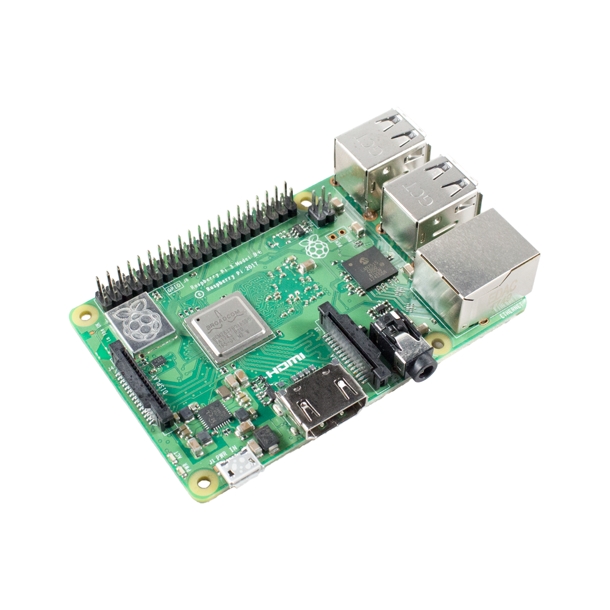
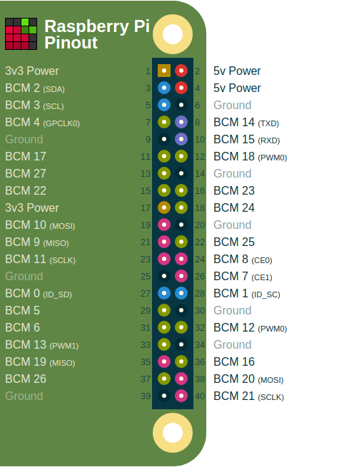
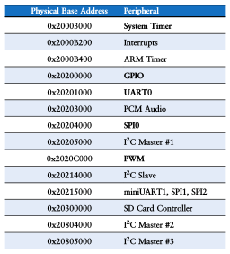
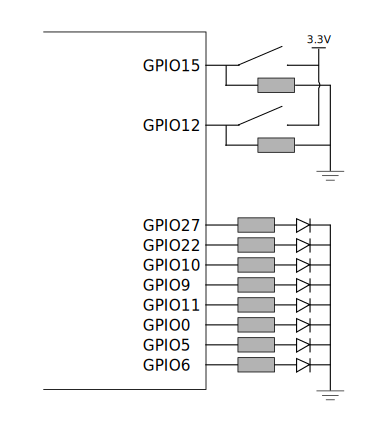
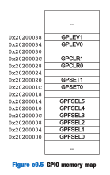
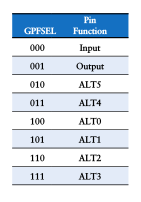
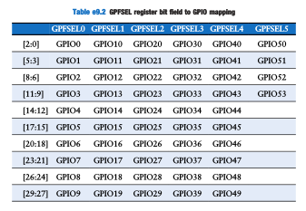

class: center, middle, inverse
<title>Unidad 10</title>

.title[Informática I]

Claudio Paz

<!-- .email[claudiojpaz@gmail.com] -->

Octubre 2023


<div style="position: absolute; left: 5%; top: 85%; height: 50%; width: 50%; padding: 1em; text-align: left;">
<input type="image" src="assets/fullscreen.png" onclick="openFullscreen()" style="height: 15%; width: 15%;">
<input type="image" src="assets/smallscreen.png" onclick="closeFullscreen()" style="height: 15%; width: 15%;">
</div>

---
class: middle, center, intermediate
.title-dark[Unidad 10]
# Uso del lenguaje C en aplicaciones de bajo nivel
---
# Operadores a nivel de bit
--
count: false

Como se vio en la primera unidad las computadoras representan toda la informacióṇ interna usando _bits_.

--
count: false

Los bits solo pueden tener dos valores, 0 y 1.

--
count: false

Los operadores a nivel de bit realizan las operaciones _bit a bit_ entre sus operandos

--
count: false

```C
char a = 77;         // 0 1 0 0 1 1 0 1
char b = 42;         // 0 0 1 0 1 0 1 0
```

---
count: false
# Operadores a nivel de bit

Como se vio en la primera unidad las computadoras representan toda la informacióṇ interna usando _bits_.

Los bits solo pueden tener dos valores, 0 y 1.

Los operadores a nivel de bit realizan las operaciones _bit a bit_ entre sus operandos

```C
char a = 77;         // 0 1 0 0 1 1 0 `1`
char b = 42;         // 0 0 1 0 1 0 1 `0`
```

---
count: false
# Operadores a nivel de bit

Como se vio en la primera unidad las computadoras representan toda la informacióṇ interna usando _bits_.

Los bits solo pueden tener dos valores, 0 y 1.

Los operadores a nivel de bit realizan las operaciones _bit a bit_ entre sus operandos

```C
char a = 77;         // 0 1 0 0 1 1 `0` 1
char b = 42;         // 0 0 1 0 1 0 `1` 0
```

---
count: false
# Operadores a nivel de bit

Como se vio en la primera unidad las computadoras representan toda la informacióṇ interna usando _bits_.

Los bits solo pueden tener dos valores, 0 y 1.

Los operadores a nivel de bit realizan las operaciones _bit a bit_ entre sus operandos

```C
char a = 77;         // 0 1 0 0 1 `1` 0 1
char b = 42;         // 0 0 1 0 1 `0` 1 0
```

---
count: false
# Operadores a nivel de bit

Como se vio en la primera unidad las computadoras representan toda la informacióṇ interna usando _bits_.

Los bits solo pueden tener dos valores, 0 y 1.

Los operadores a nivel de bit realizan las operaciones _bit a bit_ entre sus operandos

```C
char a = 77;         // 0 1 0 0 `1` 1 0 1
char b = 42;         // 0 0 1 0 `1` 0 1 0
```

---
count: false
# Operadores a nivel de bit

Como se vio en la primera unidad las computadoras representan toda la informacióṇ interna usando _bits_.

Los bits solo pueden tener dos valores, 0 y 1.

Los operadores a nivel de bit realizan las operaciones _bit a bit_ entre sus operandos

```C
char a = 77;         // 0 1 0 `0` 1 1 0 1
char b = 42;         // 0 0 1 `0` 1 0 1 0
```
---
count: false
# Operadores a nivel de bit

Como se vio en la primera unidad las computadoras representan toda la informacióṇ interna usando _bits_.

Los bits solo pueden tener dos valores, 0 y 1.

Los operadores a nivel de bit realizan las operaciones _bit a bit_ entre sus operandos

```C
char a = 77;         // 0 1 `0` 0 1 1 0 1
char b = 42;         // 0 0 `1` 0 1 0 1 0
```
---
count: false
# Operadores a nivel de bit

Como se vio en la primera unidad las computadoras representan toda la informacióṇ interna usando _bits_.

Los bits solo pueden tener dos valores, 0 y 1.

Los operadores a nivel de bit realizan las operaciones _bit a bit_ entre sus operandos

```C
char a = 77;         // 0 `1` 0 0 1 1 0 1
char b = 42;         // 0 `0` 1 0 1 0 1 0
```
---
count: false
# Operadores a nivel de bit

Como se vio en la primera unidad las computadoras representan toda la informacióṇ interna usando _bits_.

Los bits solo pueden tener dos valores, 0 y 1.

Los operadores a nivel de bit realizan las operaciones _bit a bit_ entre sus operandos

```C
char a = 77;         // `0` 1 0 0 1 1 0 1
char b = 42;         // `0` 0 1 0 1 0 1 0
```

---
# Operadores a nivel de bit. Operadores Lógicos
--
count: false
## Tablas de verdad: AND

--
count: false

<div style="font-size: 90%;"> 
<p>
    \begin{array}{cc|c}
    \mathtt{a_i} & \mathtt{b_i} & \mathtt{\&} \\ \hline
    0 & 0 & 0 \\
    0 & 1 & 0 \\
    1 & 0 & 0 \\
    1 & 1 & 1
    \end{array}
</p>
</div>

--
count: false

```C
a = 77;         // 0 1 0 0 1 1 0 1
b = 42;         // 0 0 1 0 1 0 1 0
c = a & b;      `// 0 0 0 0 1 0 0 0`
printf("%d\n", c);
```

--
count: false
```bash
8
```

---
# Operadores a nivel de bit. Operadores Lógicos
--
count: false
## Tablas de verdad: OR

--
count: false

<div style="font-size: 90%;"> 
<p>
    \begin{array}{cc|c}
    \mathtt{a_i} & \mathtt{b_i} & \mathtt{|} \\ \hline
    0 & 0 & 0 \\
    0 & 1 & 1 \\
    1 & 0 & 1 \\
    1 & 1 & 1
    \end{array}
</p>
</div>

--
count: false

```C
a = 77;         // 0 1 0 0 1 1 0 1
b = 42;         // 0 0 1 0 1 0 1 0
c = a | b;      `// 0 1 1 0 1 1 1 1`
printf("%d\n", c);
```

--
count: false
```bash
111
```

---
# Operadores a nivel de bit. Operadores Lógicos
--
count: false
## Tablas de verdad: OR exclusiva (XOR)

--
count: false

<div style="font-size: 90%;"> 
<p>
    \begin{array}{cc|c}
    \mathtt{a_i} & \mathtt{b_i} & \mathtt{\land} \\ \hline
    0 & 0 & 0 \\
    0 & 1 & 1 \\
    1 & 0 & 1 \\
    1 & 1 & 0
    \end{array}
</p>
</div>

--
count: false

```C
a = 77;         // 0 1 0 0 1 1 0 1
b = 42;         // 0 0 1 0 1 0 1 0
c = a ^ b;      `// 0 1 1 0 0 1 1 1`
printf("%d\n", c);
```

--
count: false
```bash
103
```

---
# Operadores a nivel de bit. Operadores Lógicos
--
count: false
## Tablas de verdad: Complemento

--
count: false

<div style="font-size: 90%;"> 
<p>
    \begin{array}{c|c}
    \mathtt{a_i} & \sim \\ \hline
    0 & 1 \\
    1 & 0
    \end{array}
</p>
</div>

--
count: false

```C
a = 77;         // 0 1 0 0 1 1 0 1
c = ~a;         `// 1 0 1 1 0 0 1 0`
printf("%d\n", c);
```

--
count: false
```bash
-78
```
---
# Operadores de desplazamiento

--
count: false

Los operadores `<<` y `>>` son operadores que generan un desplazamiento sobre los bits de un `int` o un `char`, con o sin signo.

--
count: false

El operando de la izq. es el que se ve afectado por el corrimiento.

--
count: false

El de la derecha indica cuantos bit de corrimiento.

--
count: false

```C
a = 5;         // 0 0 0 0 0 1 0 1
c = a<<1;      `// 0 0 0 0 1 0 1 0`
printf("%d\n", c);
```

--
count: false
```bash
10
```

---
# Operadores de desplazamiento

--
count: false

Cuando se usa el operador `<<` los bits se corren a la izquierda, agregando 0 (ceros) a la derecha.

--
count: false

Cuando se usa el operador `>>` los bits se corren a la derecha, agregando 0 (ceros) a la izquierda.
--
count: false

En caso de ser un número negativo pueden pasar dos cosas...Se agregan unos (el número sigue siendo negativo) o se agregan ceros (cambia el signo). Depende de la arquitectura.

---
# Operadores a nivel de bit. Asignación
--
count: false

<div style="font-size: 90%;"> 
<p>
    \begin{array}{rl}
     \texttt{&=}& \text{AND y asignación } \\
     \texttt{|=}& \text{OR y asignación } \\
     \texttt{^=}& \text{XOR y asignación } \\
     \texttt{<<=}& \text{Desp. izq. y asignación } \\
     \texttt{>>=}& \text{Desp. der. y asignación }
    \end{array}
</p>
</div>

---
# Operadores. Precedencia
--
count: false

<div style="font-size: 60%;position:relative;top:-20px;left:-40px">
<p>
    \begin{array}{llll}
    \textsf{Operador}                                           &   &  & \textsf{Asociatividad} \\\hline
    () \quad [] \quad \dot \quad\quad \texttt{->}                    &   &  & \textsf{Izq. a Der.} \\
    + \quad - \quad (\text{tipo}) \quad ++ \quad -- \quad ! \quad \sim \quad \& \quad *    &   &  & \textsf{Der. a Izq.} \\
    * \quad / \quad \%                                          &   &  & \textsf{Izq. a Der.} \\
    + \quad -                                                   &   &  & \textsf{Izq. a Der.} \\
    << \quad >>                                                 &   &  & \textsf{Izq. a Der.} \\
    < \quad <= \quad > \quad >=                                 &   &  & \textsf{Izq. a Der.} \\
    == \quad !=                                                 &   &  & \textsf{Izq. a Der.} \\
    \&                                                        &   &  & \textsf{Izq. a Der.} \\
    \land                                                        &   &  & \textsf{Izq. a Der.} \\
    |                                                        &   &  & \textsf{Izq. a Der.} \\
    \&\&                                                        &   &  & \textsf{Izq. a Der.} \\
    ||                                                          &   &  & \textsf{Izq. a Der.} \\
    ?:                                                          &   &  & \textsf{Der. a Izq.} \\
    = \quad += \quad -=  \quad /= \quad *= \quad \&= \quad |= \quad \land= \quad <<= \quad >>= \quad \%=            &   &  & \textsf{Der. a Izq.} \\
    ,                                                           &   &  & \textsf{Izq. a Der.} \\
    \end{array}
</p>
</div>

---
class: center, middle, inverse

# Raspberry Pi

---
# Raspbery Pi 3 B+
--
count: false
<div style="position: absolute; left: 150px; top: 50px; height: 200px; width: 100px;">

</div>

---
# Raspbery Pi 3 B+
--
count: false
<div style="position: absolute; left: 50px; top: 150px; height: 200px; width: 100px;">

</div>
--
count: false
<div style="font-size: 80%">
.right-column[
* SoC BCM2837
* Cortex-A53 (ARMv8) 64-bit @ 1.4GHz
* 1GB de memoria RAM
* 4 USB, 1 Ethernet
* WiFi, BlueTooth
* Conector de 40 pines E/S
* HDMI
* etc.
]
</div>

---
# Raspbery Pi 3 B+
--
count: false

<div style="position: absolute; left: 470px; top: 50px; height: 200px; width: 100px;">

</div>

--
count: false
## Pinout

--
count: false

<div style="font-size: 80%">
28 GPIO
</div>

--
count: false
<div style="font-size: 80%">
Tensión máx de entrada: 3.3V
</div>

--
count: false
<div style="font-size: 80%">
Corriente máx de salida 1pin: 16mA
</div>

--
count: false
<div style="font-size: 80%">
Corriente máx de salida Total: 50mA
</div>


---
# E/S mapeada en memoria
--
count: false

Una parte del espacio de memoria es utilizado para dispositivos de E/S.

--
count: false

Por ejemplo, si las direcciones físicas en el rango 0x20000000 a 0x20FFFFFF son usadas para dispositivos de entrada/salida...

--
count: false

Tratar de escribir en esas direcciones de memoria (`store`) envía datos a los dispositivos.

--
count: false

Tratar de leer de esas direcciones de memoria (`load`) recibe datos desde los dispositivos.

---
# E/S mapeada en memoria

--
count: false

Este método de comunicación con los dispositivos se llama _Entrada/Salida mapeada en memoria_

---
# E/S mapeada en memoria

--
count: false

El dispositivos de E/S mapeados en memoria en el BCM2837:

--
count: false

<div style="position: absolute; left: 260px; top: 220px; height: 200px; width: 100px;">

</div>

---
# Puertos GPIO
--
count: false

GPIO significa General-purpose I/O (Entrada/Salida de propósitos generales).

--
count: false

Son usados para leer o escribir señales digitales.

--
count: false

<div style="position: absolute; left: 280px; top: 280px; height: 200px; width: 100px;">

</div>

---
# Puertos GPIO
--
count: false

Generalmente las GPIO necesitan registros para leer los valores de entrada...

--
count: false

...registros para escribir los valores de salida...

--
count: false

...y registros para configurar los pines como entradas o salidas.

--
count: false

También se necesitan registros en caso de que los pines sean pines especiales además de GPIO...

--
count: false

...o funcionen con interrupciones.

---
# Puertos GPIO
--
count: false

El BCM2837 tiene 54 GPIO...

--
count: false

Son controlados por los registros:

--
count: false

* GPFSEL
--
count: false
* GPLEV
--
count: false
* GPSET
--
count: false
* GPCLR

--
count: false

<div style="position: absolute; left: 580px; top: 120px; height: 200px; width: 100px;">

</div>

---
# Puertos GPIO
--
count: false
## GPFSEL

--
count: false

Se usa para configurar el GPIO.

--
count: false

Se usan 3 bits por cada GPIO.

--
count: false

<div style="position: absolute; left: 600px; top: 150px; height: 200px; width: 100px;">

</div>

--
count: false

Hay 6 GPFSEL de 32 bits cada uno

---
# Puertos GPIO
## GPFSEL
--
count: false

<div style="position: absolute; left: 100px; top: 160px; height: 200px; width: 100px;">

</div>

---
# Puertos GPIO
--
count: false
## GPLEV

--
count: false

Se utiliza para leer el valor de cada GPIO.

--
count: false

Hay 2 GPLEV de 32 bits cada uno.

--
count: false

Si se quiere saber el _estado_ del GPIO15 se evalua GPLEV0[15].

--
count: false

Si se quiere saber el _estado_ del GPIO34 se evalua GPLEV1[2].

---
# Puertos GPIO
--
count: false
## GPSET y GPCLR

--
count: false

Se utilizan para poner a 1 o a 0 cada GPIO.

--
count: false

En sistemas embebidos, poner en uno un pin se asocia a hacer un SET en ese pin, y un cero a un CLEAR.

--
count: false

Por ejemplo para poner el GPIO6 en nivel bajo se pone un 1 en GPCLR0[6].

--
count: false

Para poner el GPIO6 en nivel alto se pone un 1 en GPSET0[6].


<!-- --- -->
<!-- # Modelo de programación de un puerto -->


<!-- --- -->
<!-- # Controlador de dispositivo (device driver) -->

---
# EasyPIO.h
--

<!-- ver video en el drive -->

<!-- count: false -->

<!-- ```C -->
<!-- #include <sys/mman.h> -->

<!-- #define BCM2835_PERI_BASE  0x3F000000 -->
<!-- #define GPIO_BASE          (BCM2835_PERI_BASE + 0x200000) -->

<!-- volatile unsigned int      *gpio; //Pointer to base of gpio -->

<!-- #define GPFSEL             ((volatile unsigned int *) (gpio + 0)) -->
<!-- #define GPSET              ((volatile unsigned int *) (gpio + 7)) -->
<!-- #define GPCLR              ((volatile unsigned int *) (gpio + 10)) -->
<!-- #define GPLEV              ((volatile unsigned int *) (gpio + 13)) -->

<!-- #define INPUT              0 -->
<!-- #define OUTPUT             1 -->

<!-- #define BLOCK_SIZE         (4*1024) -->

<!-- ``` -->
<!-- --- -->
<!-- # EasyPIO.h (continua) -->
<!-- -- -->
<!-- count: false -->

<!-- ```C -->
<!-- void pioInit() { -->
  <!-- int  mem_fd; -->
  <!-- void *reg_map; -->

  <!-- // /dev/mem is a psuedo-driver for accessing memory in the Linux filesystem -->
  <!-- if ((mem_fd = open("/dev/mem", O_RDWR|O_SYNC) ) < 0) { -->
    <!-- printf("can't open /dev/mem \n"); -->
    <!-- exit(-1); -->
  <!-- } -->

  <!-- reg_map = mmap( -->
    <!-- NULL,             //Address at which to start local mapping (null means don't-care) -->
    <!-- BLOCK_SIZE,       //Size of mapped memory block -->
    <!-- PROT_READ|PROT_WRITE,// Enable both reading and writing to the mapped memory -->
    <!-- MAP_SHARED,       // This program does not have exclusive access to this memory -->
    <!-- mem_fd,           // Map to /dev/mem -->
    <!-- GPIO_BASE);       // Offset to GPIO peripheral -->

  <!-- if (reg_map == MAP_FAILED) { -->
    <!-- printf("gpio mmap error %d\n", (int)reg_map); -->
    <!-- close(mem_fd); -->
    <!-- exit(-1); -->
  <!-- } -->

  <!-- gpio = (volatile unsigned *)reg_map; -->

  <!-- close(mem_fd); -->
<!-- } -->
<!-- ``` -->
