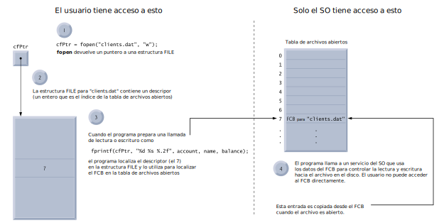

class: center, middle, inverse

.title[Informática I]

Claudio Paz

.email[claudiojpaz@gmail.com]

Noviembre 2023

---
class: middle, center, intermediate
.title-dark[Unidad 11]
# Manejo de archivos en C
---
# Concepto de Flujo de datos (_streams_)
--
count: false

La mayoría de los programas necesitan _entradas_ (in) o _salidas_ (out), o ambas.

--
count: false

El lenguaje C NO dispone de sentencias de entrada/salida.

--
count: false

Hay que recurrir a una biblioteca que tenga funciones para manejar las entrada/salidas.

--
count: false

Las funciones de la biblioteca estándar están _declaradas_ en el archivo de cabecera `stdio.h`

---
# Concepto de Flujo de datos (_streams_)
--
count: false

Todas las entradas y salidas son simplemente secuencias de bytes que van de un lado a otro, llamadas _streams_

--
count: false

Las entradas son bytes que van desde dispositivos (teclado, disco, red) hacia la memoria

--
count: false

Las salidas son bytes que van desde la memoria a un dispositivo (pantalla, impresora, disco, red)


---
# Concepto de Flujo de datos (_streams_)
--
count: false

Cuando un programa comienza, ya tiene tres _streams_ estándar predefinidos, listos para su uso...

--
count: false

...están declarados en `stdio.h`

--
count: false

.blue[`stdin`] es la entrada y está _conectada_ al teclado.

--
count: false

.blue[`stdout`] es la salida y está _conectada_ a la pantalla.

--
count: false

.blue[`stderr`] es la salida de error  y está _conectada_ a la pantalla.

---
# Concepto de Flujo de datos (_streams_)
--
count: false

El SO puede permitir redireccionarlos a otros dispositivos.

--
count: false

Tanto `stdin`, `stdout` y `stderr` son de tipo `FILE *`

--
count: false

`FILE *` es un tipo de datos usado para representar _streams_

--
count: false

Es una estructura con información necesaria para el manejo en bajo nivel de los archivos.

---
# El tipo `FILE *`
--
count: false

El tipo FILE es una estructura definida en `stdio.h` que contiene información para procesar el archivo

--
count: false

Esta estructura contiene un descriptor de archivo, que no es más que un índice, que se encuentra en una tabla del sistema operativo llamada _tabla de archivos abiertos_

--
count: false

Cada elemento de esa tabla contiene un FCB (_bloque de control de archivo_) que es lo que utiliza el SO para administrar el archivo

---
# El tipo `FILE *`
--
count: false

<!--  -->
<div style="position: absolute; left: 0px; top: 120px; height: 400px; width: 100px; padding: 1em;">

</div>

---
# Apertura y cierre de _streams_
--
count: false

Las funciones utilizadas para abrir y cerrar archivos son .blue[`fopen`] y .blue[`fclose`]

--
count: false

<div style="line-height:50%;">
    <br>
</div>

## `fopen`

```C
FILE * fopen (const char *filename, const char *opentype);
```

--
count: false

`fopen` recibe dos cadenas como argumentos: el nombre del archivo y el modo de apertura.

--
count: false

Devuelve un `FILE *` que representa al _stream_ asociado al archivo o `NULL` ante un error.

---
# Apertura y cierre de _streams_

Las funciones utilizadas para abrir y cerrar archivos son .blue[`fopen`] y .blue[`fclose`]

---
count: false
# Apertura y cierre de _streams_

Las funciones utilizadas para abrir y cerrar archivos son .blue[`fopen`] y .blue[`fclose`]

<div style="line-height:50%;">
    <br>
</div>

## `fclose`

```C
int fclose (FILE *stream);
```

--
count: false

`fclose` recibe el `FILE *` del _stream_ asociado al archivo que se quiere cerrar.

--
count: false

Devuelve un 0 (cero) si tuvo éxito, o un `EOF` si falló.

---
# Apertura y cierre de _streams_
--
count: false

Según el estándar los archivos pueden ser abiertos en modo _texto_ o en modo _binario_, para lectura, escritura o ambos.

--
count: false

Los modos de apertura son:

* r para lectura en modo texto
--
count: false
* w para escritura en modo texto. Si no existe lo crea. Si existe lo sobrescribe.
--
count: false
* a para escritura en modo texto. Si no existe lo crea. Si existe escribe al final.

---
# Apertura y cierre de _streams_
--
count: false

Otros modos de apertura son:

* r+ para lectura y escritura en modo texto. El archivo debe existir.
--
count: false
* w+ para lectura y escritura en modo texto. Si no existe lo crea. Si existe lo sobrescribe.
--
count: false
* a+ para lectura y escritura en modo texto. Si no existe lo crea. Siempre escribe al final.

---
# Apertura y cierre de _streams_
--
count: false

En modo binario existen los mismos modos, agregando después de la letra inicial una b

--
count: falso

* rb
* wb
* ab
* rb+
* wb+
* ab+

---
# Apertura y cierre de _streams_
--
count: false
## Ejemplo de redirección de `stdout` a un archivo
--
count: false
```C
#include <stdio.h>

int main (void)
{
  fclose(stdout);
  stdout = fopen("salida.txt", "w");

  printf("Hola, mundo!\n");

  return 0;
}
```

---
count: false
# Apertura y cierre de _streams_
## Ejemplo de redirección de `stdout` a un archivo

```C
#include <stdio.h>

int main (void)
{
* fclose(stdout);
  stdout = fopen("salida.txt", "w");

  printf("Hola, mundo!\n");

  return 0;
}
```

.blue[`fclose`] cierra el _stream_ estándar `stdout`

---
count: false
# Apertura y cierre de _streams_
## Ejemplo de redirección de `stdout` a un archivo

```C
#include <stdio.h>

int main (void)
{
  fclose(stdout);
  stdout = fopen("salida.txt", "w");

  printf("Hola, mundo!\n");

  return 0;
}
```

---
count: false
# Apertura y cierre de _streams_
## Ejemplo de redirección de `stdout` a un archivo

```C
#include <stdio.h>

int main (void)
{
  fclose(stdout);
  stdout = `fopen("salida.txt", "w");`

  printf("Hola, mundo!\n");

  return 0;
}
```

.blue[`fopen`] abre el archivo `salida.txt` en modo escritura

---
count: false
# Apertura y cierre de _streams_
## Ejemplo de redirección de `stdout` a un archivo

```C
#include <stdio.h>

int main (void)
{
  fclose(stdout);
* stdout = fopen("salida.txt", "w");

  printf("Hola, mundo!\n");

  return 0;
}
```

.blue[`fopen`] abre el archivo `salida.txt` en modo escritura, y el _stream_ asociado es asignado en `stdout`.
Si el archivo no existe, lo crea.

---
count: false
# Apertura y cierre de _streams_
## Ejemplo de redirección de `stdout` a un archivo

```C
#include <stdio.h>

int main (void)
{
  fclose(stdout);
  stdout = fopen("salida.txt", "w");

  printf("Hola, mundo!\n");

  return 0;
}
```

---
count: false
# Apertura y cierre de _streams_
## Ejemplo de redirección de `stdout` a un archivo

```C
#include <stdio.h>

int main (void)
{
  fclose(stdout);
  stdout = fopen("salida.txt", "w");

  printf("Hola, mundo!\n");

  return 0;
}
```

Luego de compilar, la ejecución no muestra nada por pantalla

---
count: false
# Apertura y cierre de _streams_
## Ejemplo de redirección de `stdout` a un archivo

```C
#include <stdio.h>

int main (void)
{
  fclose(stdout);
  stdout = fopen("salida.txt", "w");

  printf("Hola, mundo!\n");

  return 0;
}
```

---
count: false
# Apertura y cierre de _streams_
## Ejemplo de redirección de `stdout` a un archivo

```C
#include <stdio.h>

int main (void)
{
  fclose(stdout);
  stdout = fopen("salida.txt", "w");

  printf("Hola, mundo!\n");

  return 0;
}
```

```shell
$ gcc -Wall -std=c99 -pedantic-errors u10-redirect-stdout.c
$
```
---
count: false
# Apertura y cierre de _streams_
## Ejemplo de redirección de `stdout` a un archivo

```C
#include <stdio.h>

int main (void)
{
  fclose(stdout);
  stdout = fopen("salida.txt", "w");

  printf("Hola, mundo!\n");

  return 0;
}
```

```shell
$ gcc -Wall -std=c99 -pedantic-errors u10-redirect-stdout.c
$ ./a.out
$
```
--
count: false

pero si se revisa el contenido del archivo `salida.txt`...

---
count: false
# Apertura y cierre de _streams_
## Ejemplo de redirección de `stdout` a un archivo

```C
#include <stdio.h>

int main (void)
{
  fclose(stdout);
  stdout = fopen("salida.txt", "w");

  printf("Hola, mundo!\n");

  return 0;
}
```

```shell
$ gcc -Wall -std=c99 -pedantic-errors u10-redirect-stdout.c
$ ./a.out
$
```

---
count: false
# Apertura y cierre de _streams_
## Ejemplo de redirección de `stdout` a un archivo

```C
#include <stdio.h>

int main (void)
{
  fclose(stdout);
  stdout = fopen("salida.txt", "w");

  printf("Hola, mundo!\n");

  return 0;
}
```

```shell
$ gcc -Wall -std=c99 -pedantic-errors u10-redirect-stdout.c
$ ./a.out
$ cat salida.txt
Hola, mundo!
$
```

---
# Lectura de _streams_
--
count: false

Descontando las funciones usadas para leer desde `stdin`, las funciones usadas para leer desde un archivo en general, disponibles en `stdio.h` según el estándar son:

--
count: false

<div style="line-height:50%;">
    <br>
</div>

## fgetc

```C
int fgetc ( FILE * stream );
```
--
count: false

Toma un caracter desde el archivo representado por el _stream_ `stream` y lo devuelve como `int`

---
count: false
# Lectura de _streams_

Descontando las funciones usadas para leer desde `stdin`, las funciones usadas para leer desde un archivo en general, disponibles en `stdio.h` según el estándar son:

---
count: false
# Lectura de _streams_

Descontando las funciones usadas para leer desde `stdin`, las funciones usadas para leer desde un archivo en general, disponibles en `stdio.h` según el estándar son:

<div style="line-height:50%;">
    <br>
</div>

## fgets

```C
char *fgets(char *str, int n, FILE *stream);
```
--
count: false

Toma una cantidad `n` de caracteres desde el archivo representado por el _stream_ `stream` y lo guarda en el arreglo apuntado por el puntero `str`

---
count: false
# Lectura de _streams_

Descontando las funciones usadas para leer desde `stdin`, las funciones usadas para leer desde un archivo en general, disponibles en `stdio.h` según el estándar son:

---
count: false
# Lectura de _streams_

Descontando las funciones usadas para leer desde `stdin`, las funciones usadas para leer desde un archivo en general, disponibles en `stdio.h` según el estándar son:

<div style="line-height:50%;">
    <br>
</div>

## fscanf

```C
int fscanf(FILE *stream, const char *format, ...);
```
--
count: false

Exactamente igual al `scanf` que se usa con `stdin` (desde el teclado) pero lleva como primer argumento el _stream_ de donde se toman los valores

---
# Lectura de _streams_
--
count: false

Si se tiene un archivo de texto llamado `frutas.txt`

--
count: false

```shell
$ cat frutas.txt
manzana
banana
naranja
pera
$
```

---
# Lectura de _streams_
--
count: false

.left-60-column[
```C
#include <stdio.h>

int main (void)
{
  FILE * fp;
  char cadena[80] = {0};

  fp = fopen("frutas.txt", "r");
  if ( fp == NULL ) {
    printf("No se pudo abrir...\n");
    return 1;
  }

  fgets(cadena, 80, fp);
  printf("%s\n", cadena);

  fclose(fp);
  return 0;
}
```
]
--
count: false
.right-40-column[
* .blue[`fopen`] devuelve `NULL` si el archivo no puede abrirse por algún motivo
]

---
count: false
# Lectura de _streams_

.left-60-column[
```C
#include <stdio.h>

int main (void)
{
  FILE * fp;
  char cadena[80] = {0};

  fp = fopen("frutas.txt", "r");
  if ( fp == NULL ) {
    printf("No se pudo abrir...\n");
    return 1;
  }

  fgets(cadena, 80, fp);
  printf("%s\n", cadena);

  fclose(fp);
  return 0;
}
```
]

---
count: false
# Lectura de _streams_

.left-60-column[
```C
#include <stdio.h>

int main (void)
{
  FILE * fp;
  char cadena[80] = {0};

  fp = fopen("frutas.txt", "r");
* if ( fp == NULL ) {
*   printf("No se pudo abrir...\n");
*   return 1;
* }

  fgets(cadena, 80, fp);
  printf("%s\n", cadena);

  fclose(fp);
  return 0;
}
```
]
--
count: false
.right-40-column[
* debe chequearse la correcta apertura para evitar errores en tiempo de ejecución
]

---
count: false
# Lectura de _streams_

.left-60-column[
```C
#include <stdio.h>

int main (void)
{
  FILE * fp;
  char cadena[80] = {0};

  fp = fopen("frutas.txt", "r");
  if ( fp == NULL ) {
    printf("No se pudo abrir...\n");
    return 1;
  }

  fgets(cadena, 80, fp);
  printf("%s\n", cadena);

  fclose(fp);
  return 0;
}
```
]
---
count: false
# Lectura de _streams_

.left-60-column[
```C
#include <stdio.h>

int main (void)
{
  FILE * fp;
  char cadena[80] = {0};

  fp = fopen("frutas.txt", "r");
  if ( fp == NULL ) {
    printf("No se pudo abrir...\n");
    return 1;
  }

* fgets(cadena, 80, fp);
  printf("%s\n", cadena);

  fclose(fp);
  return 0;
}
```
]

--
count: false
.right-40-column[
* .blue[`fgets`] toma _hasta_ 79 (80-1) caracteres. Si encuentra un retorno de línea (\n) termina
]

---
# Lectura de _streams_
--
count: false

se puede reemplazar la línea

```C
  fgets(cadena, 80, fp);
```
--
count: false

...por

```C
  fscanf(fp, "%80[^\n]s", cadena);
```

--
count: false

La entrada `fscanf` es formateada, a diferencia de `fgets` que solo lee cadenas de texto.

--
count: false

Con `fscanf` se pueden leer números enteros o reales directamente desde el archivo.

---
# Lectura de _streams_
--
count: false

Para leer más líneas se pueden usar sucesivos `fscanf` o `fgets` o utilizar estructuras repetitivas

```C
  fgets(cadena, 80, fp);
  while (!feof(fp)) {
    printf("%s", cadena);
    fgets(cadena, 80, fp);
  }
```
--
count: false

La función `feof` devuelve 0 (cero) si no se alcanzó el final del archivo.

--
count: false

Devuelve 1 (uno) luego de intentar leer datos del archivo sin lograrlo por estar al final del mismo.

---
# Escritura de _streams_
--
count: false

Las funciones usadas para escribir en un archivo de texto, disponibles en stdio.h según el estándar son:

--
count: false
<div style="line-height:50%;">
    <br>
</div>

## fputc

```C
int  fputc(int data, FILE * stream);
```
--
count: false

Toma el dato `data`, lo convierte a `unsigned char` y lo escribe en la salida apuntada por `stream`. En caso de éxito devuelve el caracter escrito, si no, devuelve `EOF`.

---
count: false
# Escritura de _streams_

Las funciones usadas para escribir en un archivo de texto, disponibles en stdio.h según el estándar son:

---
# Escritura de _streams_

Las funciones usadas para escribir en un archivo de texto, disponibles en stdio.h según el estándar son:

<div style="line-height:50%;">
    <br>
</div>

## fputs

```C
int fputs(const char * ps, FILE * stream);
```
--
count: false

Toma la cadena apuntada por el puntero `ps`, y la escribe en la salida apuntada por `stream` hasta que encuentra un caracter nulo. En caso de éxito devuelve un entero mayor a cero, si no, devuelve `EOF`.

---
# Escritura de _streams_

Las funciones usadas para escribir en un archivo de texto, disponibles en stdio.h según el estándar son:

---
count: false
# Escritura de _streams_

Las funciones usadas para escribir en un archivo de texto, disponibles en stdio.h según el estándar son:

<div style="line-height:50%;">
    <br>
</div>

## fprintf

```C
int fprintf(FILE * stream, const char * format, ...);
```
--
count: false

Exactamente igual al `printf` que se usa con `stdout` (a la pantalla) pero lleva como primer argumento el _stream_ donde se colocan los valores. Tiene la ventaja de dar formato a la salida.

---
# Ejemplo Lectura/Escritura de _streams_
--
count: false

```C
#include <stdio.h>

void agregar(FILE *);
void mostrar(FILE *);
void menu (FILE *);
int menu_option (void);

int main (void) {
  FILE *fp;

  fp = fopen("db.txt","a+");

  menu(fp);

  fclose(fp);
  return 0;
}
```

---
count: false
# Ejemplo Lectura/Escritura de _streams_

```C
#include <stdio.h>

void agregar(FILE *);
void mostrar(FILE *);
void menu (FILE *);
int menu_option (void);

int main (void) {
  FILE *fp;

  fp = fopen("db.txt",`"a+"`);

  menu(fp);

  fclose(fp);
  return 0;
}
```
--
count: false

El _modo_ `"a+"` permite agregar registros al final del archivo y al mismo tiempo leer.

---
count: false
# Ejemplo Lectura/Escritura de _streams_
--
count: false
```C
void menu (FILE *fp)
{
  int salir = 0;
  int op;

  do {
    op = menu_option();
    switch (op) {
      case 1:
        agregar(fp);
        break;
      case 2:
        mostrar(fp);
        break;
      case 3:
        salir = 1;
        break;
      default:
        printf("Opción no válida\n");
    }
  } while ( salir == 0 );
}

```
---
count: false
# Ejemplo Lectura/Escritura de _streams_
--
count: false
```C
int menu_option (void)
{
  int op;

  printf("1-Agregar\n");
  printf("2-Mostrar\n");
  printf("3-Salir\n");
  printf("Que quiere? "); scanf("%d", &op);

  return op;
}
```
---
count: false
# Ejemplo Lectura/Escritura de _streams_
--
count: false
```C
void agregar(FILE *fp)
{
  int legajo;
  char nombre[80];
  char apellido[80];

  printf("Ingrese el nombre: "); scanf(" %80[^\n]s", nombre);
  printf("Ingrese el apellido: "); scanf(" %80[^\n]s", apellido);
  printf("Ingrese el legajo: "); scanf("%d", &legajo);

  fprintf(fp, "%d %s, %s\n", legajo, apellido, nombre);
}
```

---
count: false
# Ejemplo Lectura/Escritura de _streams_

```C
void agregar(FILE *fp)
{
  int legajo;
  char nombre[80];
  char apellido[80];

  printf("Ingrese el nombre: "); scanf(" %80[^\n]s", nombre);
  printf("Ingrese el apellido: "); scanf(" %80[^\n]s", apellido);
  printf("Ingrese el legajo: "); scanf("%d", &legajo);

* fprintf(fp, "%d %s, %s\n", legajo, apellido, nombre);
}
```
--
count: false

La función `fprintf` agrega el registro al final (debido al a+ del `fopen`)

---
count: false
# Ejemplo Lectura/Escritura de _streams_
--
count: false
```C
void mostrar(FILE *fp)
{
  char linea[160];

  rewind(fp);

  fgets(linea, 160, fp);
  while (!feof(fp)) {
    fputs(linea, stdout);
    fgets(linea, 160, fp);
  }

}
```
---
count: false
# Ejemplo Lectura/Escritura de _streams_

```C
void mostrar(FILE *fp)
{
  char linea[160];

* rewind(fp);

  fgets(linea, 160, fp);
  while (!feof(fp)) {
    fputs(linea, stdout);
    fgets(linea, 160, fp);
  }

}
```
--
count: false

La función `rewind` vuelve al inicio al puntero que indica cual es la posición que se lee  en el archivo.

---
# Archivos binarios
--
count: false

La diferencia entre los archivos de texto y los binarios es que los primeros siempre usan caracteres para representar la información, aunque sean números.

--
count: false

Los binarios escriben en los archivos con bits, sin importar lo que representen esos bits.

--
count: false

En cuestiones de espacio, _a veces_ puede ser una ventaja

---
# Archivos binarios
--
count: false

La función usada para escribir en un archivo binario, disponible en stdio.h según el estándar es:

--
count: false
<div style="line-height:50%;">
    <br>
</div>

## fwrite

```C
size_t fwrite(const void *ptr, size_t size, size_t nmemb, FILE *stream);
```
--
count: false

Escribe en el _stream_ apuntado por `stream`, `nmemb` datos de tamaño `size` comenzando por la posición de memoria apuntada por `ptr`.

---
# Archivos binarios
--
count: false

```C
  FILE * fpt;
  FILE * fpb;
  int numero = 4000000;

  fpt = fopen("archivo.txt", "w");
  fpb = fopen("archivo.bin", "wb");

  fprintf(fpt, "%d", numero);
  fwrite(&numero, sizeof(numero), 1, fpb);

  fclose(fpb);
  fclose(fpt);
```

---
count: false
# Archivos binarios

```C
* FILE * fpt;
  FILE * fpb;
  int numero = 4000000;

* fpt = fopen("archivo.txt", "w");
  fpb = fopen("archivo.bin", "wb");

* fprintf(fpt, "%d", numero);
  fwrite(&numero, sizeof(numero), 1, fpb);

  fclose(fpb);
* fclose(fpt);
```
--
count: false

si se graba en `archivo.txt` en modo texto la variable  `numero`, se graban siete caracteres (un 4 y seis 0) lo que corresponden a siete bytes.

---
count: false
# Archivos binarios

```C
  FILE * fpt;
  FILE * fpb;
  int numero = 4000000;

  fpt = fopen("archivo.txt", "w");
  fpb = fopen("archivo.bin", "wb");

  fprintf(fpt, "%d", numero);
  fwrite(&numero, sizeof(numero), 1, fpb);

  fclose(fpb);
  fclose(fpt);
```

---
count: false
# Archivos binarios

```C
  FILE * fpt;
* FILE * fpb;
  int numero = 4000000;

  fpt = fopen("archivo.txt", "w");
* fpb = fopen("archivo.bin", "wb");

  fprintf(fpt, "%d", numero);
* fwrite(&numero, sizeof(numero), 1, fpb);

  fclose(fpb);
* fclose(fpt);
```

--
count: false

si se graba en `archivo.bin` en modo binario la variable  `numero`, se graban cuatro bytes que corresponden a un `int`

---
count: false
# Archivos binarios

```C
  FILE * fpt;
  FILE * fpb;
  int numero = 4000000;

  fpt = fopen("archivo.txt", "w");
  fpb = fopen("archivo.bin", "wb");

  fprintf(fpt, "%d", numero);
  fwrite(&numero, sizeof(numero), 1, fpb);

  fclose(fpb);
  fclose(fpt);
```
--
count: false

```shell
$ ls -lh archivo.*
-rw-rw-r-- 1 claudiojpaz claudiojpaz 4 oct 20 19:23 archivo.bin
-rw-rw-r-- 1 claudiojpaz claudiojpaz 7 oct 20 19:23 archivo.txt
$
```
--
count: false
<div style="position: absolute; left: 410px; top: 430px; height: 200px; width: 100px; padding: 1em;">

</div>

---
# Archivos binarios
--
count: false

```C
  FILE * fpt;
  FILE * fpb;
  char cadena[80] = "Texto Vs Binario";

  fpt = fopen("archivo.txt", "w");
  fpb = fopen("archivo.bin", "wb");

  fprintf(fpt, "%s", cadena);
  fwrite(cadena, sizeof(cadena), 1, fpb);

  fclose(fpb);
  fclose(fpt);
```

--
count: false

```shell
$ ls -lh archivo.*
-rw-rw-r-- 1 claudiojpaz claudiojpaz 80 oct 20 23:37 archivo.bin
-rw-rw-r-- 1 claudiojpaz claudiojpaz 16 oct 20 23:37 archivo.txt
$
```
--
count: false
<div style="position: absolute; left: 410px; top: 430px; height: 200px; width: 100px; padding: 1em;">

</div>
--
count: false

El archivo binario almacena la cadena completa

---
# Archivos binarios
--
count: false

La ventaja principal del uso de archivos en modo binario es que cada registro ocupa largo fijo.

--
count: false

Entonces se puede accesar a los datos del archivo de manera aleatoria, porque se puede calcular donde comienza cada dato.

--
count: false

Además como la información se almacena byte a byte, se pueden guardar datos más complejos, como estructuras de datos.

---
# Archivos binarios
--
count: false

La función usada para leer de un archivo binario, disponible en stdio.h según el estándar es:

--
count: false
<div style="line-height:50%;">
    <br>
</div>

## fread

```C
size_t fread(void *ptr, size_t size, size_t nmemb, FILE *stream);
```
--
count: false

Lee del _stream_ apuntado por `stream`, `nmemb` datos de tamaño `size` y los pone en la posición de memoria apuntada por `ptr`.

---
# Archivos binarios
--
count: false

La otra función más usada en un archivo binario, disponible en stdio.h según el estándar es:

--
count: false
<div style="line-height:50%;">
    <br>
</div>

## fseek

```C
int fseek(FILE *stream, long int offset, int whence);
```
--
count: false

Mueve el puntero de posición dentro del archivo apuntado por `stream` una distancia dada por `offset`. El argumento `whence` indica desde donde se hace el movimiento del offset.

---
count: false
# Archivos binarios

La otra función más usada en un archivo binario, disponible en stdio.h según el estándar es:

<div style="line-height:50%;">
    <br>
</div>

## fseek

```C
int fseek(FILE *stream, long int offset, int whence);
```
--
count: false

SEEK_SET desde el principio del archivo

SEEK_CUR desde la posición actual

SEEK_END desde el final

---
# Acceso aleatorio
--
count: false

Supongamos que queremos llevar una _base de datos_ con 10 estudiantes, donde cada uno cuenta con un código, un nombre y una nota.

--
count: false

Podemos aprovechar una estructura como la que sigue

```C
struct estudiante {
  int cod;
  char nombre[40];
  int nota;
};
```
--
count: false

Si la usamos en un archivo en modo binario cada registro será de 48 bytes


---
# Acceso aleatorio
--
count: false

Primero se crea un archivo en modo binario

--
count: false

```C
  FILE *fp;

  fp = fopen("base.bin", "wb");

```
--
count: false

Recordar chequear que haya sido creado con éxito

---
# Acceso aleatorio
--
count: false

Luego con `fwrite` se escriben los 10 registros (o los que se necesiten) para almacenar los estudiantes

--
count: false

```C
  for (int i = 0 ; i < N; i++) {
    est_cero.cod = i;
    fwrite(&est_cero, sizeof(struct estudiante), 1, fp);
  }
```
--
count: false

Para identificar cada registro, se usará un número único, cargado desde el comienzo (en este caso usando la variable `i`)

---
# Acceso aleatorio
--
count: false
Para leer todos los registros se puede obtener un bloque completo (los 10 registros) y luego recorrer el arreglo en memoria

```C
  FILE *fpb;
  struct estudiante e[10] = {0};

  fpb = fopen("archivo.bin", "rb");

  fread(e, sizeof(struct estudiante), 10, fpb);

  for (int i = 0; i < 10; i++)
    printf("%d %s %d\n", e[i].legajo, e[i].nombre, e[i].nota);

  fclose(fpb);
```

---
# Acceso aleatorio
--
count: false

Para leer solo un registro en particular se usa `fseek`

```C
  FILE *fpb;

  struct estudiante e = {0};
  int n;

  fpb = fopen("archivo.bin", "rb+");

  printf("Que registro quiere ver? ");
  scanf("%d", &n);

  fseek(fpb, n*sizeof(struct estudiante), SEEK_SET);
  fread(&e, sizeof(struct estudiante), 1, fpb);

  printf("%d %s %d\n", e.legajo, e.nombre, e.nota);

  fclose(fpb);
```

---
# Acceso aleatorio
--
count: false

También con `fseek` se puede posicionar para cambiar un registro en particular

```C
  struct estudiante e = {0};
  int n;

  FILE *fpb = fopen("archivo.bin", "rb+");
  printf("Que registro quiere cambiar? ");
  scanf("%d", &n);
  fseek(fpb, n*sizeof(struct estudiante), SEEK_SET);
  fread(&e, sizeof(struct estudiante), 1, fpb);

  e.nota = 8;

  fseek(fpb, n*sizeof(struct estudiante), SEEK_SET);
  fwrite(&e, sizeof(struct estudiante), 1, fpb);

  fclose(fpb);
```
---
# Acceso aleatorio
--
count: false

Una vez que se lee la estructura, luego de modificarla hay que volver a colocarla en el archivo para que queden registrados los cambios.

--
count: false

Para esto hay que volver a posicionarse en el registro correcto con `fseek` y realizar el `fwrite`

